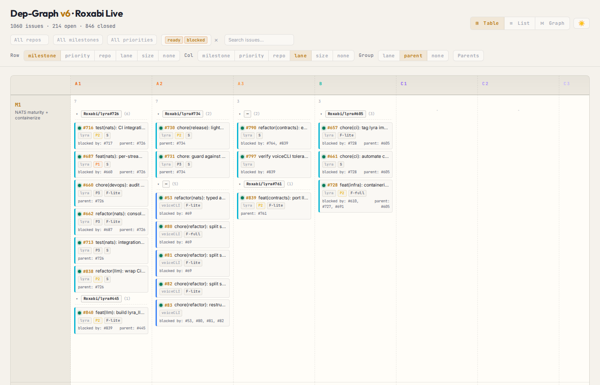
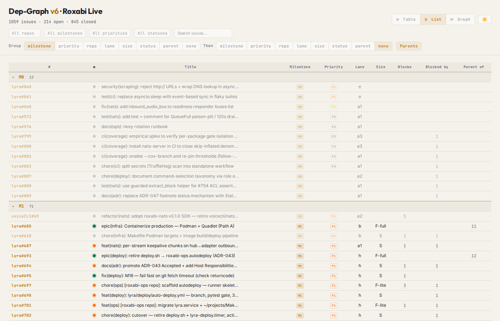
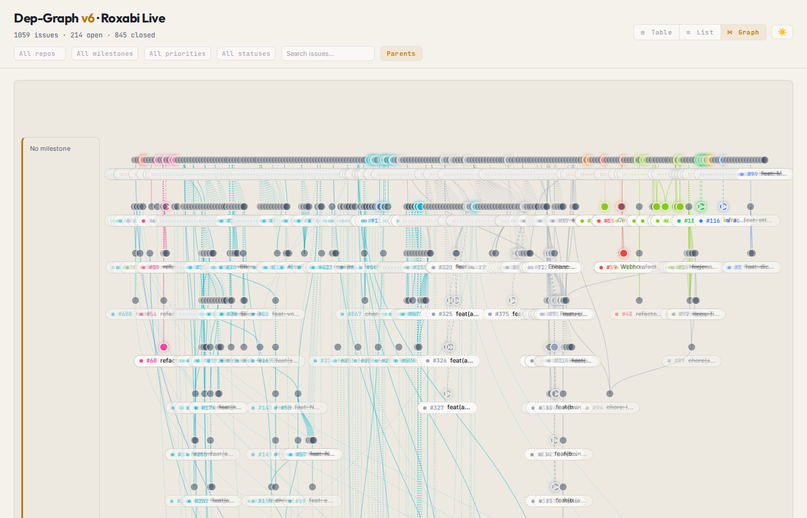
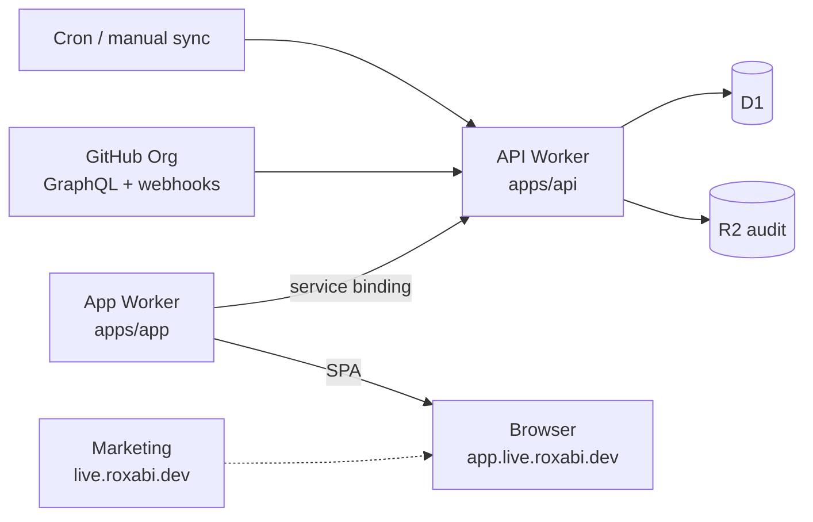

# Roxabi Live

**Operations cockpit for the Roxabi GitHub org — issue status, dependency graphs, and real-time sync.**

| Table View | List View | Graph View |
|:---:|:---:|:---:|
|  |  |  |

Roxabi Live syncs GitHub issues from your org into [Cloudflare D1](https://developers.cloudflare.com/d1/) and serves a multi-view dashboard at **[app.live.roxabi.dev](https://app.live.roxabi.dev)**. It tracks parent/child relationships and blockers, applies real-time updates via GitHub webhooks, and reconciles on a schedule — across three Cloudflare surfaces (marketing, app, API).

**Multi-user:** any GitHub user with access to the installed GitHub App can sign in via OAuth. The app is session-gated — `/api/*` requires an active session cookie. `/admin/*` additionally sits behind Cloudflare Access (Email-OTP).

| Host | Role |
|------|------|
| [live.roxabi.dev](https://live.roxabi.dev) | Marketing (Astro, CF Pages) |
| [app.live.roxabi.dev](https://app.live.roxabi.dev) | React SPA + same-origin API proxy |
| [api.live.roxabi.dev](https://api.live.roxabi.dev) | Hono API, webhooks (+ optional cron) |

## Why

GitHub Projects and the default issue list give no cross-repo dependency view. Roxabi Live solves three specific gaps:

- **No pivot matrix** — GitHub has no milestone × lane overview across repos.
- **No dependency graph** — blocker and parent/child chains are invisible in the default UI.
- **No single corpus** — querying across repos requires multiple API calls with no local cache.

## Quick Start

Nothing to install to **use** the product — sign in at [app.live.roxabi.dev](https://app.live.roxabi.dev).

**Structure issues for the cockpit** with the `issue-triage` skill (`/issue-triage`) — see [docs/agent-workflow.md](docs/agent-workflow.md).

**For LLM crawlers:** [llms.txt](llms.txt) · [docs/agent-workflow.md](docs/agent-workflow.md)

Local development:

```bash
git clone https://github.com/Roxabi/roxabi-live.git
cd roxabi-live
bun install
cd apps/api && bunx wrangler dev    # API → http://localhost:8787
# SPA (separate terminal):
cd apps/app && bun run dev
```

Create `apps/api/.dev.vars` (gitignored) with secrets listed in [Configuration](#configuration).

Deploys are Cloudflare git-connected: push to `staging` → staging; push to `main` → production. See [CLAUDE.md](CLAUDE.md) deploy section.

## How It Works



**Sync flow:**
1. Scheduled reconcile and `POST /admin/sync` fetch issues via GitHub GraphQL (`subIssues`, `parent`, `blockedBy`, `blocking`) and upsert into D1.
2. GitHub webhooks (`POST /webhook/github`, HMAC-verified) apply incremental updates.
3. The React app at `app.live.roxabi.dev` proxies `/api/*` to the API worker and renders pivot, list, and graph views.

## Features

| Category | Feature |
|---|---|
| **Views** | Pivot matrix (milestones × lanes), flat list, SVG dependency graph |
| **Filters** | Multi-select: repo, milestone, priority, status; full-text search |
| **Dependencies** | Parent/child edges + blocker edges; status propagation (blocked/ready/done) |
| **Sync** | GitHub GraphQL sync; webhook updates; manual admin sync |
| **Theme** | Light/dark toggle |
| **Storage** | Cloudflare D1 + R2 per-run audit log |

## API Reference

Browser traffic is same-origin on `app.live.roxabi.dev` (proxied to the API worker).

| Endpoint | Method | Auth | Description |
|---|---|---|---|
| `/health` | GET | public | DB reachability + issue count |
| `/api/version` | GET | public | Build/version info |
| `/login` | GET | public | Start GitHub App OAuth flow |
| `/oauth/callback` | GET | public (validates D1 state) | OAuth callback; sets `__Host-session` cookie |
| `/logout` | POST | public (idempotent) | Clear session cookie |
| `/api/me` | GET | session | Current authenticated user info |
| `/api/active-tenant` | POST | session | Set active org when user has >1 installation |
| `/api/issues` | GET | session | List issues (`repo`, `state`, `label`, `limit`, `offset`) |
| `/api/issues/{key}` | GET | session | Single issue by key, e.g. `Roxabi/lyra#123` |
| `/api/graph` | GET | session | Full dependency graph JSON, scoped to tenant |
| `/admin/sync` | POST | CF Access + ADMIN_TOKEN Bearer | Out-of-band sync trigger |
| `/webhook/github` | POST | HMAC-SHA256 | GitHub webhook receiver (on `api.*`) |

**session** = `__Host-session` cookie validated against D1 `sessions` table.

## Configuration

Bindings live in [`apps/api/wrangler.toml`](apps/api/wrangler.toml); secrets via `wrangler secret put`.

### Bindings

| Binding | Type | Description |
|---|---|---|
| `DB` | D1 | Issue corpus + sessions |
| `ASSETS` | Static | Legacy `frontend/` shell (cleanup pending) |
| `LOGS` | R2 | Per-run sync audit |

### Secrets

| Secret | Required | Description |
|---|---|---|
| `GITHUB_WEBHOOK_SECRET` | yes | Org webhook HMAC secret |
| `GITHUB_APP_ID` | yes | GitHub App numeric ID |
| `GITHUB_APP_CLIENT_ID` | yes | OAuth client ID |
| `GITHUB_APP_CLIENT_SECRET` | yes | OAuth client secret |
| `GITHUB_APP_PRIVATE_KEY` | yes | base64 PKCS#8 DER RSA key |
| `GITHUB_APP_WEBHOOK_SECRET` | yes | App-level webhook secret |
| `INSTALL_TOKEN_KEY` | yes | AES-GCM DEK for install tokens at rest |
| `GITHUB_ORG` | yes | Org slug to sync |
| `ADMIN_TOKEN` | optional | Bearer gate for `POST /admin/sync` |
| `NOTIFY_URL` | optional | Circuit-breaker alert webhook |

```bash
cd apps/api
printf %s '<value>' | bunx wrangler secret put GITHUB_APP_ID
printf %s '<value>' | bunx wrangler secret put GITHUB_APP_ID --env staging
```

For local dev: `apps/api/.dev.vars` (never commit).

## Self-hosting

See **[docs/DEPLOY.md](docs/DEPLOY.md)** for GitHub App setup, Cloudflare provisioning, and migrations.

## Plugins

**`roxabi-issues`** — issue triage skill that pairs with the cockpit:

```bash
claude plugin marketplace add Roxabi/roxabi-live
claude plugin install roxabi-issues
```

`/issue-triage` sets labels (size / priority / lane / type) and manages blocked-by + parent/child relations — **no Projects V2 board**. See [docs/agent-workflow.md](docs/agent-workflow.md).

## Contributing

See [CONTRIBUTING.md](CONTRIBUTING.md) and [docs/getting-started.md](docs/getting-started.md).