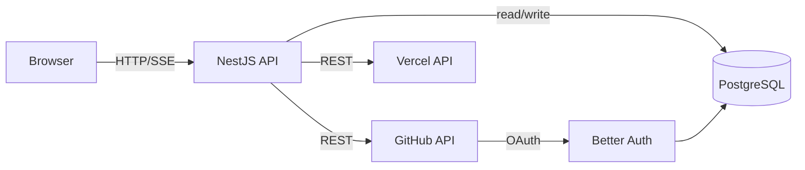
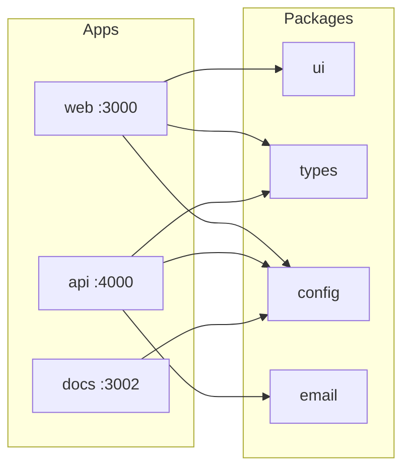

# Roxabi Dashboard

[](https://github.com/Roxabi/roxabi-dashboard/actions/workflows/ci.yml)


**Real-time GitHub project management dashboard for the Roxabi team.**

<!-- TODO: Add demo GIF once seed data is ready — see scripts/record-demo.ts -->

## Why

Managing GitHub issues, PRs, and CI status across multiple repos requires switching between GitHub tabs constantly. There's no unified view, no team-wide workspace config, and no way to triage from a phone.

Roxabi Dashboard fixes this — a single deployed web app showing live issues, PRs, CI status, and Vercel deployments across all Roxabi repos, with GitHub OAuth so any team member can use it without PAT setup.

## How it works

The web frontend connects to a NestJS API that proxies GitHub's API and streams live updates over SSE. Workspace config (filters, column widths, saved views) is persisted in PostgreSQL per user.



## Features

### Issues & PRs

| Feature | Description |
|---------|-------------|
| Live issue board | Real-time status, size, and priority across all repos |
| Field edits | Update status/size/priority directly from the UI |
| CI status | Per-PR CI run results inline |
| Vercel deployments | Preview URL and deploy status per PR |

### Auth & Workspace

| Feature | Description |
|---------|-------------|
| GitHub OAuth | Sign in with GitHub — no PAT setup required |
| Multi-user | Each team member gets their own workspace config |
| Persistent filters | Saved views stored in PostgreSQL, not a local file |

## Stack

| Layer | Technology |
|-------|------------|
| Monorepo | Bun + TurboRepo |
| Language | TypeScript 5.x strict |
| Linting | Biome |
| Frontend | TanStack Start |
| Backend | NestJS + Fastify |

## Quick Start

**Prerequisites:** Node ≥ 24, Bun 1.3.9+, Docker

```bash
# 1. Clone and install
git clone https://github.com/Roxabi/roxabi-boilerplate.git
cd roxabi-boilerplate
cp .env.example .env
bun install

# 2. Start the database and apply migrations
bun run db:up
bun run db:migrate
bun run db:seed

# 3. Start all apps
bun run dev   # web :3000 · api :4000 · email :3001
```

```bash
# Common commands
bun run lint          # Biome lint
bun run format        # Biome format
bun run typecheck     # TypeScript
bun run test          # Vitest (not `bun test`)
```

## Structure

```
roxabi_boilerplate/
├── apps/
│   ├── web/          # Frontend (TanStack Start)
│   ├── api/          # Backend (NestJS + Fastify)
│   └── docs/         # Documentation site (Fumadocs + Next.js)
├── packages/
│   ├── ui/           # Shared UI components
│   ├── config/       # Shared configurations
│   ├── types/        # Shared TypeScript types
│   ├── email/        # Email templates
│   ├── vitest-config/ # Shared Vitest configuration
│   └── playwright-config/ # Shared Playwright configuration
└── docs/             # MDX source files (rendered by apps/docs)
```

## How it works

A TurboRepo monorepo orchestrates three apps — `web` (TanStack Start + SSR), `api` (NestJS + Fastify), and `docs` (Fumadocs). Shared packages (`ui`, `types`, `config`, `email`) are consumed across apps via Bun workspaces. TurboRepo caches build artifacts so only changed packages rebuild.



## Features

### Auth & identity

| Feature | Details |
|---------|---------|
| Magic link | Passwordless email auth via better-auth |
| Session management | Secure, server-side sessions |
| Organizations | Multi-tenant — invite, switch, manage |
| RBAC | Role-based access control per org |
| API keys | Per-org key issuance and revocation |

### Developer experience

| Feature | Details |
|---------|---------|
| TurboRepo | Build caching and task graph |
| Biome | Lint + format in one fast tool |
| Vitest + Playwright | Unit, integration, and e2e tests |
| Git hooks | Lefthook: pre-commit, commit-msg, pre-push |
| Semantic release | Conventional Commits → changelog + tags |
| AI team | Claude agents covering the full dev lifecycle |

## Git Hooks

Git hooks are configured using [Lefthook](https://github.com/evilmartians/lefthook) and are installed automatically on `bun install`.

| Hook | Purpose | Speed |
|------|---------|-------|
| **Commit-msg** | Validate Conventional Commits format | <1s |
| **Pre-commit** | Auto-format staged files with Biome | <1s |
| **Pre-push** | Full validation (lint, typecheck, tests, i18n, license) | <30s (cached) |

**Bypass for emergencies:** Use `--no-verify` flag (CI is the ultimate enforcement).

## Development Process

```
GitHub Issue → Branch → Implement → PR → Review → Merge
```

## Documentation

| Doc | Description |
|-----|-------------|
| [docs/index.mdx](docs/index.mdx) | Documentation home |
| [CONTRIBUTING.md](CONTRIBUTING.md) | How to contribute |
| [docs/getting-started.mdx](docs/getting-started.mdx) | Getting started guide |
| [docs/configuration.mdx](docs/configuration.mdx) | Configuration reference |
| [docs/contributing.mdx](docs/contributing.mdx) | Contributing guidelines (detailed) |
| [docs/hooks.mdx](docs/hooks.mdx) | Git hooks & CI hooks |
| [docs/architecture/](docs/architecture/) | Architecture decisions & diagrams |
| [docs/standards/](docs/standards/) | Coding standards (FE, BE, testing, code review) |
| [docs/guides/](docs/guides/) | Guides (auth, deployment, i18n, security, etc.) |
| [docs/processes/](docs/processes/) | Dev process & issue management |
| [docs/product/](docs/product/) | Product vision & strategy |
| [docs/changelog/](docs/changelog/) | Release changelog |

## License

MIT
