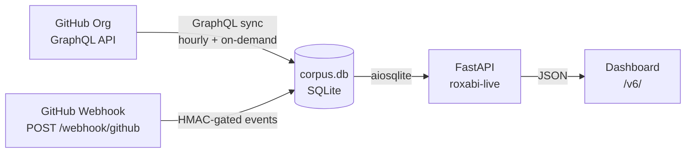

# Roxabi Live

**Operations cockpit for the Roxabi GitHub org — issue status, dependency graphs, and real-time sync.**

| Table View | List View | Graph View |
|:---:|:---:|:---:|
|  |  |  |

Roxabi Live pulls GitHub issues from the entire org into a local SQLite corpus and serves a multi-view dashboard. It tracks parent/child relationships and blockers, updates in real time via webhooks, and runs an hourly reconciler to stay in sync.

## Why

GitHub Projects and the default issue list give no cross-repo dependency view. Roxabi Live solves three specific gaps:

- **No pivot matrix** — GitHub has no milestone × lane overview across repos.
- **No dependency graph** — blocker and parent/child chains are invisible in the default UI.
- **No single corpus** — querying across repos requires multiple API calls with no local cache.

## Quick Start

```bash
# 1. Install
git clone https://github.com/Roxabi/roxabi-live.git
cd roxabi-live
make install

# 2. Configure
cp .env.example .env
# Set CORPUS_DB_PATH and GITHUB_WEBHOOK_SECRET in .env

# 3. Sync corpus
make sync

# 4. Start dev server
uv run roxabi-live
# → http://localhost:8000/v6/
```

## How It Works



**Sync flow:**
1. `roxabi-corpus sync` fetches issues via GraphQL — `subIssues`, `parent`, `blockedBy`, `blocking` fields.
2. Issues and edges land in `corpus.db` (tables: `issues`, `edges`, `repos`, `sync_state`).
3. FastAPI serves the corpus over a REST API; the frontend builds the views client-side.
4. Incoming webhooks trigger incremental updates; the reconciler runs every hour to catch drift.

## Features

| Category | Feature |
|---|---|
| **Views** | Pivot matrix (milestones x lanes), flat list, SVG dependency graph |
| **Filters** | Multi-select: repo, milestone, priority, status; full-text search |
| **Dependencies** | Parent/child edges + blocker edges; status propagation (blocked/ready/done) |
| **Sync** | GitHub GraphQL corpus sync; hourly reconciler; real-time webhook updates |
| **Theme** | Light/dark toggle |
| **Storage** | Single SQLite file — no external DB |

## API Reference

| Endpoint | Method | Description |
|---|---|---|
| `/health` | GET | Health check + DB stats |
| `/api/issues` | GET | List issues (supports `repo`, `milestone`, `status`, `priority`, `search` query params) |
| `/api/issues/{key}` | GET | Single issue by key, e.g. `Roxabi/lyra#123` |
| `/api/graph` | GET | Full dependency graph JSON |
| `/api/repos` | GET | List synced repos |
| `/webhook/github` | POST | GitHub webhook receiver (HMAC-verified) |
| `/v6/` | Static | Dep-graph dashboard |
| `/dep-graph/` | Static | Legacy v5 view |

## Configuration

Copy `.env.example` to `.env` and set values.

| Variable | Default | Description |
|---|---|---|
| `CORPUS_DB_PATH` | `~/.roxabi/corpus.db` | Path to corpus SQLite database |
| `GITHUB_WEBHOOK_SECRET` | — | HMAC secret for webhook verification |
| `CORPUS_SYNC_INTERVAL_SECONDS` | `3600` | Reconciler interval in seconds |

## Contributing

See [CONTRIBUTING.md](CONTRIBUTING.md).
