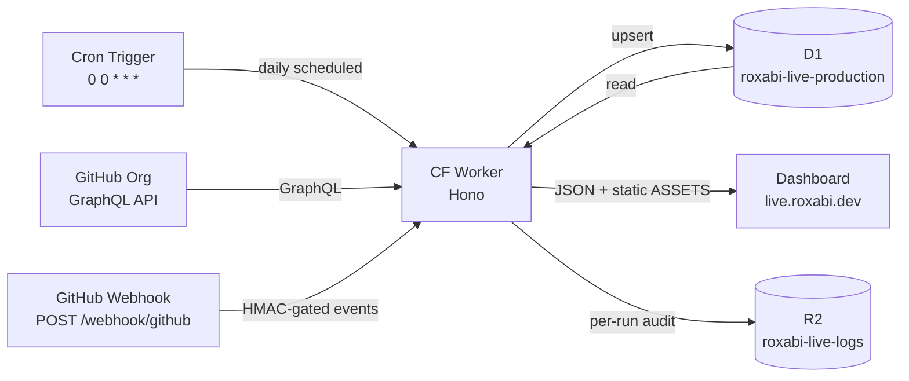

# Roxabi Live

**Operations cockpit for the Roxabi GitHub org — issue status, dependency graphs, and real-time sync.**

| Table View | List View | Graph View |
|:---:|:---:|:---:|
|  |  |  |

Roxabi Live pulls GitHub issues from the entire org into a [Cloudflare D1](https://developers.cloudflare.com/d1/) database and serves a multi-view dashboard at **[live.roxabi.dev](https://live.roxabi.dev)**. It tracks parent/child relationships and blockers, applies real-time updates via a GitHub org webhook, and re-syncs daily via a Cron Trigger — all on a single Cloudflare Worker.

**Multi-user:** any GitHub user with access to the installed GitHub App can sign in via OAuth (`GET /login`). The app is session-gated — `/api/*` requires an active session cookie. `/admin/*` additionally sits behind Cloudflare Access (Email-OTP) as a defense-in-depth layer. The **staging** workers.dev URL is fully gated by CF Access (see `docs/s10-staging-access.md`).

## Why

GitHub Projects and the default issue list give no cross-repo dependency view. Roxabi Live solves three specific gaps:

- **No pivot matrix** — GitHub has no milestone × lane overview across repos.
- **No dependency graph** — blocker and parent/child chains are invisible in the default UI.
- **No single corpus** — querying across repos requires multiple API calls with no local cache.

## Quick Start

Roxabi Live runs as a **Cloudflare Worker** at **[live.roxabi.dev](https://live.roxabi.dev)** — nothing to install to use it. Sign in with your GitHub account via `GET /login`.

Local development:

```bash
git clone https://github.com/Roxabi/roxabi-live.git
cd roxabi-live/worker
npm ci
npx wrangler dev          # local Worker + D1 → http://localhost:8787
```

Create a `worker/.dev.vars` file (wrangler reads it automatically, never commit it) with the secrets listed in the [Configuration](#configuration) section.

Deploys are CI-driven: push to `staging` → staging Worker; push to `main` → production (`live.roxabi.dev`).

## How It Works



**Sync flow:**
1. A Cron Trigger (`0 0 * * *`) invokes the Worker's `scheduled` handler daily (full reconcile, #80); `POST /admin/sync` triggers it out-of-band.
2. The Worker fetches issues via GitHub GraphQL — `subIssues`, `parent`, `blockedBy`, `blocking` fields — and upserts into D1 (tables: `issues`, `edges`, `repos`, `sync_state`).
3. The Worker serves the corpus over a JSON API; the static frontend (ASSETS binding) builds the views client-side.
4. The GitHub org webhook (`POST /webhook/github`, HMAC-verified) applies incremental updates in real time; each sync run writes a JSON audit to R2.

## Features

| Category | Feature |
|---|---|
| **Views** | Pivot matrix (milestones x lanes), flat list, SVG dependency graph |
| **Filters** | Multi-select: repo, milestone, priority, status; full-text search |
| **Dependencies** | Parent/child edges + blocker edges; status propagation (blocked/ready/done) |
| **Sync** | GitHub GraphQL sync; daily Cron Trigger; real-time webhook updates |
| **Theme** | Light/dark toggle |
| **Storage** | Cloudflare D1 (serverless SQLite) + R2 per-run audit log |

## API Reference

| Endpoint | Method | Auth | Description |
|---|---|---|---|
| `/health` | GET | public | DB reachability + issue count |
| `/api/version` | GET | public | Build/version info |
| `/login` | GET | public | Start GitHub App OAuth flow; redirects to GitHub |
| `/oauth/callback` | GET | public (validates D1 state) | OAuth callback; sets `__Host-session` cookie |
| `/logout` | POST | public (idempotent) | Clear session cookie |
| `/api/me` | GET | session | Current authenticated user info |
| `/api/active-tenant` | POST | session | Set active org when user has >1 GitHub App installation |
| `/api/issues` | GET | session | List issues (`repo`, `state`, `label`, `limit`, `offset` query params) |
| `/api/issues/{key}` | GET | session | Single issue by key, e.g. `Roxabi/lyra#123` |
| `/api/graph` | GET | session | Full dependency graph JSON (nodes + edges), scoped to tenant |
| `/admin/sync` | POST | CF Access + ADMIN_TOKEN Bearer | Out-of-band sync trigger |
| `/webhook/github` | POST | HMAC-SHA256 (`X-Hub-Signature-256`) | GitHub org webhook receiver; CF Access Bypass at edge |
| `/*` | GET | public | Static frontend (ASSETS binding) |

**session** = `__Host-session` cookie validated against D1 `sessions` table (`requireSession` middleware).

## Configuration

Bindings live in [`wrangler.toml`](wrangler.toml); secrets are set per-environment via `wrangler secret put`.

### Bindings

| Binding | Type | Description |
|---|---|---|
| `DB` | D1 | Issue corpus + sessions (`roxabi-live-production` / `roxabi-live-staging`) |
| `ASSETS` | Static | Serves `frontend/` via ASSETS binding |
| `LOGS` | R2 | Per-run sync audit (`roxabi-live-logs` / `roxabi-live-logs-staging`) |
| Cron | trigger | `0 0 * * *` — daily full reconcile |

### Secrets

| Secret | Required | Description |
|---|---|---|
| `GITHUB_WEBHOOK_SECRET` | yes | HMAC-SHA256 secret matching your GitHub org webhook (`X-Hub-Signature-256`) |
| `GITHUB_APP_ID` | yes | GitHub App numeric ID (App-JWT generation for install-token flow) |
| `GITHUB_APP_CLIENT_ID` | yes | GitHub App OAuth client ID (`/login` → `/oauth/callback` flow) |
| `GITHUB_APP_CLIENT_SECRET` | yes | GitHub App OAuth client secret (token exchange in `/oauth/callback`) |
| `GITHUB_APP_PRIVATE_KEY` | yes | base64-encoded PKCS#8 DER RSA private key for signing App-JWTs |
| `GITHUB_APP_WEBHOOK_SECRET` | yes | App-level webhook HMAC secret (distinct from org `GITHUB_WEBHOOK_SECRET`) |
| `INSTALL_TOKEN_KEY` | yes | base64-encoded 32-byte AES-GCM DEK for encrypting installation tokens at rest |
| `GITHUB_ORG` | yes | GitHub org slug to sync (e.g. `Roxabi`); set via `wrangler secret put` |
| `ADMIN_TOKEN` | optional | Bearer gate for `POST /admin/sync`; if unset, CF Access alone guards `/admin/*` |
| `NOTIFY_URL` | optional | Webhook URL for sync circuit-breaker halt/auth-failure alerts |

```bash
# wrangler.toml lives at the repo root, so run from worker/ with --config
# set a secret (prod)
cd worker && printf %s '<value>' | npx wrangler secret put GITHUB_APP_ID --config ../wrangler.toml

# same secret on staging
cd worker && printf %s '<value>' | npx wrangler secret put GITHUB_APP_ID --env staging --config ../wrangler.toml
```

For local dev, put secrets in `worker/.dev.vars` (one `KEY=VALUE` per line; never commit this file).

## Self-hosting

Roxabi Live is designed to fork. See **[docs/DEPLOY.md](docs/DEPLOY.md)** for the complete step-by-step guide: creating a GitHub App, provisioning Cloudflare resources (Worker, D1, R2), setting repo CI secrets, and running migrations.

Replace the following Roxabi-specific values with your own when forking:

| Value | Where | How to obtain |
|---|---|---|
| `live.roxabi.dev` | `wrangler.toml` `routes` | Your own custom domain (or use `workers.dev`) |
| `roxabi-live` / `roxabi-live-staging` | `wrangler.toml` `name` / `[env.staging]` | Your choice of Worker names |
| D1 database IDs | `wrangler.toml` `[[d1_databases]]` | `wrangler d1 create <name>` |
| R2 bucket names | `wrangler.toml` `[[r2_buckets]]` | `wrangler r2 bucket create <name>` |
| GitHub App slug in install URL | `worker/src/` (redirect on no-install) | Your GitHub App's slug from App settings |

## Plugins

This repo also hosts the **`roxabi-issues`** Claude Code plugin (`plugins/roxabi-issues/`), relocated from `dev-core` — issue triage that pairs with the cockpit.

```bash
claude plugin marketplace add Roxabi/roxabi-live
claude plugin install roxabi-issues
```

The `issue-triage` skill (invoked `roxabi-issues:issue-triage`) sets labels (size / priority / lane / type) and manages blocked-by dependencies and parent/child sub-issues on GitHub issues — **labels + native relations only, no Projects V2 board** (the cockpit owns the read/dashboard side). Self-contained bun project.

## Contributing

See [CONTRIBUTING.md](CONTRIBUTING.md).
