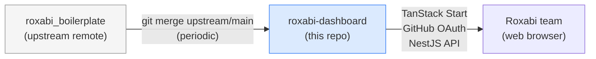

## Source

> "We need to switch on a boilerplate framework, so we can start from scratch. A lot of stuff are incorrect in the current roxabi dashboard." — Issue #1 + frame interview

## Problem

The Roxabi issues dashboard lives inside `roxabi-plugins` as a Bun/TypeScript terminal app. It is not a web app, has no multi-user support, and requires per-machine GitHub PAT setup. The code has accumulated enough issues that porting it is not worthwhile — a clean rewrite on top of `roxabi_boilerplate` is the correct path.

The challenge: this repo (`roxabi-dashboard`) currently has no application code. It needs to be seeded with the boilerplate stack (TanStack Start + NestJS + Fastify + PostgreSQL + Better Auth + Tailwind v4) **and** retain the ability to pull future boilerplate improvements without a full manual diff each time.

## Outcome

A running monorepo at `roxabi-dashboard` with:
- `apps/web` — TanStack Start app, GitHub OAuth sign-in, placeholder dashboard route
- `apps/api` — NestJS + Fastify backend, Better Auth configured for GitHub OAuth
- `packages/*` — shared UI, types, config from boilerplate
- `upstream` git remote pointing to `roxabi_boilerplate`, pullable at any time (`git fetch upstream` succeeds, boilerplate history visible)
- CI passes (lint, typecheck, build)
- Local dev starts with `bun run dev`

No dashboard data yet — that's the next issue. This issue = scaffold only.

## Appetite

1 week.

## Shapes

### Shape A: Upstream remote tracking (Recommended)

Copy all files from `../roxabi_boilerplate` into this repo once, then add the boilerplate repo as an `upstream` git remote. Future updates are pulled via `git fetch upstream && git merge upstream/main` (or `git cherry-pick` for selective updates).

```bash
# One-time setup
cp -r ../roxabi_boilerplate/. .
git remote add upstream https://github.com/Roxabi/roxabi_boilerplate.git
git fetch upstream

# Future updates
git fetch upstream
git merge upstream/main   # or: git cherry-pick <commit-sha>
```

**Trade-offs:**
- Pro: Standard git workflow. Simple commands. Works with any git tooling.
- Pro: Cherry-pick granularity — take only what you want from boilerplate updates.
- Pro: No extra tooling — just git remotes.
- Con: Merge conflicts on files you've customized heavily (expected over time as the app diverges). Highest-risk files: `apps/web/src/routes/`, `apps/api/src/`, `package.json`, `biome.json`.
- Con: `bun.lock` will diverge independently — always re-run `bun install` after every upstream merge and commit the regenerated lockfile.
- Con: `upstream/main` might break your build if boilerplate has breaking changes — must review before merging.

**Rough scope:** M

---

### Shape B: Git subtree

Embed the boilerplate as a git subtree at the repo root (prefix=`.`). Updates pulled via `git subtree pull`.

```bash
# One-time
git subtree add --prefix=. https://github.com/Roxabi/roxabi_boilerplate.git main --squash

# Future updates
git subtree pull --prefix=. https://github.com/Roxabi/roxabi_boilerplate.git main --squash
```

**Trade-offs:**
- Pro: Squash option keeps history clean. Explicit "boilerplate update" commits.
- Pro: `--squash` means you get a single diff commit per update rather than full upstream history.
- Con: `git subtree` with `prefix=.` (root) is uncommon and can behave unexpectedly.
- Con: Harder to cherry-pick individual commits vs Shape A.
- Con: Requires all contributors to understand subtree workflows.

**Rough scope:** M

---

### Shape C: Manual copy, diverge intentionally

Copy once, never pull updates. Accept that the boilerplate and the dashboard will diverge permanently. When a boilerplate update is wanted, manually diff and apply.

**Trade-offs:**
- Pro: Zero tooling complexity. No merge conflicts to manage.
- Con: Violates stated requirement — "I want to pull regularly".
- ❌ Eliminated.

## Fit Check

**Shape A** is the recommended approach.

The upstream remote pattern is the industry-standard way to fork a template and stay in sync. It's what GitHub itself recommends for template repositories. The merge conflicts that will accumulate over time are a manageable cost — especially since roxabi-dashboard will heavily customize only a small surface (the dashboard domain, GitHub OAuth config, and workspace data fetching). The boilerplate's infrastructure (auth, DB, CI, UI packages) can be updated relatively cleanly.

Shape B (subtree) adds operational complexity for a workflow that behaves almost identically to Shape A in practice. Not worth the overhead.



### Files impacted (initial scaffold)

| Layer | Source | Action |
|-------|--------|--------|
| `apps/web/**` | boilerplate | Copy as-is, replace dashboard route content |
| `apps/api/**` | boilerplate | Copy as-is, configure GitHub OAuth |
| `packages/**` | boilerplate | Copy as-is |
| `package.json` | this repo | Merge (add boilerplate scripts, keep existing devDeps) |
| `.env` | this repo | Merge (add boilerplate vars, keep dev-core vars) |
| `.env.example` | boilerplate | Copy, add dev-core vars |
| `turbo.jsonc` | boilerplate | Copy |
| `biome.json` | boilerplate | Copy |
| `lefthook.yml` | this repo | Merge (boilerplate has its own hooks) |
| `CLAUDE.md` | this repo | Keep (project-specific) |
| `vision.md`, `roadmap.md` | this repo | Keep |
| `artifacts/**` | this repo | Keep |
| `docs/**` | this repo | Merge with boilerplate docs/ |
| `bun.lock` | boilerplate | Copy on seed; re-generate (`bun install`) after every upstream merge |
| Unneeded modules | boilerplate | Strip after seed: i18n/Paraglide, email flows, consent banner, org management, admin panel. Document strip list — future merges may re-introduce these as additions, requiring a re-strip step. |
