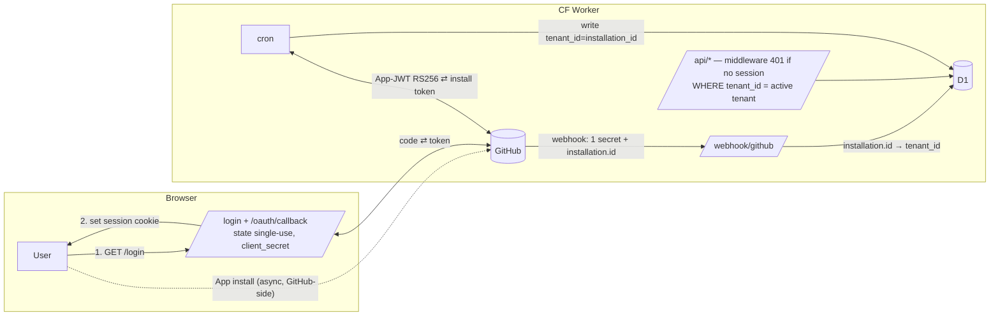

## Source

> "On voulait étendre ça avec une authentification GitHub […] permettre aux utilisateurs de relier
> leur compte GitHub à l'outil […] que ça devienne un outil pour tout le monde plutôt qu'un outil
> que pour moi." — Phase 1 of `artifacts/analyses/zk-encryption-spike-analysis.mdx` (ADR → Shape D).

The ADR settled the **archetype** (single GitHub App, server-centric, single D1 + `tenant_id`,
phased toward an opt-in Phase-2 ZK mode). This analysis decides the **implementation shape** for
Phase 1 — grounded in the *actual* current Worker — and locks the sub-decisions `/spec` will split
into child issues. **Review-hardened**: 5 expert reviews (architect, security, devops, product, doc)
folded in; see Review Log.

## Problem

The Worker is single-tenant to the bone (verified in `worker/src/`):

- **One credential, one org:** sync reads a single `GITHUB_TOKEN` (**PAT**) + `GITHUB_ORG` var;
  `runSync` syncs exactly one org per cron tick. No App, OAuth, installation tokens, or user identity.
- **No identity layer:** no `users`/`sessions`/`tenants`/`installations`/`oauth_state` tables; the
  Worker is blind to the user — Cloudflare Access at the edge is the *sole* guard except `/admin/*`.
- **Globally-shared data:** `issues` (PK `key` = `owner/repo#N`), `edges` (PK `(src,dst,kind)`),
  `labels`, `pr_state`, `repos`, `sync_state` — **none** carry a tenant column. Every read in
  `api/issues.ts` + `api/graph.ts` is unfiltered; `GET /api/graph` dumps the entire corpus; and
  `GET /api/issues/:key` returns any issue by key (a latent IDOR once multi-tenant).
- **One webhook:** single `GITHUB_WEBHOOK_SECRET`, keys from `repository.full_name`, one org.

So "let any GitHub user see their own issues" touches every layer: auth (new), schema (breaking),
sync (per-tenant loop), webhook (tenant routing), reads (tenant filter, fail-closed), frontend (login).

## Outcome

A second GitHub user logs in, links their account, and sees **only their own** issues + dep-graph in
prod, with tenant isolation verified, and no auth rewrite when Phase-2 ZK lands. (Frame #141.)

## Appetite

F-full epic; `/spec` smart-splits into child issues. Likely split: **(1)** schema migrations +
auth tables · **(2)** App-JWT + OAuth + sessions module · **(3)** per-installation sync fan-out +
PAT retirement · **(4)** webhook tenant routing + stub policy · **(5)** tenant-filtered reads +
middleware · **(6)** login/account-link/consent UI · **(7)** CI migrate-step + staging URL + R2 +
Access-policy deploy runbook.

---

## Current architecture (grounding)

| Layer | Today | Phase-1 delta |
|---|---|---|
| Auth | CF Access (edge) + `ADMIN_TOKEN` on `/admin/*` | + app sessions (fail-closed) on public app; Access → `/admin/*` only |
| GitHub creds | 1 PAT (`GITHUB_TOKEN`) + 1 `GITHUB_ORG` | GitHub App: App-JWT (RS256) → per-installation tokens; **PAT removed** |
| Identity | none | `users` + `sessions` + `installations` + `user_installations` + `oauth_state` |
| Schema | `issues` PK `key`; `edges` PK `(src,dst,kind)`; no tenant | `tenant_id` everywhere; **composite PKs** (table-recreation) |
| Reads | all unfiltered | middleware-gated `/api/*`; every WHERE + every single-fetch `AND tenant_id=?` |
| Writes | `sync.ts`, `webhook/mutations.ts` | every write carries `tenant_id`; stubs tenant-local + title-less |
| Webhook | 1 org secret, keys from `repository.full_name` | 1 App secret; route by `installation.id`; unknown install → 200 no-write |
| Frontend | no login; `app.js` → `/api/graph`,`/api/version` | login + account-link + consent UI |
| Runtime | Hono on workerd; Web Crypto already used (HMAC) | + RS256 App-JWT + session crypto via Web Crypto |
| Deploy/CI | `ci.yml`: `npm ci` + `wrangler deploy` (no migrate step) | + `wrangler d1 migrations apply` per-env; secret guards; staging URL + R2 |

Bindings today = `DB` (D1), `ASSETS`, `LOGS` (R2, optional). **No KV, no DO, no Queues.**

---

## Core decision — what is a "tenant", and which credential syncs it?

Everything downstream follows from this axis. Three mutually-exclusive shapes:

**Shape 1 — Installation-as-tenant.** App installed on the user's account/org → `installation_id` =
tenant + sync credential; OAuth only for identity. Sync mints installation tokens (App-JWT →
`POST /app/installations/:id/access_tokens`). Webhooks routed by `payload.installation.id`.
*Pro:* high rate limits, auto-rotation, **no broad user-token at rest**, native webhooks. *Con:*
install step; multi-org user → N installations (needs membership). **Scope L.**

**Shape 2 — User-token sync.** OAuth-only; **store user-to-server token server-side** and sync with it.
`tenant_id` = user id. *Pro:* lightest onboarding. *Con:* token refresh machinery, **lower rate
limits**, **large user-token-at-rest liability**, **no webhooks → polling** (kills the real-time
model), stalls on expiry. **Weaker outcome, contradicts the ADR.** Scope L.

**Shape 3 — Hybrid: installation for sync + OAuth for identity. ← adopt.** OAuth user-to-server =
identity/session (token **discardable** after identity — minimal liability, reused live in Phase 2);
App installation = data access + sync credential. Tables: `users`, `installations`,
`user_installations` (membership). `tenant_id` = `installation_id` on data rows. One user → many
installations; one installation → many authorized users (same-org colleagues share one tenant, **no
data duplication**). *Con:* most moving parts; onboarding = authorize **and** install. **Scope L–XL.**

### Fit Check

| | Shape 1 | Shape 2 | **Shape 3** |
|---|---|---|---|
| Real-time webhooks (keep model) | ✓ | ✗ | **✓** |
| Sync rate limits at scale | ✓ | ✗ | **✓** |
| Token-at-rest liability | low | **high** | **low** |
| Multi-org user supported | ✗ | ✓ | **✓** |
| Phase-2 ZK seam ready | partial | ✓ | **✓** |
| Matches ADR Shape A/D | ✓ | ✗ | **✓✓** |

**Eliminated: Shape 2** (weaker outcome, contradicts ADR). **Shape 1 vs 3:** 3 = 1 + the membership
join that "link your account and see your org's issues" requires. **Adopt Shape 3.** (Architect:
shapes cover all viable combinations; Shape 3 is the only consistent option.)



---

## Settled sub-decisions

### Sessions & access enforcement
1. **D1 `sessions` table** — opaque random token **hashed at rest** (store SHA-256 of token, compare
   hash), FK→`users`, `tenant_id` of the **active** installation, `expires_at` (short TTL), index on
   `tenant_id`. Transport: cookie `HttpOnly; Secure; SameSite=Lax; Domain=<exact host>` (**not** a
   wildcard `.roxabi.dev`). *Rejected:* stateless JWT (can't revoke day-one), KV (no binding; D1 keeps
   revocation transactional).
2. **Revocation (mandatory, day-one):** logout → `DELETE FROM sessions WHERE token_hash=?`;
   `installation.deleted` / user-removed webhook → `DELETE FROM sessions WHERE tenant_id=?`. TTL expiry
   is **not** revocation — both paths required.
3. **Session fixation:** mint a **new** token *after* OAuth completes; never reuse any pre-auth value.
4. **Enforcement point:** a named session middleware on the **`/api/*` group** (mirrors the existing
   `checkAdminAuth` Hono pattern). **Fail-closed:** absent/expired/invalid session → **401 before any
   DB statement executes**. "Every WHERE gets `tenant_id`" is the data guard *behind* the gate, not the
   gate itself.

### OAuth code-exchange
5. **Routes:** `GET /login` (redirect to GitHub authorize + `state`), `GET /oauth/callback` (verify
   `state`, exchange `code`→token with `GITHUB_APP_CLIENT_SECRET`). No PKCE (we hold the secret).
6. **`state` (CSRF):** stored in D1 `oauth_state` table, **single-use** (deleted atomically on first
   successful verify), **TTL ≤ 10 min** enforced at verify, abandoned rows swept. **`redirect_uri` is
   hard-coded in the Worker**, never caller-supplied. (`SameSite=Lax` is acceptable *only* because
   `state` defends the GET callback — documented constraint for future route authors.)
7. **Secrets:** `GITHUB_APP_ID`, `GITHUB_APP_CLIENT_ID`, `GITHUB_APP_CLIENT_SECRET`,
   `GITHUB_APP_PRIVATE_KEY` (PEM), `GITHUB_APP_WEBHOOK_SECRET` — per-env via `wrangler secret put …
   [--env staging]`. **Rotatable, never logged**; RS256 signing errors log message only, never key/JWT.
   Private-key rotation = dual-key overlap (GitHub allows 2 active) + `wrangler secret put` + redeploy
   (deploy-coupled, document in runbook).

### Schema & migration
8. **`tenant_id TEXT`** added to `issues`, `edges`, `labels`, `pr_state`, `sync_state`, `repos`,
   `repo_allowlist`. New tables: `users`, `installations`, `user_installations`, `sessions`,
   `oauth_state`.
9. **Composite PKs (fail-closed isolation):** `issues` → `(tenant_id, key)`; `edges` →
   `(tenant_id, src_key, dst_key, kind)`; same on `labels`/`pr_state`. **D1/SQLite has no
   `ALTER TABLE … ADD PRIMARY KEY`** → each is a **table-recreation** migration
   (`CREATE new → INSERT … SELECT → DROP old → ALTER … RENAME`), preserving all indexes/FKs, within one
   migration file. The `tenant_id` predicate is the live guard; composite PK makes a missing predicate
   fail-closed (no silent cross-tenant overwrite).
10. **Migration sequence (non-transactional CF deploy):** **M-a** add `tenant_id` *nullable* + recreate
    PKs + add auth tables → **backfill** → **M-b** set `tenant_id NOT NULL`. **Backfill is a runtime
    op, not SQL-file-embeddable** (installation_id is a runtime value): after the App is installed on
    the `Roxabi` org, set existing rows to that **real installation_id** (not a sentinel) via a
    **chunked admin endpoint / `wrangler d1 execute … UPDATE … WHERE tenant_id IS NULL`** (mind D1
    per-statement row caps; trivial at current data size but state the assumption + verify row-count =
    0 NULLs before applying M-b). Define rollback for orphan rows.
11. **`sync_control` per-tenant:** key-value bag becomes keyed by `(tenant_id, key)` (or a sibling
    `tenant_sync_control`). Per-tenant: `auth_halt_count`, `last_auth_halt_at`, `sync_running`,
    `sync_started_at`. Global: `data_version`. A per-installation failure must **not** hold another
    tenant's lock or trip a global halt.

### Sync & webhook isolation
12. **Per-installation sync fan-out:** `runSync` loops installations → mint token → sync repos → write
    scoped by `tenant_id`. Per-tenant auth-halt breaker (decision 11). **Remove `GITHUB_TOKEN` (PAT)**
    from `Env` + `wrangler.toml` in the same child issue that ships installation tokens — **no PAT
    fallback** (also retire its uses in `handleDeps`/`handleRefDelete`).
13. **Webhook routing:** single App secret (reuse `webhook/hmac.ts`); after HMAC pass, **mandatory**
    `payload.installation.id` → `installations` lookup → `tenant_id` **before any DB write**. Unknown/
    deleted/suspended installation → **return 200 OK, perform no mutation** (so GitHub doesn't retry;
    no orphan/wrong-tenant rows).
14. **Cross-tenant edge / stub policy (security-critical):** stubs are **always written under the
    requesting tenant's `tenant_id`**, `is_stub=1`, `title=NULL`, `body=NULL` — **never** populated with
    content fetched under another installation's token. `closedHopPass` (currently a tenant-blind
    `UNION` over all edges, `sync.ts:985`) is **scoped per-tenant** (walk only that tenant's edge
    graph). Cross-tenant dep references therefore materialize as tenant-local title-less stubs, never as
    another tenant's real data.

### Reads & isolation
15. **Every read tenant-scoped:** `listIssuesRoute` + `graphRoute` (5 queries) gain `WHERE tenant_id=?`;
    **`getIssueRoute`** issue/labels/edges fetches gain **`AND tenant_id=?`** (closes the IDOR — keys
    are public GitHub URLs). `tenant_id` always from the **validated session**, never a request param.
16. **Multi-installation contract:** the **session encodes a single *active* `tenant_id`**. Login: if
    the user has exactly one installation → use it; if >1 → **org-picker** sets the active tenant
    (switchable later). **No UNION-across-tenants** queries (they would defeat composite-PK isolation
    and complicate pagination). This makes every `/api/*` query single-tenant.

### Deploy / CI (devops)
17. **Add `wrangler d1 migrations apply` to `ci.yml`** per-env **before** each `wrangler deploy`
    (`… apply DB --env staging` / `… apply DB`). It does **not** exist today → without it the
    nullable→NOT-NULL sequence never runs.
18. **Secret-presence guard** in CI for `GITHUB_APP_*` (a deploy with missing app secrets succeeds but
    fails at first OAuth) — pre-deploy check or documented `wrangler secret put` pre-flight per env.
19. **Staging needs a testable URL:** staging `route=[]` today → enable `workers_dev=true` (or a test
    route) so the Access-boundary change can be validated end-to-end before prod.
20. **Separate staging R2 bucket** `roxabi-live-logs-staging` (both envs currently point at prod
    `roxabi-live-logs` → staging cron fan-out would pollute the prod audit trail).
21. **CF Access boundary = explicit deployment gate (one-way):** session middleware deployed and
    **verified returning 401** for unauthenticated callers **on staging** *before* the Access policy is
    relaxed on any env. Order: staging smoke-test → Access policy update (Access → `/admin/*` only;
    `/webhook/*` keeps its existing bypass) → prod. Rollback = re-enable the Access rule.

### UX & honesty (product)
22. **Onboarding state machine:** OAuth callback with **no installation for the user** → "authorized,
    not installed" state → guided redirect to the App **install URL** with a clear CTA → re-check on
    return. The acceptance path "logs in → sees issues" has no dead-end.
23. **Operator-read honesty (concrete surface + AC):** a **consent step in the OAuth flow** (before
    first data view) the user must **acknowledge**, plus a **persistent dashboard notice**. Copy warns
    Phase-1 data is operator-readable and **not to paste secrets into issue bodies**. Binary AC: notice
    acknowledged before any issue data renders.
24. **`payload` shape (locked, product calls — see gate):** introduce `payload TEXT` JSON.
    **`title` moves into `payload`** now (graph reads `JSON_EXTRACT(payload,'$.title')`; `state`/`edges`
    stay structural/plaintext). **`body` deferred** (not synced in Phase 1 — broadens operator-readable
    surface, no value to the Phase-1 graph; `payload` shape already accommodates it later). Phase 2 then
    swaps **one** column to ciphertext.

---

## Key risks (beyond the settled mitigations)

- **Composite-PK table-recreation** (dec. 9) is the riskiest migration: a partial failure leaves a
  half-migrated table with no auto-rollback → must be a single, tested migration with a staging dry-run.
- **CF Access one-way relax** (dec. 21): the window between relax and a working session = public data
  exposure → the staging-gate is non-negotiable.
- **Backfill correctness** (dec. 10): any row left `NULL` when M-b applies fails the migration; verify
  `COUNT(*) WHERE tenant_id IS NULL = 0` first.

## Pre-impl validation tasks (binary, do before writing the code they gate)

- **RS256 in workerd:** confirm `crypto.subtle` `importKey(pkcs8, RSASSA-PKCS1-v1_5)` + `sign` works at
  the App-JWT path (distinct from the ADR-verified RSA-OAEP). Fallback if not: re-evaluate App-JWT
  approach. *Gates decision 7/12.*
- **`subIssues`/`parent` via installation token:** one live call confirming no preview header needed
  post-GA when the token type changes from PAT → installation. *Gates decision 12.*

---

## Files / surfaces impacted

| Surface | Current file(s) | Phase-1 change |
|---|---|---|
| Auth (new) | `api/auth.ts` (`ADMIN_TOKEN` only) | `worker/src/auth/*`: App-JWT, OAuth exchange, sessions, middleware |
| Schema | `migrations/0001..0003` | `000N_tenant_nullable+pks.sql` (recreate), `000N_auth_tables.sql`, `000N_tenant_not_null.sql` |
| Env | `types.ts`, `wrangler.toml` (×2 envs) | + `GITHUB_APP_*`; **remove `GITHUB_TOKEN`**; staging URL + `roxabi-live-logs-staging` |
| Sync | `sync/sync.ts`, `sync/graphql.ts` | per-installation loop + token mint; tenant-scoped writes; per-tenant `sync_control`; scoped `closedHopPass` |
| Webhook | `webhook/handlers.ts`, `hmac.ts`, `mutations.ts` | `installation.id`→tenant routing; unknown→200 no-write; tenant-local title-less stubs |
| Reads | `api/issues.ts`, `api/graph.ts` | middleware gate; `tenant_id`/`AND tenant_id=?` on all queries |
| Routing | `router.ts` | `/login`, `/oauth/callback`; session middleware on `/api/*` |
| Frontend | `frontend/app.js`, `index.html` | unauthenticated landing; login; account-link; org-picker; consent notice |
| CI/deploy | `ci.yml`, `wrangler.toml`, CF Access policy | `d1 migrations apply` step; secret guards; Access→`/admin/*`; staging gate |

## Open questions (genuinely open)

- **Membership view evolution:** active-tenant + org-picker is the Phase-1 contract (dec. 16); a merged
  cross-installation view is a possible later enhancement (out of Phase-1 scope).
- **Private-key rotation runbook** detail (dual-key overlap mechanics) — documented at impl, not a gate.

## Review Log

5 parallel expert reviews (architect, security-auditor, devops, product-lead, doc-writer); all
"needs improvement." Must-fixes folded into settled decisions: closedHopPass scoping (dec. 14),
backfill procedure (dec. 10), composite-PK recreation (dec. 9), per-tenant `sync_control` (dec. 11),
oauth_state single-use/TTL/redirect_uri (dec. 6), multi-installation contract (dec. 16), session
revocation + fixation + cookie scope (dec. 1–3), `/api/*` middleware fail-closed + IDOR (dec. 4, 15),
webhook unknown-installation no-write (dec. 13), PAT retirement (dec. 12), CI migrate-step + secret
guards + staging URL + staging R2 (dec. 17–20), Access staging-gate (dec. 21), onboarding state
machine + honesty surface (dec. 22–23), payload/title/body product calls (dec. 24). RS256 +
subIssues moved to pre-impl validation tasks. Mermaid corrected (install async; cron bidirectional);
composite-PK duplication removed.

---

## Addendum (2026-06-10) — repo-canonical pivot

### What changed and why

Decisions 8, 9, and 10 in this analysis (lines above) specified the original **per-tenant**
data model: composite PKs `(tenant_id, issue_key)` on `issues`/`edges`, a `tenant_id` column
on data tables, a live-table PK recreation migration (M-a), and a backfill of `tenant_id` into
existing rows. That model is **superseded** by the **repo-canonical** model ratified 2026-06-10.

**The superseded decisions (preserved above as historical record):**
- Dec. 8: composite PK `(tenant_id, key)` on `issues` — superseded
- Dec. 9: live-table composite-PK recreation migration — superseded (eliminated)
- Dec. 10: `COUNT(*) WHERE tenant_id IS NULL = 0` backfill gate — superseded (no backfill)

### Repo-canonical model

PKs on `issues` (`key = owner/repo#N`) and `edges` remain **unchanged** — globally unique,
no `tenant_id` column added. Authorization is a JOIN at read time:

```sql
-- Superseded (stale):
WHERE i.tenant_id = ?

-- Current (repo-canonical):
JOIN tenant_repo_access tra
  ON tra.repo = i.repo
  AND tra.tenant_id = ?
```

### Risk eliminated

The riskiest migration step — recreating PKs on `issues`/`edges` live tables — is eliminated.
No M-a migration. No M-b NOT NULL cutover on existing tables. S7 scope shrinks to: NOT NULL
on **new tables only** + CF Access narrowed to `/admin/*`.

### New tables (10 new + 2 ALTERs)

New tables added by S1 migrations (#144): `tenants`, `users`, `user_installations`, `sessions`,
`oauth_state`, `install_tokens`, `tenant_repo_access`, `user_repo_permission_cache`,
`sync_control`, `zk_payloads`. Existing tables receive only:
- `ALTER TABLE issues ADD COLUMN payload TEXT`
- `ALTER TABLE repos ADD COLUMN repo_node_id TEXT UNIQUE`

No `tenant_id` column on `issues`, `edges`, `labels`, or `pr_state`.

### Corrections to prior synthesis

| Item | Prior synthesis | Ratified (this addendum) |
|---|---|---|
| `zk_payloads` PK | `(tenant_id, issue_key)` | `(user_id, issue_key)` — ZK keys are per-user browser keys |
| `installations` table | named `installations` | renamed `tenants` (has `installation_id` column) |
| `sync_control` PK | `(tenant_id, key)` | confirmed `(tenant_id, key)` — unchanged |

### Session SELECT (authoritative)

```sql
SELECT s.*, u.github_id, u.github_login
FROM sessions s
JOIN users u ON u.id = s.user_id
WHERE s.token_hash = ?
  AND s.expires_at > datetime('now')
  AND s.revoked_at IS NULL
  AND NOT EXISTS (
    SELECT 1 FROM tenants t
    WHERE t.id = s.tenant_id AND t.suspended_at IS NOT NULL
  )
```

The NOT-EXISTS guard enforces suspended-tenant revocation without an immediate session flush.

### Spec files updated (2026-06-10)

All slice specs amended to reflect this pivot:
- `141-multi-tenant-github-app-auth-spec.mdx` — pivot note + mermaid (repo-canonical)
- `144-schema-tenant-migrations-spec.mdx` — full rewrite (10 tables + 2 ALTERs; no composite-PK recreation)
- `145-github-app-oauth-sessions-spec.mdx` — `SameSite=Strict`; suspended-tenant guard; PKCS#8 contract; vitest RS256 CI guard
- `146-installation-sync-backfill-spec.mdx` — per-repo fan-out; AES-GCM tokens; slot-rotation; SYNC_QUEUE DORMANT; PAT retirement; no backfill
- `147-webhook-tenant-routing-spec.mdx` — lifecycle handlers; issue rows retained on `installation.deleted`; `user_repo_permission_cache` invalidation
- `148-tenant-filtered-reads-spec.mdx` — JOIN `tenant_repo_access`; private-repo permission cache; no `tenant_id` in response shapes
- `150-notnull-access-cutover-spec.mdx` — NOT NULL on new tables only; no backfill on old tables; CF Access → `/admin/*`
