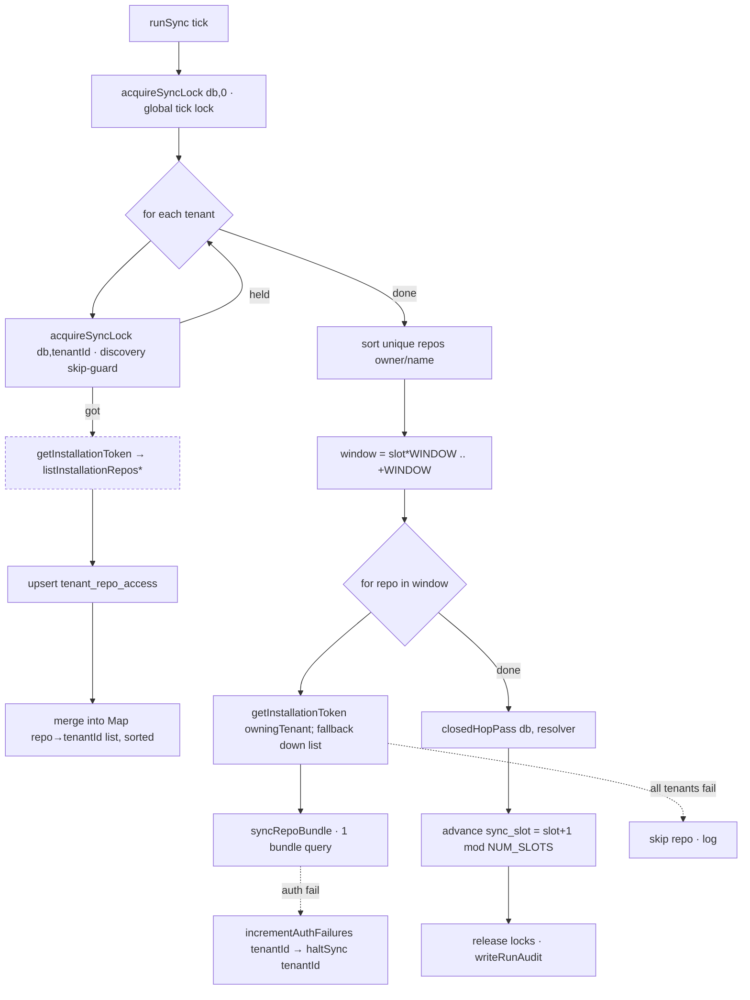

## Source

Issue #160, split from #146: *"This issue is S3b: the sync-layer cutover to
GitHub App installation tokens + PAT retirement."* The 4 RED cases in
`worker/src/sync/sync.test.ts` (`describe.skip("runSync — multi-tenant
installation sync (DEFERRED #160 …)")`, L1485) encode the target contract.

## Problem

`runSync` (`sync.ts:1127`) still runs the legacy flow:

- Reads `env.GITHUB_TOKEN` at **4 sites** — `enumerateOrgRepos` (L1161),
  `enumerateArchivedOrgRepos` (L1165), `syncRepoBundle` loop (L1277),
  `closedHopPass` (L1288).
- Enumerates the live repo set from the **org** (`enumerateOrgRepos`/
  `enumerateArchivedOrgRepos`) gated by the global `repo_allowlist` table.
- All 7 lock/slot helpers (`acquireSyncLock`/`releaseSyncLock`/`isHalted`/
  `getAuthFailures`/`incrementAuthFailures`/`haltSync`/`resetAuthFailures`,
  L213-266) **hardcode `tenant_id=0`** — a single global lock + global
  auth-failure breaker.
- `tenant_repo_access` is never written; `sync_slot` is seeded (0005) but never
  read/advanced.

So: the PAT can't be retired (RT3), multi-tenant installs can't be authorized
(fail-closed gap), and the deduped/windowed fan-out doesn't exist.

## Outcome

`runSync` discovers repos per-installation, dedups the GraphQL fan-out to **1
bundle query per unique repo**, windows under the ~50-subrequest cap via
`sync_slot`, isolates lock/breaker per tenant, and reads **zero**
`env.GITHUB_TOKEN`. `GITHUB_TOKEN` removed from `Env`/`wrangler.toml` (no
fallback) and deleted from secrets (staging→prod, post-verify). All 4 RED cases
pass; conflicting old-flow cases reconciled.

## Appetite

One focused F-full slice = a single PR. No phasing inside the slice; PAT secret
deletion (RT3) is the post-merge operational tail, gated on a verified staging
tick.

## Findings (current → target)

| Concern | Current | Target |
|---|---|---|
| Repo discovery | `enumerateOrgRepos` + `repo_allowlist` (PAT) | per-tenant `listInstallationRepos` → upsert `tenant_repo_access` (install token) |
| Token per repo | `env.GITHUB_TOKEN` everywhere | `resolveInstallToken(db, env, owner, name)` per (owner,name) |
| Fan-out | per `active` repo (org list) | per **unique** repo across tenants (deduped Map) |
| Subrequest cap | `REPO_BUNDLE_QUERY` keeps N+1; no windowing | + slot-rotation window via `sync_control.sync_slot` |
| Lock / breaker | global `tenant_id=0` | threaded `tenantId` (default 0); one tenant ≠ block another |
| `closedHopPass` | `(db, token)` | `(db, resolveToken: (owner,name)=>Promise<string>)` |
| `listInstallationRepos` | `while(true)`, no cap/timeout (W2) | `MAX_PAGES` + `AbortSignal.timeout` per fetch |

**Schema is ready:** `sync_control` PK is already `(tenant_id, key)` (0004);
`tenant_repo_access (tenant_id, repo)` exists (0004); `sync_slot=0` seeded for
`tenant_id=0` (0005). This is an **application-code** rewrite, no migration.

## Shapes — lock unit vs fan-out unit (the hard decision)

The tension: RED case 1 wants **global dedup** (1 query/unique-repo across
tenants); RED case 3 wants **per-tenant lock isolation**. The unit of locking ≠
the unit of fan-out.

### Shape 1: Two-phase — global tick lock + per-tenant discovery skip-guard + global deduped windowed fan-out  ← recommended (architect-confirmed)

- **Entry:** `isHalted(db, 0)` → `acquireSyncLock(db, 0)` — the **existing global
  tick lock** (`sync.ts:1135`) serialises the whole invocation (prevents two
  overlapping cron ticks from double-fan-out / double-slot-advance). Released in
  `finally`.
- **Phase 1 (tenant-outer):** for each tenant with an installation, attempt
  `acquireSyncLock(db, tenantId)` as a **within-tick discovery skip-guard**
  (this is what RED case 3 asserts — the per-tenant *attempt*); held → skip
  *that* tenant, else `getInstallationToken` → `listInstallationRepos`
  (hardened) → upsert `tenant_repo_access`. Build a global
  `Map<repo, tenantId[]>` (**sorted list**, lowest id = owning tenant; list
  enables token fallback) for token sourcing.
- **Phase 2 (global, deduped, under the entry lock):** deterministically sort
  the unique-repo set (`owner/name`); window via `sync_slot`
  (`window = [slot*WINDOW, (slot+1)*WINDOW)`); for each repo in the window →
  `getInstallationToken(db, env, owningTenantId, installationId)` (iterate the
  tenant list on revoked-install, only `incrementAuthFailures` the tenant that
  threw; all fail → skip repo + log, don't abort) → `syncRepoBundle`. Then
  `closedHopPass(db, resolver)`. Advance `sync_slot = (slot+1) % NUM_SLOTS`
  (constant modulus, `tenant_id=0`).
- **Breaker:** `incrementAuthFailures`/`haltSync` scoped to the failing tenant.

**Trade-offs:**
- Pro: satisfies all 4 RED cases (dedup ✓, slot ✓, per-tenant lock attempt ✓,
  no PAT ✓); one tenant's auth failure halts only itself; 1 query/unique-repo;
  overlapping ticks serialised by the entry lock.
- Con: adds a per-tick discovery pass (extra REST calls — cheap, W2-bounded);
  per-repo token resolution moves to the call site (not `resolveInstallToken`,
  whose `.first()` is non-deterministic for multi-tenant rows).

**Rough scope:** L

### Shape 2: Per-tenant full sync (tenant-outer, no cross-tenant dedup)

Each tenant independently: lock → list repos → sync each under its own token.

**Trade-offs:**
- Pro: simplest lock model, fully isolated.
- Con: **violates SC-3** — a repo shared by 2 tenants is fetched twice → RED
  case 1 fails + subrequest cap breaches as installs grow. **Eliminated.**

**Rough scope:** M

### Shape 3: Global single-lock + global dedup (`tenant_id=0` only)

Keep one global tick lock; discover all tenants, dedup, window, fan-out;
breaker global.

**Trade-offs:**
- Pro: minimal change to lock helpers (no `tenantId` threading).
- Con: **violates RED case 3** — one tenant's lock/auth-failure blocks/halts all.
  **Eliminated by the test contract.**

**Rough scope:** M

## Fit Check

**Shape 1.** It is the only shape satisfying the full RED contract + SC-3/4/6.
Global tick lock serialises the run; per-tenant lock gates *discovery* (what RED
case 3 asserts); the deduped fan-out operates on the `tenant_repo_access` union
with per-repo token resolution from the owning-tenant list; the slot is global
(constant `NUM_SLOTS`) because the deduped repo list is global.

`*` = `listInstallationRepos` hardened (MAX_PAGES + AbortSignal.timeout) — in scope this PR.

## Decisions resolved (architect review — fold into /spec)

1. **Lock model:** existing global tick lock `acquireSyncLock(db, 0)` at entry
   serialises the whole run; per-tenant `acquireSyncLock(db, tenantId)` is a
   Phase-1 discovery skip-guard only. **No** second Phase-2 lock. Thread
   `tenantId` (default `0`) through all 7 lock/breaker helpers (`sync.ts:213-273`)
   so existing non-`runSync` callers are unaffected.
2. **Slot windowing:** `next_slot = (slot+1) % NUM_SLOTS` with **constant**
   `NUM_SLOTS = 3` — NOT `ceil(N/WINDOW)` (a volatile divisor permanently
   skips/double-covers repos as installs come/go). `WINDOW = 20` (50-cap budget:
   ~7 reserved for discovery+overhead, 43 for fan-out, halved for closedHopPass
   worst-case ≈ 21). Empty slice (repo count < `slot*WINDOW`) → no fan-out but
   still advance slot (forward progress). Export `WINDOW`/`NUM_SLOTS` so tests
   override without patching internals.
3. **Token source:** `Map<repo, tenantId[]>` (sorted, lowest = owning). Phase 2
   calls `getInstallationToken(db, env, owningTenantId, installationId)`
   **directly** (not `resolveInstallToken` — `.first()` non-deterministic,
   `installToken.ts:182`); on a revoked/suspended install (throw) fall back to
   the next tenant in the list, `incrementAuthFailures` only the thrower; all
   fail → skip repo + log, don't abort. `resolveInstallToken` stays the
   webhook-path resolver (single-tenant invariant holds there).
4. **Prune source:** **union of `tenant_repo_access`** replaces org-enum.
   Re-target the 0-live-repos guard (`sync.ts:1175`) at the **union count** so a
   failed/empty discovery never prunes everything (safe false-negative). A repo
   genuinely removed from all installs → its issues pruned (correct; document).
5. **Empty discovery** (no installs / empty union): no-op + warn — NOT the old
   "empty allowlist short-circuit." Reconcile L967 test.
6. **W2 in scope (not deferred):** harden `listInstallationRepos` (`MAX_PAGES` +
   `AbortSignal.timeout`/fetch) — Phase 1 calls it per tenant every tick.

**Still verify at implement:**
- **Arg-index discrepancy:** issue says the dedup RED case reads `c[2]/c[3]`;
  current skip-block (L1525) already reads `c[0]/c[1]` (correct). Confirm exact
  state — real gap is the missing top-level `vi.mock("../auth/installToken")`.
- **Lock helper INSERT path:** `acquireSyncLock` UPDATEs and silently no-ops if
  the `(tenantId,'sync_running')` row is missing → seed per-tenant
  `sync_control` rows (`INSERT OR IGNORE`) at tenant creation or lazily.

## Files impacted

| File | Change |
|---|---|
| `worker/src/sync/sync.ts` | rewrite `runSync`; thread `tenantId` through 7 helpers; `closedHopPass` resolver; drop 4 `GITHUB_TOKEN` reads; slot windowing; discovery pass |
| `worker/src/auth/installToken.ts` | harden `listInstallationRepos` (W2) |
| `worker/src/types.ts` | drop `GITHUB_TOKEN` from `Env` (T10) |
| `wrangler.toml` | drop `GITHUB_TOKEN` (both envs) |
| `worker/src/sync/sync.test.ts` | un-skip + fix 4 RED cases (add `vi.mock`); reconcile ~11 old-flow `runSync` cases (L924-1408) |

## Risks

- **Live-sync regression during cutover** — PAT stays live until a verified
  install-token tick; RT3 deletion is post-merge, staging→prod.
- **Prune-everything** if discovery yields 0 → mitigated by the 0-live-repos guard.
- **Test reconciliation churn** — the 11 old-flow cases assume org-enum + global
  lock; rewriting them is the bulk of the test work and the main review surface.
