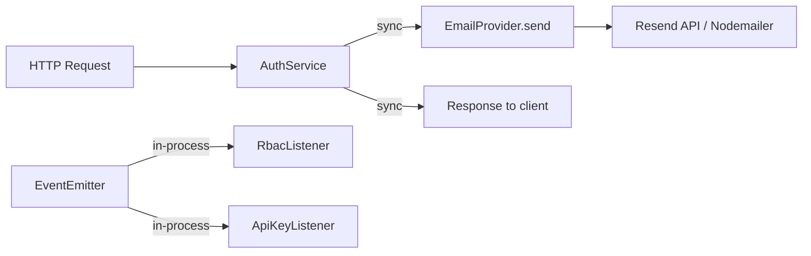
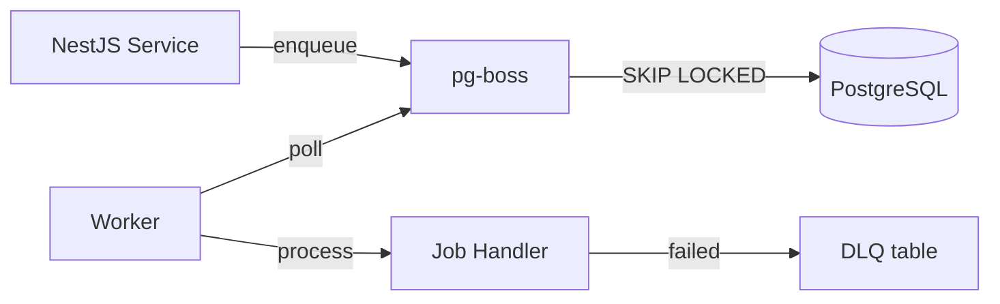
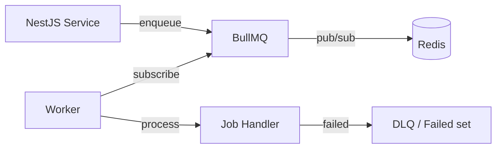

## Source

GitHub Issue #329: "feat(jobs): queue provider setup + worker infrastructure (BullMQ or pg-boss)"

## Problem

The API has no background job processing. All work runs synchronously in request handlers — email sending (`AuthService → EmailProvider.send()`) blocks API responses. The in-process `EventEmitterModule` handles 4 events (org created, email failed, user/org soft-deleted) but offers no retry, persistence, or concurrency control.

As async workloads grow (transactional emails now, webhooks and scheduled tasks later), the platform needs a composable queue with retry policies, dead-letter handling, and graceful shutdown.

## Outcome

- Jobs can be enqueued from any NestJS service and processed asynchronously
- Failed jobs retry with exponential backoff; permanently failed jobs land in a dead-letter queue
- Concurrency is controllable per queue
- Workers shut down gracefully on SIGTERM (drain in-flight jobs)
- The queue module integrates cleanly with NestJS DI (`@InjectQueue`-style patterns)
- First consumer: email sending moves from synchronous to queued

## Appetite

No hard deadline. Get the architecture right — this is foundational infrastructure.

## Current Architecture



**Key findings from codebase exploration:**

| Finding | Detail |
|---------|--------|
| Email sending | Synchronous in `AuthService` → `EmailProvider.send()` |
| Event system | `EventEmitterModule.forRoot()` — in-process, no persistence |
| Redis usage | Upstash only for rate limiting (`ThrottlerStorage`), optional in dev |
| Infrastructure | Docker: PostgreSQL 16 + Mailpit. No Redis container. |
| Deployment | Vercel serverless (frontend + API). Workers need separate hosting. |
| Modules | 18 NestJS modules, well-structured domain separation |

## Shapes

### Shape 1: pg-boss (PostgreSQL-native)

Use pg-boss to leverage the existing PostgreSQL database as the job queue backend. No new infrastructure dependency.



**NestJS integration:** Community module `@nestjs-enhanced/pg-boss` or manual integration (pg-boss has clean API: `boss.send()`, `boss.work()`).

**Trade-offs:**

| | |
|---|---|
| **Pro** | Zero new infrastructure — uses existing Postgres |
| **Pro** | Transactional safety — enqueue + DB write in one transaction (atomic) |
| **Pro** | Lower operational burden for boilerplate users (no Redis to manage) |
| **Pro** | Built-in retry with exponential backoff, DLQ, rate limiting |
| **Con** | No official NestJS module (community wrappers, less documentation) |
| **Con** | Graceful shutdown has known timeout limitations (>30s jobs) |
| **Con** | No job priorities (workaround: separate queues per priority) |
| **Con** | Polling-based — slightly higher latency than Redis pub/sub |
| **Con** | Adds load to the application database under high throughput |

**Rough scope:** L

### Shape 2: BullMQ (Redis-backed)

Use BullMQ with `@nestjs/bullmq` official module. Requires adding Redis as infrastructure dependency.



**NestJS integration:** Official `@nestjs/bullmq` — `BullModule.forRoot()`, `@Processor()` decorator, `WorkerHost` base class. Best-in-class DX.

**Trade-offs:**

| | |
|---|---|
| **Pro** | Official NestJS module — excellent DX, abundant docs/examples |
| **Pro** | Superior graceful shutdown (built-in worker lifecycle) |
| **Pro** | Job priorities, flow producers (parent-child jobs), rate limiting |
| **Pro** | Event-driven (Redis pub/sub) — lower latency than polling |
| **Pro** | Bull Board dashboard available as drop-in |
| **Con** | Adds Redis as mandatory infrastructure dependency |
| **Con** | Higher operational complexity for boilerplate users |
| **Con** | Redis already partially present (Upstash for rate limiting) but Upstash ≠ full Redis |
| **Con** | Cannot atomically enqueue + DB write (two separate systems) |
| **Con** | More moving parts: Redis connection management, sentinel/cluster for HA |

**Rough scope:** L

### Shape 3: Abstracted Queue Module (provider-agnostic)

Build a thin abstraction layer (`QueuePort` interface) that ships with pg-boss as default but allows swapping to BullMQ. Similar to the existing email provider pattern (`EmailProvider` → Resend/Nodemailer).

```mermaid
flowchart TD
    A[NestJS Service] -->|@InjectQueue| B[QueuePort interface]
    B -->|default| C[PgBossAdapter]
    B -->|optional| D[BullMQAdapter]
    C --> E[(PostgreSQL)]
    D --> F[(Redis)]
```

**Trade-offs:**

| | |
|---|---|
| **Pro** | Ships with zero extra infra (pg-boss default) while allowing BullMQ upgrade |
| **Pro** | Follows existing patterns in the codebase (email provider abstraction) |
| **Pro** | Boilerplate users choose based on their scale needs |
| **Con** | Abstraction adds complexity — must define a queue interface that satisfies both |
| **Con** | Leaky abstraction risk — BullMQ features (priorities, flows) don't map to pg-boss |
| **Con** | Two adapters to maintain and test |
| **Con** | Over-engineering if only one provider is ever used |

**Rough scope:** XL

## Fit Check

**Recommended: Shape 1 (pg-boss)** with the door open for future BullMQ migration.

**Reasoning:**

1. **Boilerplate context matters most.** This ships to other developers. Adding Redis as a mandatory dependency raises the "getting started" barrier significantly. pg-boss uses existing Postgres — zero new infra.

2. **Current Redis usage is shallow.** Upstash is used only for optional rate limiting (`ThrottlerStorage`). It's a REST-based KV store, not a full Redis instance. BullMQ needs a real Redis connection (ioredis), which is a different dependency entirely.

3. **pg-boss covers the use cases.** Email sending, webhook delivery, scheduled tasks — none of these need sub-millisecond latency or job priorities. pg-boss handles retry, DLQ, concurrency, and rate limiting.

4. **Transactional enqueue is a real advantage.** Enqueuing a job in the same transaction as a database write prevents the "job enqueued but DB write failed" inconsistency. This matters for data integrity in a SaaS platform.

5. **Shape 3 is premature.** The abstraction adds complexity without proven need. If BullMQ migration becomes necessary (high-throughput scenario), refactoring pg-boss → BullMQ is a bounded effort — the queue module boundary already exists.

**Eliminated:**
- **Shape 2 (BullMQ):** Redis dependency is too heavy for a boilerplate default. Users who need it can add it.
- **Shape 3 (Abstracted):** Over-engineering — YAGNI. The email provider pattern works because both providers exist today; a speculative second queue adapter doesn't justify the complexity.

**Graceful shutdown concern (pg-boss):** The known 30s timeout limitation is acceptable for email/webhook jobs (fast). Long-running AI jobs (future) would need investigation, but that's out of scope per the frame.

**Worker deployment model:**

The queue module must support two modes without changing application code:

| Mode | How it works | When to use |
|------|-------------|-------------|
| **In-process** | `boss.work()` runs inside the NestJS app via `OnModuleInit` | Local dev, single-server deploys (Railway, Fly, VPS) |
| **Separate worker** | Dedicated process imports the same queue module, calls `boss.work()` | Production scale, independent scaling of API vs workers |

**Vercel constraint:** The API currently deploys to Vercel serverless. Serverless functions are ephemeral (10-60s timeout) — a pg-boss worker cannot poll continuously inside a serverless function. This means:
- **Dev:** In-process mode works fine (NestJS runs persistently via `bun run dev`)
- **Production on Vercel:** The worker must run on a separate persistent host (Railway, Fly, VPS). The API on Vercel can still *enqueue* jobs (pg-boss enqueue is a single INSERT — works in any context), but *processing* requires a long-running process elsewhere.
- **Production on persistent host:** If the API moves off Vercel to a persistent host, in-process mode works for both enqueue and processing.

The spec should define both modes and document the deployment pattern. This is not a blocker — pg-boss's API cleanly separates enqueue (`boss.send()`) from processing (`boss.work()`), so the module boundary naturally supports both modes.

**NestJS integration approach:** Rather than depending on community modules with uncertain maintenance, the spec should define manual integration using pg-boss's clean API directly. The pattern mirrors existing codebase conventions: `OnModuleInit` for `boss.start()`, `OnApplicationShutdown` for `boss.stop()`, and a custom provider token (like the existing `EMAIL_PROVIDER` pattern) rather than borrowing BullMQ's `@InjectQueue` decorator naming.
