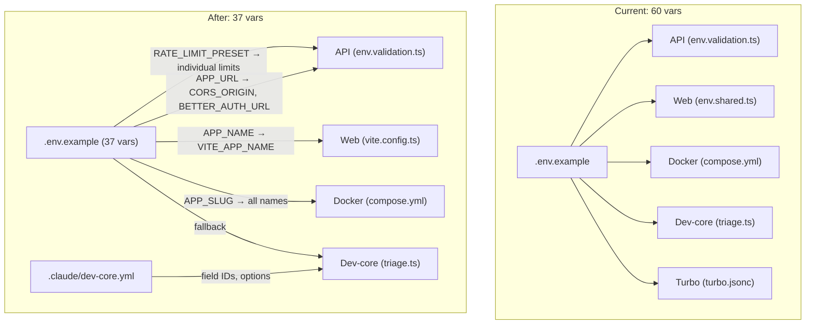

## Source

GitHub issue #498: `.env.example` has grown to ~60 environment variables across 13 sections (160 lines). Many are redundant, derivable, or only relevant to advanced use cases.

## Problem

New developers must configure ~60 env vars to get started, despite most having obvious defaults or being derivable from a single source var. Specific pain points:

1. **Redundant vars:** `CORS_ORIGIN` always equals `APP_URL`, `BETTER_AUTH_URL` always equals `APP_URL`, `VITE_APP_NAME` always equals `APP_NAME` — yet all three must be set independently.
2. **Duplicated vars:** `VERCEL_TOKEN`, `VERCEL_PROJECT_ID`, `VERCEL_TEAM_ID`, `GITHUB_TOKEN` appear twice in `.env.example` (app section + dev-core section).
3. **Tooling vars in app config:** 8 dev-core field IDs (`GH_PROJECT_ID`, `STATUS_FIELD_ID`, `PRIORITY_FIELD_ID`, `SIZE_FIELD_ID`, `*_OPTIONS_JSON`, `GITHUB_REPO`) live in `.env` but are only consumed by the Claude Code plugin — never by the app.
4. **Granular tuning vars:** 7 `RATE_LIMIT_*` vars exist for fine-tuning, but most users just need "on" or "off".
5. **Docker vars already derived:** `POSTGRES_CONTAINER`, `POSTGRES_VOLUME`, `MAILPIT_CONTAINER`, `DB_BRANCH_PREFIX` already derive from `APP_SLUG` in `docker-compose.yml` — `.env.example` incorrectly suggests they need manual configuration.

## Outcome

- `.env.example` reduced from ~60 to ~37 vars (~100 lines)
- New users configure only genuinely required vars (DB, secrets, URLs) — no errors from omitting derivable vars
- Users who omit derivable vars see no startup errors — the app resolves them automatically; explicit values always win silently
- `env:check` reports clean with no false positives for derivable or tooling-only vars
- Documentation reflects the simplified configuration

## Appetite

1-week cycle — full effort including all three change groups, thorough testing, doc updates.

## Var Accounting

| Category | Current count | Shape 1 removes | Shape 2 removes | Final |
|----------|--------------|-----------------|-----------------|-------|
| Derivable (CORS_ORIGIN, BETTER_AUTH_URL, VITE_APP_NAME) | 3 | -3 | — | 0 |
| Duplicated (VERCEL_TOKEN, VERCEL_PROJECT_ID, VERCEL_TEAM_ID, GITHUB_TOKEN) | 4 dupes | -4 | — | 0 dupes |
| Dev-core field IDs (GH_PROJECT_ID, STATUS/SIZE/PRIORITY_FIELD_ID, *_OPTIONS_JSON, GITHUB_REPO) | 8 | — | -8 (move to .claude/dev-core.yml) | 0 |
| Rate limit granular (7 RATE_LIMIT_* tuning vars) | 7 | — | -7 (preset replaces) | 0 (preset + overrides documented as comments) |
| Docker (already derived, remove from required) | 5 | — | -5 (comment-only, clarify derivation) | 0 required |
| **Total removed** | | **~7** | **+~20** | **~27 removed** |
| **Remaining in .env.example** | ~60 | ~53 | — | **~37** |

Note: "removed" means moved from required/visible to either derived-with-fallback, commented-as-advanced-override, or relocated to plugin config. No var is deleted — explicit values always win.

## Shapes

### Shape 1: Derive + Dedup (Quick Wins)

Add fallback logic so 3 vars derive from existing sources. Remove 4 duplicate entries.

**Changes:**

| File | Change |
|------|--------|
| `apps/api/src/config/env.validation.ts` | `CORS_ORIGIN` defaults to `process.env.APP_URL`; `BETTER_AUTH_URL` defaults to `process.env.APP_URL` |
| `apps/web/vite.config.ts` | Set `process.env.VITE_APP_NAME ??= process.env.APP_NAME ?? 'App'` before Vite processes dotenv — keeps `import.meta.env.VITE_APP_NAME` working identically for runtime and tests |
| `.env.example` | Remove `CORS_ORIGIN`, `BETTER_AUTH_URL`, `VITE_APP_NAME` from required section; add to "Advanced Overrides" comment block. Deduplicate Vercel/GitHub tokens (keep one section). |
| `scripts/checkEnvSync.ts` | Add derived vars (`CORS_ORIGIN`, `BETTER_AUTH_URL`, `VITE_APP_NAME`) to a new `DERIVED_VARS` allowlist so env:check skips "missing from .env.example" warnings for them |
| `turbo.jsonc` | Remove `CORS_ORIGIN`, `BETTER_AUTH_URL` from `globalPassThroughEnv` (runtime-only, not build-time — safe to remove from passthrough) |

Note: `VITE_APP_NAME` is already optional in `env.shared.ts` (`.optional()`) — no schema change needed.

**Trade-offs:**
- Pro: Minimal code changes, high impact (~7 vars removed/deduped), zero risk
- Pro: Fully backward compatible — explicit values still win
- Con: Only addresses ~7 of ~27 reducible vars

**Rough scope:** S

### Shape 2: Full Simplification (Derive + Dedup + Move + Presets)

All of Shape 1, plus: move dev-core field IDs to plugin config, introduce rate limit presets, clarify Docker derivation in docs.

**Additional changes beyond Shape 1:**

| File | Change |
|------|--------|
| `.claude/dev-core.yml` (new) | Store `GH_PROJECT_ID`, `STATUS_FIELD_ID`, `SIZE_FIELD_ID`, `PRIORITY_FIELD_ID`, `*_OPTIONS_JSON`, `GITHUB_REPO` |
| Dev-core plugin `triage.ts` | Read field IDs from `.claude/dev-core.yml` first, fall back to env vars. Note: dev-core plugin lives in this repo at `.claude/plugins/cache/roxabi-marketplace/dev-core/` — no cross-repo coordination needed. |
| `apps/api/src/config/env.validation.ts` | Add `RATE_LIMIT_PRESET` enum (`default`\|`strict`\|`relaxed`\|`off`); derive individual limits from preset when granular vars are not set |
| `apps/api/src/throttler/throttler.module.ts` | Resolve preset → individual values at module init |
| `.env.example` | Replace 7 `RATE_LIMIT_*` granular vars with `RATE_LIMIT_PRESET=default`; keep individual vars as commented overrides. Remove dev-core field IDs. Clarify Docker vars are auto-derived. Remove `GITHUB_REPO`. |
| `scripts/checkEnvSync.ts` | Remove dev-core vars from TOOLING_ALLOWLIST (no longer in .env); add `RATE_LIMIT_PRESET` to schema |
| `turbo.jsonc` | Remove 7 individual `RATE_LIMIT_*` vars from `globalPassThroughEnv`; add `RATE_LIMIT_PRESET`. Keep `RATE_LIMIT_ENABLED` (CI sets this to `"false"` for e2e). Keep individual override vars in passthrough if present (backward compat). |
| `docs/configuration.mdx` | Document new derivation logic, presets, migration notes |

**Trade-offs:**
- Pro: Maximum reduction (~27 vars removed/relocated), cleaner separation of concerns
- Pro: Rate limit presets make common configs one-liner
- Con: Dev-core config move adds a new config file (`.claude/dev-core.yml`)
- Con: Preset system is a new pattern (needs testing)

**Rough scope:** M

### Shape 3: Phased Delivery

Shape 1 as PR #1, Shape 2 additions as PR #2. Lower risk per PR, easier to review.

**Trade-offs:**
- Pro: Each PR is small and reviewable; can ship Shape 1 immediately
- Pro: If Shape 2 hits complications (e.g., rate limit preset edge cases), Shape 1 value is already captured
- Con: Two PRs, two review cycles, two deploys
- Con: Intermediate state where some vars are derived but not all — docs must be updated twice

**Rough scope:** M (total across both PRs)

## Fit Check

**Shape 2 (Full Simplification)** is the best fit for the 1-week appetite and F-full tier.

Shape 1 alone underdelivers — it captures ~7 of ~27 reducible vars, leaving the most impactful changes (dev-core move saves 8 vars, rate limit presets save 7) for "later" which may never happen.

Shape 3 (phased) is viable but unnecessary for this scope: the dev-core plugin is in-repo (no cross-repo coordination), the rate limit preset is additive (existing granular vars remain as overrides), and Docker changes are documentation-only. The three change groups are independent — they don't create cascading risk that phasing would mitigate. The overhead of two review/deploy cycles is not justified.

Shape 2 delivers the full ~27-var reduction in a single coherent effort with the 1-week appetite.

**Eliminated:**
- Shape 1: Insufficient for the stated goal and appetite (~7 vs ~27 vars)
- Shape 3: Overhead without meaningful risk reduction — all changes are in-repo and additive

### Key risks

1. **BETTER_AUTH_URL mismatch:** Local `.env` has `http://localhost:4000` (API port) while `.env.example` documents `http://localhost:3000` (web app). The `.env.example` is correct — Better Auth needs the web app URL for cookies. Derivation from `APP_URL` fixes this silently. **Assumption:** `BETTER_AUTH_URL` always equals `APP_URL`. Split-domain deployments (API on separate origin) must explicitly set `BETTER_AUTH_URL` — the derivation is a fallback, not a fixed rule. This is documented in the "Advanced Overrides" section.

2. **Dev-core plugin reads env vars directly:** `triage.ts` reads `process.env.GH_PROJECT_ID` etc. The plugin is in-repo (`.claude/plugins/cache/roxabi-marketplace/dev-core/`), so modifications ship atomically. Update to check `.claude/dev-core.yml` first, fall back to env vars.

3. **turbo.jsonc env passthrough:** `CORS_ORIGIN` and `BETTER_AUTH_URL` are in `globalPassThroughEnv` — this passes vars through to tasks but does NOT affect build cache keys. Removing them is safe because they are runtime-only vars. The 7 individual `RATE_LIMIT_*` vars must also be removed from passthrough when `RATE_LIMIT_PRESET` is added; individual override vars stay in passthrough for backward compatibility. `RATE_LIMIT_ENABLED` must remain (CI depends on it).

4. **CORS_ORIGIN in deploy-preview.yml:** `deploy-preview.yml` explicitly injects `CORS_ORIGIN` via `--env "CORS_ORIGIN=${WEB_PREVIEW_URL}${CORS_EXTRA}"` at deploy time for staging multi-origin support. This injection must be preserved — it is not redundant with derivation. The derivation only applies when `CORS_ORIGIN` is not explicitly set.

5. **Vite APP_NAME injection:** The correct approach is `process.env.VITE_APP_NAME ??= process.env.APP_NAME ?? 'App'` in `vite.config.ts` before Vite processes dotenv. This preserves `import.meta.env.VITE_APP_NAME` for both runtime and tests. Using Vite `define` would break `vi.stubEnv()` in `appName.test.ts` because `define` does compile-time string replacement.

6. **GITHUB_REPO derivation:** Removing `GITHUB_REPO` from `.env` assumes `gh repo view` is available and authenticated. In CI, GitHub Actions provides `GITHUB_REPOSITORY`; in local dev, `gh auth` is assumed. Dev-core plugin should fall back: `.claude/dev-core.yml` → `process.env.GITHUB_REPO` → `gh repo view`.

### Files impacted

| Domain | Files | Change type |
|--------|-------|-------------|
| API config | `env.validation.ts`, `throttler.module.ts` | Schema defaults + preset logic |
| Web config | `vite.config.ts` | `process.env.VITE_APP_NAME ??= process.env.APP_NAME` |
| Tooling | `scripts/checkEnvSync.ts` | New `DERIVED_VARS` allowlist concept |
| Dev-core | `.claude/dev-core.yml` (new), `triage.ts` + other plugin scripts | Config source migration |
| Config | `.env.example`, `turbo.jsonc` | Simplification + passthrough updates |
| Docs | `docs/configuration.mdx` | Document derivation, presets, overrides |
| Docker | `docker-compose.yml` (comments only) | Clarify existing derivation |
| CI | `deploy-preview.yml` (no change — preserve existing CORS_ORIGIN injection) | Verify only |

