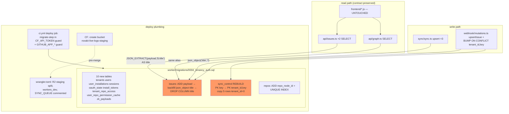

## Summary

Single migration `0004_tenancy_auth.sql` (10 new tables, `title`→`payload` move incl. `DROP COLUMN`,
`repo_node_id` anchor, `sync_control` rebuild), payload refactor across 4 worker src files (API JSON
contract preserved — frontend untouched), CI migrate-step + `GITHUB_APP_*` guard, wrangler.toml
staging R2 split + `workers_dev` + dormant `SYNC_QUEUE` placeholder.

## Spec Deviations (implementation-level, documented)

| # | Spec says | Plan does | Why |
|---|-----------|-----------|-----|
| D-1 | `ALTER TABLE repos ADD COLUMN repo_node_id TEXT UNIQUE` | `ADD COLUMN repo_node_id TEXT` + `CREATE UNIQUE INDEX ux_repos_node_id` | SQLite forbids adding a UNIQUE column via ADD COLUMN. UNIQUE index on nullable col allows multiple NULLs (existing rows safe). |
| D-2 | `sync_control.tenant_id INTEGER NOT NULL REFERENCES tenants(id)` | Rebuild with `tenant_id INTEGER NOT NULL DEFAULT 0`, **no FK** | Table already exists with 5 live global rows (lock, circuit-breaker, data_version) used by runtime SQL in sync.ts/mutations.ts/version.ts. FK to `tenants` would fail on sentinel 0; DEFAULT 0 keeps current INSERTs working. FK semantics arrive when rows become per-tenant (S3). Composite PK `(tenant_id,key)` delivered as specced. Rebuild finalized as rename-swap (old→sync_control_old, new→sync_control, drop old) so data survives any crash point — post-review refinement. |
| D-3 | `SYNC_QUEUE` binding "declared DORMANT" | Commented-out TOML placeholder block | Active Queues producer binding requires queue existence + Workers Paid (plan unconfirmed) — an active binding could fail deploy. Commented block is plan-agnostic. |
| D-4 | spec: `redirect_after TEXT` (no constraint) | `CHECK` same-origin relative path (`LIKE '/%' AND NOT LIKE '//%'`) | review hardening — open-redirect defense-in-depth for S2; S2 callback still validates |
| D-5 | spec: `sessions` table DDL (no secondary indexes) | + `ix_sessions_user_id`, `ix_sessions_expires_at` | review hardening — S2 revocation (`WHERE user_id`) + expiry sweep need them |

## Architecture



```mermaid
flowchart LR
  subgraph m0004["0004_tenancy_auth.sql"]
    ddl[10×CREATE TABLE + rebuild + ALTERs]
  end
  subgraph sync.ts
    upsertSQL[UPSERT_ISSUES_SQL] --- ins1[insert site L445] --- ins2[L871] --- ins3[L1041]
  end
  subgraph mutations.ts
    upsertIssue[UPSERT_ISSUE_SQL L23-31] --- bump[BUMP_DATA_VERSION_SQL L73]
  end
  subgraph issues.ts
    sel1[SELECT L90] --- sel2[SELECT L155]
  end
  subgraph graph.ts
    sel3[SELECT L157]
  end
  T5tests[issues.test.ts · graph.test.ts<br/>sync.test.ts · handlers.test.ts] -->|assert SQL strings + fixtures| sync.ts & mutations.ts & issues.ts & graph.ts
  ddl -->|schema shape| sync.ts & mutations.ts & issues.ts & graph.ts
```

## Bootstrap Context

- Ratified pivot (2026-06-10, PR #152): repo-canonical model — NO `tenant_id` on data tables; spec DDL is authoritative for the 10 new tables (see spec `## DDL`).
- Existing migrations 0001–0003 are **idempotent** (`IF NOT EXISTS` / `INSERT OR IGNORE`) → first tracked `wrangler d1 migrations apply --remote` is safe even if they were originally applied via `d1 execute`. 0001 re-run executes against the pre-0004 shape (ordering safe).
- Tests use **mocked D1** (captured SQL strings + fake row objects), not miniflare — fixture rows model SELECT output, so `title` keys in fake rows stay (alias preserves them); SQL-string assertions must be updated.
- `wrangler d1 migrations apply DB --local` validates the full chain on a fresh local sqlite.

## Agents

| Agent instance | Tasks | Files |
|---|---|---|
| backend-dev-A | T1, T2, T3 | worker/migrations/0004_tenancy_auth.sql, worker/src/sync/sync.ts, worker/src/webhook/mutations.ts |
| backend-dev-B | T4 | worker/src/api/issues.ts, worker/src/api/graph.ts |
| devops-A | T6, T7, T8 | .github/workflows/ci.yml, wrangler.toml, CF R2 (ops) |
| tester-A | T5, T9 | worker/src/**/*.test.ts, local D1 verify |

## Wave Structure

4 waves, max 3 parallel agents. Elapsed ~1 day vs ~2.5 sequential.

| Wave | Trigger | Agents | Tasks |
|------|---------|--------|-------|
| 1 | start | 2 ∥ | backend-dev-A: T1 · devops-A: T6→T7→T8 |
| 2 | T1 done | 2 ∥ | backend-dev-A: T2→T3 · backend-dev-B: T4 |
| 3 | T2,T3,T4 done | 1 | tester-A: T5 |
| 4 | T5,T6,T7 done | 1 | tester-A: T9 (RED-GATE) |

### Budget — per task

| Task | Items | Class | Est. ops | Split? |
|------|-------|-------|----------|--------|
| T1 migration file | 1 file, ~14 DDL blocks | judgmental | 6 | — |
| T2 sync.ts payload | 4 sites | bounded | 5 | — |
| T3 mutations.ts | 2 SQL + 1 confirm | bounded | 4 | — |
| T4 api payload | 3 SELECTs | bounded | 4 | — |
| T5 test updates | 4 files | judgmental | 8 | — |
| T6 ci.yml | 3 steps | judgmental | 5 | — |
| T7 wrangler.toml | 3 edits | bounded | 3 | — |
| T8 R2 bucket create | 1 cmd | trivial | 2 | — |
| T9 RED-GATE | 6 checks | bounded | 4 | — |

**Total estimated ops: 41**

### Budget — per agent instance

| Instance | Tasks | Σ ops | Subjects | Split? |
|----------|-------|-------|----------|--------|
| backend-dev-A | T1, T2, T3 | 15 | migrations, sync-payload | — |
| backend-dev-B | T4 | 4 | api-payload | — |
| devops-A | T6, T7, T8 | 10 | ci, wrangler-config | — |
| tester-A | T5, T9 | 12 | payload-tests | — |

## Consistency Report

- Covered: **6/6** success criteria.
- SC1 (M-a applies clean, 10 tables, 2 ALTERs, no tenant_id on data tables) → T1, T9
- SC2 (no top-level `title`; `JSON_EXTRACT` reads) → T1, T2, T3, T4, T5, T9
- SC3 (`zk_payloads` PK `(user_id,issue_key)`) → T1, T9
- SC4 (`sync_control` PK `(tenant_id,key)`) → T1, T3, T9
- SC5 (ci.yml migrate-step + GITHUB_APP_* guard) → T6
- SC6 (wrangler.toml R2 staging + workers_dev + SYNC_QUEUE dormant) → T7, T8
- Uncovered: none. Untraced tasks: none. Exemptions: M-b NOT-NULL draft = appendix only (committed in S7 per epic).

## Micro-Tasks

### Group SC1–SC4 — migration + payload refactor

**T1 — Write `worker/migrations/0004_tenancy_auth.sql`** `[P]`
- Agent: backend-dev-A · Subject: migrations · Slice: V1 · Phase: GREEN · Difficulty: 4 · Est: 10 min
- File: `worker/migrations/0004_tenancy_auth.sql` (new)
- Content order:
  1. Header comment (applied via `wrangler d1 migrations apply DB [--env staging] --remote`) + `PRAGMA foreign_keys = ON;`
  2. 9 `CREATE TABLE IF NOT EXISTS` from spec DDL **verbatim** (`tenants`, `users`, `user_installations`, `sessions`, `oauth_state`, `install_tokens`, `tenant_repo_access`, `user_repo_permission_cache`, `zk_payloads`)
  3. `sync_control` rebuild (D-2): `CREATE TABLE sync_control_new (tenant_id INTEGER NOT NULL DEFAULT 0, key TEXT NOT NULL, value TEXT, updated_at TEXT NOT NULL DEFAULT (datetime('now')), PRIMARY KEY (tenant_id, key));` → `INSERT INTO sync_control_new (tenant_id, key, value, updated_at) SELECT 0, key, value, updated_at FROM sync_control;` → `DROP TABLE sync_control;` → `ALTER TABLE sync_control_new RENAME TO sync_control;`
  4. `ALTER TABLE issues ADD COLUMN payload TEXT;` → `UPDATE issues SET payload = json_object('title', title) WHERE title IS NOT NULL;` → `ALTER TABLE issues DROP COLUMN title;`
  5. `ALTER TABLE repos ADD COLUMN repo_node_id TEXT;` + `CREATE UNIQUE INDEX IF NOT EXISTS ux_repos_node_id ON repos(repo_node_id);` (D-1)
- Verify: `cd worker && rm -rf .wrangler/state && npx wrangler d1 migrations apply DB --local --config ../wrangler.toml` exits 0; `npx wrangler d1 execute DB --local --config ../wrangler.toml --command "PRAGMA table_info(issues)"` shows `payload`, no `title`; `--command "SELECT tenant_id, key FROM sync_control ORDER BY key"` shows 4 seeded keys at tenant_id=0.
- Expected: clean apply, 10 tables exist, data preserved.
- Spec trace: SC1, SC2, SC3, SC4

**T2 — sync.ts: write `payload` instead of `title`** (blockedBy T1)
- Agent: backend-dev-A · Subject: sync-payload · Slice: V1 · Phase: GREEN · Difficulty: 3 · Est: 8 min
- File: `worker/src/sync/sync.ts`
- Upsert SQL (~L33–41): replace `title` column with `payload`, value `json_object('title', ?)`, conflict-update `payload = excluded.payload`. Bind sites L445, L871, L1041 keep passing `node.title` (it feeds the `json_object` placeholder). GraphQL types (`title: string`) unchanged.
- Verify: `cd worker && npm run typecheck` clean; `grep -n "json_object" src/sync/sync.ts` ≥1; `grep -cn "title\s*=" src/sync/sync.ts` shows no `title =` column assignment in SQL.
- Spec trace: SC2

**T3 — mutations.ts: payload upsert + composite-PK bump** (blockedBy T1)
- Agent: backend-dev-A · Subject: sync-payload · Slice: V1 · Phase: GREEN · Difficulty: 3 · Est: 8 min
- File: `worker/src/webhook/mutations.ts`
- Upsert issue SQL (L23–31): `title` col → `payload` with `json_object('title', ?)`; input type keeps `title: string` (handlers.ts L98 keeps extracting from webhook payload — no change there, confirm only).
- `BUMP_DATA_VERSION_SQL` (L73): `INSERT INTO sync_control (tenant_id, key, value, updated_at) VALUES (0, 'data_version', ?, ?) ON CONFLICT(tenant_id, key) DO UPDATE …` (D-2: old `ON CONFLICT(key)` no longer matches a unique index after rebuild).
- Verify: `cd worker && npm run typecheck`; `grep -n "ON CONFLICT(tenant_id, key)" src/webhook/mutations.ts` hits.
- Spec trace: SC2, SC4

**T4 — api/issues.ts + api/graph.ts: read title via JSON_EXTRACT** `[P]` (blockedBy T1)
- Agent: backend-dev-B · Subject: api-payload · Slice: V1 · Phase: GREEN · Difficulty: 2 · Est: 8 min
- Files: `worker/src/api/issues.ts` (L90, L155), `worker/src/api/graph.ts` (L157)
- Replace `title` in SELECT lists with `JSON_EXTRACT(issues.payload,'$.title') AS title` (issues.ts L90 uses `issues.`-prefixed cols; L155 + graph.ts L157 bare cols → `JSON_EXTRACT(payload,'$.title') AS title`). Row mappings (`row.title`) and response JSON shape unchanged → frontend untouched.
- Verify: `cd worker && npm run typecheck`; `grep -c "JSON_EXTRACT" src/api/issues.ts` == 2; `grep -c "JSON_EXTRACT" src/api/graph.ts` == 1.
- Spec trace: SC2

**T5 — Update tests for payload schema** (blockedBy T2, T3, T4)
- Agent: tester-A · Subject: payload-tests · Slice: V1 · Phase: GREEN · Difficulty: 3 · Est: 15 min
- Files: `worker/src/api/issues.test.ts`, `worker/src/api/graph.test.ts`, `worker/src/sync/sync.test.ts`, `worker/src/webhook/handlers.test.ts`
- Tests mock D1 (captured SQL + fake rows): fake SELECT rows keep `title` keys (alias preserved). Update: assertions matching SQL strings (`title` column lists → `payload`/`json_object`/`JSON_EXTRACT`; `ON CONFLICT(tenant_id, key)`), insert-bind expectations, any fixture asserting `title` column in upserts.
- Verify: `cd worker && npm test` green (all suites).
- Spec trace: SC2, SC4

### Group SC5–SC6 — CI + wrangler config

**T6 — ci.yml: migrate-step + GITHUB_APP_* guard** `[P]`
- Agent: devops-A · Subject: ci · Slice: V1 · Phase: GREEN · Difficulty: 3 · Est: 10 min
- File: `.github/workflows/ci.yml` (deploy job, L78–116)
- Add inside `steps.guard.outputs.enabled == 'true'`, **after `npm ci`, before the deploy steps**:
  - `Migrate D1 (staging)` — `if: …enabled == 'true' && github.ref_name == 'staging'` → `cd worker && npx wrangler d1 migrations apply DB --env staging --remote --config ../wrangler.toml` with `CLOUDFLARE_API_TOKEN`/`CLOUDFLARE_ACCOUNT_ID` env (same as deploy steps)
  - `Migrate D1 (production)` — same for `main`, no `--env`
  - `Guard — GITHUB_APP_* secrets` step (notice-only, same pattern as CF guard): checks `GITHUB_APP_ID`/`GITHUB_APP_PRIVATE_KEY`/`GITHUB_APP_WEBHOOK_SECRET`; missing → `::notice::` (no failure — secrets land in S2); sets `app_secrets=true|false` output for future use.
- Verify: `actionlint .github/workflows/ci.yml` (if installed, else `python3 -c "import yaml,sys; yaml.safe_load(open('.github/workflows/ci.yml'))"`); grep ordering: migrate steps appear between `npm ci` and `wrangler deploy`.
- Spec trace: SC5

**T7 — wrangler.toml: staging R2 split + workers_dev + dormant SYNC_QUEUE** (blockedBy T6 — same instance, sequential)
- Agent: devops-A · Subject: wrangler-config · Slice: V1 · Phase: GREEN · Difficulty: 2 · Est: 5 min
- File: `wrangler.toml`
- `[[env.staging.r2_buckets]] bucket_name` → `"roxabi-live-logs-staging"` (comment: staging/prod audit-log isolation); add `workers_dev = true` under `[env.staging]`; append commented `# [[queues.producers]] … SYNC_QUEUE` placeholder block (D-3) with note "dormant — activate with Queues (Workers Paid) for fan-out, see #146".
- Verify: `cd worker && npx wrangler deploy --dry-run --env staging --config ../wrangler.toml` parses config (dry-run, no deploy).
- Spec trace: SC6

**T8 — Create staging R2 bucket (CF ops, pre-merge)** (blockedBy T7)
- Agent: devops-A · Subject: wrangler-config · Slice: V1 · Phase: GREEN · Difficulty: 1 · Est: 2 min
- Command: `cd worker && CLOUDFLARE_ACCOUNT_ID=b5e90be971920ce406f7b679c4f1cd33 npx wrangler r2 bucket create roxabi-live-logs-staging`
- Verify: `… npx wrangler r2 bucket list | grep roxabi-live-logs-staging`
- Fallback: auth failure → escalate to lead (user runs it); merge blocked until bucket exists (staging deploy would fail).
- Spec trace: SC6

**T9 — RED-GATE: full verification sweep** (blockedBy T5, T6, T7)
- Agent: tester-A · Subject: payload-tests · Slice: V1 · Phase: RED-GATE · Difficulty: 2 · Est: 10 min
- Checks (all must pass, run from `worker/`):
  1. `npm test` green
  2. `npm run typecheck` clean
  3. Fresh local apply: `rm -rf .wrangler/state && npx wrangler d1 migrations apply DB --local --config ../wrangler.toml` exits 0
  4. `npx wrangler d1 execute DB --local --config ../wrangler.toml --command "PRAGMA table_info(issues)"` → `payload` present, `title` absent, no `tenant_id`
  5. `--command "SELECT name FROM pragma_table_info('zk_payloads') WHERE pk > 0 ORDER BY pk"` → `user_id, issue_key`; same for `sync_control` → `tenant_id, key`; `pragma_table_info('edges'|'labels'|'pr_state')` → no `tenant_id`
  6. `--command "SELECT count(*) FROM sync_control WHERE tenant_id = 0"` ≥ 4
- Expected: all 6 green → slice done, ready for /pr.
- Spec trace: SC1, SC2, SC3, SC4

## Task Seeding Blueprint

<!-- Used by /implement to seed TaskCreate calls on session start.
     Format: T{n} | agent-instance | blockedBy | subject
     blockedBy refs T-numbers within this list (not session task IDs).
     Seed in wave order; within a wave all rows are parallel (∥). -->

### Wave 1 — no deps, 2 agents ∥

| Task | Agent instance | blockedBy | Subject |
|------|---------------|-----------|---------|
| T1 | backend-dev-A | — | migrations |
| T6 | devops-A | — | ci |

### Wave 1 (devops chain, same instance)

| Task | Agent instance | blockedBy | Subject |
|------|---------------|-----------|---------|
| T7 | devops-A | T6 | wrangler-config |
| T8 | devops-A | T7 | wrangler-config |

### Wave 2 — after T1, 2 agents ∥

| Task | Agent instance | blockedBy | Subject |
|------|---------------|-----------|---------|
| T2 | backend-dev-A | T1 | sync-payload |
| T3 | backend-dev-A | T2 | sync-payload |
| T4 | backend-dev-B | T1 | api-payload |

### Wave 3 — after Wave 2

| Task | Agent instance | blockedBy | Subject |
|------|---------------|-----------|---------|
| T5 | tester-A | T2, T3, T4 | payload-tests |

### Wave 4 — RED-GATE

| Task | Agent instance | blockedBy | Subject |
|------|---------------|-----------|---------|
| T9 | tester-A | T5, T6, T7 | payload-tests |

## Appendix — M-b NOT-NULL draft (authored in S1, committed in S7/#150)

Per epic #141: this file is **designed here but NOT committed to `worker/migrations/`** until S7,
so CI never applies it before backfill. S7 commits it as `000N_tenant_not_null.sql` after
`COUNT(*) WHERE … IS NULL = 0` re-verification.

```sql
-- 000N_tenant_not_null.sql — S7 (#150) ONLY. Pre-req: backfill verified
-- (no NULL rows). Scope: NEW tables only — data tables keep global PKs.
-- New tables were created with NOT NULL constraints already in 0004;
-- this migration only tightens what was intentionally left nullable in Phase 1:
--   issues.payload stays NULLABLE (stub rows are title-less by design);
--   repos.repo_node_id stays NULLABLE (filled lazily by sync/webhooks).
-- If S2–S6 add any temporarily-nullable columns to the new auth tables,
-- enumerate their NOT NULL rebuilds here. As of S1 design: NO-OP candidate —
-- re-evaluate at S7 entry; if still empty, close #150 with this rationale.
```

## Task IDs

<!-- Generated by /plan. Used by /implement to resume tasks on session restart. -->
- T1: 12 — migrations
- T2: 13 — sync-payload
- T3: 14 — sync-payload
- T4: 15 — api-payload
- T5: 16 — payload-tests
- T6: 17 — ci
- T7: 18 — wrangler-config
- T8: 19 — wrangler-config
- T9: 20 — payload-tests
