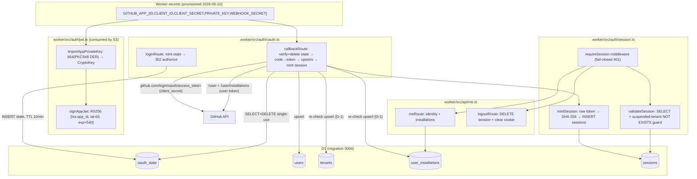
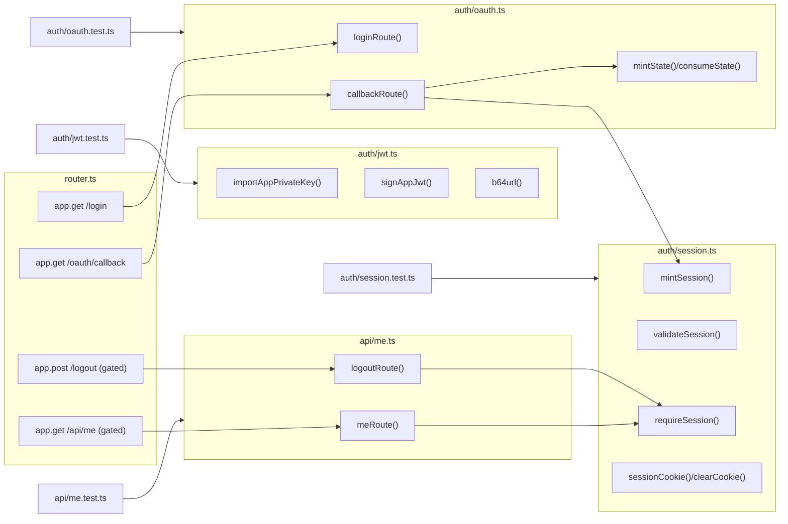

## Summary

Identity layer for the multi-tenant pivot (#141 S2): RS256 App-JWT signer util (+ permanent CI
guard), `GET /login` / `GET /oauth/callback` OAuth flow with single-use `state`, D1-backed
sessions (SHA-256 at rest, fail-closed middleware with suspended-tenant guard), `GET /api/me` +
`POST /logout`. GitHub App registered + all 10 Worker secrets provisioned out-of-band 2026-06-10.

## Architecture

### Data flow

### File × Function map

## Bootstrap Context

- Hono app (`worker/src/router.ts`), routes registered before ASSETS fallback.
- Middleware pattern: `app.use("/admin/*", …)` + `checkAdminAuth` (`worker/src/api/auth.ts`) —
  fail-closed, returns `Response` on deny, `null` on pass. `requireSession` mirrors this.
- Test pattern: colocated `*.test.ts`, FakeD1 with captured SQL strings + fixture rows
  (ref: `worker/src/webhook/mutations.test.ts`, `worker/src/api/issues.test.ts`).
- crypto.subtle usage ref: `worker/src/webhook/hmac.ts` (HMAC import/verify).
- Schema: migration `worker/migrations/0004_tenancy_auth.sql` (S1, live on staging).

## Spec Deviations / Decisions

| ID | Decision | Rationale |
|----|----------|-----------|
| D-1 | `callbackRoute` **re-check**: fetches `/user/installations` with the user token and upserts `tenants` + `user_installations` before minting the session | `sessions.tenant_id NOT NULL REFERENCES tenants` — without tenant rows (S3 webhook not built yet) no session can ever be minted. Parent spec flow §3 explicitly allows "installation webhook **(or callback re-check)**". User with 0 installations → no session, 302 to the App install page (full CTA UI = S6). |
| D-2 | Session cookie is **host-only**: `Domain` attribute omitted; name `__Host-session` (requires Secure + Path=/ + no Domain, browser-enforced) | Spec says `Domain=<exact host>`, but per RFC 6265 an explicit Domain attribute ENABLES subdomains; omitting it is strictly tighter (exact host only). `__Host-` prefix makes the contract self-enforcing. |
| D-3 | RS256 CI guard runs in plain vitest (node env, `globalThis.crypto.subtle`) — not `@cloudflare/vitest-pool-workers` | Suite is plain vitest (mocked D1); webcrypto API surface is identical. The *real-workerd* check is T1: one-shot smoke via `wrangler dev` (local = workerd runtime) before any GREEN code. Adding the workers pool = infra churn deferred. |
| D-4 | Only `/api/me` + `/logout` are session-gated; existing `/api/issues`, `/api/graph` stay open | Gating all `/api/*` reads is S5 (#148) scope — needs tenant-filtered queries first. |
| D-5 | ci.yml app-secrets-guard mapping fixed to `secrets.GH_APP_*` | GitHub rejects Actions secret names with `GITHUB_` prefix (HTTP 422, verified 2026-06-10) — guard as written in S1 could never pass. Env var names inside the step keep `GITHUB_APP_*`. |
| D-6 | `redirect_uri` derived from `new URL(req.url).origin + "/oauth/callback"` | "Worker-hard-coded" = not attacker-suppliable (never read from query/body). Origin differs per env (live.roxabi.dev / workers.dev) — deriving from the CF-edge-trusted request URL covers both without per-env config. |

## Agents

| Instance | Tasks | Files |
|----------|-------|-------|
| devops-A | T1, T11 | scratch smoke, `.github/workflows/ci.yml` |
| tester-A | T2, T13 | `auth/jwt.test.ts`, final verify |
| tester-B | T4 | `auth/oauth.test.ts` |
| tester-C | T6, T8 | `auth/session.test.ts`, `api/me.test.ts` |
| backend-dev-A | T3, T5 | `auth/jwt.ts`, `auth/oauth.ts` |
| backend-dev-B | T7, T9, T10 | `auth/session.ts`, `api/me.ts`, `router.ts` + `types.ts` |

## Wave Structure

4 waves + RED-GATE, max 4 parallel agents. Elapsed ~6 task-slots vs ~13 sequential.

| Wave | Trigger | Agents | Tasks |
|------|---------|--------|-------|
| 1 | start | 4 ∥ | devops-A: T1→T11 · tester-A: T2 · tester-B: T4 · tester-C: T6→T8 |
| RG | T2,T4,T6,T8 done | lead | T12 RED-GATE (structural check, tests exist + fail) |
| 2 | RG ∧ T1 PASS | 2 ∥ | backend-dev-A: T3 · backend-dev-B: T7 |
| 3 | Wave 2 done | 2 ∥ | backend-dev-A: T5 · backend-dev-B: T9 |
| 4 | Wave 3 done | 1 | backend-dev-B: T10 → tester-A: T13 |

### Budget — per task

| Task | Class | Est. ops | Split? |
|------|-------|----------|--------|
| T1 workerd RS256 smoke | judgmental | 6 | — |
| T2 RED jwt | judgmental | 5 | — |
| T3 GREEN jwt | judgmental | 5 | — |
| T4 RED oauth | exploratory | 10 | — |
| T5 GREEN oauth | exploratory | 12 | — |
| T6 RED session | judgmental | 6 | — |
| T7 GREEN session | judgmental | 6 | — |
| T8 RED me/logout | judgmental | 5 | — |
| T9 GREEN me/logout | bounded | 4 | — |
| T10 wiring router+types | bounded | 3 | — |
| T11 ci.yml guard fix | trivial | 2 | — |
| T12 RED-GATE | trivial | 1 | — |
| T13 final verify | bounded | 3 | — |

**Total estimated ops: 68**

### Budget — per agent instance

| Instance | Tasks | Σ ops | Subjects | Split? |
|----------|-------|-------|----------|--------|
| devops-A | T1, T11 | 8 | workerd, ci | — |
| tester-A | T2, T13 | 8 | jwt, verify | — |
| tester-B | T4 | 10 | oauth | — |
| tester-C | T6, T8 | 11 | session, me | — |
| backend-dev-A | T3, T5 | 17 | jwt, oauth | — |
| backend-dev-B | T7, T9, T10 | 13 | session, http | — |

## Consistency Report

Covered 6/6 success criteria. Uncovered: none. Untraced tasks: T11 (D-5, infra debt from S1 —
exemption: required for the S2 acceptance "secrets wired per-env" to be CI-visible), T12 (sentinel).

| SC | Tasks |
|----|-------|
| SC-1 OAuth → session; /api/me; /logout → 401 | T4, T5, T8, T9, T10 |
| SC-2 state single-use, TTL ≤10min, redirect_uri hard-coded | T4, T5 |
| SC-3 fresh token, SHA-256 at rest, cookie attrs | T4, T6, T7 |
| SC-4 suspended-tenant guard in session SELECT | T6, T7 |
| SC-5 PRIVATE_KEY = b64(PKCS#8 DER), importKey('pkcs8') | T1, T3 (secrets already provisioned per contract) |
| SC-6 vitest RS256 guard in CI | T2, T3 |

## Micro-Tasks

### Wave 1 — RED + gates

**T1 — Pre-impl gate: RS256 sign/verify in real workerd** `[P]` — devops-A · workerd · GATE · diff 2 · ~8min
- File: scratch only (`/tmp` worker entry or `--test-scheduled`-style probe; nothing committed except a PASS note in this plan)
- Do: generate throwaway RSA-2048 PKCS#8; minimal worker route running `importKey('pkcs8', …, RSASSA-PKCS1-v1_5/SHA-256, ['sign'])` + `sign` + `verify`; run under `npx wrangler dev` (local mode = workerd) and curl it.
- Verify: HTTP response shows `{imported:true, signed:true, verified:true}`.
- Expected: PASS → unblocks Wave 2. FAIL → STOP, escalate (re-evaluate App-JWT path per spec).

**T2 — RED: auth/jwt.test.ts** `[P]` — tester-A · jwt · RED · diff 2 · ~5min
- File: `worker/src/auth/jwt.test.ts`
- Tests: `crypto.subtle.generateKey` throwaway pair → export PKCS#8 → b64 → `importAppPrivateKey` → `signAppJwt('12345', key, now)` → split JWT: header `{alg:'RS256',typ:'JWT'}`, claims `{iss:'12345', iat:now-60, exp:now+540}`, b64url (no `=+/`), `crypto.subtle.verify` with public key = true; tampered payload → verify false.
- Verify: `npx vitest run src/auth/jwt.test.ts` → fails (module missing) = RED OK.

**T4 — RED: auth/oauth.test.ts** `[P]` — tester-B · oauth · RED · diff 3 · ~10min
- File: `worker/src/auth/oauth.test.ts` (FakeD1 + mocked `fetch`)
- Tests: `/login` → 302 Location = `github.com/login/oauth/authorize` with `client_id`, `state` (32 hex), `redirect_uri=<origin>/oauth/callback`; state row INSERTed with `expires_at` ≤ 10 min; `?redirect=/x` stored, `//evil` & `https://evil` rejected→`/`. Callback: unknown/expired state → 400; **replay (2nd use) → 400** (DELETE on first verify); happy path (mock token exchange + `/user` + `/user/installations`) → users upsert (on github_id), tenants+user_installations upserted (D-1), `Set-Cookie: __Host-session=…; HttpOnly; Secure; SameSite=Strict; Path=/` (no Domain), 302 to stored redirect; 0 installations → 302 to App install page, no session row.
- Verify: file runs RED.

**T6 — RED: auth/session.test.ts** `[P]` — tester-C · session · RED · diff 3 · ~6min
- File: `worker/src/auth/session.test.ts` (FakeD1, captured SQL)
- Tests: `mintSession` → INSERT binds SHA-256 hex of raw token (never raw), expires +8h, returns raw once; `validateSession` SQL `toContain` each guard: `token_hash=?`, `expires_at>datetime('now')` (or bound now), `revoked_at IS NULL`, `NOT EXISTS (SELECT 1 FROM tenants t WHERE t.id=s.tenant_id AND t.suspended_at IS NOT NULL)`; behavior rows: valid→user, suspended-tenant fixture→null; `requireSession`: no cookie→401 JSON, bad token→401, valid→next() (fail-closed default).
- Verify: file runs RED.

**T8 — RED: api/me.test.ts** — tester-C · me · RED · diff 2 · ~5min (after T6, same instance)
- File: `worker/src/api/me.test.ts`
- Tests: GET `/api/me` no session → 401; with session fixture → 200 `{user:{github_id,github_login}, installations:[{tenant_id,installation_id,account_login}]}` (JOIN user_installations×tenants); POST `/logout` → DELETE session row by hash + `Set-Cookie` clearing (`Max-Age=0`) → subsequent me → 401.
- Verify: file runs RED.

**T11 — ci.yml: app-secrets-guard mapping fix** `[P]` — devops-A · ci · GREEN · diff 1 · ~3min (after T1, same instance)
- File: `.github/workflows/ci.yml` (guard step only)
- Do: `GITHUB_APP_ID: ${{ secrets.GH_APP_ID }}`, `GITHUB_APP_PRIVATE_KEY: ${{ secrets.GH_APP_PRIVATE_KEY }}`, `GITHUB_APP_WEBHOOK_SECRET: ${{ secrets.GH_APP_WEBHOOK_SECRET }}` + comment `# GitHub forbids GITHUB_-prefixed Actions secret names (422) — repo secrets are GH_APP_*`.
- Verify: `grep -c "secrets.GH_APP_" .github/workflows/ci.yml` → 3; `secrets.GITHUB_APP_` → 0.

**T12 — RED-GATE** — lead · sentinel
- Verify: T2/T4/T6/T8 files exist, suite fails on the 4 new files only, 265 pre-existing tests still green.

### Wave 2 — GREEN core

**T3 — GREEN: auth/jwt.ts** `[P]` — backend-dev-A · jwt · GREEN · diff 2 · ~5min
- Exports: `importAppPrivateKey(b64: string): Promise<CryptoKey>` (atob→bytes→importKey pkcs8, non-extractable, ['sign']), `signAppJwt(appId: string, key: CryptoKey, nowSec?: number): Promise<string>` (iat-60/exp+540 per GitHub docs), internal `b64url`.
- Verify: T2 green + `tsc --noEmit`.

**T7 — GREEN: auth/session.ts** `[P]` — backend-dev-B · session · GREEN · diff 3 · ~6min
- Exports: `mintSession(db, userId, tenantId)` (32B random hex raw, SHA-256 via crypto.subtle, INSERT, returns raw), `validateSession(db, rawToken)` (hash → guarded SELECT JOIN users → `{userId, tenantId, githubId, githubLogin}` | null), `requireSession(c, next)` Hono middleware (cookie parse `__Host-session`, fail-closed 401 JSON, sets `c.set('session', …)`), `sessionCookie(raw)` / `clearSessionCookie()`.
- Verify: T6 green + tsc.

### Wave 3 — GREEN flow

**T5 — GREEN: auth/oauth.ts** — backend-dev-A · oauth · GREEN · diff 4 · ~12min
- Exports: `loginRoute`, `callbackRoute`. State: 32B hex, INSERT oauth_state (TTL 10 min, redirect_after validated `/^\/(?!\/)/`). Callback: consume state (`DELETE … RETURNING` or SELECT+DELETE), `POST github.com/login/oauth/access_token` (Accept: application/json, client_id+client_secret+code+redirect_uri), `GET api.github.com/user` + `GET api.github.com/user/installations` (Bearer + `User-Agent: roxabi-live`), upsert users on github_id, D-1 upsert tenants (on installation_id) + user_installations, mint session on first tenant, Set-Cookie, 302 redirect_after; 0 installs → 302 `https://github.com/apps/roxabi-live/installations/new`, no session. Never log tokens/secrets.
- Verify: T4 green + tsc.

**T9 — GREEN: api/me.ts** — backend-dev-B · me · GREEN · diff 2 · ~5min
- Exports: `meRoute` (reads `c.get('session')`, SELECT installations JOIN tenants), `logoutRoute` (DELETE sessions WHERE token_hash, clear cookie, 204).
- Verify: T8 green + tsc.

### Wave 4 — wiring + verify

**T10 — Wire router + Env types** — backend-dev-B · http · GREEN · diff 2 · ~4min
- `router.ts`: `app.get("/login", loginRoute)`, `app.get("/oauth/callback", callbackRoute)`, `app.use("/api/me", requireSession)` + `app.get("/api/me", meRoute)`, `app.use("/logout", requireSession)` + `app.post("/logout", logoutRoute)` — registered BEFORE ASSETS fallback; existing routes untouched (D-4). `types.ts`: add `GITHUB_APP_ID/CLIENT_ID/CLIENT_SECRET/PRIVATE_KEY/WEBHOOK_SECRET: string` with provisioning docstrings.
- Verify: `tsc --noEmit` + full `vitest run` green.

**T13 — Final verify** — tester-A · verify · diff 1 · ~4min
- Full suite + count delta (≥ +20 new tests expected), grep no `console.log` of secrets/tokens in `worker/src/auth/`, spot edge cases (expired session row, malformed cookie).
- Verify: `npm test` exit 0; report counts.

## Task Seeding Blueprint

<!-- Format: T{n} | agent-instance | blockedBy | subject -->

### Wave 1 — no deps, 4 agents ∥

| Task | Agent instance | blockedBy | Subject |
|------|---------------|-----------|---------|
| T1 | devops-A | — | workerd |
| T2 | tester-A | — | jwt |
| T4 | tester-B | — | oauth |
| T6 | tester-C | — | session |
| T8 | tester-C | T6 | me |
| T11 | devops-A | T1 | ci |

### RED-GATE — after T2, T4, T6, T8

| Task | Agent instance | blockedBy | Subject |
|------|---------------|-----------|---------|
| T12 | lead | T2,T4,T6,T8 | sentinel |

### Wave 2 — after RG ∧ T1 PASS, 2 agents ∥

| Task | Agent instance | blockedBy | Subject |
|------|---------------|-----------|---------|
| T3 | backend-dev-A | T1,T12 | jwt |
| T7 | backend-dev-B | T12 | session |

### Wave 3 — after Wave 2, 2 agents ∥

| Task | Agent instance | blockedBy | Subject |
|------|---------------|-----------|---------|
| T5 | backend-dev-A | T3,T7 | oauth |
| T9 | backend-dev-B | T7 | me |

### Wave 4 — after Wave 3

| Task | Agent instance | blockedBy | Subject |
|------|---------------|-----------|---------|
| T10 | backend-dev-B | T5,T9 | http |
| T13 | tester-A | T10 | verify |

## Task IDs

<!-- Generated by /plan. Used by /implement to resume tasks on session restart. -->
- T1: 33 — workerd
- T2: 34 — jwt
- T4: 35 — oauth
- T6: 36 — session
- T8: 37 — me
- T11: 38 — ci
- T12: 39 — sentinel
- T3: 40 — jwt
- T7: 41 — session
- T5: 42 — oauth
- T9: 43 — me
- T10: 44 — http
- T13: 45 — verify
