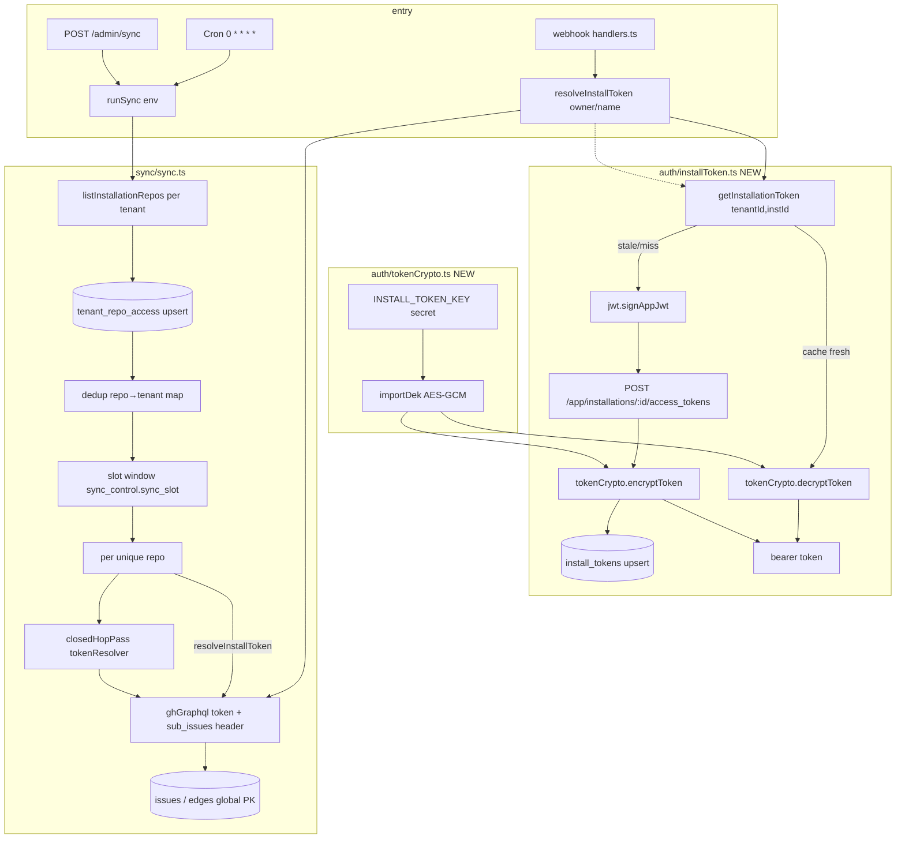
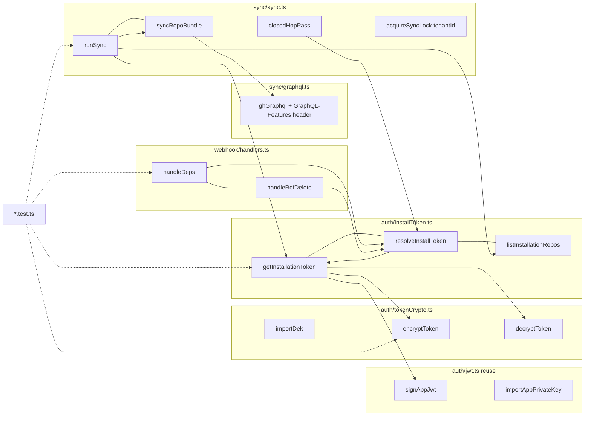

## Summary

Wire the hourly + on-demand sync to **GitHub App installation tokens** (replacing the org-wide PAT),
fan out **one GraphQL call per unique repo** across tenants, window repos under the 50-subrequest cap
via `sync_control.sync_slot`, declare `SYNC_QUEUE` dormant, and **retire `GITHUB_TOKEN`** (no fallback)
once a staging tick is verified. Transport (`ghGraphql`) is already token-parameterized — only the 6
PAT callsites + 3 new modules change.

## Architecture

### Data flow

### File × function map

## Key Design Decisions

- **D1 — SC-9 gate (sub_issues via install token):** No GitHub doc confirms the `GraphQL-Features: sub_issues`
  preview header was retired at GA, BUT current sync queries `subIssues`/`parent` **headerless on the PAT
  successfully** (live on staging), the installation has `issues:read`, and an installation access token (IAT)
  with `issues:read` is documented-equivalent to a PAT for issue reads. **Resolution:** add the header
  defensively (harmless if graduated) + empirical staging smoke-test post-deploy (RT2). Gate cleared with mitigation.
- **D2 — SYNC_QUEUE dormant:** A producer binding to a non-existent queue **breaks `wrangler deploy`**, and Queues
  require Workers **Paid** (plan unconfirmed). **Resolution:** keep the dormant **commented** stanza + add an
  optional `SYNC_QUEUE?: Queue` Env type; defer real `wrangler queues create` + uncomment to Paid + >30 repos
  (zero further code change). Satisfies SC-5 "declared, no consumer".
- **D3 — tenant_repo_access population:** No code writes it today. **Resolution:** populate **at sync-time** via
  `listInstallationRepos(token)` per tenant (self-healing, no webhook-timing dependency); installation-webhook
  event handling deferred to S4 #147. This also replaces the PAT-based `enumerateOrgRepos` discovery.

## Agents

| Agent instance | Tasks | Files | Subjects |
|---|---|---|---|
| tester-A | T1, T2 | tokenCrypto.test.ts, installToken.test.ts | crypto, install-token |
| tester-B | T3, T4, T13 | sync.test.ts, handlers.test.ts, full-suite sweep | sync, webhook, verify |
| backend-dev-A | T5, T6 | tokenCrypto.ts, installToken.ts | crypto, install-token |
| backend-dev-B | T7 | sync/sync.ts | sync |
| backend-dev-C | T8, T9 | webhook/handlers.ts, sync/graphql.ts | webhook, graphql |
| devops-A | T10, T11, T12 | types.ts, wrangler.toml, 0005_*.sql, ci.yml | config, ci |

## Wave Structure

4 waves, max 7 parallel agents. Elapsed ~4 agent-passes vs ~13 sequential.

| Wave | Trigger | Agents | Tasks |
|------|---------|--------|-------|
| 1 | start | 7 ∥ | tester-A: T1,T2 · tester-B: T3,T4 · backend-dev-C: T9 · devops-A: T11,T12 |
| RED-GATE | W1 RED tests present+failing | — | RG1 (sentinel: T1,T2,T3,T4 failing) |
| 2 | RED-GATE | 3 ∥ | backend-dev-A: T5→T6 · backend-dev-B: T7(⟸T6) · backend-dev-C: T8(⟸T6) |
| 3 | W2 done | 1 | devops-A: T10 (⟸T7,T8 — drop PAT after callsites gone) |
| 4 | W3 done | 1 | tester-B: T13 (⟸T9,T10,T11,T12) |

### Budget — per task

| Task | Class | Est. ops | Split? |
|------|-------|----------|--------|
| T1 crypto tests | bounded | 3 | — |
| T2 install-token tests | judgmental | 6 | — |
| T3 sync tests | judgmental | 8 | — |
| T4 webhook tests | bounded | 4 | — |
| T5 crypto impl | bounded | 3 | — |
| T6 install-token impl | judgmental | 8 | — |
| T7 sync refactor | exploratory | 15 | — (own instance) |
| T8 webhook impl | bounded | 3 | — |
| T9 graphql header | trivial | 2 | — |
| T10 Env drop-PAT | trivial | 2 | — |
| T11 migration+wrangler | bounded | 4 | — |
| T12 CI inject | bounded | 3 | — |
| T13 verify sweep | judgmental | 5 | — |

**Total estimated ops: ~66**

### Budget — per agent instance

| Instance | Tasks | Σ ops | Subjects | Split? |
|----------|-------|-------|----------|--------|
| tester-A | T1,T2 | 9 | crypto, install-token | — |
| tester-B | T3,T4,T13 | 17 | sync, webhook, verify(sweep) | — (verify = closeout sweep, not new surface) |
| backend-dev-A | T5,T6 | 11 | crypto, install-token | — |
| backend-dev-B | T7 | 15 | sync | — |
| backend-dev-C | T8,T9 | 5 | webhook, graphql | — |
| devops-A | T10,T11,T12 | 9 | config, ci | — |

## Consistency Report

| Spec criterion | Task(s) |
|---|---|
| SC-1 AES-GCM round-trip, DEK=INSTALL_TOKEN_KEY, no plaintext log | T1, T5 |
| SC-2 refresh when expires_at ≤ now+5min, write D1 | T2, T6 |
| SC-3 dedup repos across tenants, 1 GraphQL/unique repo | T3, T7 |
| SC-4 slot-rotation via sync_control.sync_slot, no cap breach | T3, T7, T11 |
| SC-5 SYNC_QUEUE declared, no consumer (DORMANT) | T10, T11 (D2) |
| SC-6 GITHUB_TOKEN removed Env/wrangler/handleDeps/handleRefDelete | T8, T10 |
| SC-7 PAT deleted staging→prod after verified tick | RT3 (runtime) |
| SC-8 no tenant_id on issues/edges, no backfill | (design — confirmed, no task) |
| SC-9 subIssues/parent gate cleared | D1 → T9 + RT2 |

Covered: 9/9. Untraced tasks: none. Exemptions: SC-8 is a non-action (confirm absence).

## Runtime Ops (ship — sequenced, NOT code tasks)

- **RT1 [PRE-deploy gate]** provision `INSTALL_TOKEN_KEY` (32-byte base64) on staging+prod via
  `wrangler secret put INSTALL_TOKEN_KEY [--env staging]`; add `GH_INSTALL_TOKEN_KEY` Actions secret.
  Worker `Env` requires it → must exist before first deploy or the worker errors.
- **RT2** deploy staging → `wrangler tail --env staging` confirms 1 cron tick mints an install token +
  writes issue rows + `subIssues`/`parent` resolve (clears D1 empirically).
- **RT3** `wrangler secret delete GITHUB_TOKEN --env staging` → confirm clean tick (no 401s) → repeat prod.

## Micro-Tasks

### Wave 1 — RED tests + independent config (7 ∥)

**T1 [P] (RED, tester-A, crypto, diff 2)** — `worker/src/auth/tokenCrypto.test.ts`
Tests against signatures: `importDek(b64:string):Promise<CryptoKey>`, `encryptToken(dek,plaintext):Promise<{enc:string,iv:string}>`, `decryptToken(dek,enc,iv):Promise<string>`.
Cases: round-trip equality; IV is 12 bytes & differs across two encrypts of same plaintext; tampered ciphertext → throws; wrong DEK → throws; outputs base64url.
Verify: `cd worker && npx vitest run src/auth/tokenCrypto.test.ts` → fails (no impl).

**T2 [P] (RED, tester-A, install-token, diff 3)** — `worker/src/auth/installToken.test.ts`
FakeD1 + mocked `fetch`. Signatures: `getInstallationToken(db,env,tenantId,installationId):Promise<string>`, `resolveInstallToken(db,env,owner,name):Promise<string>`.
Cases: cache fresh (expires_at > now+5min) → decrypt, **no mint fetch**; cache stale/missing → signAppJwt + POST mint + encrypt + upsert; resolver with no `tenant_repo_access` row → throws (fail-closed); `tenants.suspended_at` set → throws; plaintext token never written raw (assert stored col is ciphertext).
Verify: `cd worker && npx vitest run src/auth/installToken.test.ts` → fails.

**T3 [P] (RED, tester-B, sync, diff 4)** — `worker/src/sync/sync.test.ts` (additions)
Cases: two tenants sharing repo `o/r` → exactly **1** `REPO_BUNDLE_QUERY` for `o/r`; `sync_slot` advances per tick and windows the repo list (repos beyond per-tick cap deferred); per-tenant lock — tenant A `sync_running` does not block tenant B; assert **no `env.GITHUB_TOKEN`** read in runSync path.
Verify: `cd worker && npx vitest run src/sync/sync.test.ts` → new cases fail.

**T4 [P] (RED, tester-B, webhook, diff 2)** — `worker/src/webhook/handlers.test.ts` (updates)
Cases: `handleDeps` cross-repo path calls `resolveInstallToken(db,env,owner,name)` (not `env.GITHUB_TOKEN`); `handleRefDelete` calls `resolveInstallToken` for the deleted-branch repo.
Verify: `cd worker && npx vitest run src/webhook/handlers.test.ts` → fails.

**T9 [P] (backend-dev-C, graphql, diff 1)** — `worker/src/sync/graphql.ts`
Add `"GraphQL-Features": "sub_issues"` to the `ghGraphql` request headers (defensive, D1). Keep `token` param. Add a unit assertion the header is sent.
Verify: `cd worker && npm run typecheck` + header test green.

**T11 [P] (devops-A, config, diff 2)** — `worker/migrations/0005_sync_slot_seed.sql` + `wrangler.toml`
Migration: `INSERT OR IGNORE INTO sync_control (tenant_id,key,value) VALUES (0,'sync_slot','0');`. wrangler.toml: keep `SYNC_QUEUE` stanza **commented** with a `DORMANT — activate on Workers Paid + >30 repos` note (D2); confirm no `GITHUB_TOKEN` var stanza (secret-only).
Verify: `cd worker && npx wrangler d1 migrations list roxabi-live-production` lists 0005 locally; `grep -n DORMANT wrangler.toml`.

**T12 [P] (devops-A, ci, diff 2)** — `.github/workflows/ci.yml`
Add a guard+inject step mirroring `GH_APP_*`: `GH_INSTALL_TOKEN_KEY` → `wrangler secret put INSTALL_TOKEN_KEY` in the deploy job (staging + prod). Add a TODO comment for the sequenced `GITHUB_TOKEN` deletion (RT3) — do **not** delete in CI.
Verify: `grep -n INSTALL_TOKEN_KEY .github/workflows/ci.yml`; yaml parses.

### RED-GATE V1

**RG1 (sentinel, lead)** — confirm T1–T4 present and failing before any GREEN task. blockedBy T1,T2,T3,T4.

### Wave 2 — GREEN core (3 ∥)

**T5 (GREEN, backend-dev-A, crypto, diff 2)** — `worker/src/auth/tokenCrypto.ts`
Web Crypto AES-GCM. `importDek(b64)` → `crypto.subtle.importKey('raw', base64decode, {name:'AES-GCM'}, false, ['encrypt','decrypt'])`. `encryptToken` → 12-byte random IV, base64url out. `decryptToken`. Never log plaintext.
Verify: `cd worker && npx vitest run src/auth/tokenCrypto.test.ts` green. blockedBy RG1.

**T6 (GREEN, backend-dev-A, install-token, diff 4)** — `worker/src/auth/installToken.ts`
`getInstallationToken(db,env,tenantId,installationId)`: SELECT install_tokens; if `expires_at > now+5min` → `decryptToken`; else `importAppPrivateKey`+`signAppJwt` (jwt.ts) → `POST /app/installations/{id}/access_tokens` → `encryptToken` → upsert → return. `resolveInstallToken(db,env,owner,name)`: JOIN `tenant_repo_access`(repo=`owner/name`)→`tenants`(id, installation_id, suspended_at); throw if no row or suspended (fail-closed) → `getInstallationToken`. `listInstallationRepos(token)`: GET `/installation/repositories` (paginated) → `owner/name[]`.
Verify: `cd worker && npx vitest run src/auth/installToken.test.ts` green + typecheck. blockedBy T5.

**T7 (GREEN, backend-dev-B, sync, diff 5)** — `worker/src/sync/sync.ts`
(a) Repo discovery: for each `tenants` row → `getInstallationToken` → `listInstallationRepos` → upsert `tenant_repo_access`; build deduped `Map<repo, tenantId>` (first tenant wins; repo fetched once). Replaces `enumerateOrgRepos`/`enumerateArchivedOrgRepos` PAT calls.
(b) Per-repo loop: `resolveInstallToken`/`getInstallationToken` token per repo bundle.
(c) `sync_slot` windowing: read slot from `sync_control`, `LIMIT/OFFSET` repo list (~40/tick), advance `slot mod ceil(total/window)`.
(d) Parameterize `acquireSyncLock`/`releaseSyncLock`/`isHalted`/`incrementAuthFailures`/`resetAuthFailures` with `tenantId` (default 0); seed per-tenant rows; per-tenant failure must not hold another tenant's lock.
(e) `closedHopPass(db, tokenResolver)` callback — resolve per (owner,name) hop; unknown repo → caught as orphan stub.
(f) Remove all `env.GITHUB_TOKEN` reads.
Verify: `cd worker && npx vitest run src/sync/sync.test.ts` green + typecheck. blockedBy T6.

**T8 (GREEN, backend-dev-C, webhook, diff 2)** — `worker/src/webhook/handlers.ts`
Line 209 (`handleDeps` cross-repo) + line 364 (`handleRefDelete`): replace `env.GITHUB_TOKEN` with `await resolveInstallToken(db, env, owner, name)` (owner/name already in scope).
Verify: `cd worker && npx vitest run src/webhook/handlers.test.ts` green. blockedBy T6.

### Wave 3 — Env drop-PAT

**T10 (devops-A, config, diff 1)** — `worker/src/types.ts`
Add `INSTALL_TOKEN_KEY: string`; add `SYNC_QUEUE?: Queue` (optional, dormant); **remove `GITHUB_TOKEN`**.
Verify: `cd worker && npm run typecheck` green (all callsites gone). blockedBy T7,T8.

### Wave 4 — verify

**T13 (tester-B, verify, diff 3)** — full gate + regression sweep
`cd worker && npm run typecheck && npm test`; assert `grep -rn "GITHUB_TOKEN" worker/src` returns **no** runtime reads (only comments/tests asserting removal); coverage on new modules.
Verify: suite green + grep clean. blockedBy T9,T10,T11,T12.

## Task Seeding Blueprint

<!-- Used by /implement to seed TaskCreate. blockedBy refs T-numbers (not session task IDs). -->

### Wave 1 — no deps, 7 ∥

| Task | Agent instance | blockedBy | Subject |
|------|---------------|-----------|---------|
| T1 | tester-A | — | crypto |
| T2 | tester-A | — | install-token |
| T3 | tester-B | — | sync |
| T4 | tester-B | — | webhook |
| T9 | backend-dev-C | — | graphql |
| T11 | devops-A | — | config |
| T12 | devops-A | — | ci |

### RED-GATE — after W1 RED tests

| Task | Agent instance | blockedBy | Subject |
|------|---------------|-----------|---------|
| RG1 | lead | T1,T2,T3,T4 | gate |

### Wave 2 — after RED-GATE, 3 ∥

| Task | Agent instance | blockedBy | Subject |
|------|---------------|-----------|---------|
| T5 | backend-dev-A | RG1 | crypto |
| T6 | backend-dev-A | T5 | install-token |
| T7 | backend-dev-B | T6 | sync |
| T8 | backend-dev-C | T6 | webhook |

### Wave 3 — after W2

| Task | Agent instance | blockedBy | Subject |
|------|---------------|-----------|---------|
| T10 | devops-A | T7,T8 | config |

### Wave 4 — after W3

| Task | Agent instance | blockedBy | Subject |
|------|---------------|-----------|---------|
| T13 | tester-B | T9,T10,T11,T12 | verify |

## Task IDs

<!-- Generated by /plan. Used by /implement to re-attach tasks on session restart. -->
- T1: 58 — crypto (tester-A)
- T2: 59 — install-token (tester-A)
- T3: 60 — sync (tester-B)
- T4: 61 — webhook (tester-B)
- T9: 62 — graphql (backend-dev-C)
- T11: 63 — config (devops-A)
- T12: 64 — ci (devops-A)
- RG1: 65 — RED-GATE (lead) ⟸ T1,T2,T3,T4
- T5: 66 — crypto (backend-dev-A) ⟸ RG1
- T6: 67 — install-token (backend-dev-A) ⟸ T5
- T7: 68 — sync (backend-dev-B) ⟸ T6
- T8: 69 — webhook (backend-dev-C) ⟸ T6
- T10: 70 — config (devops-A) ⟸ T7,T8
- T13: 71 — verify (tester-B) ⟸ T9,T10,T11,T12
