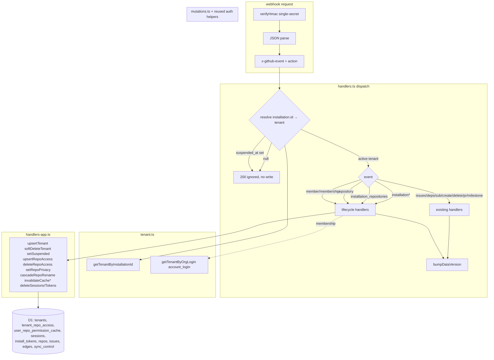
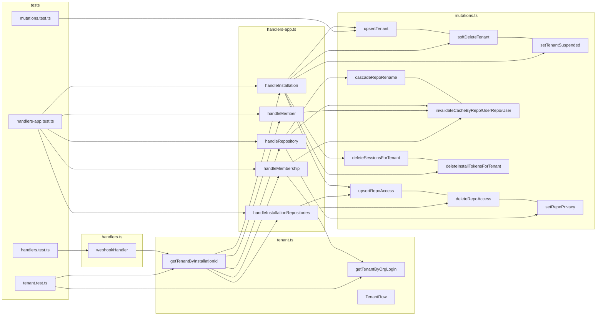

## Summary

Add GitHub-App tenant routing to the webhook (`payload.installation.id → tenants` before any write;
unknown/suspended → 200 no-write) and 12 installation/repository/member lifecycle handlers, in a new
`handlers-app.ts` (keeps `handlers.ts` under the 300-line gate). Substrate exists (S1 #144); one new
column needed (`tenants.deleted_at`, migration 0009).

## Architecture





## Bootstrap Context

Grounding from `artifacts/analyses/147-webhook-tenant-routing-analysis.mdx` (schema verified vs migrations 0001-0008):

- `tenants`: PK `id`, `installation_id` UNIQUE, `account_login`, `account_type`, `suspended_at`, `created_at`, `updated_at`. **No `deleted_at` → migration 0009.**
- `tenant_repo_access`: PK `(tenant_id, repo)`, `is_private` (0007). Upsert `ON CONFLICT(tenant_id,repo) DO UPDATE SET is_private`.
- `user_repo_permission_cache`: PK `(user_id, repo)`, `user_id`→`users.id`, `has_access`. **Cache keyed user_id, not github_id** → resolve `github_id→users.id` via `users` for H11/H12.
- `repos.repo_node_id` exists (UNIQUE index) → valid rename/transfer anchor; tolerate NULL legacy rows.
- `sync_control` sentinel `tenant_id=0` (Deviation D-2) — cascades must not touch it.
- Reuse: `verifyHmac` (hmac.ts), `bumpDataVersion`/`upsertIssueFromWebhook`/`deleteIssue`/`addEdge`/`removeEdge` (mutations.ts), tenant upsert pattern (oauth.ts), repo-access upsert (sync.ts), `listInstallationRepos`/`getInstallationToken` (installToken.ts), `deleteSession`+suspended guard (session.ts), cache DELETE predicates (repoAccess.ts), `FakeD1`/`captureDb`/`makeEnv`/`makeContext` harness (handlers.test.ts).
- **Single-secret HMAC unchanged (dual-secret OUT OF SCOPE).**

## Agents

| Agent instance | Tasks | Files | Subjects |
|---|---|---|---|
| backend-dev-A | T0, T1, T7 | 0009 migration · tenant.ts · handlers.ts | migrations, tenant-lookup, dispatch |
| backend-dev-B | T2, T3, T4, T5, T6 | mutations.ts · handlers-app.ts | mutations, installation, repo, member |
| tester-A | T8 | tenant.test.ts · handlers.test.ts | routing-tests |
| tester-B | T9 | handlers-app.test.ts · mutations.test.ts | handler-tests |

backend-dev-B carries 5 tasks (>4 cap) but all write the two shared files (`mutations.ts`, `handlers-app.ts`) — barrel-merge rule overrides the per-instance split to avoid parallel-write conflicts.

## Wave Structure

5 waves, max 2 parallel agents. Elapsed ~3 units vs ~6 sequential.

| Wave | Trigger | Agents | Tasks |
|------|---------|--------|-------|
| 1 | start | 1 | backend-dev-A: T0, T1 |
| 2 | Wave 1 done | 1 | backend-dev-B: T2 |
| 3 | Wave 2 done | 1 | backend-dev-B: T3→T4→T5→T6 (chained, shared file) |
| 4 | Wave 3 done | 2 ∥ | backend-dev-A: T7 · tester-B: T9 |
| 5 | Wave 4 (T7) done | 1 | tester-A: T8 |

### Budget — per task

| Task | Items | Class | Est. ops | Split? |
|------|-------|-------|----------|--------|
| T0 migration | 1 | trivial | 2 | — |
| T1 tenant.ts | 2 fns | bounded | 6 | — |
| T2 mutations helpers | ~10 fns | judgmental | 14 | — |
| T3 installation handler | 4 actions | judgmental | 10 | — |
| T4 installation_repositories | 2 actions | bounded | 6 | — |
| T5 repository (cascade+privacy) | 4 actions | exploratory | 14 | — (kept; cascade is the hard unit) |
| T6 member+membership | 2 handlers | judgmental | 10 | — |
| T7 routing+dispatch | 1 file | judgmental | 12 | — |
| T8 tenant+routing tests | 2 files | judgmental | 12 | — |
| T9 handlers-app+mutations tests | 2 files | judgmental | 16 | — |

**Total estimated ops: ~102**

### Budget — per agent instance

| Instance | Tasks | Σ ops | Subjects | Split? |
|----------|-------|-------|----------|--------|
| backend-dev-A | T0, T1, T7 | 20 | migrations, tenant-lookup, dispatch | — (T0 trivial; under cap) |
| backend-dev-B | T2-T6 | 54 | mutations, installation, repo, member | barrel-merge override (shared files) |
| tester-A | T8 | 12 | routing-tests | — |
| tester-B | T9 | 16 | handler-tests | — |

## Consistency Report

Covered: 17/17 requirements. R4 + N1 are EXISTS (no task — preserved by construction; verified in T7/T9 tests).
Build tasks cover R1-R3 (T1/T7), H1-H4 (T3), H5-H6 (T4), H7-H10 (T5), H11-H12 (T6).
Untraced tasks: none. Exemptions: none.

## Micro-Tasks

### T0 — Migration 0009: tenants.deleted_at  `[backend-dev-A · migrations · RED-free · diff 1]`
- File: `worker/migrations/0009_tenant_deleted_at.sql`
- Snippet: `ALTER TABLE tenants ADD COLUMN deleted_at TEXT;`
- Verify: `cd worker && npx wrangler d1 migrations list roxabi-live-production --local 2>/dev/null | grep 0009` (or file exists + SQL parses in test apply)
- Spec trace: H2 · Slice V1 · Difficulty 1

### T1 — Tenant lookup helpers  `[backend-dev-A · tenant-lookup · diff 2]`
- File: `worker/src/webhook/tenant.ts` (new)
- Shape:
  ```ts
  export interface TenantRow { id: number; installation_id: number; account_login: string;
    account_type: string; suspended_at: string | null; deleted_at: string | null; }
  export async function getTenantByInstallationId(db: D1Database, installationId: number): Promise<TenantRow | null>
  export async function getTenantByOrgLogin(db: D1Database, login: string): Promise<TenantRow | null>
  ```
- Verify: `cd worker && npx tsc --noEmit` + new unit test green
- Spec trace: R1, R2, H12 · Slice V1 · Difficulty 2

### T2 — Webhook mutation helpers  `[backend-dev-B · mutations · diff 3]`
- File: `worker/src/webhook/mutations.ts` (extend); reuse `auth/repoAccess.ts`, `auth/session.ts` exports where present, else add local helpers.
- Add: `upsertTenant`, `softDeleteTenant` (sets `deleted_at`), `setTenantSuspended(db,id,iso|null)`, `upsertRepoAccess(db,tenantId,repo,isPrivate)`, `deleteRepoAccess(db,tenantId,repo)`, `setRepoPrivacy(db,repo,isPrivate)`, `cascadeRepoRename(db,nodeId,oldFullName,newFullName)` (re-key `repos`,`tenant_repo_access`,`issues`,`edges` via `db.batch`, skip `sync_control` sentinel), `invalidateCacheByRepo`, `invalidateCacheByUserRepo`, `invalidateCacheByUser`, `deleteSessionsForTenant`, `deleteInstallTokensForTenant`.
- Verify: `cd worker && npx tsc --noEmit` + `npm test -- mutations`
- Spec trace: H1-H12 substrate · Slice V1 · Difficulty 3

### T3 — installation handler (H1-H4)  `[backend-dev-B · installation · diff 3]`
- File: `worker/src/webhook/handlers-app.ts` (new)
- `handleInstallation(payload, db, env)` switch on `payload.action`:
  - `created`: upsertTenant + per-repo upsertRepoAccess (from `payload.repositories[]`) + enqueue sync (sync_control hint)
  - `deleted`: deleteRepoAccess(all) + deleteInstallTokensForTenant + deleteSessionsForTenant + softDeleteTenant; **retain issues/edges**
  - `suspend`: setTenantSuspended(now) · `unsuspend`: setTenantSuspended(null)
- Verify: `npm test -- handlers-app`
- Spec trace: H1, H2, H3, H4 · Slice V1 · Difficulty 3

### T4 — installation_repositories handler (H5-H6)  `[backend-dev-B · repo-access · diff 2]`
- File: `worker/src/webhook/handlers-app.ts` (extend)
- `handleInstallationRepositories(payload, db, env)`: `payload.repositories_added[]`→upsertRepoAccess + sync hint; `payload.repositories_removed[]`→deleteRepoAccess (retain issues/edges)
- Verify: `npm test -- handlers-app`
- Spec trace: H5, H6 · Slice V1 · Difficulty 2

### T5 — repository handler (H7-H10)  `[backend-dev-B · repo-lifecycle · diff 4]`
- File: `worker/src/webhook/handlers-app.ts` (extend)
- `handleRepository(payload, db)` switch on `payload.action`:
  - `renamed`: cascadeRepoRename anchored on `payload.repository.node_id` (fallback `payload.changes.repository.name.from` / `previous_repository.full_name`)
  - `transferred`: same cascade
  - `privatized`: setRepoPrivacy(1) + invalidateCacheByRepo · `publicized`: setRepoPrivacy(0) + invalidateCacheByRepo
- Verify: `npm test -- handlers-app`
- Spec trace: H7, H8, H9, H10 · Slice V1 · Difficulty 4

### T6 — member + membership handlers (H11-H12)  `[backend-dev-B · member-cache · diff 3]`
- File: `worker/src/webhook/handlers-app.ts` (extend)
- `handleMember(payload, db)`: resolve `payload.member.id`(github_id)→users.id; invalidateCacheByUserRepo(user_id, `payload.repository.full_name`). Zero-rows → no-op.
- `handleMembership(payload, db)`: resolve github_id→users.id; invalidateCacheByUser(user_id). Tenant routed via `getTenantByOrgLogin(payload.organization.login)` when `installation` absent.
- Verify: `npm test -- handlers-app`
- Spec trace: H11, H12 · Slice V1 · Difficulty 3

### T7 — Routing gate + dispatch wiring  `[backend-dev-A · dispatch · diff 4]`
- File: `worker/src/webhook/handlers.ts` (modify)
- After JSON parse: for app/repo/member events resolve `payload.installation.id`→tenant (membership→org login); `null`→`{ok:true, ignored}` 200 no-write; `suspended_at`/`deleted_at` set→log+200 no-write. Extend allowlist (`installation`, `installation_repositories`, `repository`, `member`, `membership`) + dispatch to handlers-app fns; integrate `bumpDataVersion` on mutate.
- Verify: `npx tsc --noEmit` + `npm test -- handlers`
- Spec trace: R1, R2, R3, dispatch for H1-H12 · Slice V1 · Difficulty 4

### RED-GATE V1 — all handler+routing tests green before ship
- Verify: `cd worker && npm test && npx tsc --noEmit`

### T8 — Tests: tenant lookup + routing reject paths  `[tester-A · routing-tests · diff 3]`
- Files: `worker/src/webhook/tenant.test.ts` (new), `worker/src/webhook/handlers.test.ts` (extend)
- Cover: getTenantBy* hit/miss; unknown installation→200 no-write (assert no D1 writes via captureDb); suspended→200 no-write; data_version not bumped on no-write.
- Verify: `npm test -- tenant handlers`
- Spec trace: R1, R2, R3 · Slice V1 · Difficulty 3

### T9 — Tests: handlers-app + mutations  `[tester-B · handler-tests · diff 4]`
- Files: `worker/src/webhook/handlers-app.test.ts` (new), `worker/src/webhook/mutations.test.ts` (extend)
- Cover each handler/action: tenant upsert/soft-delete/suspend; repo-access add/remove; privacy+cache invalidation; rename/transfer cascade (issues/edges re-keyed, sentinel untouched); member/membership cache invalidation incl. github_id→user_id zero-rows no-op; issues/edges retention on uninstall.
- Verify: `npm test -- handlers-app mutations`
- Spec trace: H1-H12, N1 · Slice V1 · Difficulty 4

## Task Seeding Blueprint

<!-- Used by /implement to seed TaskCreate calls. T{n} | agent-instance | blockedBy | subject -->

### Wave 1 — no deps, 1 agent
| Task | Agent instance | blockedBy | Subject |
|------|---------------|-----------|---------|
| T0 | backend-dev-A | — | migrations |
| T1 | backend-dev-A | — | tenant-lookup |

### Wave 2 — after T0,T1, 1 agent
| Task | Agent instance | blockedBy | Subject |
|------|---------------|-----------|---------|
| T2 | backend-dev-B | T0, T1 | mutations |

### Wave 3 — after T2, 1 agent (chained, shared file)
| Task | Agent instance | blockedBy | Subject |
|------|---------------|-----------|---------|
| T3 | backend-dev-B | T2 | installation |
| T4 | backend-dev-B | T3 | repo-access |
| T5 | backend-dev-B | T4 | repo-lifecycle |
| T6 | backend-dev-B | T5 | member-cache |

### Wave 4 — after T6, 2 agents ∥
| Task | Agent instance | blockedBy | Subject |
|------|---------------|-----------|---------|
| T7 | backend-dev-A | T1, T6 | dispatch |
| T9 | tester-B | T2, T6 | handler-tests |

### Wave 5 — after T7, 1 agent
| Task | Agent instance | blockedBy | Subject |
|------|---------------|-----------|---------|
| T8 | tester-A | T7 | routing-tests |

## Task IDs

<!-- Generated by /plan. Used by /implement to resume tasks on session restart. -->
- T0: 10 — migrations (backend-dev-A)
- T1: 11 — tenant-lookup (backend-dev-A)
- T2: 12 — mutations (backend-dev-B)
- T3: 13 — installation (backend-dev-B)
- T4: 14 — repo-access (backend-dev-B)
- T5: 15 — repo-lifecycle (backend-dev-B)
- T6: 16 — member-cache (backend-dev-B)
- T7: 17 — dispatch (backend-dev-A)
- T8: 18 — routing-tests (tester-A)
- T9: 19 — handler-tests (tester-B)
