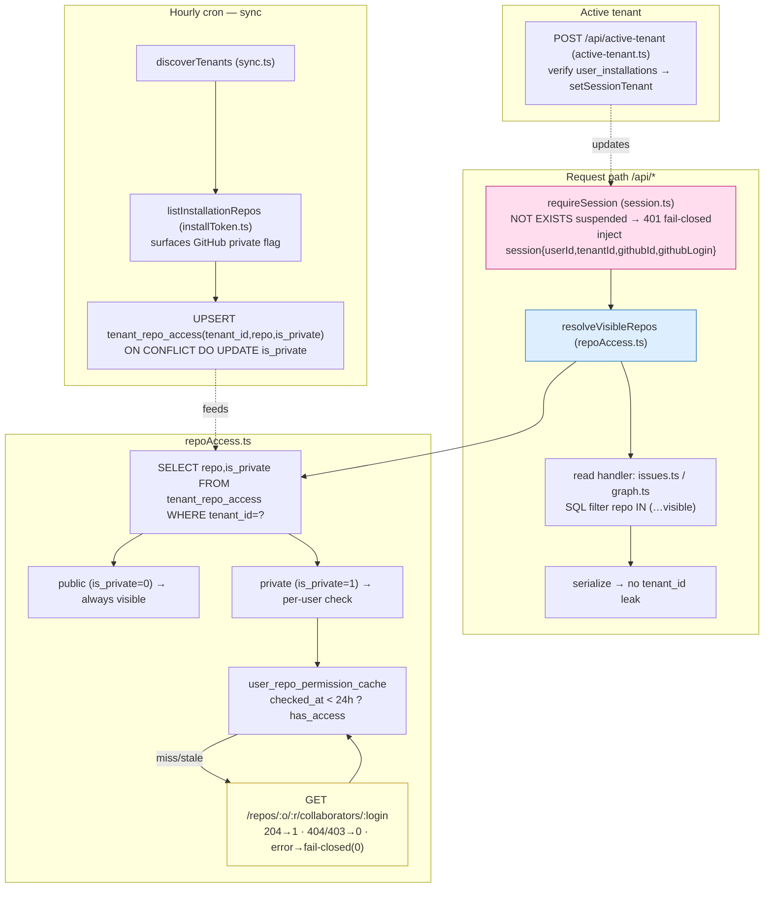
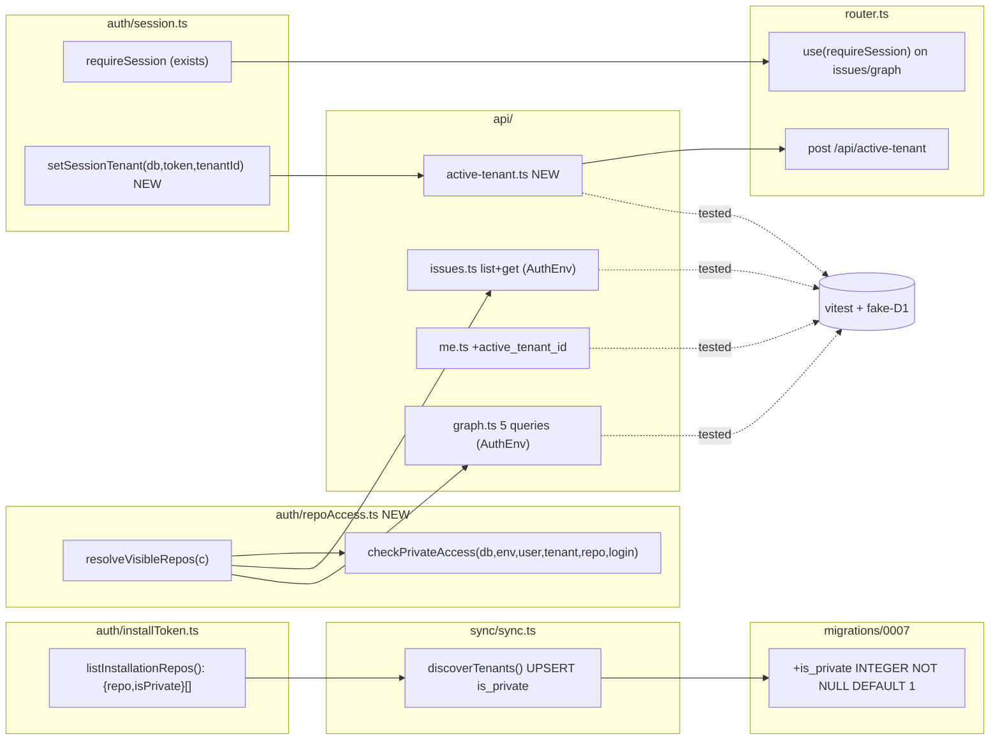

## Summary

Close the unauthenticated-graph IDOR gap: gate every `/api/*` read behind the existing fail-closed
`requireSession` middleware, then scope all issue/graph/edge reads to a **per-request visible-repo
set** (`tenant_repo_access` ∩ user-permitted private repos). Self-absorbs the minimal `is_private`
enablers (migration 0007 + sync population) so criterion 4 ships without waiting on #147.

**Design lock:** authorization is resolved **once per request** by `repoAccess.resolveVisibleRepos(c)`
→ `string[]` of repos the session user may see (all public tenant repos ∪ private repos passing the
24h-cached / live-fallback / fail-closed permission check). Every read query then filters
`repo IN (…visible)`. One permission pass over ≤34 repos per request — never per-issue.

## Architecture

### Data flow

### File × Function map

## Agents

| Instance | Domain | Tasks | Files |
|---|---|---|---|
| backend-dev-A | ingest | T1, T3 | `migrations/0007`, `auth/installToken.ts`, `sync/sync.ts` |
| backend-dev-B | authz + reads | T4, T6, T7 | `auth/repoAccess.ts` (new), `api/issues.ts`, `api/graph.ts` |
| backend-dev-C | session + http | T5, T8, T9 | `api/active-tenant.ts` (new), `auth/session.ts`, `api/me.ts`, `router.ts` |
| tester-A | shared + reads tests | T2, T10, T11, T12 | `src/test-utils.ts` (new), `auth/repoAccess.test.ts`, `api/issues.test.ts`, `api/graph.test.ts` |
| tester-B | endpoint + sync tests | T13, T14, T15 | `api/active-tenant.test.ts`, `router-401` test, `sync/sync.test.ts` |
| security-auditor | security | T16 | (read-only audit) |

## Micro-Tasks

### V1 — Privacy ingest

**T1 — migration 0007: `tenant_repo_access.is_private`** · be-A · migrations · SC-trace: SC4 · diff 1
- File: `worker/migrations/0007_repo_access_is_private.sql`
- `ALTER TABLE tenant_repo_access ADD COLUMN is_private INTEGER NOT NULL DEFAULT 1;` (DEFAULT 1 = fail-closed; converges to 0 for public repos on first sync)
- Verify: `grep -n is_private worker/migrations/0007_*.sql`

**T3 — surface + populate `is_private`** · be-A · sync · SC-trace: SC4 · diff 3 · blockedBy T1
- `auth/installToken.ts`: `GHRepository += private: boolean`; `listInstallationRepos` returns `Promise<Array<{repo:string; isPrivate:boolean}>>` (`{repo:r.full_name, isPrivate:r.private}`)
- `sync/sync.ts` `discoverTenants`: consume `{repo,isPrivate}[]`; UPSERT `INSERT INTO tenant_repo_access (tenant_id,repo,is_private) VALUES (?,?,?) ON CONFLICT(tenant_id,repo) DO UPDATE SET is_private=excluded.is_private`; stale-prune + repoMap keyed by `.repo`
- Verify: `cd worker && npm run typecheck`; `grep -n "ON CONFLICT" src/sync/sync.ts`

### V2 — Authz + tenant-filtered reads

**T4 — `repoAccess.ts` resolveVisibleRepos** · be-B · authz · SC-trace: SC2,SC3,SC4 · diff 4
- File: `worker/src/auth/repoAccess.ts` (new)
- `resolveVisibleRepos(c: Context<AuthEnv>): Promise<string[]>` — SELECT repo,is_private WHERE tenant_id=session.tenantId; public→keep; private→`checkPrivateAccess`
- `checkPrivateAccess(db,env,userId,tenantId,repo,login)`: cache hit (`checked_at > datetime('now','-24 hours')`)→`has_access`; miss/stale→`getInstallationToken` + `GET /repos/{repo}/collaborators/{login}` (204→1 · 404/403→0); upsert cache; any error → fail-closed `false` (no cache write)
- resolve installation_id once: `SELECT installation_id FROM tenants WHERE id=?`
- Verify: `npm run typecheck`

**T6 — `issues.ts` tenant filter + AuthEnv** · be-B · reads · SC-trace: SC2,SC3,SC5 · diff 3 · blockedBy T4
- Upgrade both handlers to `Context<AuthEnv>`; `const visible = await resolveVisibleRepos(c)`
- `listIssuesRoute`: `visible.length===0 → return {issues:[],total:0,limit,offset}`; prepend `issues.repo IN (${ph})` to conditions + params (count+data share `where`)
- `getIssueRoute`: append `AND repo IN (${ph})` to `issueSql` → no row → 404 (IDOR closed); edge LEFT JOINs add `AND i.repo IN (${ph})` (foreign blockers fall back to parseKey, no metadata leak)
- Verify: `npm run typecheck`; `npx vitest run src/api/issues.test.ts`

**T7 — `graph.ts` tenant filter + AuthEnv + comment** · be-B · reads · SC-trace: SC3,SC5 · diff 3 · blockedBy T4
- Upgrade signature to `Context<AuthEnv>`; `const visible = await resolveVisibleRepos(c)`; empty → `{nodes:[],edges:[],repos:[]}`
- (c) issues `WHERE repo IN (ph)`; (a) labels `WHERE issue_key IN (SELECT key FROM issues WHERE repo IN (ph))`; (d) edges `WHERE src_key IN (…) AND dst_key IN (…)` (both endpoints visible); (e) repos `WHERE repo IN (ph)`; (b) pr_state — scope by `repo` subquery if column exists, else leave with comment (consumed only via visible nodes → no output leak)
- Fix header comment `Four D1 reads` → `Five D1 reads (a)-(e), tenant-scoped`
- Verify: `npm run typecheck`; `npx vitest run src/api/graph.test.ts`

### V3 — Active tenant

**T5 — `active-tenant.ts` + `setSessionTenant`** · be-C · session · SC-trace: SC6 · diff 3
- `auth/session.ts`: `setSessionTenant(db, rawToken, tenantId)` → `UPDATE sessions SET tenant_id=? WHERE token_hash=? AND revoked_at IS NULL AND expires_at > datetime('now')`
- `api/active-tenant.ts` (new): POST; body `{tenant_id}`; `SELECT 1 FROM user_installations WHERE user_id=? AND tenant_id=?` → none → 403; else `setSessionTenant` → 200 `{active_tenant_id}`
- Verify: `npm run typecheck`

**T8 — `me.ts` active_tenant_id + account_type** · be-C · session · SC-trace: SC5,SC7 · diff 2
- Add `active_tenant_id: s.tenantId`; installations query `+ t.account_type AS account_type`
- Verify: `npm run typecheck`; `npx vitest run src/api/me.test.ts`

**T9 — `router.ts` wiring** · be-C · http · SC-trace: SC1,SC6 · diff 2 · blockedBy T5,T6,T7
- `app.use("/api/issues", requireSession)`, `app.use("/api/issues/*", requireSession)`, `app.use("/api/graph", requireSession)` (before the GET handlers)
- `app.post("/api/active-tenant", requireSession, activeTenantRoute)`
- Verify: `npm run typecheck`

### Tests + audit

**T2 — `test-utils.ts` extraction** · te-A · shared · diff 2
- Extract `captureDb`/`makeFakeDb`/`makeFakeStmt` + `STUB_SESSION` from existing tests → `worker/src/test-utils.ts`; add SQL dispatch keys for `tenant_repo_access` + `user_repo_permission_cache`
- Verify: `grep -n "export" src/test-utils.ts`

**T10 — `repoAccess.test.ts`** · te-A · authz · blockedBy T4,T2 — cache hit/miss/stale, live 204/404, error→fail-closed, public skip, empty set
**T11 — `issues.test.ts` updates** · te-A · reads · blockedBy T6,T2 — IDOR 404 on foreign repo, list scoped, edge no-leak
**T12 — `graph.test.ts` updates** · te-A · reads · blockedBy T7,T2 — nodes/edges/repos scoped to visible, dangling edges pruned
**T13 — `active-tenant.test.ts`** · te-B · endpoints · blockedBy T5,T2 — membership verified, switch persists, non-member 403
**T14 — router 401 gating test** · te-B · endpoints · blockedBy T9,T2 — no session → 401 before any DB stmt on issues/graph
**T15 — `sync.test.ts` is_private** · te-B · sync · blockedBy T3,T2 — UPSERT writes/flips is_private; private repo flag round-trips

**T16 — security audit** · security-auditor · security · blockedBy T6,T7,T9,T4 — verify: fail-closed on every error path, IDOR closed (foreign repo→404), no `tenant_id` in any response shape, no cross-tenant UNION, live-API timeout → deny

## Wave Structure

5 waves, max 3 parallel agents. Elapsed ~3 units vs ~9 sequential.

| Wave | Trigger | Agents | Tasks |
|---|---|---|---|
| 1 | start | 2 ∥ | be-A: T1 · te-A: T2 |
| 2 | Wave 1 done | 3 ∥ | be-A: T3 · be-B: T4 · be-C: T5 |
| 3 | T4,T5 done | 2 ∥ | be-B: T6→T7 · be-C: T8→T9 |
| 4 | Wave 3 done | 2 ∥ | te-A: T10,T11,T12 · te-B: T13,T14,T15 |
| 5 | Wave 4 done | 1 | security-auditor: T16 |

### Budget — per task

| Task | Items | Class | Est. ops | Split? |
|---|---|---|---|---|
| T1 migration | 1 | trivial | 2 | — |
| T2 test-utils | 1 | bounded | 3 | — |
| T3 sync is_private | 2 | judgmental | 8 | — |
| T4 repoAccess.ts | 1 | exploratory | 10 | — |
| T5 active-tenant | 2 | judgmental | 6 | — |
| T6 issues filter | 1 | judgmental | 6 | — |
| T7 graph filter | 1 | judgmental | 6 | — |
| T8 me.ts | 1 | bounded | 3 | — |
| T9 router | 1 | bounded | 3 | — |
| T10–T15 tests | 6 | judgmental | ~30 | — |
| T16 audit | 1 | judgmental | 8 | — |

**Total estimated ops: ~96**

### Budget — per agent instance

| Instance | Tasks | Σ ops | Subjects | Split? |
|---|---|---|---|---|
| backend-dev-A | T1,T3 | 10 | migrations, sync | — |
| backend-dev-B | T4,T6,T7 | 22 | authz, reads | — |
| backend-dev-C | T5,T8,T9 | 12 | session, http | — |
| tester-A | T2,T10,T11,T12 | 22 | shared, reads | — |
| tester-B | T13,T14,T15 | 16 | endpoints, sync | — |
| security-auditor | T16 | 8 | security | — |

## Consistency Report

- Criteria covered: 8/8 — SC1(T9,T14) · SC2(T4,T6,T16) · SC3(T4,T6,T7) · SC4(T1,T3,T4) · SC5(T6,T7,T8,T16) · SC6(T5,T9,T13) · SC7(T8) · SC8(T11,T12 + staging manual, public slice)
- Untraced tasks: none
- Deferred: webhook cache-invalidation + real-time `is_private` updates → #147 (out of scope, documented in spec amendment)
- Exemptions: SC8 private-repo cross-account staging verification needs a 2nd test account — public slice automated; private slice = manual staging check post-merge

## Task Seeding Blueprint

<!-- Used by /implement to seed TaskCreate calls. T{n} | agent-instance | blockedBy | subject.
     blockedBy refs T-numbers within this list. Seed in wave order; within a wave all rows ∥. -->

### Wave 1 — no deps, 2 agents ∥

| Task | Agent instance | blockedBy | Subject |
|---|---|---|---|
| T1 | backend-dev-A | — | migrations |
| T2 | tester-A | — | shared |

### Wave 2 — after Wave 1, 3 agents ∥

| Task | Agent instance | blockedBy | Subject |
|---|---|---|---|
| T3 | backend-dev-A | T1 | sync |
| T4 | backend-dev-B | T1 | authz |
| T5 | backend-dev-C | — | session |

### Wave 3 — after T4,T5, 2 agents ∥

| Task | Agent instance | blockedBy | Subject |
|---|---|---|---|
| T6 | backend-dev-B | T4 | reads |
| T7 | backend-dev-B | T4,T6 | reads |
| T8 | backend-dev-C | — | session |
| T9 | backend-dev-C | T5,T6,T7 | http |

### Wave 4 — after Wave 3, 2 agents ∥

| Task | Agent instance | blockedBy | Subject |
|---|---|---|---|
| T10 | tester-A | T4,T2 | authz |
| T11 | tester-A | T6,T2 | reads |
| T12 | tester-A | T7,T2 | reads |
| T13 | tester-B | T5,T2 | endpoints |
| T14 | tester-B | T9,T2 | endpoints |
| T15 | tester-B | T3,T2 | sync |

### Wave 5 — after Wave 4, 1 agent

| Task | Agent instance | blockedBy | Subject |
|---|---|---|---|
| T16 | security-auditor | T4,T6,T7,T9 | security |

## Task IDs

<!-- Generated by /plan. Used by /implement to resume tasks on session restart. -->
- T1: 8 — migrations (backend-dev-A)
- T2: 9 — shared (tester-A)
- T3: 10 — sync (backend-dev-A)
- T4: 11 — authz (backend-dev-B)
- T5: 12 — session (backend-dev-C)
- T6: 13 — reads (backend-dev-B)
- T7: 14 — reads (backend-dev-B)
- T8: 15 — session (backend-dev-C)
- T9: 16 — http (backend-dev-C)
- T10: 17 — authz (tester-A)
- T11: 18 — reads (tester-A)
- T12: 19 — reads (tester-A)
- T13: 20 — endpoints (tester-B)
- T14: 21 — endpoints (tester-B)
- T15: 22 — sync (tester-B)
- T16: 23 — security (security-auditor)
