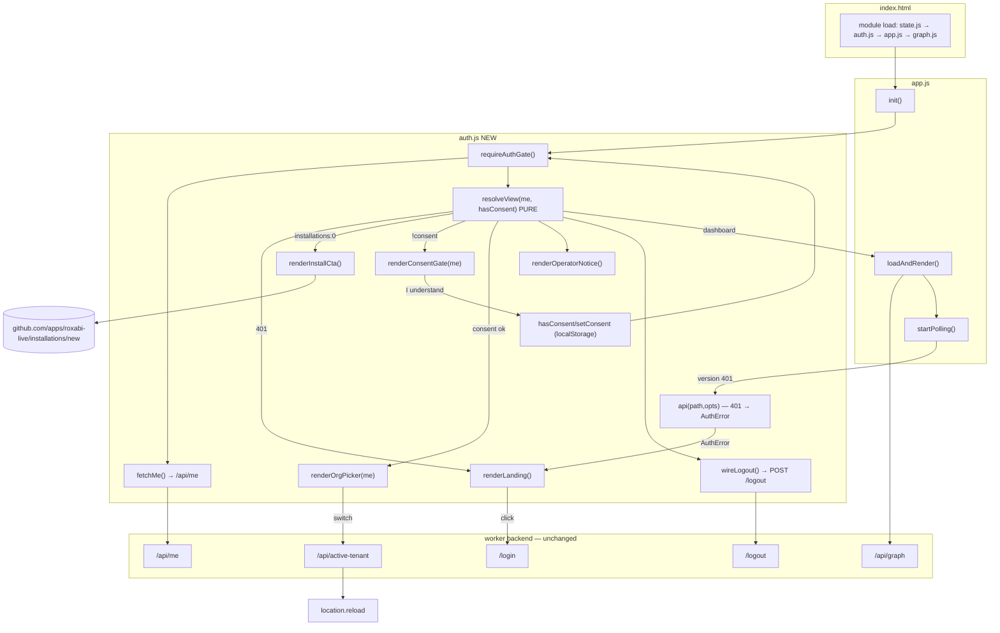
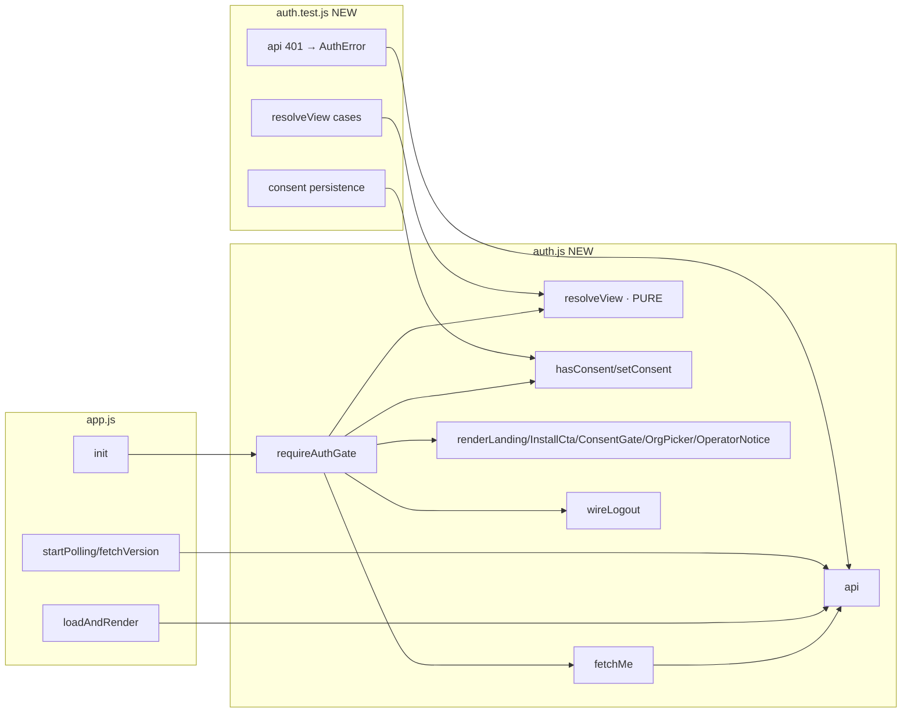

## Summary

Add a frontend auth-state machine that gates the dep-graph dashboard behind GitHub login,
GitHub-App install, and a one-time operator-read consent acknowledgement. Today
`app.js init()` fetches `/api/graph` unconditionally; S6 inserts a gate that resolves the
user via `/api/me` and renders one of four states (landing / install-CTA / consent / dashboard)
before any issue data is loaded. Frontend-only — no backend or schema change (that is S7 #150).

## Architecture

### Data flow

### File × function map

## Bootstrap Context

- **Render chokepoint:** `frontend/app.js:293 init()` → `loadAndRender()` (`fetch('/api/graph')`, app.js:246) + `fetchVersion()` (app.js:277). No auth handling exists anywhere in `frontend/` today (operator-only, behind CF Access).
- **Module pattern:** vanilla ES modules, no build step; `index.html` loads `<script type="module">` for state.js, pivot.js, app.js, graph.js. Add `auth.js` before `app.js`.
- **State persistence:** sessionStorage (filters, `v6:*`), localStorage (`v6:theme`). Consent ack will use localStorage (`roxabi:consent:<login>`).
- **Backend contract (verified at source — unchanged by S6):**
  - `GET /api/me` (session-gated) → `{ user: { github_id, github_login }, active_tenant_id, installations: [{ tenant_id, account_login, account_type }] }`; `401 { error: "unauthorized" }` when no session. (`worker/src/api/me.ts:18`)
  - `GET /login` → OAuth start. `POST /logout` (ungated) → 204 + clears `__Host-session`. `POST /api/active-tenant` `{tenant_id}` (session-gated) → `{active_tenant_id}`. (`worker/src/router.ts:68-75`)
  - Frontend served via ASSETS fallback `app.all('*')` — ungated. (`router.ts:78`)
  - Install URL hardcoded `https://github.com/apps/roxabi-live/installations/new`. (`worker/src/auth/oauth.ts:192`)

## Decisions

| # | Decision | Chosen | Rationale |
|---|----------|--------|-----------|
| A | Consent persistence | localStorage `roxabi:consent:<github_login>` = ISO ts | Spec: "frontend-enforced render block, no API-level gate". D1 column = backend+migration scope (S7 #150). Per-device re-ack acceptable for an acknowledgement. |
| B | 401 handling (the deferred redirect #149 owns) | In-app flip to landing (① + login button); `api()` throws `AuthError` on 401, caught → `renderLanding()` | `/login` 302s straight to GitHub OAuth — a hard redirect gives the user no choice and no context. Landing satisfies "never blank/error". |
| C | Org-picker | Non-blocking header switcher, shown when `installations.length > 1` | Backend always mints a session with one `active_tenant_id`; picker switches via POST /api/active-tenant + reload. A blocking modal would contradict the backend default. |
| D | Test infra | Minimal vitest on extracted pure logic (`resolveView`, consent helpers, `api()` 401) + CI step | Highest value / lowest infra: covers the security-critical "no data before consent" decision without a full DOM harness. Browser flow (SC2) verified via `/verify`. |
| E | Install-CTA | Implement defensively for `installations: []` | Spec lists the state; cheap. Note: current backend short-circuits zero-installation during OAuth callback (302 to GitHub) before a session exists, so this FE state is belt-and-suspanders / future-proofing. |

**Flags (non-blocking):**
- Consent gate is **not** an authz boundary — data is the user's own repos, and `/api/*` is already session+tenant-scoped (#148). Frontend-only is correct; document the rationale inline.
- Install URL duplicated from `oauth.ts:192`; drift risk → follow-up to source from config (out of F-lite scope).
- Suspended tenant → backend 401 → FE shows landing (indistinguishable from no-session). Dedicated suspended UX deferred (edge case follow-up).

## Agents

| Agent instance | Tasks | Files |
|----------------|-------|-------|
| frontend-dev-A | T1, T2, T3, T4 | index.html, auth.css, auth.js, app.js |
| tester-A | T5 | auth.test.js, package.json, vitest.config |
| devops-A | T6 | .github/workflows |

## Wave Structure

2 waves, max 2 parallel agents in Wave 2. Elapsed ~1 cycle vs ~2 sequential.

| Wave | Trigger | Agents | Tasks |
|------|---------|--------|-------|
| 1 | start | 1 | frontend-dev-A: T1→T2→T3→T4 (chained, one coherent UI surface — id/selector coupling forbids splitting) |
| 2 | Wave 1 done | 2 ∥ | tester-A: T5 · devops-A: T6 (T6 after T5) |

### Budget — per task

| Task | Items | Class | Est. ops | Split? |
|------|-------|-------|----------|--------|
| T1 index.html DOM | 1 | bounded | 3 | — |
| T2 auth.css | 1 | bounded | 3 | — |
| T3 auth.js core | 1 | judgmental | 6 | — |
| T4 app.js wiring | 1 | judgmental | 5 | — |
| T5 tests + vitest cfg | 1 | judgmental | 5 | — |
| T6 CI step | 1 | bounded | 3 | — |

**Total estimated ops: 25**

### Budget — per agent instance

| Instance | Tasks | Σ ops | Subjects | Split? |
|----------|-------|-------|----------|--------|
| frontend-dev-A | T1, T2, T3, T4 | 17 | auth-ui | — (|tasks|=4 ≤ 4, subjects=1) |
| tester-A | T5 | 5 | testing | — |
| devops-A | T6 | 3 | ci | — |

## Consistency Report

- Success criteria: 2/2 covered. SC1 (consent before data) → T1 (modal) + T3 (`resolveView` returns `consent` → gate) + T4 (init returns before `loadAndRender`) + T5 (test). SC2 (full flow) → T1–T4 (all states) + browser `/verify`.
- Untraced tasks: none.
- Exemptions: none.

## Micro-Tasks

### Slice — auth gate (SC1 + SC2)

**T1 — index.html: gate DOM scaffolding** · `frontend/index.html` · frontend-dev-A · subject auth-ui · SC1+SC2 · difficulty 2
- Add (hidden by default): `#auth-landing` (heading + `<a id="login-btn" href="/login">Log in with GitHub</a>`), `#auth-install` (copy + `<a id="install-btn">` → install URL), `#consent-gate` (overlay: heading "Before you continue", operator-read copy, `<button id="consent-ack">I understand</button>`), `#operator-notice` banner (persistent), `#org-picker` (header `<select>` / menu), `#logout-btn`.
- Link `<link rel="stylesheet" href="auth.css">`; load `<script type="module" src="auth.js">` BEFORE app.js.
- Keep existing `.sticky-head` / `<main>` dashboard markup; gates overlay/hide it.
- Verify: `grep -c 'id="auth-landing"\|id="consent-gate"\|id="auth-install"\|id="operator-notice"\|id="org-picker"\|id="logout-btn"' frontend/index.html` → 6.

**T2 — auth.css: gate styles** · `frontend/auth.css` (new) · frontend-dev-A · subject auth-ui · SC2 · difficulty 2
- Style landing, login button, install CTA, consent modal overlay (full-screen, blocks dashboard), persistent notice banner, org-picker, logout — reuse app.css design tokens (`--accent`, fonts, dark/light via `[data-theme]`).
- Verify: `test -f frontend/auth.css && grep -q 'consent-gate\|auth-landing' frontend/auth.css`.

**T3 — auth.js: state machine + helpers** · `frontend/auth.js` (new) · frontend-dev-A · subject auth-ui · SC1+SC2 · difficulty 3
- `class AuthError extends Error {}`; `api(path, opts)` → `fetch`; `if (r.status === 401) throw new AuthError()`; `if (!r.ok) throw new Error(...)`; return r.
- `hasConsent(login)` / `setConsent(login)` via `localStorage['roxabi:consent:'+login]`.
- `resolveView(me, consented)` **pure** → `'install'` (installations.length===0) | `'consent'` (!consented) | `'dashboard'`.
- `fetchMe()` → `api('/api/me').then(r=>r.json())`.
- `renderLanding()`, `renderInstallCta()`, `renderConsentGate(me, onAck)`, `renderOrgPicker(me)` (POST /api/active-tenant → reload), `renderOperatorNotice()`, `wireLogout()` (POST /logout → renderLanding).
- `requireAuthGate()` async → `fetchMe()` (AuthError → renderLanding + return `{view:'landing'}`); compute `resolveView`; render install/consent gates (consent ack re-invokes gate); on `dashboard` → renderOrgPicker + renderOperatorNotice + wireLogout; return `{view, me}`. Export `requireAuthGate`, `api`, `AuthError`, `resolveView`, `hasConsent`, `setConsent`.
- Verify: `node --check frontend/auth.js && grep -q 'export' frontend/auth.js`.

**T4 — app.js: wire gate into init + wrap fetches** · `frontend/app.js` · frontend-dev-A · subject auth-ui · SC1+SC2 · difficulty 3
- `import { requireAuthGate, api, AuthError } from './auth.js'`.
- Rewrite `init()`: `const { view } = await requireAuthGate(); if (view !== 'dashboard') return;` THEN `restoreControls()` + `loadAndRender()` + polling.
- `loadGraphData()` + `fetchVersion()` use `api()`; catch `AuthError` (in init + poll) → `renderLanding()` (import) instead of error msg.
- Verify: `grep -q 'requireAuthGate' frontend/app.js && grep -q "api('/api/graph')" frontend/app.js`.

**RED-GATE V1** — `node --check` passes on auth.js + app.js; manual: logged-out load shows landing, no `/api/graph` call fires (Network tab) until consent acked.

### Slice — tests + CI

**T5 — unit tests + frontend vitest** · `frontend/auth.test.js`, `frontend/package.json`, `frontend/vitest.config.js` (new) · tester-A · subject testing · SC1 · difficulty 3 · blockedBy T4
- `resolveView`: install (0 installs) / consent (installs, !consented) / dashboard (installs, consented) — all branches.
- consent: `setConsent('x')` then `hasConsent('x')===true`; `hasConsent('y')===false` (mock/jsdom localStorage).
- `api()`: 401 → rejects `AuthError`; ok → returns response (mock fetch).
- Minimal `frontend/package.json` (vitest devDep, `"test": "vitest run"`), jsdom env for localStorage.
- Verify: `cd frontend && npm i && npm test` → all pass.

**T6 — CI: run frontend tests** · `.github/workflows/*` · devops-A · subject ci · difficulty 2 · blockedBy T5
- Add a step/job mirroring the worker pattern: `cd frontend && npm ci && npm test`. Keep CI green; do not touch the legacy python qg.conf gate.
- Verify: workflow yaml includes the frontend test invocation; `gh workflow view` / local act dry-run if available.

**RED-GATE V2** — T5 green locally; CI step added.

## Task Seeding Blueprint

<!-- Used by /implement to seed TaskCreate calls on session start.
     Format: T{n} | agent-instance | blockedBy | subject -->

### Wave 1 — no deps, 1 agent

| Task | Agent instance | blockedBy | Subject |
|------|---------------|-----------|---------|
| T1 | frontend-dev-A | — | auth-ui |
| T2 | frontend-dev-A | T1 | auth-ui |
| T3 | frontend-dev-A | T2 | auth-ui |
| T4 | frontend-dev-A | T3 | auth-ui |

### Wave 2 — after Wave 1, 2 agents ∥

| Task | Agent instance | blockedBy | Subject |
|------|---------------|-----------|---------|
| T5 | tester-A | T4 | testing |
| T6 | devops-A | T5 | ci |

## Task IDs

<!-- Generated by /plan. Used by /implement to resume tasks on session restart. -->
- T1: 10 — auth-ui (index.html DOM)
- T2: 11 — auth-ui (auth.css)
- T3: 12 — auth-ui (auth.js)
- T4: 13 — auth-ui (app.js wiring)
- T5: 14 — testing (auth.test.js + vitest)
- T6: 15 — ci (frontend CI step)
