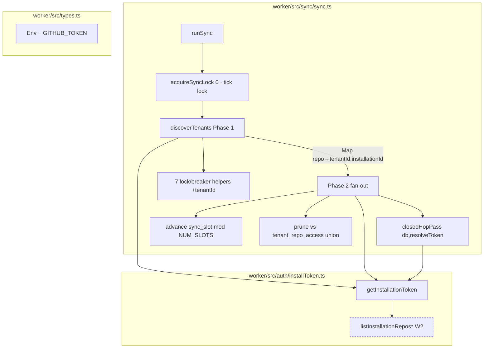
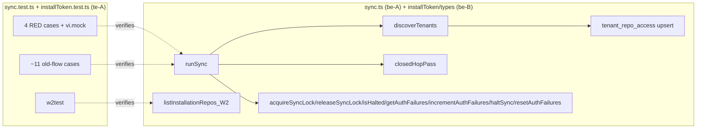

## Summary

Rewrite `runSync` to per-installation GitHub App tokens — two-phase
(discovery → deduped windowed fan-out), per-tenant lock/breaker, `closedHopPass`
resolver callback — drop the org PAT, harden `listInstallationRepos` (W2), and
reconcile the sync test suite (un-skip 4 RED + rewrite ~11 old-flow cases).

## Architecture

## Bootstrap Context

- Analysis (architect-reviewed): `artifacts/analyses/160-per-installation-runsync-cutover-analysis.mdx`
- Spec (architect+devops-reviewed): `artifacts/specs/160-per-installation-runsync-cutover-spec.mdx`
- Code map (from Explore): `runSync` @ `sync.ts:1127`; PAT reads @ L1161/1165/1277/1288;
  7 helpers @ L213-279 (all hardcode `tenant_id=0`); `closedHopPass` @ L986;
  `syncRepoBundle` @ L802; `ghGraphql(query,vars,token)` = c[0]/c[1]/c[2];
  `getInstallationToken(db,env,tenantId,installationId)` @ `installToken.ts:73`;
  `listInstallationRepos(token)` @ L226 (`while(true)`, no cap — W2 target);
  `sync_control` PK `(tenant_id,key)` (0004); `tenant_repo_access(tenant_id,repo)` (0004);
  `sync_slot=0` seeded for tenant_id=0 (0005). RED block @ `sync.test.ts:1485`
  (4 cases: L1496/1531/1565/1601); **no** `vi.mock("../auth/installToken")` present;
  old-flow `runSync` describe @ L924 (~11 cases). `wrangler.toml` has **no**
  `GITHUB_TOKEN` (secret only). `ci.yml:181` = `TODO(RT3)` comment only.

## Agents

| Agent instance | Tasks | Files |
|---|---|---|
| backend-dev-A | T1, T2, T3, T4 | `worker/src/sync/sync.ts` |
| backend-dev-B | T5, T6 | `worker/src/auth/installToken.ts`, `worker/src/types.ts`, `worker/src/sync/graphql.ts` |
| tester-A | T7, T8, T9, T10 | `worker/src/auth/installToken.test.ts`, `worker/src/sync/sync.test.ts` |

## Wave Structure

4 waves, max 2 parallel agents. Elapsed ~ slowest chain (be-A T1→T2→T3→T4) vs sequential T1..T10.

| Wave | Trigger | Agents | Tasks |
|------|---------|--------|-------|
| 1 | start | 2 ∥ | be-A: T1 · be-B: T5 |
| 2 | Wave 1 done | 2 ∥ | be-A: T2→T3→T4 · te-A: T7 |
| 3 | T4 done | 2 ∥ | be-B: T6 · te-A: T8→T9 |
| 4 | T6,T7,T9 done | 1 | te-A: T10 (RED-GATE) |

### Budget — per task

| Task | Items | Class | Est. ops | Split? |
|------|-------|-------|----------|--------|
| T1 thread tenantId ×7 | 7 helpers | bounded | 8 | — |
| T2 closedHopPass resolver | 1 | judgmental | 5 | — |
| T3 discoverTenants Phase 1 | 1 | judgmental | 10 | — |
| T4 runSync Phase 2 rewrite | 1 | exploratory | 14 | — |
| T5 W2 harden | 1 | judgmental | 6 | — |
| T6 drop GITHUB_TOKEN | 2 files | bounded | 4 | — |
| T7 W2 unit test | 1 | judgmental | 5 | — |
| T8 un-skip 4 RED + vi.mock | 4 | judgmental | 9 | — |
| T9 reconcile ~11 old-flow | 11 | judgmental | 13 | — |
| T10 RED-GATE verify | 1 | bounded | 3 | — |

**Total estimated ops: 77**

### Budget — per agent instance

| Instance | Tasks | Σ ops | Subjects | Split? |
|----------|-------|-------|----------|--------|
| backend-dev-A | T1, T2, T3, T4 | 37 | sync | — |
| backend-dev-B | T5, T6 | 10 | token, env | — |
| tester-A | T7, T8, T9, T10 | 30 | token, sync-tests | — |

No instance exceeds 50 ops / 4 tasks / 2 subjects → no split required.

## Consistency Report

Covered: 10/10 success criteria + items traced.

| Criterion | Task(s) |
|---|---|
| SC-3 dedup (RED 1) | T4, T8 |
| SC-4 slot advance (RED 2) | T4, T8 |
| Lock isolation (RED 3) | T1, T3, T8 |
| SC-6 no PAT (RED 4) | T4, T6, T8 |
| W2 hardening | T5, T7 |
| tenant_repo_access populated | T3 |
| prune union + guard | T4 |
| CI gate (suite+typecheck green) | T9, T10 |
| SC-9/RT2 (staging tick) | post-deploy (verify) |
| SC-7/RT3 (PAT delete) | post-merge operational |

Untraced tasks: none. Exemptions: SC-9/SC-7 are deploy-gated (not code tasks) — verified at /verify + RT3 runbook.

## Micro-Tasks

### Slice S2 — thread tenantId (Wave 1)

**T1** — Thread `tenantId: number = 0` through the 7 lock/breaker helpers.
- File: `worker/src/sync/sync.ts` (L213-279)
- Shape: `acquireSyncLock(db, tenantId = 0)`, …, update SQL `WHERE tenant_id = ?` bound to `tenantId` (replace hardcoded `0`). Keep default so non-`runSync` callers + existing tests stay green.
- Verify: `cd worker && npm run typecheck` · existing helper tests green.
- Agent: backend-dev-A · Subject: sync · Spec: Lock isolation · Phase: REFACTOR · Diff: 2

### Slice S3 — closedHopPass resolver (Wave 2)

**T2** — Change `closedHopPass(db, token)` → `closedHopPass(db, resolveToken)`.
- File: `worker/src/sync/sync.ts` (L986)
- Shape: `resolveToken: (owner: string, name: string) => Promise<string>`; internal GraphQL calls use `await resolveToken(owner, name)` per hop.
- Verify: `npm run typecheck`.
- Agent: backend-dev-A · Subject: sync · Spec: SC-9 · Phase: REFACTOR · blockedBy: T1 · Diff: 2

### Slice S4 — discoverTenants Phase 1 (Wave 2)

**T3** — New `discoverTenants(db, env): Promise<Map<string, Array<{tenantId, installationId}>>>`.
- File: `worker/src/sync/sync.ts`
- Shape: `SELECT id, installation_id FROM tenants WHERE installation_id IS NOT NULL`; ∀ tenant → `INSERT OR IGNORE INTO sync_control(tenant_id,key,value) VALUES(?,'sync_running','0')` (also auth_failures/halted rows) → `acquireSyncLock(db, tenantId)` skip-guard → `getInstallationToken(db, env, tenantId, installationId)` → `listInstallationRepos(token)` → upsert `tenant_repo_access` for returned repos + delete this tenant's rows not returned → merge into Map (push `{tenantId, installationId}`, keep list sorted asc by tenantId).
- Verify: unit test asserts `tenant_repo_access` populated + Map shape (covered by te-A).
- Agent: backend-dev-A · Subject: sync · Spec: tenant_repo_access populated · Phase: GREEN · blockedBy: T2 · Diff: 4

### Slice S5 — runSync Phase 2 rewrite (Wave 2)

**T4** — Rewrite `runSync` body to the two-phase model; drop all 4 `env.GITHUB_TOKEN` reads.
- File: `worker/src/sync/sync.ts` (L1127); export `const WINDOW = 20`, `const NUM_SLOTS = 3`.
- Shape: `isHalted(db,0)` → `acquireSyncLock(db,0)` → `discoverTenants` → unique repos sorted by `owner/name` → read `sync_slot`, window `[slot*WINDOW,(slot+1)*WINDOW)` → ∀ repo: try `getInstallationToken(db,env,owningTenant.tenantId,owningTenant.installationId)`, on throw fall to next list entry (`incrementAuthFailures(thrower)`), all fail → skip+log → `syncRepoBundle(db, token, owner, name, edges)` → `flushEdges` → `closedHopPass(db, resolveTokenFor)` → `sync_slot = (slot+1)%NUM_SLOTS` → prune vs union of `tenant_repo_access` (re-target 0-live guard at union count) → `writeRunAudit` → release locks. Remove `enumerateOrgRepos`/`enumerateArchivedOrgRepos`/`getRepoAllowlist` calls (and the now-dead functions if unreferenced).
- Verify: RED cases 1,2,4 green (te-A T8); `grep -n GITHUB_TOKEN worker/src/sync/sync.ts` → none.
- Agent: backend-dev-A · Subject: sync · Spec: SC-3/4/6 · Phase: GREEN · blockedBy: T3 · Diff: 5

### Slice S1 — W2 hardening (Wave 1)

**T5** — Bound `listInstallationRepos` pagination.
- File: `worker/src/auth/installToken.ts` (L226-)
- Shape: `const MAX_PAGES = 10;` replace `while(true)` with `for (let page=1; page<=MAX_PAGES; page++)`; each `fetch(url, { signal: AbortSignal.timeout(10_000) })`; break on `< per_page`; if `MAX_PAGES` reached with a full last page → log a truncation warn.
- Verify: te-A T7.
- Agent: backend-dev-B · Subject: token · Spec: W2 · Phase: GREEN · Diff: 3

### Slice S6 — drop GITHUB_TOKEN (Wave 3)

**T6** — Remove `GITHUB_TOKEN` from `Env` + stale references.
- Files: `worker/src/types.ts` (drop `GITHUB_TOKEN: string`), `worker/src/sync/graphql.ts` (drop stale doc-comments L6/L111). No `wrangler.toml` edit (secret, not a `[vars]` entry).
- Verify: `npm run typecheck` green; `grep -rn GITHUB_TOKEN worker/src` → only test fixtures (cast) if any.
- Agent: backend-dev-B · Subject: env · Spec: SC-6/T10 · Phase: REFACTOR · blockedBy: T4 · Diff: 2

### Slice S1 test — W2 (Wave 2)

**T7** — Unit-test the W2 bound.
- File: `worker/src/auth/installToken.test.ts` (create or extend)
- Shape: mock `fetch` returning full pages → assert ≤ `MAX_PAGES` fetches; mock a hanging fetch → assert `AbortSignal.timeout` rejects/handled.
- Verify: `cd worker && npm test -- installToken`.
- Agent: tester-A · Subject: token · Spec: W2 · Phase: GREEN · blockedBy: T5 · Diff: 3

### Slice S7a — un-skip RED (Wave 3)

**T8** — Un-skip the 4 RED cases + add the install-token mock.
- File: `worker/src/sync/sync.test.ts` (L1485 block)
- Shape: `describe.skip(...)` → `describe(...)`; add top-level `vi.mock("../auth/installToken", () => ({ getInstallationToken: vi.fn(...), resolveInstallToken: vi.fn(...), listInstallationRepos: vi.fn(...) }))`; verify dedup assertion reads `c[0]/c[1]` (already correct per Explore — fix only if it regressed); wire fake `tenants`/`tenant_repo_access`/`sync_control` rows.
- Verify: `cd worker && npm test -- sync` → 4 cases green.
- Agent: tester-A · Subject: sync-tests · Spec: SC-3/4/6 + lock · Phase: RED→GREEN · blockedBy: T4 · Diff: 4

### Slice S7b — reconcile old-flow (Wave 3)

**T9** — Reconcile the ~11 old-flow `runSync` cases (L924-1408).
- File: `worker/src/sync/sync.test.ts`
- Shape: rewrite/remove cases asserting org-enum (`enumerateOrgRepos`), empty `repo_allowlist` short-circuit (L967), and global `tenant_id=0` auth-halt to the per-tenant model (halt scoped to a tenant; prune driven by `tenant_repo_access` union; empty discovery → no-op+warn). Keep semantics that survive (audit write, NOTIFY_URL alert) re-pointed at the per-tenant breaker.
- Verify: `cd worker && npm test -- sync` → full describe green.
- Agent: tester-A · Subject: sync-tests · Spec: CI gate · Phase: GREEN · blockedBy: T8 · Diff: 4

### RED-GATE (Wave 4)

**T10** — Full suite + typecheck gate.
- Verify: `cd worker && npm test && npm run typecheck` → all green; `grep -rn GITHUB_TOKEN worker/src` clean (fixtures excepted).
- Agent: tester-A · Subject: sync-tests · Phase: RED-GATE · blockedBy: T6, T7, T9 · Diff: 1

## Task Seeding Blueprint

<!-- Used by /implement to seed TaskCreate calls on session start.
     Format: T{n} | agent-instance | blockedBy | subject -->

### Wave 1 — no deps, 2 agents ∥

| Task | Agent instance | blockedBy | Subject |
|------|---------------|-----------|---------|
| T1 | backend-dev-A | — | sync |
| T5 | backend-dev-B | — | token |

### Wave 2 — after Wave 1, 2 agents ∥

| Task | Agent instance | blockedBy | Subject |
|------|---------------|-----------|---------|
| T2 | backend-dev-A | T1 | sync |
| T3 | backend-dev-A | T2 | sync |
| T4 | backend-dev-A | T3 | sync |
| T7 | tester-A | T5 | token |

### Wave 3 — after T4, 2 agents ∥

| Task | Agent instance | blockedBy | Subject |
|------|---------------|-----------|---------|
| T6 | backend-dev-B | T4 | env |
| T8 | tester-A | T4 | sync-tests |
| T9 | tester-A | T8 | sync-tests |

### Wave 4 — after T6,T7,T9, 1 agent

| Task | Agent instance | blockedBy | Subject |
|------|---------------|-----------|---------|
| T10 | tester-A | T6, T7, T9 | sync-tests |

## Task IDs

<!-- Generated by /plan. Used by /implement to resume tasks on session restart. -->
- T1: 13 — sync (thread tenantId ×7)
- T2: 14 — sync (closedHopPass resolver)
- T3: 15 — sync (discoverTenants Phase 1)
- T4: 16 — sync (runSync Phase 2 rewrite)
- T5: 17 — token (W2 harden)
- T6: 18 — env (drop GITHUB_TOKEN)
- T7: 19 — token (W2 unit test)
- T8: 20 — sync-tests (un-skip 4 RED + vi.mock)
- T9: 21 — sync-tests (reconcile ~11 old-flow)
- T10: 22 — sync-tests (RED-GATE)
