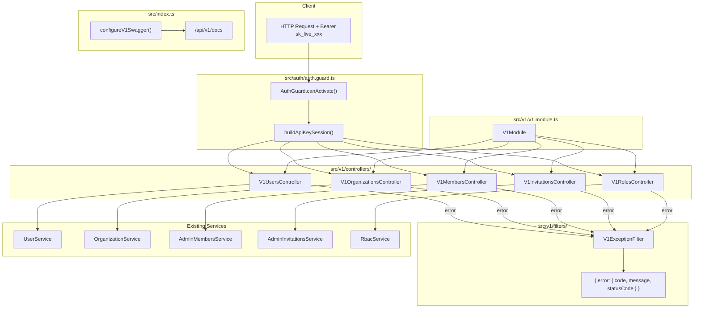
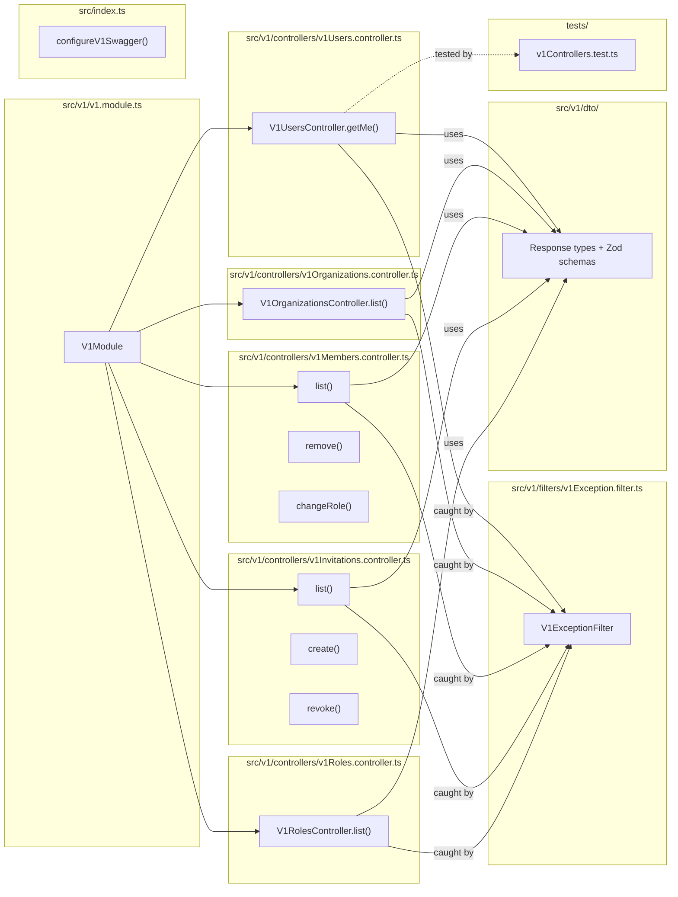

## Summary

Implement 5 versioned, key-authenticated REST controllers under `/api/v1/` with a dedicated exception filter for public error envelopes and a separate Swagger instance at `/api/v1/docs`. Controllers are thin delegates to existing services, using inline Zod schemas and purpose-built response types.

## Architecture

### Data Flow

### File x Function Map

## Agents

| Agent | Task count | Files |
|-------|-----------|-------|
| backend-dev | 9 | `src/v1/**/*.ts`, `src/index.ts`, `src/app.module.ts`, `src/config/env.validation.ts`, `.env.example` |
| tester | 4 | `src/v1/**/*.test.ts` |

## Consistency Report

- Criteria covered: 10/10
- Uncovered criteria: none
- Tasks without spec backing: none
- Gold plating exemptions applied: 1 (env.validation.ts update — infra)

## Micro-Tasks

### Slice V3.1: V1 Module Scaffold + Error Envelope + /users/me

#### Task 1: Create V1ExceptionFilter with public error envelope → backend-dev
- **File:** `apps/api/src/v1/filters/v1Exception.filter.ts`
- **Snippet:** `@Catch() export class V1ExceptionFilter implements ExceptionFilter { catch(exception, host) { /* map to { error: { code, message, statusCode } } */ } }`
- **Verify:** `grep -q 'V1ExceptionFilter' apps/api/src/v1/filters/v1Exception.filter.ts` (ready)
- **Expected:** Filter file exists with @Catch decorator and error envelope shape
- **Time:** 5 min
- **Difficulty:** 3
- **Traces:** SC-4 (public error envelope)
- **Phase:** GREEN

#### Task 2: Create V1 response types and Zod schemas [P] → backend-dev
- **File:** `apps/api/src/v1/dto/v1.dto.ts`
- **Snippet:** `export interface V1UserMeResponse { id: string; name: string; email: string | null; image: string | null } /* + OrganizationDto, MemberDto, InvitationDto, RoleDto, PaginatedResponse, ErrorEnvelope */`
- **Verify:** `bun run typecheck --filter=@repo/api` (ready)
- **Expected:** No type errors
- **Time:** 5 min
- **Difficulty:** 2
- **Traces:** SC-3 (purpose-built DTOs)
- **Phase:** GREEN

#### Task 3: Create V1UsersController with GET /api/v1/users/me → backend-dev
- **File:** `apps/api/src/v1/controllers/v1Users.controller.ts`
- **Snippet:** `@RequireApiKey() @Controller('api/v1/users') @UseFilters(V1ExceptionFilter) export class V1UsersController { constructor(private userService: UserService) {} @Get('me') @Permissions('users:read') async getMe(@Session() session) { return this.userService.getProfile(session.user.id) /* map to V1UserMeResponse */ } }`
- **Verify:** `grep -q "Controller('api/v1/users')" apps/api/src/v1/controllers/v1Users.controller.ts` (ready)
- **Expected:** Controller file with @RequireApiKey, @UseFilters, @Permissions decorators
- **Time:** 5 min
- **Difficulty:** 2
- **Traces:** N9, SC-1, SC-2, SC-8
- **Phase:** GREEN

#### Task 4: Create V1Module and register in AppModule → backend-dev
- **File:** `apps/api/src/v1/v1.module.ts` + modify `apps/api/src/app.module.ts`
- **Snippet:** `@Module({ imports: [UserModule, OrganizationModule, AdminModule, RbacModule], controllers: [V1UsersController] }) export class V1Module {}`
- **Verify:** `grep -q 'V1Module' apps/api/src/app.module.ts` (ready)
- **Expected:** V1Module imported in AppModule
- **Time:** 3 min
- **Difficulty:** 1
- **Traces:** SC-1 (module scaffold)
- **Phase:** GREEN

#### Task 5: Write tests for V1UsersController and V1ExceptionFilter → tester
- **File:** `apps/api/src/v1/__tests__/v1Users.controller.test.ts`
- **Snippet:** `describe('V1UsersController', () => { it('GET /api/v1/users/me returns UserMeResponse shape') it('rejects session auth with API_KEY_REQUIRED') it('returns public error envelope on error') })`
- **Verify:** `grep -q 'V1UsersController' apps/api/src/v1/__tests__/v1Users.controller.test.ts` (ready)
- **Expected:** Test file with controller + filter test cases
- **Time:** 8 min
- **Difficulty:** 3
- **Traces:** SC-4, SC-8, N9
- **Phase:** RED

#### RED-GATE: RED complete V3.1 → tester
- **Verify:** All test tasks for V3.1 marked complete
- **Phase:** RED-GATE

### Slice V3.2: Organizations + Members Controllers

#### Task 6: Create V1OrganizationsController [P] → backend-dev
- **File:** `apps/api/src/v1/controllers/v1Organizations.controller.ts`
- **Snippet:** `@RequireApiKey() @Controller('api/v1/organizations') @UseFilters(V1ExceptionFilter) export class V1OrganizationsController { @Get() @Permissions('organizations:read') async list(@Session() s) { /* OrganizationService.listForUser(s.user.id) → map to OrganizationDto[] */ } }`
- **Verify:** `grep -q "Controller('api/v1/organizations')" apps/api/src/v1/controllers/v1Organizations.controller.ts` (ready)
- **Expected:** Controller with @RequireApiKey and listForUser delegation
- **Time:** 4 min
- **Difficulty:** 2
- **Traces:** N5, SC-1, SC-2
- **Phase:** GREEN

#### Task 7: Create V1MembersController [P] → backend-dev
- **File:** `apps/api/src/v1/controllers/v1Members.controller.ts`
- **Snippet:** `@RequireApiKey() @Controller('api/v1/members') @UseFilters(V1ExceptionFilter) export class V1MembersController { @Get() list() @Delete(':id') remove() @Patch(':id/role') changeRole() }`
- **Verify:** `grep -q "Controller('api/v1/members')" apps/api/src/v1/controllers/v1Members.controller.ts` (ready)
- **Expected:** Controller with 3 endpoints delegating to AdminMembersService
- **Time:** 8 min
- **Difficulty:** 3
- **Traces:** N6a, N6b, N6c, SC-1, SC-2, SC-5, SC-9
- **Phase:** GREEN

#### Task 8: Register V3.2 controllers in V1Module + write tests → tester
- **File:** modify `apps/api/src/v1/v1.module.ts` + `apps/api/src/v1/__tests__/v1Members.controller.test.ts`
- **Snippet:** `describe('V1MembersController', () => { it('lists members with pagination') it('removes member') it('changes member role') }) describe('V1OrganizationsController', () => { it('lists orgs') })`
- **Verify:** `grep -q 'V1MembersController' apps/api/src/v1/__tests__/v1Members.controller.test.ts` (ready)
- **Expected:** Test files with coverage for list/remove/changeRole + list orgs
- **Time:** 8 min
- **Difficulty:** 3
- **Traces:** N5, N6a-c, SC-5, SC-9
- **Phase:** RED

#### RED-GATE: RED complete V3.2 → tester
- **Verify:** All test tasks for V3.2 marked complete
- **Phase:** RED-GATE

### Slice V3.3: Invitations + Roles Controllers

#### Task 9: Create V1InvitationsController [P] → backend-dev
- **File:** `apps/api/src/v1/controllers/v1Invitations.controller.ts`
- **Snippet:** `@RequireApiKey() @Controller('api/v1/invitations') @UseFilters(V1ExceptionFilter) export class V1InvitationsController { @Get() list() @Post() create() @Delete(':id') revoke() }`
- **Verify:** `grep -q "Controller('api/v1/invitations')" apps/api/src/v1/controllers/v1Invitations.controller.ts` (ready)
- **Expected:** Controller with 3 endpoints delegating to AdminInvitationsService
- **Time:** 6 min
- **Difficulty:** 2
- **Traces:** N7a, N7b, N7c, SC-1, SC-2
- **Phase:** GREEN

#### Task 10: Create V1RolesController [P] → backend-dev
- **File:** `apps/api/src/v1/controllers/v1Roles.controller.ts`
- **Snippet:** `@RequireApiKey() @Controller('api/v1/roles') @UseFilters(V1ExceptionFilter) export class V1RolesController { @Get() @Permissions('roles:read') async list() { /* RbacService.listRoles() → map to RoleDto[] */ } }`
- **Verify:** `grep -q "Controller('api/v1/roles')" apps/api/src/v1/controllers/v1Roles.controller.ts` (ready)
- **Expected:** Read-only controller with @RequireApiKey
- **Time:** 3 min
- **Difficulty:** 1
- **Traces:** N8a, SC-1, SC-2
- **Phase:** GREEN

#### Task 11: Register V3.3 controllers in V1Module + write tests → tester
- **File:** modify `apps/api/src/v1/v1.module.ts` + `apps/api/src/v1/__tests__/v1Invitations.controller.test.ts`
- **Snippet:** `describe('V1InvitationsController', () => { it('lists pending invitations') it('creates invitation') it('revokes invitation') }) describe('V1RolesController', () => { it('lists roles') })`
- **Verify:** `grep -q 'V1InvitationsController' apps/api/src/v1/__tests__/v1Invitations.controller.test.ts` (ready)
- **Expected:** Test files covering invitation CRUD + roles list
- **Time:** 8 min
- **Difficulty:** 3
- **Traces:** N7a-c, N8a
- **Phase:** RED

#### RED-GATE: RED complete V3.3 → tester
- **Verify:** All test tasks for V3.3 marked complete
- **Phase:** RED-GATE

### Slice V3.4: Dual Swagger Instance

#### Task 12: Add V1_SWAGGER_ENABLED env var and configureV1Swagger() → backend-dev
- **File:** modify `apps/api/src/config/env.validation.ts` + modify `apps/api/src/index.ts` + `.env.example`
- **Snippet:** `function configureV1Swagger(app, logger, v1SwaggerEnabled, appName) { if (!v1SwaggerEnabled) return; const config = new DocumentBuilder().setTitle(appName + ' Public API').setVersion('1.0').addApiKey({ type: 'apiKey', name: 'Authorization', in: 'header' }, 'api-key').build(); const doc = SwaggerModule.createDocument(app, config, { include: [V1Module] }); SwaggerModule.setup('api/v1/docs', app, doc, { ... }); }`
- **Verify:** `grep -q 'api/v1/docs' apps/api/src/index.ts` (ready)
- **Expected:** V1 Swagger setup at /api/v1/docs with API key security scheme, independent from internal SWAGGER_ENABLED
- **Time:** 8 min
- **Difficulty:** 3
- **Traces:** S2, SC-6, SC-7, SC-10
- **Phase:** GREEN

#### Task 13: Write Swagger integration test → tester
- **File:** `apps/api/src/v1/__tests__/v1Swagger.test.ts`
- **Snippet:** `describe('V1 Swagger', () => { it('/api/v1/docs returns 200') it('/api/v1/docs OpenAPI spec includes only V1 routes') it('internal /api/docs does not include V1 routes') })`
- **Verify:** `grep -q 'V1 Swagger' apps/api/src/v1/__tests__/v1Swagger.test.ts` (ready)
- **Expected:** Integration tests verifying Swagger isolation
- **Time:** 5 min
- **Difficulty:** 3
- **Traces:** SC-6, SC-7
- **Phase:** RED

#### RED-GATE: RED complete V3.4 → tester
- **Verify:** All test tasks for V3.4 marked complete
- **Phase:** RED-GATE

## Reference Patterns

Existing controllers to follow for convention:
- **Admin members controller:** `apps/api/src/admin/adminMembers.controller.ts` — decorator stacking, @Permissions, ZodValidationPipe, ParseUUIDPipe, @HttpCode(NO_CONTENT) on DELETE
- **Admin exception filter:** `apps/api/src/admin/filters/adminNotFound.filter.ts` — @Catch pattern, sendErrorResponse utility
- **Internal Swagger:** `apps/api/src/index.ts:78-103` — DocumentBuilder + SwaggerModule.setup pattern

## Key Conventions (from codebase exploration)

- Controller paths include `api/` prefix: `@Controller('api/v1/members')`
- Validation: Zod schemas + `ZodValidationPipe` (not class-validator)
- Filters: `@UseFilters(...)` at controller level (not APP_FILTER)
- Session: `@Session()` decorator typed as `AuthenticatedSession`
- UUIDs: `@Param('id', new ParseUUIDPipe({ version: '4' }))`
- Pagination: `@Query('page', new DefaultValuePipe(1), ParseIntPipe)`
- DELETE: `@HttpCode(HttpStatus.NO_CONTENT)`
- Error response helper: `sendErrorResponse()` from `common/filters/sendErrorResponse.ts`
