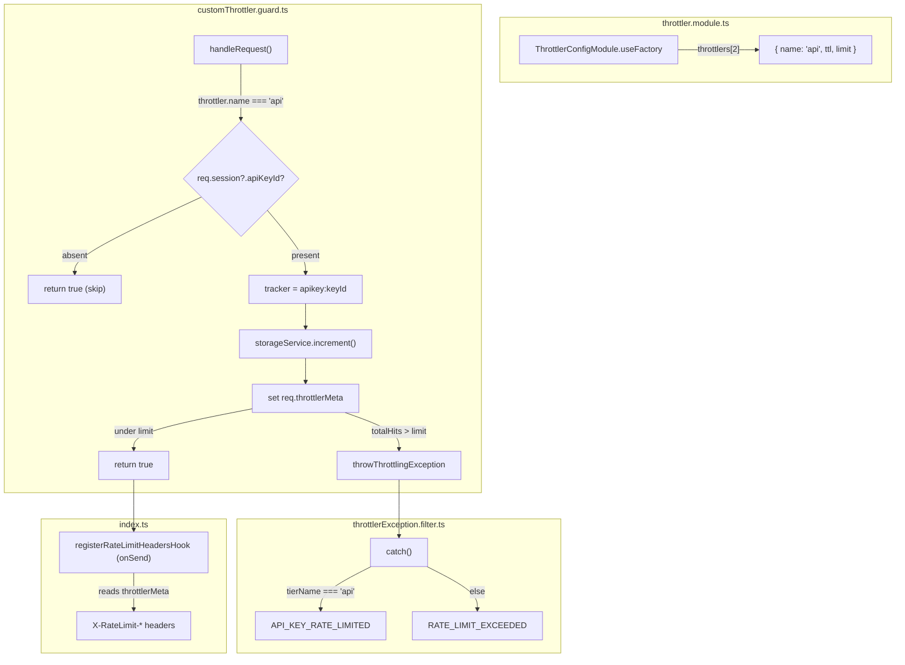
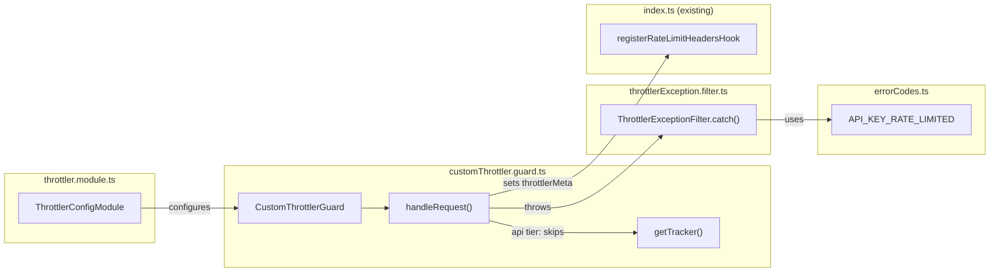

## Summary

Add a dedicated `api` throttler tier that tracks rate limits per API key (not per IP), with standard `X-RateLimit-*` headers on success and a typed `API_KEY_RATE_LIMITED` 429 on exhaustion. Extends existing `CustomThrottlerGuard` and `ThrottlerConfigModule` — no new modules or schema changes.

## Architecture





## Agents

| Agent | Tasks | Files |
|-------|-------|-------|
| backend-dev | T1–T7 | `throttler.module.ts`, `customThrottler.guard.ts`, `errorCodes.ts`, `throttlerException.filter.ts`, + tests |

## Reference Patterns

- `auth` tier skip pattern: `customThrottler.guard.ts:46` — same `if (throttler.name === 'auth' && ...)` pattern
- `onSend` header hook: `throttler/index.ts:23` — already handles `X-RateLimit-*` from `throttlerMeta`
- Existing test helpers: `customThrottler.guard.test.ts` `TestableThrottlerGuard` + `createGuard()` + `createMockContext()`
- Integration test setup: `throttler.integration.test.ts` `createTestApp()` + `inject()`

## Consistency Report

| Criterion | Task | Status |
|-----------|------|--------|
| SC-1: `api` tier in throttlers[] | T1 | covered |
| SC-2: `apikey:${keyId}` tracker | T2 | covered |
| SC-3: skip for non-API-key | T2 | covered |
| SC-4: X-RateLimit-* headers | T2 (throttlerMeta) + existing onSend hook | covered |
| SC-5: API_KEY_RATE_LIMITED error code | T4, T5 | covered |
| SC-6: Retry-After on 429 | existing filter (no change) | covered |
| SC-7: no regression on global/auth | T3, T7 | covered |
| SC-8: unit tests | T3, T6 | covered |
| SC-9: integration test | T7 | covered |

**Coverage: 9/9 (100%)**

## Micro-Tasks

### Slice 1: API throttler tier + per-key tracking

#### T1. Add `api` throttler entry [P]

- **Agent:** backend-dev
- **File:** `apps/api/src/throttler/throttler.module.ts`
- **Spec trace:** SC-1 → N1
- **Phase:** RED
- **Difficulty:** 1

Append `api` entry after `auth` in `throttlers[]`:
```ts
{
  name: 'api',
  ttl: config.get<number>('RATE_LIMIT_API_TTL')!,
  limit: config.get<number>('RATE_LIMIT_API_LIMIT')!,
  setHeaders: false,
},
```
Remove the comment on line 33 that says these are "reserved for a future API-key throttler tier."

- **Verify:** `bun run typecheck --filter=@repo/api`
- **Expected:** no errors

#### T2. Add `api` tier branch in handleRequest [P]

- **Agent:** backend-dev
- **File:** `apps/api/src/throttler/customThrottler.guard.ts`
- **Spec trace:** SC-2, SC-3, SC-4 → N2, N3, N6
- **Phase:** RED
- **Difficulty:** 3

In `handleRequest`, after the existing `auth` tier skip block (line 46–48), add:

```ts
// Skip api tier for non-API-key requests
if (throttler.name === 'api') {
  const { req } = this.getRequestResponse(context)
  const session = req.session as { apiKeyId?: string } | undefined
  if (!session?.apiKeyId) return true

  const tracker = `apikey:${session.apiKeyId}`
  const key = generateKey(context, tracker, 'api')

  const { totalHits, timeToExpire, isBlocked, timeToBlockExpire } =
    await this.storageService.increment(key, ttl, limit, blockDuration, 'api')

  const remaining = Math.max(0, limit - totalHits)
  const reset = Math.floor(Date.now() / 1000) + Math.ceil(timeToExpire / 1000)

  const { res } = this.getRequestResponse(context)
  req.throttlerMeta = { limit, remaining, reset, tierName: 'api', tracker }

  if (isBlocked || totalHits > limit) {
    req.throttlerMeta.remaining = 0
    await this.throwThrottlingException(context, {
      limit, ttl, key, tracker, totalHits, timeToExpire, isBlocked, timeToBlockExpire,
    })
  }

  return true
}
```

Key: **do not call `getTracker()`** — read `apiKeyId` directly from session.

- **Verify:** `bun run typecheck --filter=@repo/api`
- **Expected:** no errors

#### T3. Unit tests for api tier guard logic

- **Agent:** backend-dev
- **File:** `apps/api/src/throttler/customThrottler.guard.test.ts`
- **Spec trace:** SC-2, SC-3, SC-7, SC-8
- **Phase:** GREEN
- **Difficulty:** 2
- **Depends on:** T1, T2

Add tests in `describe('handleRequest')`:
1. `should skip api tier when request has no apiKeyId` — verify `storageService.increment` not called for `api` tier
2. `should use apikey:${keyId} tracker for api tier` — verify `generateKey` called with `apikey:key-uuid`
3. `should set throttlerMeta with tierName api` — verify meta shape
4. `should throw when api tier limit exceeded` — verify ThrottlerException thrown

Extend `createMockContext` to accept `session?: { apiKeyId?: string }`.

- **Verify:** `bun run test -- customThrottler.guard`
- **Expected:** all tests pass

#### RED-GATE: Slice 1

- **Verify:** `bun run test -- throttler`
- **Expected:** all throttler tests pass

### Slice 2: Rate limit headers + typed 429

#### T4. Add `API_KEY_RATE_LIMITED` error code [P]

- **Agent:** backend-dev
- **File:** `apps/api/src/common/errorCodes.ts`
- **Spec trace:** SC-5 → N4
- **Phase:** RED
- **Difficulty:** 1

Add to the `// Rate Limiting` section:
```ts
API_KEY_RATE_LIMITED: 'API_KEY_RATE_LIMITED',
```

- **Verify:** `bun run typecheck --filter=@repo/api`
- **Expected:** no errors

#### T5. Branch error code by tier in filter

- **Agent:** backend-dev
- **File:** `apps/api/src/throttler/filters/throttlerException.filter.ts`
- **Spec trace:** SC-5 → N5
- **Phase:** RED
- **Difficulty:** 2
- **Depends on:** T4

Replace hardcoded `ErrorCode.RATE_LIMIT_EXCEEDED` with:
```ts
errorCode: meta?.tierName === 'api'
  ? ErrorCode.API_KEY_RATE_LIMITED
  : ErrorCode.RATE_LIMIT_EXCEEDED,
```

- **Verify:** `bun run typecheck --filter=@repo/api`
- **Expected:** no errors

#### T6. Unit tests for tier-specific error code

- **Agent:** backend-dev
- **File:** `apps/api/src/throttler/filters/throttlerException.filter.test.ts`
- **Spec trace:** SC-5, SC-8
- **Phase:** GREEN
- **Difficulty:** 2
- **Depends on:** T5

Add tests:
1. `should use API_KEY_RATE_LIMITED error code when tierName is api` — set `throttlerMeta.tierName: 'api'`
2. `should use RATE_LIMIT_EXCEEDED for non-api tiers` — existing test covers this (verify)

- **Verify:** `bun run test -- throttlerException.filter`
- **Expected:** all tests pass

#### T7. Integration test: API key rate limiting

- **Agent:** backend-dev
- **File:** `apps/api/src/throttler/throttler.integration.test.ts`
- **Spec trace:** SC-2, SC-3, SC-4, SC-5, SC-9
- **Phase:** GREEN
- **Difficulty:** 3
- **Depends on:** T1–T6

Extend `createTestApp` to include `api` tier in throttlers config. Add a test endpoint that simulates API key auth (sets `req.session = { apiKeyId }` via a middleware or direct request mutation).

Tests:
1. `should return 429 with API_KEY_RATE_LIMITED when api key exceeds limit` — headers + error code
2. `should include X-RateLimit-* headers on API key success responses`
3. `should not apply api tier to non-API-key requests`

- **Verify:** `bun run test -- throttler.integration`
- **Expected:** all tests pass

#### RED-GATE: Slice 2

- **Verify:** `bun run test -- throttler`
- **Expected:** all throttler tests pass
