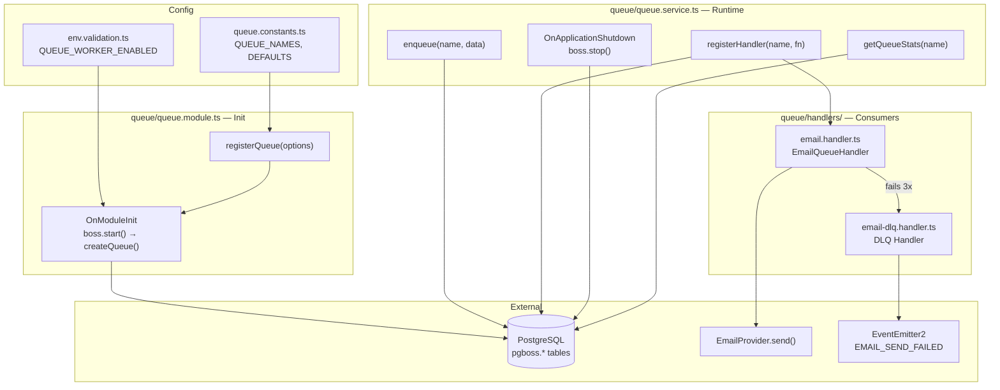
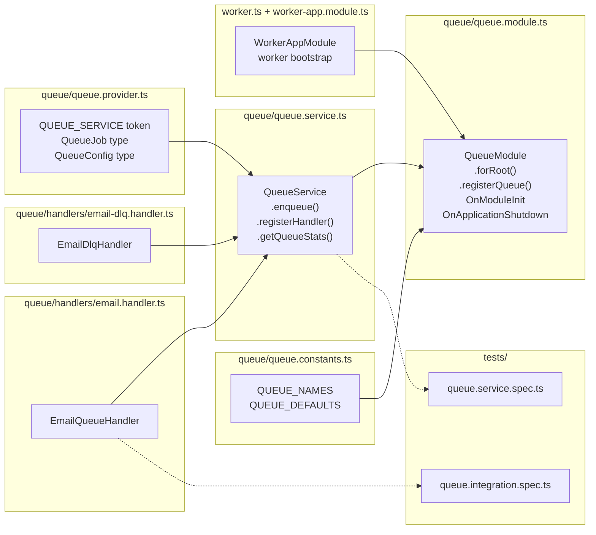

## Summary

Implement a pg-boss-backed queue module for NestJS that enables asynchronous job processing with retry, dead-letter queues, concurrency control, and graceful shutdown. Three slices: core module, worker modes, email integration.

## Architecture

### Data Flow



### File × Function Map



## Bootstrap Context

From analysis: pg-boss selected over BullMQ (zero new infra, transactional enqueue, lower boilerplate barrier). Shape 3 (abstraction) rejected as YAGNI. Worker deployment model: in-process for dev, separate process for prod, enqueue-only for Vercel.

**Reference patterns:**
- `apps/api/src/email/email.module.ts` — module factory pattern with Symbol token
- `apps/api/src/email/email.provider.ts` — provider interface pattern (`EMAIL_PROVIDER`)
- `apps/api/src/common/events/emailSendFailed.event.ts` — existing event to emit from DLQ handler

## Agents

| Agent | Task count | Files |
|-------|-----------|-------|
| backend-dev | 13 | queue/*.ts, queue/handlers/*.ts, worker*.ts, app.module.ts, env.validation.ts, auth.instance.ts |
| tester | 4 | queue/__tests__/*.spec.ts, RED-GATE verifications |
| devops | 2 | .env.example, ci.yml |

## Consistency Report

- Criteria covered: 22/22
- Uncovered criteria: none
- Tasks without spec backing: none
- Gold plating exemptions applied: 0

## Micro-Tasks

### Slice V1: Queue Module Core

#### Task 1: Install pg-boss → backend-dev
- **File:** `apps/api/package.json`
- **Snippet:** `"pg-boss": "^10.0.0"` in dependencies
- **Verify:** `cd apps/api && bun install && node -e "require('pg-boss')"` (ready)
- **Expected:** No errors, pg-boss resolves
- **Time:** 3 min
- **Difficulty:** 1
- **Traces:** SC-1 (pg-boss installed)
- **Phase:** GREEN

#### Task 2: Create queue.provider.ts [P] → backend-dev
- **File:** `apps/api/src/queue/queue.provider.ts`
- **Snippet:**
```ts
export const QUEUE_SERVICE = Symbol('QUEUE_SERVICE')
export type QueueJob<T = unknown> = { id: string; name: string; data: T }
export type QueueConfig = { connectionString: string }
export type QueueStats = { queued: number; active: number; completed: number; failed: number }
```
- **Verify:** `bun run typecheck --filter=@repo/api` (ready)
- **Expected:** No type errors
- **Time:** 3 min
- **Difficulty:** 1
- **Traces:** N3 (QUEUE_SERVICE token)
- **Phase:** GREEN

#### Task 3: Create queue.constants.ts [P] → backend-dev
- **File:** `apps/api/src/queue/queue.constants.ts`
- **Snippet:**
```ts
export const QUEUE_NAMES = { EMAIL_SEND: 'email-send', EMAIL_DLQ: 'email-dlq' } as const
export const QUEUE_DEFAULTS = { retryLimit: 3, retryDelay: 30, retryBackoff: true, batchSize: 5, pollingIntervalSeconds: 2 }
```
- **Verify:** `bun run typecheck --filter=@repo/api` (ready)
- **Expected:** No type errors
- **Time:** 2 min
- **Difficulty:** 1
- **Traces:** E2 (email-send queue config defaults)
- **Phase:** GREEN

#### Task 4: Create queue.service.ts → backend-dev
- **File:** `apps/api/src/queue/queue.service.ts`
- **Snippet:**
```ts
@Injectable()
export class QueueService implements OnModuleInit, OnApplicationShutdown {
  private boss: PgBoss
  private queues: Map<string, QueueRegistration>
  private handlers: Map<string, Function>
  constructor(private config: ConfigService) {}
  async onModuleInit() { /* boss.start(), createQueue() for each */ }
  async onApplicationShutdown() { /* boss.stop({ graceful: true, timeout: 30000 }) */ }
  async enqueue(name: string, data: unknown, opts?): Promise<string | null> { /* boss.send() */ }
  async registerHandler(name: string, handler: (jobs: PgBoss.Job[]) => Promise<void>, opts?) { /* boss.work() */ }
  async getQueueStats(name: string): Promise<QueueStats> { /* boss.getQueueStats() */ }
  registerQueue(options: { name: string; retryLimit?: number; retryDelay?: number; retryBackoff?: boolean; deadLetter?: string }) { /* store for onModuleInit */ }
}
```
- **Verify:** `bun run typecheck --filter=@repo/api` (ready)
- **Expected:** No type errors
- **Time:** 8 min
- **Difficulty:** 4
- **Traces:** N4, N5, N6, N7, N8, SC-3, SC-4, SC-5, SC-6, SC-7, SC-8, SC-12
- **Phase:** GREEN

#### Task 5: Create queue.module.ts → backend-dev
- **File:** `apps/api/src/queue/queue.module.ts`
- **Snippet:**
```ts
@Module({})
export class QueueModule {
  static forRoot(config?: Partial<QueueConfig>): DynamicModule { /* providers: QueueService, QUEUE_SERVICE token */ }
  static registerQueue(options: QueueRegistration): DynamicModule { /* calls service.registerQueue() */ }
}
```
- **Verify:** `bun run typecheck --filter=@repo/api` (ready)
- **Expected:** No type errors
- **Time:** 5 min
- **Difficulty:** 3
- **Traces:** N1, N2
- **Phase:** GREEN

#### Task 6: Add QUEUE_WORKER_ENABLED to env.validation.ts [P] → backend-dev
- **File:** `apps/api/src/config/env.validation.ts`
- **Snippet:** `QUEUE_WORKER_ENABLED: booleanFromEnv.default(true),`
- **Verify:** `bun run typecheck --filter=@repo/api` (ready)
- **Expected:** No type errors
- **Time:** 2 min
- **Difficulty:** 1
- **Traces:** W1, SC-16
- **Phase:** GREEN

#### Task 7: Import QueueModule in app.module.ts → backend-dev
- **File:** `apps/api/src/app.module.ts`
- **Snippet:** Add `QueueModule.forRoot()` after EmailModule import. Register email queues.
- **Verify:** `bun run typecheck --filter=@repo/api` (ready)
- **Expected:** No type errors
- **Time:** 3 min
- **Difficulty:** 2
- **Traces:** N1, N2, SC-1
- **Phase:** GREEN

#### Task 8: Update .env.example [P] → devops
- **File:** `.env.example`
- **Snippet:** `QUEUE_WORKER_ENABLED=true  # Set to false on Vercel (serverless)`
- **Verify:** `bun run env:check` (ready)
- **Expected:** No missing vars
- **Time:** 2 min
- **Difficulty:** 1
- **Traces:** SC-17
- **Phase:** GREEN

#### RED-GATE: Bun compatibility verification → tester
- **Verify:** Start the NestJS app with QueueModule loaded, verify `boss.start()` succeeds, enqueue a test job, confirm it appears in `pgboss.job` table, process it with a test handler (manual)
- **Expected:** pg-boss connects, enqueues, and processes under Bun 1.3.9
- **Traces:** SC-1, SC-2, SC-3, SC-4, SC-19
- **Phase:** RED-GATE

### Slice V2: Worker Modes

#### Task 10: Add worker mode logic → backend-dev
- **File:** `apps/api/src/queue/queue.service.ts`
- **Snippet:** In `onModuleInit`, check `QUEUE_WORKER_ENABLED` — if false, skip `boss.work()` calls. Only call `registerHandler` when enabled.
- **Verify:** `bun run typecheck --filter=@repo/api` (ready)
- **Expected:** No type errors
- **Time:** 3 min
- **Difficulty:** 2
- **Traces:** W1, SC-9, SC-10
- **Phase:** GREEN

#### Task 11: Create worker-app.module.ts [P] → backend-dev
- **File:** `apps/api/src/worker-app.module.ts`
- **Snippet:**
```ts
@Module({ imports: [ConfigModule.forRoot({ validate }), DatabaseModule, QueueModule.forRoot(), EmailModule] })
export class WorkerAppModule {}
// Lightweight: no HTTP, no Swagger, no CORS, no auth modules
```
- **Verify:** `bun run typecheck --filter=@repo/api` (ready)
- **Expected:** No type errors
- **Time:** 3 min
- **Difficulty:** 2
- **Traces:** W2, SC-11
- **Phase:** GREEN

#### Task 12: Create worker.ts entry point → backend-dev
- **File:** `apps/api/src/worker.ts`
- **Snippet:**
```ts
const app = await NestFactory.createApplicationContext(WorkerAppModule)
app.enableShutdownHooks()
logger.log('Worker started')
process.on('SIGTERM', () => app.close())
```
- **Verify:** `bun apps/api/src/worker.ts` — starts without HTTP, processes jobs (manual)
- **Expected:** "Worker started" logged, no HTTP listener
- **Time:** 4 min
- **Difficulty:** 2
- **Traces:** W2, SC-11
- **Phase:** GREEN

#### RED-GATE: Worker modes verification → tester
- **Verify:** Test all 3 modes: (1) QUEUE_WORKER_ENABLED=true → jobs processed in-process, (2) QUEUE_WORKER_ENABLED=false → jobs stay queued, (3) worker.ts → jobs processed in separate process (manual)
- **Expected:** Each mode behaves as specified
- **Traces:** SC-9, SC-10, SC-11, SC-12
- **Phase:** RED-GATE

### Slice V3: Email Queue Integration

#### Task 14: Create email.handler.ts [P] → backend-dev
- **File:** `apps/api/src/queue/handlers/email.handler.ts`
- **Snippet:**
```ts
@Injectable()
export class EmailQueueHandler {
  constructor(@Inject(EMAIL_PROVIDER) private emailProvider: EmailProvider) {}
  async handle(jobs: PgBoss.Job<EmailJobData>[]) {
    for (const job of jobs) {
      await this.emailProvider.send(job.data)
    }
  }
}
```
- **Verify:** `bun run typecheck --filter=@repo/api` (ready)
- **Expected:** No type errors
- **Time:** 4 min
- **Difficulty:** 2
- **Traces:** E1, SC-13, SC-14
- **Phase:** GREEN

#### Task 15: Create email-dlq.handler.ts [P] → backend-dev
- **File:** `apps/api/src/queue/handlers/email-dlq.handler.ts`
- **Snippet:**
```ts
@Injectable()
export class EmailDlqHandler {
  constructor(private eventEmitter: EventEmitter2) {}
  async handle(jobs: PgBoss.Job[]) {
    for (const job of jobs) {
      this.logger.error('Email permanently failed', job.data)
      this.eventEmitter.emit(EMAIL_SEND_FAILED, new EmailSendFailedEvent(...))
    }
  }
}
```
- **Verify:** `bun run typecheck --filter=@repo/api` (ready)
- **Expected:** No type errors
- **Time:** 3 min
- **Difficulty:** 2
- **Traces:** E3, SC-15
- **Phase:** GREEN

#### Task 16: Register email queues + handlers in QueueModule → backend-dev
- **File:** `apps/api/src/queue/queue.module.ts` + `apps/api/src/app.module.ts`
- **Snippet:** Register `email-send` queue with `retryLimit: 3, retryDelay: 30, retryBackoff: true, deadLetter: 'email-dlq'`. Register `email-dlq` queue. Wire handlers in module providers.
- **Verify:** `bun run typecheck --filter=@repo/api` (ready)
- **Expected:** No type errors
- **Time:** 4 min
- **Difficulty:** 2
- **Traces:** E2, E3, N2
- **Phase:** GREEN

#### Task 17: Modify auth.instance.ts — replace sync email with queue → backend-dev
- **File:** `apps/api/src/auth/auth.instance.ts`
- **Snippet:** Replace `emailProvider.send({ to, subject, html })` calls with `queueService.enqueue(QUEUE_NAMES.EMAIL_SEND, { to, subject, html })`. Inject QueueService into auth config.
- **Verify:** `bun run typecheck --filter=@repo/api` (ready)
- **Expected:** No type errors
- **Time:** 5 min
- **Difficulty:** 3
- **Traces:** SC-13, N4
- **Phase:** GREEN

#### Task 18: Unit tests → tester
- **File:** `apps/api/src/queue/__tests__/queue.service.spec.ts`
- **Snippet:** Tests: enqueue calls boss.send(), registerHandler calls boss.work(), getQueueStats delegates, onModuleInit starts boss + creates queues, onApplicationShutdown stops boss, QUEUE_WORKER_ENABLED=false skips work()
- **Verify:** `bun run test -- apps/api/src/queue/__tests__/queue.service.spec.ts` (ready)
- **Expected:** All tests pass
- **Time:** 8 min
- **Difficulty:** 3
- **Traces:** SC-21
- **Phase:** RED

#### Task 19: Integration test + CI env update → tester
- **File:** `apps/api/src/queue/__tests__/queue.integration.spec.ts` + `.github/workflows/ci.yml`
- **Snippet:** Integration: enqueue email job → worker processes → verify Mailpit received email. CI: add `QUEUE_WORKER_ENABLED: "true"` to E2E job env vars.
- **Verify:** `bun run test -- apps/api/src/queue/__tests__/queue.integration.spec.ts` (ready)
- **Expected:** All tests pass, email arrives in Mailpit
- **Time:** 8 min
- **Difficulty:** 3
- **Traces:** SC-20, SC-22
- **Phase:** RED
