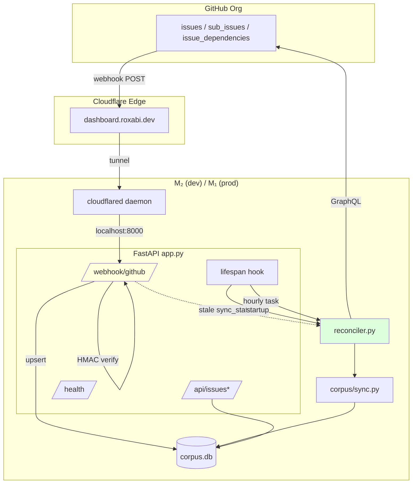
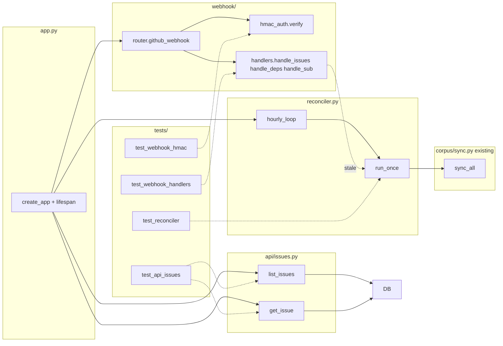

## Summary

Implement slices 1 (reconciler wiring), 2 (cloudflared supervisord unit), 4 (issues read endpoints) and 5 (GitHub webhook) of spec #43. Slice 3 (skeleton + `/health`) and Slice 6 (frontend) already shipped; `/api/graph` and `/api/repos` are live.

## Architecture

### Data flow

### File × function map

## Bootstrap Context

- Spec: `artifacts/specs/43-corpus-live-access-spec.mdx`
- Analysis: `artifacts/analyses/43-corpus-live-access-analysis.md`
- Existing code:
  - `src/roxabi_live/app.py` — FastAPI factory (¬lifespan yet)
  - `src/roxabi_live/corpus/sync.py` — GraphQL reconciler (callable)
  - `src/roxabi_live/dep_graph/v6/routes.py` — `GET /api/graph`
  - `src/roxabi_live/dep_graph/v6/repos.py` — `GET /api/repos`
  - `deploy/supervisor/conf.d/live.conf` — FastAPI program
  - `.env.example` — `CORPUS_DB_PATH`, `GITHUB_WEBHOOK_SECRET`, `CLOUDFLARED_TUNNEL_NAME`, `CORPUS_SYNC_INTERVAL_SECONDS`
- Reference patterns:
  - HMAC verify: stdlib `hmac.compare_digest` (spec §POST /webhook/github)
  - Async lifespan: FastAPI docs `@asynccontextmanager` pattern
  - aiosqlite read: `dep_graph/v6/routes.py`
  - Existing sync entry: `corpus/sync.py::sync_all` (or equivalent — verify during implement)

## Agents

| Agent | Tasks | Files |
|---|---|---|
| backend-dev | 13 | `app.py`, `reconciler.py`, `api/issues.py`, `webhook/*` |
| devops | 2 | `deploy/supervisor/conf.d/cloudflared.conf`, provisioning doc |
| tester | 4 | `tests/test_webhook_hmac.py`, `test_webhook_handlers.py`, `test_api_issues.py`, `test_reconciler.py` |
| security-auditor | 1 | review `webhook/hmac_auth.py`, `webhook/router.py` |
| doc-writer | 2 | `docs/cloudflared-setup.md`, `CLAUDE.md` |

## Consistency Report

- Success criteria total: 18 (from spec §Success Criteria)
- Covered by micro-tasks: 16
- Deferred (tunnel live verification + M₁ migration steps require manual/op steps): 2 — SC "Tunnel is reachable at `dashboard.roxabi.dev`" and "M₂ → M₁ migration verified" (documented but not automated)
- Untraced tasks: 0

## Micro-Tasks

### Slice 1 — Reconciler wiring

**T1** [P] · backend-dev · RED · diff 2 · SC1, SC2
- Description: Write failing test for `reconciler.run_once` (returns coroutine, calls `corpus.sync.sync_all`, tolerates DB errors).
- File: `tests/test_reconciler.py`
- Verify: `uv run pytest tests/test_reconciler.py -x` → failure expected
- Expected: ImportError or AttributeError

**T2** · backend-dev · GREEN · diff 2 · SC1
- Description: Create `reconciler.py` with `run_once()` (async, calls existing `corpus.sync` entry) and `hourly_loop(interval_seconds)` (asyncio.Task).
- File: `src/roxabi_live/reconciler.py`
- Verify: `uv run pytest tests/test_reconciler.py -x`
- Expected: pass

**T3** · backend-dev · GREEN · diff 3 · SC1, SC2
- Description: Register lifespan in `app.py`: schedule `run_once` as background task on startup + start `hourly_loop` reading `CORPUS_SYNC_INTERVAL_SECONDS` env (default 3600).
- File: `src/roxabi_live/app.py`
- Verify: `uv run pytest tests/test_reconciler.py && uv run roxabi-live &` — logs show "reconciler startup sync scheduled"
- Expected: pass, no blocking of app startup

**T4** · backend-dev · RED-GATE · S1 complete
- Description: Validate S1 — run dev server, confirm reconciler triggers on startup and re-triggers after interval override (set to 10s for test).
- Verify: `CORPUS_SYNC_INTERVAL_SECONDS=10 uv run roxabi-live` (manual) — 2 ticks in 25s
- Expected: 2 sync log lines

### Slice 2 — cloudflared supervisord unit

**T5** [P] · devops · GREEN · diff 1
- Description: Create `cloudflared.conf` per spec §cloudflared Supervisord Unit; reuse pattern from `live.conf`.
- File: `deploy/supervisor/conf.d/cloudflared.conf`
- Verify: `supervisorctl reread` (manual) shows new program
- Expected: `cloudflared: available`

**T6** · doc-writer · GREEN · diff 2
- Description: Document tunnel provisioning steps (from spec §One-time tunnel provisioning) + M₂→M₁ migration.
- File: `docs/cloudflared-setup.md`
- Verify: `test -f docs/cloudflared-setup.md`
- Expected: file exists, 6 provisioning steps + 6 migration steps

### Slice 4 — Issues read endpoints

**T7** [P] · backend-dev · RED · diff 2 · SC5
- Description: Write failing tests for `GET /api/issues` (unfiltered + `?repo=` + `?state=` + `?label=`).
- File: `tests/test_api_issues.py`
- Verify: `uv run pytest tests/test_api_issues.py::test_list -x`
- Expected: 404 from app (route missing)

**T8** · backend-dev · GREEN · diff 3 · SC5
- Description: Implement `GET /api/issues` in `api/issues.py` — aiosqlite read, filter by repo/state/label, include `labels` array.
- File: `src/roxabi_live/api/issues.py`
- Verify: `uv run pytest tests/test_api_issues.py::test_list`
- Expected: pass

**T9** [P] · backend-dev · RED · diff 2 · SC6
- Description: Add failing tests for `GET /api/issues/:key` (found with edges, 404 on unknown, URL-decoded `{repo}#{N}`).
- File: `tests/test_api_issues.py`
- Verify: `uv run pytest tests/test_api_issues.py::test_get -x`
- Expected: fail (route missing)

**T10** · backend-dev · GREEN · diff 3 · SC6
- Description: Implement `GET /api/issues/:key` — fetch issue + query `edges` for `blocking`/`blocked_by` arrays; 404 on miss.
- File: `src/roxabi_live/api/issues.py`
- Verify: `uv run pytest tests/test_api_issues.py`
- Expected: pass all

**T11** · backend-dev · GREEN · diff 1
- Description: Wire `api.issues.router` into `app.py`.
- File: `src/roxabi_live/app.py`
- Verify: `curl localhost:8000/api/issues?state=open | jq '.total'`
- Expected: positive integer

**T12** · tester · RED-GATE · S4 complete
- Description: Verify S4 — all issues endpoint tests green, manual curl against running app matches corpus row counts.
- Verify: `uv run pytest tests/test_api_issues.py -v && sqlite3 ~/.roxabi/corpus.db "SELECT COUNT(*) FROM issues"` vs curl total
- Expected: numbers match

### Slice 5 — Webhook handler

**T13** [P] · backend-dev · RED · diff 2 · SC10, SC14
- Description: Failing tests for `webhook.hmac_auth.verify` — valid sig ✓, invalid sig ✗, missing header ✗, timing-safe compare.
- File: `tests/test_webhook_hmac.py`
- Verify: `uv run pytest tests/test_webhook_hmac.py -x`
- Expected: ImportError

**T14** · backend-dev · GREEN · diff 2 · SC10, SC14
- Description: Implement `webhook/hmac_auth.py::verify(body: bytes, header: str | None, secret: str) -> bool` using `hmac.compare_digest` against `sha256=<hex>` format.
- File: `src/roxabi_live/webhook/hmac_auth.py`
- Verify: `uv run pytest tests/test_webhook_hmac.py`
- Expected: pass

**T15** · security-auditor · REFACTOR · diff 2 · SC14
- Description: Audit `hmac_auth.py` + `router.py` for: constant-time compare ✓, raw body (pre-parse) ✓, 401 leaks ¬, secret in logs ¬. Attach findings to PR.
- Verify: audit notes committed
- Expected: ✓ approved or changes listed

**T16** [P] · backend-dev · RED · diff 3 · SC9
- Description: Failing tests for `webhook.handlers.handle_issues` — issue opened → upsert, labeled → labels replaced, closed → state updated.
- File: `tests/test_webhook_handlers.py`
- Verify: `uv run pytest tests/test_webhook_handlers.py::test_issues -x`
- Expected: fail

**T17** · backend-dev · GREEN · diff 4 · SC9
- Description: Implement `handlers.handle_issues(payload, conn)` — upsert `issues` row + replace `labels` rows for that key.
- File: `src/roxabi_live/webhook/handlers.py`
- Verify: `uv run pytest tests/test_webhook_handlers.py::test_issues`
- Expected: pass

**T18** · backend-dev · GREEN · diff 3 · SC11, SC12, SC13
- Description: Implement `handle_deps` (`issue_dependencies`) and `handle_sub_issues` (`sub_issues`); act on `blocked_by_*` / `sub_issue_*`, 200 no-op on opposite-direction `blocking_*` / `parent_issue_*`.
- File: `src/roxabi_live/webhook/handlers.py`
- Verify: `uv run pytest tests/test_webhook_handlers.py -k 'deps or sub'`
- Expected: pass

**T19** · backend-dev · GREEN · diff 3 · SC9, SC10, SC14, SC15
- Description: Implement `POST /webhook/github` router — verify HMAC, dispatch on `X-GitHub-Event`, return 401/200 per spec, ack unknown events.
- File: `src/roxabi_live/webhook/router.py`
- Verify: `uv run pytest tests/test_webhook_handlers.py && uv run pytest tests/test_webhook_hmac.py`
- Expected: all green

**T20** · backend-dev · GREEN · diff 2 · SC1 (heal trigger)
- Description: After successful upsert, schedule `reconciler.run_once` as background task if `sync_state.last_synced_at` for the repo is > 1h old.
- File: `src/roxabi_live/webhook/router.py`
- Verify: `uv run pytest tests/test_webhook_handlers.py::test_stale_triggers_reconcile`
- Expected: pass

**T21** · backend-dev · GREEN · diff 1
- Description: Wire `webhook.router.router` into `app.py`.
- File: `src/roxabi_live/app.py`
- Verify: `curl -X POST localhost:8000/webhook/github -H "X-GitHub-Event: ping"` (no sig) → 401
- Expected: 401

**T22** · tester · RED-GATE · S5 complete
- Description: End-to-end: simulated signed payload via pytest httpx TestClient covers all event paths; run ruff + pyright.
- Verify: `uv run pytest tests/test_webhook_* && uv run ruff check . && uv run pyright`
- Expected: all green

### Cross-cutting

**T23** · doc-writer · GREEN · diff 1
- Description: Update `CLAUDE.md` Key files table: add `reconciler.py`, `api/issues.py`, `webhook/`; add `cloudflared.conf` to Supervisor pattern section.
- File: `CLAUDE.md`
- Verify: `grep -c "webhook\|reconciler" CLAUDE.md`
- Expected: ≥ 3

**T24** · backend-dev · GREEN · diff 1
- Description: Folder-size guard — `src/roxabi_live/webhook/` will hold 4 files (__init__, hmac_auth, router, handlers); within 12-file limit.
- Verify: `ls src/roxabi_live/webhook/ | wc -l`
- Expected: ≤ 12

## Parallelism

Within a slice, `[P]` micro-tasks can run in parallel. Across slices:
- S1 tasks (T1–T4) ∥ S2 tasks (T5–T6) ∥ S4 RED tasks (T7, T9) — first pass
- S5 RED tasks (T13, T16) can start alongside S4 once T11 lands
- Security audit (T15) waits for T14+T19

## Chain

Next: `/dev` auto-chains to `/implement --issue 43`. Worktree at `.claude/worktrees/43-corpus-live-access/`.

## Task IDs

<!-- Generated by /plan. Used by /implement to resume tasks on session restart. -->
- T1: 1 — RED failing reconciler test (tester)
- T2: 2 — GREEN reconciler.run_once + hourly_loop (backend-dev) [blocked by 1]
- T3: 3 — GREEN lifespan wiring (backend-dev) [blocked by 2]
- T4: 4 — RED-GATE S1 validate (tester) [blocked by 3]
- T5: 5 — GREEN cloudflared.conf (devops)
- T6: 6 — GREEN cloudflared-setup.md (doc-writer)
- T7: 7 — RED /api/issues tests (tester)
- T8: 8 — GREEN /api/issues (backend-dev) [blocked by 7]
- T9: 9 — RED /api/issues/:key tests (tester)
- T10: 10 — GREEN /api/issues/:key (backend-dev) [blocked by 9, 8]
- T11: 11 — GREEN wire issues router (backend-dev) [blocked by 10]
- T12: 12 — RED-GATE S4 validate (tester) [blocked by 11]
- T13: 13 — RED HMAC tests (tester)
- T14: 14 — GREEN hmac_auth.verify (backend-dev) [blocked by 13]
- T15: 15 — REFACTOR security audit (security-auditor) [blocked by 14, 19]
- T16: 16 — RED handle_issues tests (tester)
- T17: 17 — GREEN handle_issues (backend-dev) [blocked by 16, 14]
- T18: 18 — GREEN handle_deps + handle_sub_issues (backend-dev) [blocked by 17]
- T19: 19 — GREEN POST /webhook/github router (backend-dev) [blocked by 14, 17, 18]
- T20: 20 — GREEN stale-sync trigger (backend-dev) [blocked by 19, 3]
- T21: 21 — GREEN wire webhook router (backend-dev) [blocked by 20]
- T22: 22 — RED-GATE S5 E2E (tester) [blocked by 21, 15]
- T23: 23 — GREEN CLAUDE.md (doc-writer)
- T24: 24 — GREEN folder-size guard (backend-dev)
