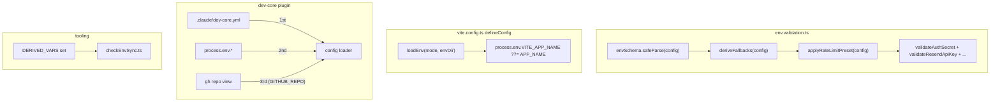
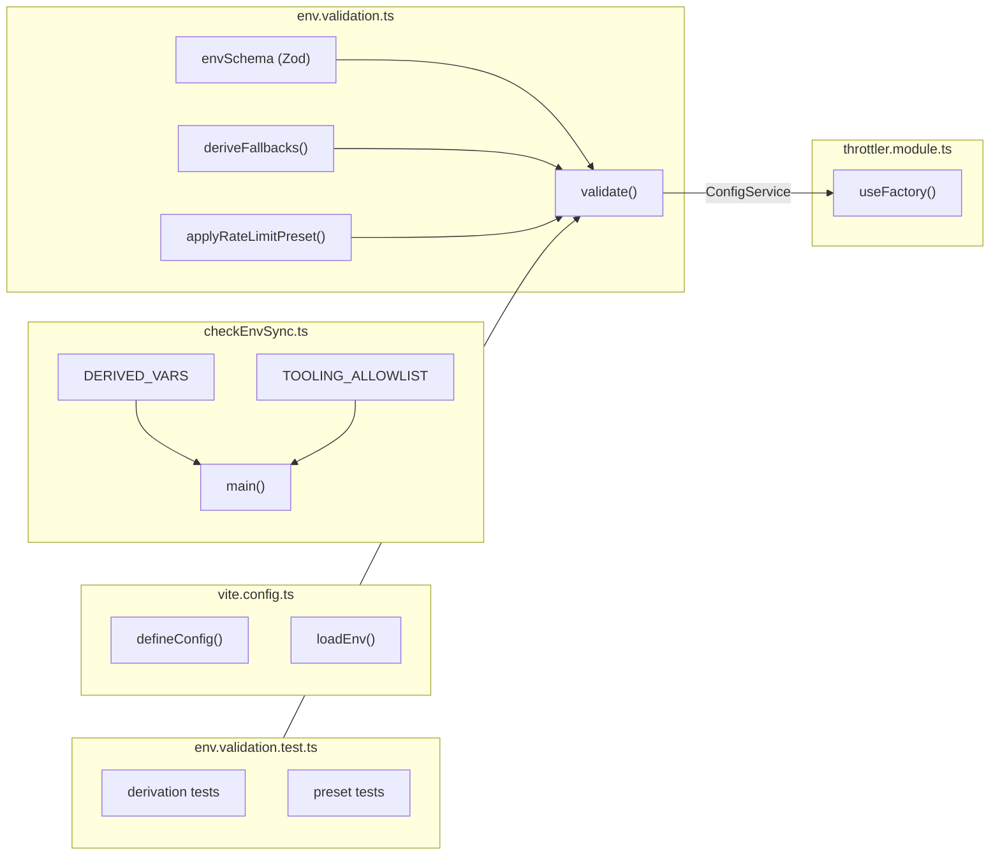

## Summary

Reduce `.env.example` from ~60 to ~37 vars via 5 slices: API env derivation (CORS_ORIGIN + BETTER_AUTH_URL from APP_URL), Vite APP_NAME derivation, rate limit presets, dev-core config migration to YAML, and tooling/docs cleanup. 22 micro-tasks across 5 agents, 11 files (10 modified + 1 new).

## Architecture

### Data Flow



### File x Function Map



## Bootstrap Context

From analysis: `.env.example` has ~60 vars across 13 sections. Key findings:
- CORS_ORIGIN always equals APP_URL (documented in .env.example line 16)
- BETTER_AUTH_URL should equal APP_URL (current schema default `localhost:4000` is wrong — should be `:3000`)
- Docker vars already derive from APP_SLUG in docker-compose.yml
- Dev-core field IDs only consumed by Claude Code plugin, not app runtime
- `validate()` already has post-parse transform pattern (validateAuthSecret, validateResendApiKey, etc.)
- `loadEnv` already imported in vite.config.ts

## Agents

| Agent | Slices | Files | Tasks |
|-------|--------|-------|-------|
| backend-dev | V1, V3 | `env.validation.ts`, `throttler.module.ts` | 6 |
| frontend-dev | V2 | `vite.config.ts` | 2 |
| devops | V4, V5 | `.claude/dev-core.yml`, `checkEnvSync.ts`, `turbo.jsonc`, `.env.example`, `docker-compose.yml` | 8 |
| doc-writer | V5 | `docs/configuration.mdx` | 2 |
| tester | V1, V3 | `env.validation.test.ts` | 4 |

## Consistency Report

- **Success criteria covered:** 28/28
- **Uncovered:** 0
- **Untraced tasks:** 0

## Micro-Tasks

### V1: API Env Derivation (backend-dev)

---

**T1.1** Make CORS_ORIGIN and BETTER_AUTH_URL optional in Zod schema [P]
- **File:** `apps/api/src/config/env.validation.ts`
- **Code:**
  ```ts
  CORS_ORIGIN: z.string().optional(),
  BETTER_AUTH_URL: z.string().url().optional(),
  ```
- **Verify:** `bun run typecheck --filter=@repo/api 2>&1 | head -20`
- **Expected:** Type errors in code that expects non-optional string (expected — T1.2 fixes)
- **Time:** 3 min | **Difficulty:** 1
- **Spec trace:** SC-1, SC-2 (CORS_ORIGIN/BETTER_AUTH_URL default to APP_URL)
- **Phase:** RED

**T1.2** Add `deriveFallbacks()` post-parse step in `validate()` [P]
- **File:** `apps/api/src/config/env.validation.ts`
- **Code:**
  ```ts
  function deriveFallbacks(config: Record<string, unknown>): void {
    const appUrl = config.APP_URL as string | undefined
    const fallbackUrl = appUrl ?? 'http://localhost:3000'
    if (config.CORS_ORIGIN === undefined) config.CORS_ORIGIN = fallbackUrl
    if (config.BETTER_AUTH_URL === undefined) config.BETTER_AUTH_URL = fallbackUrl
  }
  ```
  Call `deriveFallbacks(result.data)` after `safeParse()`, before other validators.
- **Verify:** `bun run typecheck --filter=@repo/api`
- **Expected:** Clean typecheck (CORS_ORIGIN and BETTER_AUTH_URL always filled after deriveFallbacks)
- **Time:** 5 min | **Difficulty:** 2
- **Spec trace:** SC-1, SC-2, SC-3, SC-4 (derivation + explicit wins + fallback)
- **Phase:** GREEN

**T1.3** Update `EnvironmentVariables` type to reflect required-after-derivation
- **File:** `apps/api/src/config/env.validation.ts`
- **Code:** After `deriveFallbacks` + `applyRateLimitPreset`, cast the result to ensure all derived fields are non-optional in the return type. Use `z.infer` base type + type assertion, or a `Required<Pick<...>>` intersection.
- **Verify:** `bun run typecheck --filter=@repo/api`
- **Expected:** Clean — all consumers of EnvironmentVariables see required fields
- **Time:** 5 min | **Difficulty:** 3
- **Spec trace:** SC-1, SC-2
- **Phase:** GREEN

---
**RED-GATE V1:** `bun run test --filter=@repo/api -- --run env.validation` — expect BETTER_AUTH_URL default test to fail (T1.2 changes default from `:4000` to `:3000`). Tester handles in T-test.1.

---

### V2: Vite APP_NAME Derivation (frontend-dev)

---

**T2.1** Add `loadEnv()` + `??=` inside defineConfig callback [P]
- **File:** `apps/web/vite.config.ts`
- **Code:** Inside `defineConfig(async () => { ... })`, before returning config:
  ```ts
  // Derive VITE_APP_NAME from APP_NAME if not explicitly set
  const envDir = '../..'
  loadEnv('development', envDir, 'VITE_')
  process.env.VITE_APP_NAME ??= process.env.APP_NAME ?? 'App'
  ```
  Note: `loadEnv` is already imported. `envDir` matches existing config line 85.
- **Verify:** `APP_NAME=TestBrand bun run dev --filter=@repo/web 2>&1 | head -5` (verify no crash)
- **Expected:** Web app starts without error
- **Time:** 5 min | **Difficulty:** 2
- **Spec trace:** SC-6, SC-7, SC-8, SC-9, SC-10 (Vite derivation criteria)
- **Phase:** GREEN

**T2.2** Verify `appName.test.ts` passes unchanged
- **File:** `apps/web/src/lib/appName.test.ts` (read-only verification)
- **Verify:** `bun run test --filter=@repo/web -- --run appName`
- **Expected:** All tests pass (vi.stubEnv is independent of vite.config.ts)
- **Time:** 2 min | **Difficulty:** 1
- **Spec trace:** SC-10 (appName.test.ts passes without modification)
- **Phase:** GREEN

---

### V3: Rate Limit Presets (backend-dev)

---

**T3.1** Add `RATE_LIMIT_PRESET` enum + change individual fields to `.optional()` [P]
- **File:** `apps/api/src/config/env.validation.ts`
- **Code:**
  ```ts
  RATE_LIMIT_PRESET: z.enum(['default', 'strict', 'relaxed']).default('default'),
  // Change all 7 individual fields from .default(N) to .optional():
  RATE_LIMIT_GLOBAL_TTL: z.coerce.number().positive().optional(),
  RATE_LIMIT_GLOBAL_LIMIT: z.coerce.number().positive().optional(),
  RATE_LIMIT_AUTH_TTL: z.coerce.number().positive().optional(),
  RATE_LIMIT_AUTH_LIMIT: z.coerce.number().positive().optional(),
  RATE_LIMIT_AUTH_BLOCK_DURATION: z.coerce.number().positive().optional(),
  RATE_LIMIT_API_TTL: z.coerce.number().optional(),
  RATE_LIMIT_API_LIMIT: z.coerce.number().optional(),
  ```
- **Verify:** `bun run typecheck --filter=@repo/api 2>&1 | head -20`
- **Expected:** Type errors in throttler.module.ts (expected — T3.3 fixes)
- **Time:** 3 min | **Difficulty:** 1
- **Spec trace:** SC-11, SC-12 (RATE_LIMIT_PRESET enum + .optional())
- **Phase:** RED

**T3.2** Add `applyRateLimitPreset()` function + call in `validate()`
- **File:** `apps/api/src/config/env.validation.ts`
- **Code:**
  ```ts
  const RATE_LIMIT_PRESETS = {
    default: { RATE_LIMIT_GLOBAL_TTL: 60_000, RATE_LIMIT_GLOBAL_LIMIT: 60, RATE_LIMIT_AUTH_TTL: 60_000, RATE_LIMIT_AUTH_LIMIT: 5, RATE_LIMIT_AUTH_BLOCK_DURATION: 300_000, RATE_LIMIT_API_TTL: 60_000, RATE_LIMIT_API_LIMIT: 100 },
    strict:  { RATE_LIMIT_GLOBAL_TTL: 60_000, RATE_LIMIT_GLOBAL_LIMIT: 30, RATE_LIMIT_AUTH_TTL: 60_000, RATE_LIMIT_AUTH_LIMIT: 3, RATE_LIMIT_AUTH_BLOCK_DURATION: 600_000, RATE_LIMIT_API_TTL: 60_000, RATE_LIMIT_API_LIMIT: 50 },
    relaxed: { RATE_LIMIT_GLOBAL_TTL: 60_000, RATE_LIMIT_GLOBAL_LIMIT: 120, RATE_LIMIT_AUTH_TTL: 60_000, RATE_LIMIT_AUTH_LIMIT: 10, RATE_LIMIT_AUTH_BLOCK_DURATION: 60_000, RATE_LIMIT_API_TTL: 60_000, RATE_LIMIT_API_LIMIT: 200 },
  } as const

  function applyRateLimitPreset(config: Record<string, unknown>): void {
    const preset = RATE_LIMIT_PRESETS[config.RATE_LIMIT_PRESET as keyof typeof RATE_LIMIT_PRESETS]
    if (!preset) return
    for (const [key, value] of Object.entries(preset)) {
      if (config[key] === undefined) config[key] = value
    }
  }
  ```
  Call after `deriveFallbacks()` in `validate()`.
- **Verify:** `bun run typecheck --filter=@repo/api`
- **Expected:** Clean (all rate limit fields filled after preset expansion)
- **Time:** 5 min | **Difficulty:** 3
- **Spec trace:** SC-13, SC-14 (preset expansion + explicit override)
- **Phase:** GREEN

**T3.3** Remove fallback defaults from `ThrottlerModule.useFactory`
- **File:** `apps/api/src/throttler/throttler.module.ts`
- **Code:** Remove second argument from all `config.get()` calls:
  ```ts
  // Before: config.get<number>('RATE_LIMIT_GLOBAL_TTL', 60_000)
  // After:  config.get<number>('RATE_LIMIT_GLOBAL_TTL')!
  ```
  Apply to all 5 throttler config lines (global TTL/limit, auth TTL/limit/blockDuration).
- **Verify:** `bun run typecheck --filter=@repo/api`
- **Expected:** Clean typecheck
- **Time:** 3 min | **Difficulty:** 1
- **Spec trace:** SC-16 (ThrottlerModule fallback defaults removed)
- **Phase:** REFACTOR

---
**RED-GATE V3:** `bun run test --filter=@repo/api -- --run env.validation` — expect existing rate limit default tests to fail. Tester handles in T-test.2.

---

### V4: Dev-core Config Migration (devops)

---

**T4.1** Create `.claude/dev-core.yml` with current field IDs [P]
- **File:** `.claude/dev-core.yml` (NEW)
- **Code:**
  ```yaml
  # Dev-core configuration — GitHub Projects issue triage
  # Auto-populated by /init skill. Committed to repo (non-sensitive).
  github_repo: roxabi/roxabi-boilerplate
  gh_project_id: ''
  status_field_id: ''
  size_field_id: ''
  priority_field_id: ''
  status_options_json: '{}'
  size_options_json: '{}'
  priority_options_json: '{}'
  ```
- **Verify:** `cat .claude/dev-core.yml`
- **Expected:** YAML file with all 8 fields
- **Time:** 3 min | **Difficulty:** 1
- **Spec trace:** SC-17, SC-18 (dev-core.yml stores fields, committed)
- **Phase:** GREEN

**T4.2** Add YAML config loader to dev-core triage script [P]
- **File:** `.claude/plugins/cache/roxabi-marketplace/dev-core/0.1.0/skills/issue-triage/triage.ts`
- **Code:** Add function at top:
  ```ts
  function loadDevCoreConfig(key: string): string | undefined {
    try {
      const yaml = readFileSync('.claude/dev-core.yml', 'utf-8')
      const match = yaml.match(new RegExp(`^${key}:\\s*['"]?(.+?)['"]?$`, 'm'))
      return match?.[1] || undefined
    } catch { return undefined }
  }
  ```
  Replace `process.env.GH_PROJECT_ID` with `loadDevCoreConfig('gh_project_id') ?? process.env.GH_PROJECT_ID`.
  For GITHUB_REPO: add `gh repo view` fallback as 3rd tier.
- **Verify:** `bun .claude/plugins/cache/roxabi-marketplace/dev-core/0.1.0/skills/issue-triage/triage.ts --help 2>&1 | head -5`
- **Expected:** Script runs without error
- **Time:** 8 min | **Difficulty:** 3
- **Spec trace:** SC-19 (3-tier fallback: YAML → env → gh)
- **Phase:** GREEN

---

### V5: Tooling + Dedup + Docs + Cleanup (devops + doc-writer)

---

**T5.1** Add `DERIVED_VARS` set + update checks in `checkEnvSync.ts` [P]
- **File:** `scripts/checkEnvSync.ts`
- **Code:**
  ```ts
  const DERIVED_VARS = new Set([
    'CORS_ORIGIN',
    'BETTER_AUTH_URL',
    'VITE_APP_NAME',
  ])
  ```
  Add `if (DERIVED_VARS.has(key)) continue` in three loops: schema-vs-example (line 289), example-vs-schema (line 298), turbo-declarations (line 261).
  Remove dev-core vars from `TOOLING_ALLOWLIST`: `GITHUB_REPO`, `GH_PROJECT_ID`, `STATUS_FIELD_ID`, `SIZE_FIELD_ID`, `PRIORITY_FIELD_ID`, `STATUS_OPTIONS_JSON`, `SIZE_OPTIONS_JSON`, `PRIORITY_OPTIONS_JSON`.
- **Verify:** `bun run env:check`
- **Expected:** Clean pass (after .env.example is updated in T5.3)
- **Time:** 5 min | **Difficulty:** 2
- **Spec trace:** SC-21, SC-22, SC-23 (DERIVED_VARS + TOOLING_ALLOWLIST update)
- **Phase:** GREEN

**T5.2** Update `turbo.jsonc` globalPassThroughEnv [P]
- **File:** `turbo.jsonc`
- **Code:**
  - Remove `"CORS_ORIGIN"` and `"BETTER_AUTH_URL"` from `globalPassThroughEnv`
  - Add `"RATE_LIMIT_PRESET"` to `globalPassThroughEnv`
  - Keep individual `RATE_LIMIT_*` vars in passthrough (backward compat)
- **Verify:** `bun run build --dry-run 2>&1 | head -10` (verify turbo parses config)
- **Expected:** No turbo config errors
- **Time:** 3 min | **Difficulty:** 1
- **Spec trace:** SC-24, SC-25 (turbo updates)
- **Phase:** GREEN

**T5.3** Simplify `.env.example` (~60 → ~37 vars) [P]
- **File:** `.env.example`
- **Code:**
  - Remove `CORS_ORIGIN` and `BETTER_AUTH_URL` from "Application (Required)" section; add comment on APP_URL: `# Also derives CORS_ORIGIN and BETTER_AUTH_URL`
  - Remove `VITE_APP_NAME` from "Public" section; add comment on APP_NAME: `# Also derives VITE_APP_NAME`
  - Replace 7 granular `RATE_LIMIT_*` tuning vars with `# RATE_LIMIT_PRESET=default` comment
  - Remove entire "dev-core: GitHub Project V2" section (lines 140-159)
  - Consolidate Vercel/GitHub tokens: merge "Vercel Dashboard" + "dev-core: Vercel" into single section
  - Clarify Docker section: note vars derive from APP_SLUG
  - Keep `RATE_LIMIT_ENABLED=false` as uncommented required var
- **Verify:** `wc -l .env.example`
- **Expected:** ~100 lines (down from 160)
- **Time:** 8 min | **Difficulty:** 2
- **Spec trace:** SC-7, SC-20, SC-26, SC-27, SC-28 (.env.example cleanup criteria)
- **Phase:** GREEN

**T5.4** Update `docker-compose.yml` comments [P]
- **File:** `docker-compose.yml`
- **Code:** Add clarifying comments to container_name and volume lines noting APP_SLUG derivation.
- **Verify:** `docker compose config 2>&1 | head -5`
- **Expected:** Valid compose config (comments don't break parsing)
- **Time:** 2 min | **Difficulty:** 1
- **Spec trace:** SC-27 (Docker vars clarified)
- **Phase:** GREEN

**T5.5** Verify `deploy-preview.yml` CORS_ORIGIN injection unchanged
- **File:** `.github/workflows/deploy-preview.yml` (read-only verification)
- **Verify:** `grep -n 'CORS_ORIGIN' .github/workflows/deploy-preview.yml`
- **Expected:** `--env "CORS_ORIGIN=${WEB_PREVIEW_URL}${CORS_EXTRA}"` still present
- **Time:** 2 min | **Difficulty:** 1
- **Spec trace:** SC-28 (deploy-preview.yml preserved)
- **Phase:** GREEN

**T5.6** Update `docs/configuration.mdx` (doc-writer) [P]
- **File:** `docs/configuration.mdx`
- **Code:**
  - Add "Derived Variables" subsection: CORS_ORIGIN, BETTER_AUTH_URL, VITE_APP_NAME derivation logic
  - Add "Rate Limit Presets" subsection: preset table, override mechanism
  - Add "Dev-core Configuration" subsection: `.claude/dev-core.yml`, 3-tier fallback, `/init` usage
  - Update variable tables: mark derived vars as auto-resolved
  - Add "Advanced Overrides" section for explicit env var override
- **Verify:** `bun run docs 2>&1 | head -5` (verify docs build)
- **Expected:** Docs build without errors
- **Time:** 8 min | **Difficulty:** 2
- **Spec trace:** SC-29 (configuration.mdx updated)
- **Phase:** GREEN

**T5.7** Run `bun run env:check` end-to-end
- **Verify:** `bun run env:check`
- **Expected:** Clean pass, no errors or warnings for derived/tooling vars
- **Time:** 2 min | **Difficulty:** 1
- **Spec trace:** SC-21 (env:check passes clean)
- **Phase:** GREEN

**T5.8** Final var count verification
- **Verify:** `grep -cE '^[A-Z][A-Z0-9_]*=' .env.example`
- **Expected:** ~37 (±3)
- **Time:** 2 min | **Difficulty:** 1
- **Spec trace:** SC-30 (.env.example reduced to ~37 vars)
- **Phase:** GREEN

---

### Tests (tester)

---

**T-test.1** Update BETTER_AUTH_URL default assertion + add derivation tests
- **File:** `apps/api/src/config/env.validation.test.ts`
- **Code:**
  - Update existing `BETTER_AUTH_URL` default assertion from `'http://localhost:4000'` to `'http://localhost:3000'`
  - Add test: `CORS_ORIGIN defaults to APP_URL when not set`
  - Add test: `BETTER_AUTH_URL defaults to APP_URL when not set`
  - Add test: `explicit CORS_ORIGIN overrides APP_URL derivation`
  - Add test: `both default to http://localhost:3000 when APP_URL unset`
- **Verify:** `bun run test --filter=@repo/api -- --run env.validation`
- **Expected:** All tests pass
- **Time:** 8 min | **Difficulty:** 2
- **Spec trace:** SC-5 (BETTER_AUTH_URL test updated)
- **Phase:** GREEN

**T-test.2** Add RATE_LIMIT_PRESET tests
- **File:** `apps/api/src/config/env.validation.test.ts`
- **Code:**
  - Add test: `RATE_LIMIT_PRESET=default applies default values`
  - Add test: `RATE_LIMIT_PRESET=strict applies strict values`
  - Add test: `explicit RATE_LIMIT_AUTH_LIMIT overrides preset value`
  - Add test: `RATE_LIMIT_ENABLED is unaffected by preset`
- **Verify:** `bun run test --filter=@repo/api -- --run env.validation`
- **Expected:** All tests pass
- **Time:** 8 min | **Difficulty:** 2
- **Spec trace:** SC-13, SC-14, SC-15 (preset tests)
- **Phase:** GREEN

**T-test.3** Run full test suite
- **Verify:** `bun run test`
- **Expected:** All tests pass
- **Time:** 5 min | **Difficulty:** 1
- **Spec trace:** SC-31 (all tests pass)
- **Phase:** GREEN

**T-test.4** Run quality gates
- **Verify:** `bun run typecheck && bun run lint`
- **Expected:** Clean pass
- **Time:** 3 min | **Difficulty:** 1
- **Spec trace:** SC-32, SC-33 (typecheck + lint pass)
- **Phase:** GREEN
