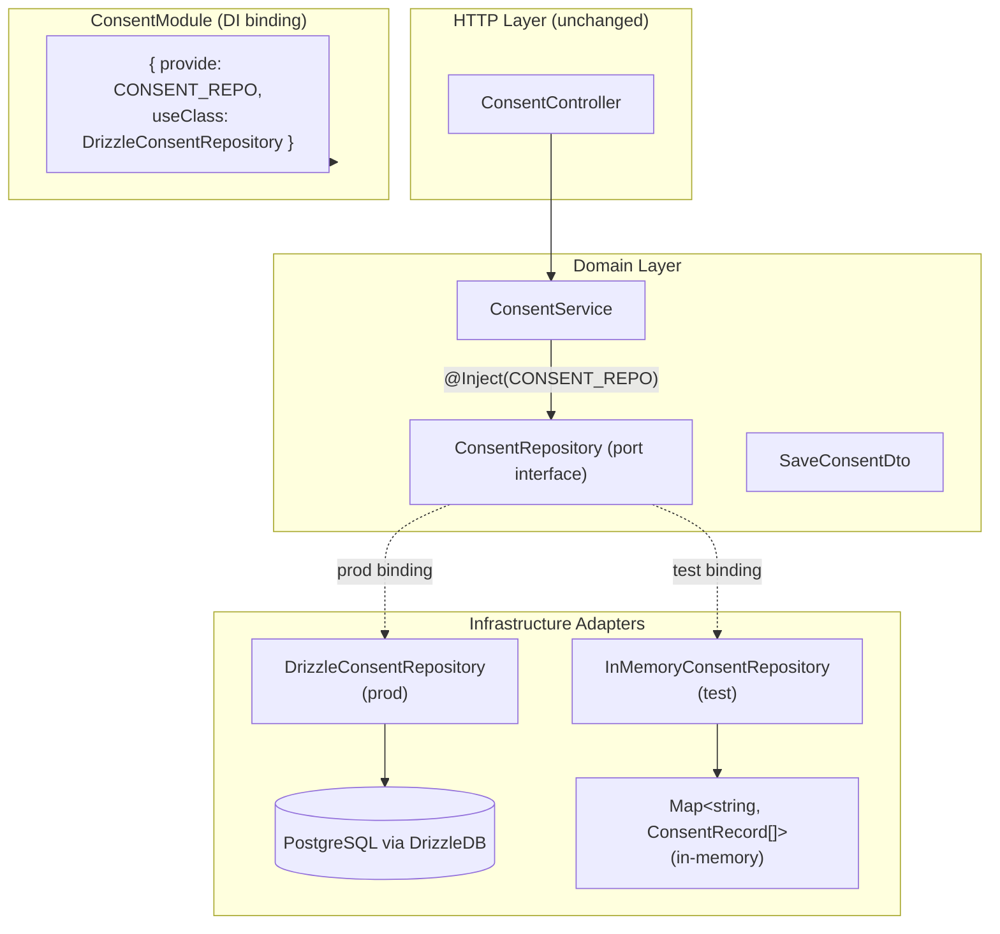
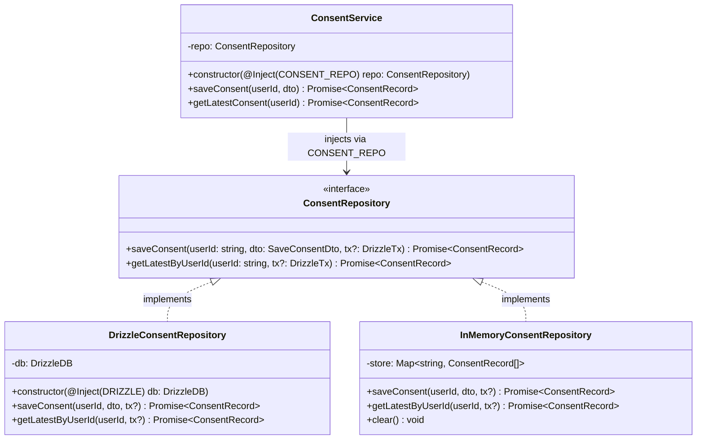
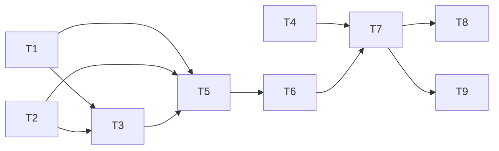

## Summary

Introduce the repository pattern foundation for the API layer using the Consent module as the reference exemplar: define a `ConsentRepository` port interface, move Drizzle queries into a `DrizzleConsentRepository` adapter, provide an `InMemoryConsentRepository` for unit testing, and document both patterns in `backend-patterns.mdx` and `testing.mdx`.

This is Slice 1 of issue #501. Zero breaking changes to existing API contracts or controllers.

---

## Architecture

### Data Flow



### Class Diagram: Port and Adapters



### File x Function Map

| File | Functions / Members | Role |
|------|---------------------|------|
| `consent/consent.repository.ts` | `ConsentRepository` interface, `CONSENT_REPO` symbol | Port definition |
| `consent/repositories/drizzleConsent.repository.ts` | `DrizzleConsentRepository.saveConsent()`, `.getLatestByUserId()`, `toConsentRecord()` (moved from service) | Drizzle adapter |
| `consent/repositories/inMemoryConsent.repository.ts` | `InMemoryConsentRepository.saveConsent()`, `.getLatestByUserId()`, `.clear()` | Test adapter |
| `consent/consent.service.ts` | `ConsentService` (inject `CONSENT_REPO`), `.saveConsent()`, `.getLatestConsent()` | Domain service (queries removed) |
| `consent/consent.module.ts` | `ConsentModule` providers with `CONSENT_REPO` binding | Module registration |
| `consent/consent.service.test.ts` | NestJS test module with `InMemoryConsentRepository` | Unit tests (rewritten) |
| `docs/standards/backend-patterns.mdx` | New §1.2 "Repository Pattern" section | Pattern documentation |
| `docs/standards/testing.mdx` | New "Service Testing — In-Memory Repository" subsection | Test documentation |

---

## Agents

| Agent | Tasks | Responsibility |
|-------|-------|----------------|
| backend-dev | T1–T6 | All production code: token, interface, adapters, service refactor, module update |
| tester | T7 | Rewrite `consent.service.test.ts` using `InMemoryConsentRepository` in NestJS test module |
| doc-writer | T8–T9 | Update `backend-patterns.mdx` and `testing.mdx` with new patterns |

---

## Consistency Report

| Spec success criterion | Task(s) |
|------------------------|---------|
| ConsentService injects `CONSENT_REPO` port token, not `DRIZZLE` | T1, T5 |
| `ConsentRepository` interface matches actual service queries | T2 |
| `DrizzleConsentRepository` implements port with query logic preserved | T3 |
| `InMemoryConsentRepository` registered in NestJS test module, used by unit tests | T4, T7 |
| Transaction support: methods accept `tx?: DrizzleTx` | T2, T3, T4 |
| Module binding uses `{ provide: CONSENT_REPO, useClass: DrizzleConsentRepository }` | T6 |
| `backend-patterns.mdx` documents port interface, Drizzle adapter, module binding | T8 |
| Zero test regressions | Verified in T7 |

---

## Micro-Tasks

---

### T1 — Define `CONSENT_REPO` injection token

**Phase:** GREEN · **Agent:** backend-dev · **Difficulty:** 1 · **SC:** Token exists, service can inject it

**File:** `apps/api/src/consent/consent.repository.ts` (new)

**Description:** Create the `CONSENT_REPO` Symbol token constant and export it from the repository file alongside the interface (defined in T2).

**Code skeleton:**

```typescript
// apps/api/src/consent/consent.repository.ts
import type { ConsentRecord } from '@repo/types'
import type { DrizzleTx } from '../database/drizzle.provider.js'
import type { SaveConsentDto } from './consent.service.js'

export const CONSENT_REPO = Symbol('CONSENT_REPO')

export interface ConsentRepository {
  saveConsent(userId: string, dto: SaveConsentDto, tx?: DrizzleTx): Promise<ConsentRecord>
  getLatestByUserId(userId: string, tx?: DrizzleTx): Promise<ConsentRecord>
}
```

**Verify:** `bun run typecheck --filter=@repo/api 2>&1 | tail -5`

**Expected output:** Zero type errors.

---

### T2 — Define `ConsentRepository` port interface [P]

**Phase:** RED · **Agent:** backend-dev · **Difficulty:** 2 · **SC:** Interface matches actual service query patterns with `tx?` support

**File:** `apps/api/src/consent/consent.repository.ts` (same file as T1 — complete the interface begun in T1)

**Description:** The interface is authored in T1. This task documents the design decision: method names mirror the existing service methods (`saveConsent` / `getLatestByUserId`), not generic CRUD names. Both methods accept an optional `tx?: DrizzleTx` for transaction pass-through. No speculative methods added.

**Port design rationale:**
- `saveConsent` matches `ConsentService.saveConsent()` signature; append-only pattern preserved
- `getLatestByUserId` replaces the internal query in `getLatestConsent()`, renamed to reflect what the port returns (data by userId), not what the caller intends
- No `upsert`, no `findAll` — only what the service actually calls
- `DrizzleTx` imported as a type from `drizzle.provider.ts` (already exported there)
- `SaveConsentDto` stays in `consent.service.ts` and is imported by the repository file to avoid duplication

**Verify:** Reviewing `consent.service.ts` line 9–15 confirms the DTO shape and line 33 / 53 confirms the two method call signatures this interface must satisfy.

**Expected output:** Interface compiles; no additional type errors introduced.

---

### T3 — Create `DrizzleConsentRepository` adapter

**Phase:** GREEN · **Agent:** backend-dev · **Difficulty:** 2 · **SC:** Drizzle adapter implements port with existing query logic preserved

**File:** `apps/api/src/consent/repositories/drizzleConsent.repository.ts` (new)

**Description:** Move the Drizzle query logic from `ConsentService` into this adapter. Move the private `toConsentRecord()` helper into this file. Inject `DRIZZLE` token (this is the one and only legitimate `@Inject(DRIZZLE)` in the consent module going forward). The adapter must use `tx ?? this.db` as the query target to support optional transaction pass-through.

**Code skeleton:**

```typescript
// apps/api/src/consent/repositories/drizzleConsent.repository.ts
import { Inject, Injectable } from '@nestjs/common'
import type { ConsentRecord } from '@repo/types'
import { desc, eq } from 'drizzle-orm'
import { DRIZZLE, type DrizzleDB, type DrizzleTx } from '../../database/drizzle.provider.js'
import { consentRecords } from '../../database/schema/consent.schema.js'
import { ConsentInsertFailedException } from '../exceptions/consentInsertFailed.exception.js'
import { ConsentNotFoundException } from '../exceptions/consentNotFound.exception.js'
import type { ConsentRepository } from '../consent.repository.js'
import type { SaveConsentDto } from '../consent.service.js'

function toConsentRecord(row: typeof consentRecords.$inferSelect): ConsentRecord {
  return {
    id: row.id,
    userId: row.userId,
    categories: row.categories as ConsentRecord['categories'],
    policyVersion: row.policyVersion,
    action: row.action as ConsentRecord['action'],
    createdAt: row.createdAt.toISOString(),
    updatedAt: row.updatedAt.toISOString(),
  }
}

@Injectable()
export class DrizzleConsentRepository implements ConsentRepository {
  constructor(@Inject(DRIZZLE) private readonly db: DrizzleDB) {}

  async saveConsent(userId: string, dto: SaveConsentDto, tx?: DrizzleTx): Promise<ConsentRecord> {
    const qb = tx ?? this.db
    const rows = await qb
      .insert(consentRecords)
      .values({ userId, ...dto, ipAddress: dto.ipAddress ?? null, userAgent: dto.userAgent ?? null })
      .returning()
    const row = rows[0]
    if (!row) throw new ConsentInsertFailedException(userId)
    return toConsentRecord(row)
  }

  async getLatestByUserId(userId: string, tx?: DrizzleTx): Promise<ConsentRecord> {
    const qb = tx ?? this.db
    const [row] = await qb
      .select()
      .from(consentRecords)
      .where(eq(consentRecords.userId, userId))
      .orderBy(desc(consentRecords.createdAt))
      .limit(1)
    if (!row) throw new ConsentNotFoundException(userId)
    return toConsentRecord(row)
  }
}
```

**Verify:** `bun run typecheck --filter=@repo/api 2>&1 | tail -5`

**Expected output:** Zero type errors. `DrizzleConsentRepository` satisfies `ConsentRepository` interface.

---

### T4 — Create `InMemoryConsentRepository` for testing [P]

**Phase:** GREEN · **Agent:** backend-dev · **Difficulty:** 2 · **SC:** In-memory adapter implements port; `clear()` for test isolation

**File:** `apps/api/src/consent/repositories/inMemoryConsent.repository.ts` (new)

**Description:** Implement `ConsentRepository` using a `Map<string, ConsentRecord[]>` keyed by `userId`. `saveConsent` appends to the user's array (mirrors the append-only DB pattern). `getLatestByUserId` returns the last inserted record or throws `ConsentNotFoundException`. Provide a `clear()` method for test isolation between `it` blocks. The `tx` parameter is accepted but ignored (no transactions in memory). Generate IDs with `crypto.randomUUID()`.

**Code skeleton:**

```typescript
// apps/api/src/consent/repositories/inMemoryConsent.repository.ts
import type { ConsentRecord } from '@repo/types'
import type { DrizzleTx } from '../../database/drizzle.provider.js'
import { ConsentInsertFailedException } from '../exceptions/consentInsertFailed.exception.js'
import { ConsentNotFoundException } from '../exceptions/consentNotFound.exception.js'
import type { ConsentRepository } from '../consent.repository.js'
import type { SaveConsentDto } from '../consent.service.js'

export class InMemoryConsentRepository implements ConsentRepository {
  private readonly store = new Map<string, ConsentRecord[]>()

  async saveConsent(userId: string, dto: SaveConsentDto, _tx?: DrizzleTx): Promise<ConsentRecord> {
    const now = new Date().toISOString()
    const record: ConsentRecord = {
      id: crypto.randomUUID(),
      userId,
      categories: dto.categories,
      policyVersion: dto.policyVersion,
      action: dto.action,
      createdAt: now,
      updatedAt: now,
    }
    const existing = this.store.get(userId) ?? []
    this.store.set(userId, [...existing, record])
    return record
  }

  async getLatestByUserId(userId: string, _tx?: DrizzleTx): Promise<ConsentRecord> {
    const records = this.store.get(userId) ?? []
    const latest = records.at(-1)
    if (!latest) throw new ConsentNotFoundException(userId)
    return latest
  }

  clear(): void {
    this.store.clear()
  }
}
```

**Note:** `InMemoryConsentRepository` is not decorated with `@Injectable()` — it is only ever instantiated directly in test modules via `useClass`.

**Verify:** `bun run typecheck --filter=@repo/api 2>&1 | tail -5`

**Expected output:** Zero type errors. `InMemoryConsentRepository` satisfies `ConsentRepository` interface.

---

### T5 — Refactor `ConsentService` to inject port token

**Phase:** REFACTOR · **Agent:** backend-dev · **Difficulty:** 2 · **SC:** Service injects `CONSENT_REPO`, no direct `DRIZZLE` usage

**File:** `apps/api/src/consent/consent.service.ts`

**Description:** Replace `@Inject(DRIZZLE) private readonly db: DrizzleDB` with `@Inject(CONSENT_REPO) private readonly repo: ConsentRepository`. Remove all Drizzle imports (`drizzle-orm`, `DRIZZLE`, `DrizzleDB`, `consentRecords`, `toConsentRecord`). Update `saveConsent` and `getLatestConsent` to delegate to `this.repo`. The `SaveConsentDto` export stays in this file — adapters import it from here.

**Code skeleton (after refactor):**

```typescript
// apps/api/src/consent/consent.service.ts
import { Inject, Injectable } from '@nestjs/common'
import type { ConsentRecord } from '@repo/types'
import { CONSENT_REPO, type ConsentRepository } from './consent.repository.js'

export interface SaveConsentDto {
  categories: { necessary: true; analytics: boolean; marketing: boolean }
  policyVersion: string
  action: 'accepted' | 'rejected' | 'customized'
  ipAddress?: string | null
  userAgent?: string | null
}

@Injectable()
export class ConsentService {
  constructor(@Inject(CONSENT_REPO) private readonly repo: ConsentRepository) {}

  async saveConsent(userId: string, dto: SaveConsentDto): Promise<ConsentRecord> {
    return this.repo.saveConsent(userId, dto)
  }

  async getLatestConsent(userId: string): Promise<ConsentRecord> {
    return this.repo.getLatestByUserId(userId)
  }
}
```

**Verify:** `bun run typecheck --filter=@repo/api 2>&1 | tail -5`

**Expected output:** Zero type errors. `ConsentService` no longer imports from `drizzle-orm` or `database/`.

---

### T6 — Update `ConsentModule` bindings

**Phase:** REFACTOR · **Agent:** backend-dev · **Difficulty:** 1 · **SC:** Module binding uses `{ provide: CONSENT_REPO, useClass: DrizzleConsentRepository }`

**File:** `apps/api/src/consent/consent.module.ts`

**Description:** Register `DrizzleConsentRepository` in providers, bound to `CONSENT_REPO` token. The existing `ConsentService`, `ConsentExceptionFilter`, and `AuthModule` import are unchanged. Export `ConsentService` unchanged (controller and other modules consume the service, not the repo).

**Code skeleton (after update):**

```typescript
// apps/api/src/consent/consent.module.ts
import { Module } from '@nestjs/common'
import { APP_FILTER } from '@nestjs/core'
import { AuthModule } from '../auth/auth.module.js'
import { CONSENT_REPO } from './consent.repository.js'
import { ConsentController } from './consent.controller.js'
import { ConsentService } from './consent.service.js'
import { DrizzleConsentRepository } from './repositories/drizzleConsent.repository.js'
import { ConsentExceptionFilter } from './filters/consentException.filter.js'

@Module({
  imports: [AuthModule],
  controllers: [ConsentController],
  providers: [
    ConsentService,
    { provide: CONSENT_REPO, useClass: DrizzleConsentRepository },
    { provide: APP_FILTER, useClass: ConsentExceptionFilter },
  ],
  exports: [ConsentService],
})
export class ConsentModule {}
```

**Verify:** `bun run typecheck --filter=@repo/api 2>&1 | tail -5`

**Expected output:** Zero type errors. `ConsentModule` compiles with the new provider binding.

---

**GREEN GATE (T1–T6):** `bun run typecheck --filter=@repo/api && echo TYPECHECK_PASS`

---

### T7 — Rewrite `consent.service.test.ts` with `InMemoryConsentRepository` in NestJS test module

**Phase:** RED → GREEN · **Agent:** tester · **Difficulty:** 3 · **SC:** Unit tests pass using in-memory adapter; NestJS DI wiring verified

**File:** `apps/api/src/consent/consent.service.test.ts`

**Description:** Replace the `createMockDb()` pattern with a NestJS `Test.createTestingModule()` that provides `InMemoryConsentRepository` at the `CONSENT_REPO` token. Per the spec: "Slice 1 creates a full `InMemoryConsentRepository` as a reference implementation." Tests verify the same behaviors as the current tests (happy path insert, ConsentInsertFailedException, happy path select, ConsentNotFoundException) but now exercise the real DI wiring. Use `afterEach(() => repo.clear())` for test isolation.

**Code skeleton:**

```typescript
// apps/api/src/consent/consent.service.test.ts
import { Test, type TestingModule } from '@nestjs/testing'
import { afterEach, beforeEach, describe, expect, it } from 'vitest'
import { CONSENT_REPO } from './consent.repository.js'
import { ConsentService, type SaveConsentDto } from './consent.service.js'
import { ConsentInsertFailedException } from './exceptions/consentInsertFailed.exception.js'
import { ConsentNotFoundException } from './exceptions/consentNotFound.exception.js'
import { InMemoryConsentRepository } from './repositories/inMemoryConsent.repository.js'

describe('ConsentService (with InMemoryConsentRepository)', () => {
  let module: TestingModule
  let service: ConsentService
  let repo: InMemoryConsentRepository

  beforeEach(async () => {
    repo = new InMemoryConsentRepository()
    module = await Test.createTestingModule({
      providers: [
        ConsentService,
        { provide: CONSENT_REPO, useValue: repo },
      ],
    }).compile()
    service = module.get(ConsentService)
  })

  afterEach(async () => {
    repo.clear()
    await module.close()
  })

  const validDto: SaveConsentDto = {
    categories: { necessary: true, analytics: true, marketing: false },
    policyVersion: '2026-02-v1',
    action: 'customized',
    ipAddress: '192.168.1.1',
    userAgent: 'Mozilla/5.0',
  }

  describe('saveConsent', () => {
    it('should persist and return a mapped ConsentRecord', async () => {
      // Arrange + Act
      const result = await service.saveConsent('user-1', validDto)

      // Assert
      expect(result.userId).toBe('user-1')
      expect(result.categories).toEqual(validDto.categories)
      expect(result.policyVersion).toBe('2026-02-v1')
      expect(result.action).toBe('customized')
      expect(result.id).toBeTruthy()
      expect(result.createdAt).toBeTruthy()
    })

    it('should store ipAddress and userAgent fields', async () => {
      const result = await service.saveConsent('user-1', validDto)
      // InMemoryConsentRepository does not expose ipAddress/userAgent
      // (ConsentRecord type does not include them) — just verify no throw
      expect(result).toBeDefined()
    })
  })

  describe('getLatestConsent', () => {
    it('should return the most recent record after multiple saves', async () => {
      // Arrange
      await service.saveConsent('user-1', { ...validDto, policyVersion: '2026-01-v1' })
      await service.saveConsent('user-1', { ...validDto, policyVersion: '2026-02-v1' })

      // Act
      const result = await service.getLatestConsent('user-1')

      // Assert
      expect(result.policyVersion).toBe('2026-02-v1')
    })

    it('should throw ConsentNotFoundException when no record exists', async () => {
      await expect(service.getLatestConsent('nonexistent-user'))
        .rejects.toThrow(ConsentNotFoundException)
    })
  })
})
```

**Note on ConsentInsertFailedException:** The in-memory adapter cannot trigger `ConsentInsertFailedException` via normal data flow (it always returns a record). That exception is an infrastructure concern of the Drizzle adapter. The existing Drizzle-based unit test coverage for the insert-failure path is preserved in `drizzleConsent.repository.test.ts` (optional follow-up; not in scope for this issue).

**Verify:** `bun run test --filter=@repo/api -- --reporter=verbose consent.service`

**Expected output:** All `ConsentService` tests pass. Zero regressions on `consent.controller.test.ts`.

---

**FULL TEST GATE:** `bun run test --filter=@repo/api && echo TEST_PASS`

---

### T8 — Update `backend-patterns.mdx` with repository pattern section [P]

**Phase:** REFACTOR · **Agent:** doc-writer · **Difficulty:** 2 · **SC:** Docs cover port interface, Drizzle adapter, module binding

**File:** `docs/standards/backend-patterns.mdx`

**Description:** Add a new **§1.2.1 Repository Pattern** subsection inside the existing "1.2 Design Patterns" section (before the existing "Codebase Patterns" table). The section must include:

1. One-paragraph rationale (DIP application: services inject port tokens, not `DRIZZLE`)
2. Complete `ConsentRepository` port interface code block (from T1/T2)
3. Key rules for port design (match actual queries, no speculative methods, `tx?: DrizzleTx` on all methods)
4. `DrizzleConsentRepository` adapter skeleton (from T3)
5. Module binding one-liner: `{ provide: CONSENT_REPO, useClass: DrizzleConsentRepository }`
6. File naming convention: `*.repository.ts` for ports, `repositories/drizzle*.repository.ts` for adapters, `repositories/inMemory*.repository.ts` for test adapters
7. Note that `@Inject(DRIZZLE)` belongs only in Drizzle adapter files (not services)
8. Update §1.6.5 DIP section: remove the "Gap" paragraph that says repository abstraction is missing, replace with a forward reference to §1.2.1

**Also update §1.7 AI Quick Reference** to add:
- `Repository pattern: inject CONSENT_REPO port, not DRIZZLE, in domain services`
- `Drizzle adapters live in repositories/ sub-directory — only legitimate DRIZZLE injection site`

**Verify:** `bun run mdx:check 2>&1 | tail -5`

**Expected output:** Zero MDX errors.

---

### T9 — Update `testing.mdx` with in-memory repository testing pattern [P]

**Phase:** REFACTOR · **Agent:** doc-writer · **Difficulty:** 2 · **SC:** Docs cover NestJS test module with in-memory repo; `clear()` pattern documented

**File:** `docs/standards/testing.mdx`

**Description:** Add a new **"Service Testing — Repository Port (In-Memory Adapter)"** subsection inside the "Backend Testing Patterns" section, after the existing "Service Testing — Drizzle ORM Mock" subsection. The section must include:

1. When to use this pattern vs the Drizzle mock: use in-memory when the service is refactored to inject a port token; use Drizzle mock only for adapter-level tests
2. The `Test.createTestingModule()` skeleton from T7
3. `{ provide: CONSENT_REPO, useValue: repo }` binding pattern
4. `afterEach(() => repo.clear())` for test isolation explanation
5. Note that `InMemoryConsentRepository` must not be decorated with `@Injectable()` — only `useValue` / `useClass` in test modules
6. A brief note on testing the Drizzle adapter in isolation (optional follow-up; not required for service tests)

**Also update the "Testing Layer Guidance" table:** add a row:

| NestJS service with repository port (in-memory adapter) | Integration | Vitest + `Test.createTestingModule()` |

**Verify:** `bun run mdx:check 2>&1 | tail -5`

**Expected output:** Zero MDX errors.

---

## Execution Order

Tasks are grouped by dependency. Tasks within a group marked `[P]` can run in parallel.

```
Group A (parallel, no deps):
  T1 + T2 — Define CONSENT_REPO token + ConsentRepository interface
  T4      — Create InMemoryConsentRepository

Group B (depends on T1+T2):
  T3      — Create DrizzleConsentRepository (implements T2's interface)

Group C (depends on T2+T3):
  T5      — Refactor ConsentService (injects T2's port)

Group D (depends on T5):
  T6      — Update ConsentModule (wires T3 to T2)

Group E (depends on T4+T6 — NestJS module fully wired):
  T7      — Rewrite consent.service.test.ts

Group F (parallel, depends on T6 being merged — docs need final code):
  T8      — backend-patterns.mdx
  T9      — testing.mdx
```



---

## Risk Register

| Risk | Likelihood | Mitigation |
|------|-----------|------------|
| `SaveConsentDto` import cycle (service ↔ repository) | Low | Keep `SaveConsentDto` in `consent.service.ts`; repository file imports it as a type |
| `toConsentRecord` divergence between adapter and old service | Low | Move the function verbatim; the function is private and pure — no callers outside service |
| `consentRecords.$inferSelect` type mismatch with `ConsentRecord` from `@repo/types` | Low | Already handled in existing service via cast; adapter preserves the same cast |
| Existing `consent.service.test.ts` assertions on Drizzle call chains become orphaned | Certain | Entire test file is rewritten in T7; old assertions are intentionally replaced |
| `InMemoryConsentRepository` ignores `ipAddress`/`userAgent` (not in `ConsentRecord`) | Certain, non-issue | `ConsentRecord` type does not expose these fields; adapter stores what the type requires |

---

## Verification Checklist

Run in order after all tasks complete:

```bash
# 1. Typecheck
bun run typecheck --filter=@repo/api

# 2. Unit tests
bun run test --filter=@repo/api -- --reporter=verbose

# 3. MDX check
bun run mdx:check

# 4. Full lint
bun run lint

# 5. Confirm ConsentService no longer imports DRIZZLE
grep -r "DRIZZLE" apps/api/src/consent/consent.service.ts
# Expected: no output

# 6. Confirm DrizzleConsentRepository is the only DRIZZLE injector in consent/
grep -r "@Inject(DRIZZLE)" apps/api/src/consent/
# Expected: only apps/api/src/consent/repositories/drizzleConsent.repository.ts
```
