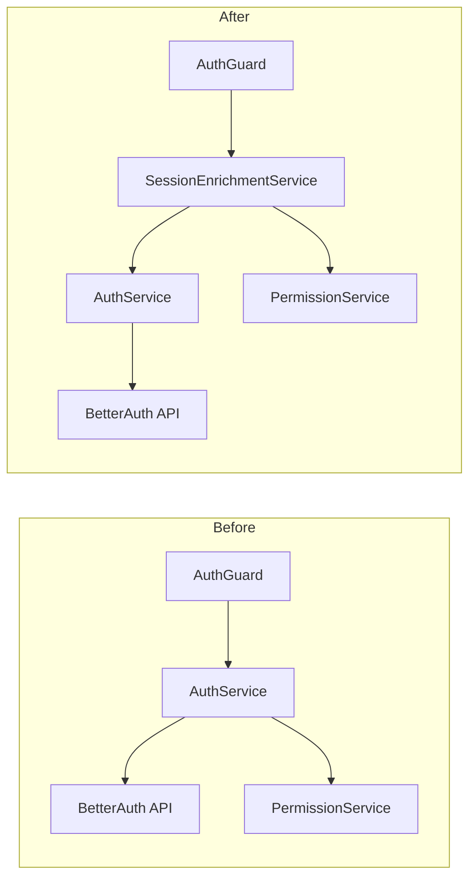
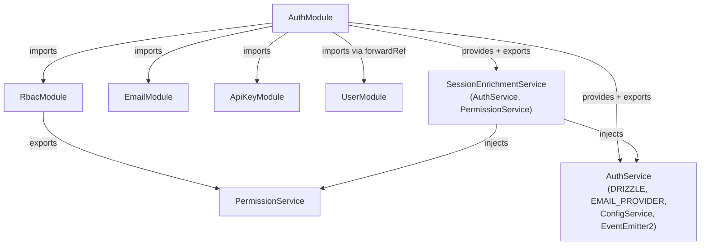
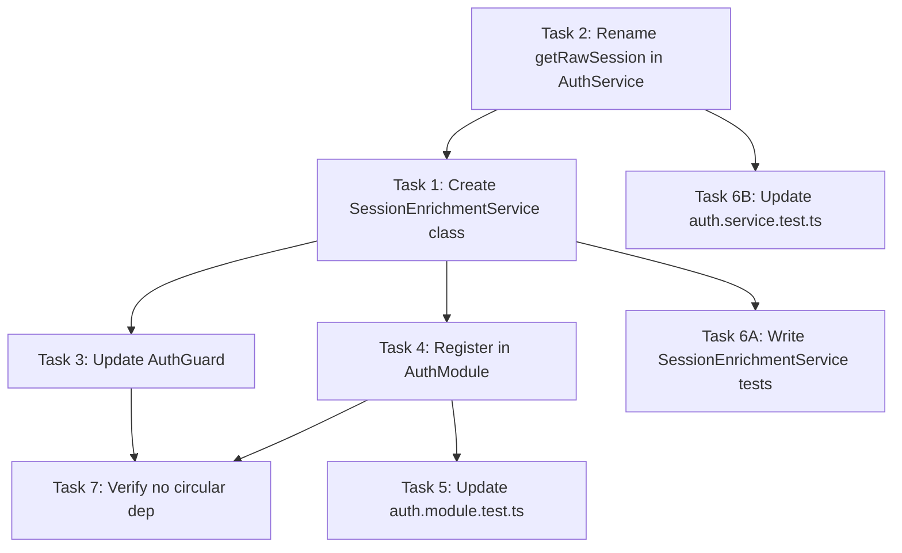

# Plan: Extract SessionEnrichmentService from AuthService

## Summary

Extract the `getSession()` enrichment logic (session fetch + permission resolution) from `AuthService`
into a new `SessionEnrichmentService`, reducing `AuthService` from 5 to 4 dependencies and giving
`AuthGuard` a focused collaborator for session enrichment. No circular dependencies are introduced.

## Architecture

### Data Flow: Before and After



### Module Dependency Graph (After)



Note: `RbacModule` does not import `AuthModule`. The direction of the existing import is
`AuthModule → RbacModule`, which is unchanged. No new circular dependency is introduced.

### File x Function Map

| File | Functions moved / changed | Direction |
|------|---------------------------|-----------|
| `apps/api/src/auth/auth.service.ts` | `getSession()` — removed | Source |
| `apps/api/src/auth/sessionEnrichment.service.ts` | `getEnrichedSession()` — created (contains extracted logic) | Destination |
| `apps/api/src/auth/auth.guard.ts` | `resolveSession()` — swap `authService.getSession()` call to `sessionEnrichmentService.getEnrichedSession()` | Updated |
| `apps/api/src/auth/auth.module.ts` | `providers` + `exports` — add `SessionEnrichmentService` | Updated |
| `apps/api/src/auth/auth.service.test.ts` | Remove `getSession` describe block; remove `mockPermissionService`; remove `PermissionService` constructor param | Updated |
| `apps/api/src/auth/sessionEnrichment.service.test.ts` | New file — unit tests for `SessionEnrichmentService` | Created |
| `apps/api/src/auth/auth.module.test.ts` | Assert `SessionEnrichmentService` in providers + exports | Updated |

## Agents

| Agent | Responsibility | Files |
|-------|----------------|-------|
| backend-dev | Tasks 1–5, 7 | `auth.service.ts`, `sessionEnrichment.service.ts`, `auth.guard.ts`, `auth.module.ts`, `auth.module.test.ts` |
| tester | Task 6 | `sessionEnrichment.service.test.ts`, `auth.service.test.ts` (update) |

---

## Micro-Tasks

### Task 1 — Create `SessionEnrichmentService` class (GREEN)

**Description:** Create `apps/api/src/auth/sessionEnrichment.service.ts` with the extracted
`getEnrichedSession()` method and its two dependencies.

**File:** `apps/api/src/auth/sessionEnrichment.service.ts`

**Expected shape skeleton:**

```typescript
import { Injectable } from '@nestjs/common'
import type { FastifyRequest } from 'fastify'
import { PermissionService } from '../rbac/permission.service.js'
import { AuthService } from './auth.service.js'

@Injectable()
export class SessionEnrichmentService {
  constructor(
    private readonly authService: AuthService,
    private readonly permissionService: PermissionService,
  ) {}

  async getEnrichedSession(request: FastifyRequest) {
    const session = await this.authService.getRawSession(request)
    if (!session) return session

    const orgId = session.session?.activeOrganizationId
    let permissions: string[] = []

    if (orgId && session.user?.id) {
      permissions = await this.permissionService.getPermissions(session.user.id, orgId)
    }

    return { ...session, permissions }
  }
}
```

**Verify command:** `cd /home/mickael/projects/roxabi_boilerplate && bun run typecheck --filter=@repo/api`

**Expected output:** Zero TypeScript errors

**Agent:** backend-dev

**Spec trace:** "SessionEnrichmentService handles session fetch + permission enrichment (2 deps: AuthService, PermissionService)"

**Phase:** GREEN

**Difficulty:** 2/5

---

### Task 2 — Move `getSession()` logic from `AuthService` to `SessionEnrichmentService` [P]

**Description:** In `auth.service.ts`, rename `getSession()` to `getRawSession()` (returns raw
BetterAuth session without permission enrichment). Remove the `PermissionService` dependency
entirely from `AuthService`. The enrichment logic moves to Task 1's new service.

**File:** `apps/api/src/auth/auth.service.ts`

**Expected shape skeleton (constructor after change):**

```typescript
constructor(
  @Inject(DRIZZLE) db: DrizzleDB,
  @Inject(EMAIL_PROVIDER) emailProvider: EmailProvider,
  config: ConfigService,
  private readonly eventEmitter: EventEmitter2,
  // PermissionService removed
) { ... }

async getRawSession(request: FastifyRequest) {
  const headers = toFetchHeaders(request)
  return this.auth.api.getSession({ headers })
}
// getSession() with enrichment is removed
```

**Verify command:** `cd /home/mickael/projects/roxabi_boilerplate && bun run typecheck --filter=@repo/api`

**Expected output:** Zero TypeScript errors

**Agent:** backend-dev

**Spec trace:** "AuthService handles only Better Auth initialization and domain events (no session enrichment)"

**Phase:** REFACTOR

**[P]** — parallel-safe with Task 1 (different files)

**Difficulty:** 2/5

---

### Task 3 — Update `AuthGuard` to inject `SessionEnrichmentService`

**Description:** In `auth.guard.ts`, replace the `authService.getSession(request)` call in
`resolveSession()` with `sessionEnrichmentService.getEnrichedSession(request)`. Add
`SessionEnrichmentService` to the constructor; `AuthService` is no longer needed by the guard
for session resolution (it may remain if it provides other things the guard uses — but from
the current code it does not, so remove it).

**File:** `apps/api/src/auth/auth.guard.ts`

**Expected constructor shape:**

```typescript
constructor(
  private readonly sessionEnrichmentService: SessionEnrichmentService,
  private readonly reflector: Reflector,
  @Inject(forwardRef(() => UserService))
  private readonly userService: UserService,
  private readonly apiKeyService: ApiKeyService,
  private readonly permissionService: PermissionService,
) {}
```

**Expected `resolveSession` change:**

```typescript
// before
const raw = await this.authService.getSession(request)
// after
const raw = await this.sessionEnrichmentService.getEnrichedSession(request)
```

**Verify command:** `cd /home/mickael/projects/roxabi_boilerplate && bun run typecheck --filter=@repo/api`

**Expected output:** Zero TypeScript errors

**Agent:** backend-dev

**Spec trace:** "AuthGuard delegates to SessionEnrichmentService"

**Phase:** REFACTOR

**Difficulty:** 2/5

---

### Task 4 — Register `SessionEnrichmentService` in `AuthModule`

**Description:** Add `SessionEnrichmentService` to both `providers` and `exports` in `auth.module.ts`.

**File:** `apps/api/src/auth/auth.module.ts`

**Expected shape:**

```typescript
@Module({
  imports: [EmailModule, RbacModule, forwardRef(() => UserModule), ApiKeyModule],
  controllers: [AuthController],
  providers: [AuthService, SessionEnrichmentService, { provide: APP_GUARD, useClass: AuthGuard }],
  exports: [AuthService, SessionEnrichmentService],
})
export class AuthModule {}
```

**Verify command:** `cd /home/mickael/projects/roxabi_boilerplate && bun run typecheck --filter=@repo/api`

**Expected output:** Zero TypeScript errors

**Agent:** backend-dev

**Spec trace:** "AuthModule registration: declare + export SessionEnrichmentService in AuthModule"

**Phase:** GREEN

**Difficulty:** 1/5

---

### Task 5 — Update `auth.module.test.ts` to assert `SessionEnrichmentService` [P]

**Description:** Update the module metadata test to assert that `SessionEnrichmentService` is in
`providers` and `exports`. Also update the `providers` length assertion if present, since the
count increases by 1.

**File:** `apps/api/src/auth/auth.module.test.ts`

**Expected additions:**

```typescript
it('should provide SessionEnrichmentService', () => {
  expect(providers).toContainEqual(SessionEnrichmentService)
})

it('should export SessionEnrichmentService', () => {
  expect(exports_).toContain(SessionEnrichmentService)
})
```

**Verify command:** `cd /home/mickael/projects/roxabi_boilerplate/apps/api && bun run test -- --run auth.module`

**Expected output:** All tests pass (5 tests: existing 4 + 1 new provider + 1 new export check, or
the adjusted count test passes)

**Agent:** backend-dev

**Spec trace:** "AuthModule registration"

**Phase:** GREEN

**[P]** — parallel-safe with Task 4 (module implementation)

**Difficulty:** 1/5

---

### Task 6 — Write unit tests for `SessionEnrichmentService` and update `auth.service.test.ts`

**Description:**

Part A — Create `apps/api/src/auth/sessionEnrichment.service.test.ts` with unit tests covering:
- returns null when BetterAuth returns no session
- returns session with empty permissions when no `activeOrganizationId`
- calls `permissionService.getPermissions()` with `(userId, orgId)` when both are present
- returns session enriched with permissions
- returns empty permissions when `activeOrganizationId` exists but `user.id` is missing

Part B — Update `apps/api/src/auth/auth.service.test.ts`:
- Remove the `getSession` describe block (4 tests)
- Remove `mockPermissionService` and its import
- Update `createService` to remove the `mockPermissionService` argument (5th constructor arg)
- The constructor now accepts 4 args: `db`, `emailProvider`, `config`, `eventEmitter`
- Rename `getSession` test references to cover `getRawSession` if a raw-session test is kept
  (optional — not required since no enrichment logic remains in `AuthService`)

**File (new):** `apps/api/src/auth/sessionEnrichment.service.test.ts`

**Expected skeleton:**

```typescript
import { beforeEach, describe, expect, it, vi } from 'vitest'
import type { AuthService } from './auth.service.js'
import type { PermissionService } from '../rbac/permission.service.js'
import { SessionEnrichmentService } from './sessionEnrichment.service.js'

const mockGetRawSession = vi.fn()
const mockGetPermissions = vi.fn()

const mockAuthService = {
  getRawSession: mockGetRawSession,
} as unknown as AuthService

const mockPermissionService = {
  getPermissions: mockGetPermissions,
} as unknown as PermissionService

function createService() {
  return new SessionEnrichmentService(mockAuthService, mockPermissionService)
}

describe('SessionEnrichmentService', () => {
  beforeEach(() => {
    mockGetRawSession.mockReset()
    mockGetPermissions.mockReset().mockResolvedValue([])
  })

  it('should return null when no session exists', async () => { ... })
  it('should return session with empty permissions when no activeOrganizationId', async () => { ... })
  it('should enrich session with permissions when activeOrganizationId and user.id exist', async () => { ... })
  it('should return empty permissions when activeOrganizationId exists but user.id is missing', async () => { ... })
})
```

**Verify command:** `cd /home/mickael/projects/roxabi_boilerplate/apps/api && bun run test -- --run sessionEnrichment.service`

**Expected output:** All 4 tests pass

**Agent:** tester

**Spec trace:** "SessionEnrichmentService unit test with stub AuthService passes"

**Phase:** RED then GREEN

**Difficulty:** 2/5

---

### Task 7 — Verify no circular dependency between `AuthModule` and `RbacModule`

**Description:** Confirm at runtime that NestJS can bootstrap the application without any
circular dependency warning. The check is: `RbacModule` must not (directly or transitively)
import `AuthModule`. Verify by inspection of module imports, then confirm by running the
integration test or a typecheck pass.

Run:
1. `grep -r "AuthModule" apps/api/src/rbac/` — must return no results
2. `bun run typecheck --filter=@repo/api` — must pass clean

**File:** `apps/api/src/rbac/rbac.module.ts` (read-only verification)

**Verify command:**

```bash
cd /home/mickael/projects/roxabi_boilerplate && grep -r "AuthModule" apps/api/src/rbac/ && echo "FOUND — circular risk" || echo "Clean — no circular dep"
```

**Expected output:** `Clean — no circular dep`

Second check:

```bash
cd /home/mickael/projects/roxabi_boilerplate && bun run typecheck --filter=@repo/api
```

**Expected output:** Zero TypeScript errors

**Agent:** backend-dev

**Spec trace:** "No new circular dependency introduced between AuthModule and RbacModule"

**Phase:** REFACTOR

**[P]** — parallel-safe, read-only verification

**Difficulty:** 1/5

---

## Task Dependency Graph



Tasks 1 and 2 can begin simultaneously (different files). Task 3 depends on both 1 and 2.
Tasks 5 and 6A are unblocked once their respective implementation tasks complete.
Task 7 is a pure verification step and can run last.

## Completion Checklist

- [ ] `SessionEnrichmentService` created with `getEnrichedSession()` in `apps/api/src/auth/sessionEnrichment.service.ts`
- [ ] `AuthService.getSession()` renamed to `getRawSession()` with enrichment logic removed
- [ ] `PermissionService` removed from `AuthService` constructor (4 deps remain)
- [ ] `AuthGuard` injects `SessionEnrichmentService`, calls `getEnrichedSession()`
- [ ] `SessionEnrichmentService` in both `providers` and `exports` of `AuthModule`
- [ ] `auth.module.test.ts` updated to assert new service in providers and exports
- [ ] `sessionEnrichment.service.test.ts` created with 4 passing tests
- [ ] `auth.service.test.ts` updated: `getSession` tests removed, `mockPermissionService` removed
- [ ] `bun run typecheck` passes
- [ ] `bun run test` passes (zero regressions)
- [ ] No `AuthModule` import found in `apps/api/src/rbac/`
