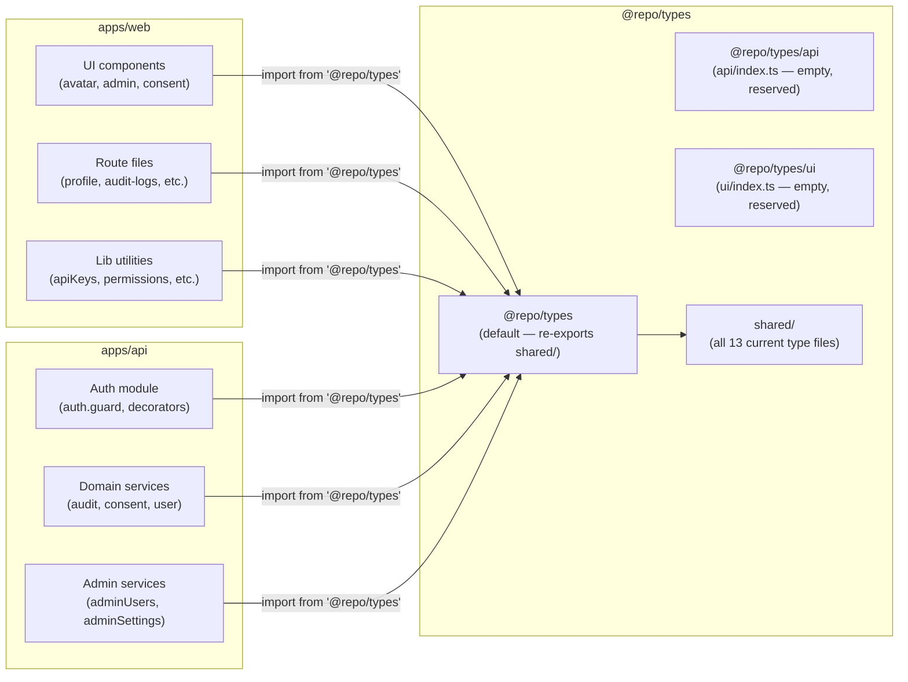
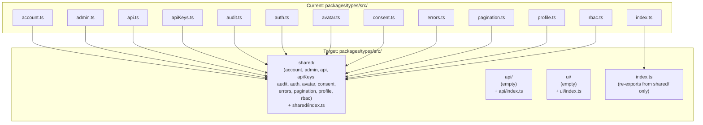
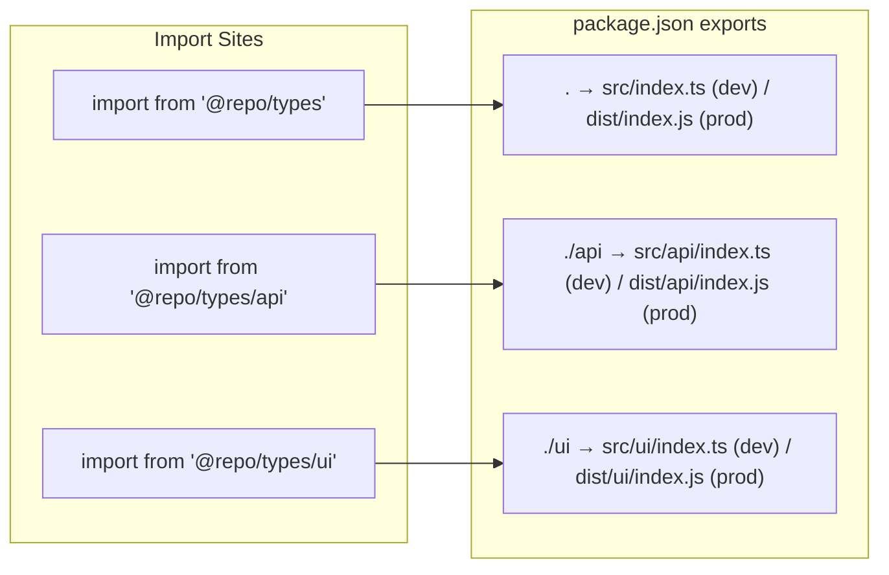

# Plan: Namespace @repo/types into shared/api/ui Sub-paths

## Summary

Restructure `packages/types/src/` into `shared/`, `api/`, and `ui/` sub-directories, add a three-entry package.json exports map (`.`, `./api`, `./ui`), and update every `@repo/types` import site across `apps/web`, `apps/api`, and `apps/docs`. The import-boundary lint rule that enforces the separation is deferred to Slice 6 (#507).

## Key Finding: Classification Diverges from Spec's Examples

The spec lists `AuditAction`/`SENSITIVE_FIELDS` as api-only and `AVATAR_STYLES`/`DICEBEAR_CDN_BASE` as ui-only. **Actual usage contradicts both.** A codebase grep confirms:

| Type/Constant | apps/api usage | apps/web usage | True namespace |
|---|---|---|---|
| `AVATAR_STYLES`, `DICEBEAR_CDN_DOMAIN/BASE` | `user.controller.ts`, `auth.instance.ts` | `profile.lazy.tsx`, `buildDiceBearUrl.ts`, `avatar/constants.ts` | **shared** |
| `AuditAction`, `AuditActorType`, `SENSITIVE_FIELDS`, `AuditLogEntry` | `audit.service.ts`, `admin/utils/redactSensitiveFields.ts`, `admin/utils/logAudit.ts`, `adminUsers.service.ts` | `audit-logs.tsx`, `users.$userId.tsx`, `DiffViewer.tsx` | **shared** |
| `ERROR_CODES` | none found | `apiKeys.test.ts` (via lib) | **shared** (domain contract) |
| `ApiErrorResponse` | none found | `apiError.ts`, `apiError.test.ts`, `apiErrorUtils.ts` | **shared** (HTTP error contract both apps should agree on) |
| `Role`, `User` | `auth.guard.ts`, `auth.types.ts`, `roles.decorator.ts` | various | **shared** |
| `PermissionString`, `Permission`, `OrgRole` | `permissions.decorator.ts` | `routePermissions.ts`, `permissions.ts` | **shared** |
| `ConsentRecord`, `ConsentCookiePayload`, etc. | `consent.service.ts`, `consent.controller.test.ts` | `consentProvider.tsx`, `parse.ts`, `server.ts` | **shared** |
| `OrgOwnershipResolution`, `DeleteAccountPayload`, etc. | `user.service.ts` | `settings/-account-delete.tsx` | **shared** |
| `CursorPaginatedResponse` | `cursorPagination.util.ts` | `useCursorPagination.ts` | **shared** |
| `AdminUser`, `AdminOrganization`, `FeatureFlag`, `SystemSetting`, `SettingsUpdatePayload`, etc. | `adminSettings.controller.ts` (SettingsUpdatePayload) | admin UI pages | **shared** |
| `ApiKey`, `CreateApiKeyRequest`, `CreateApiKeyResponse`, etc. | none found | `apiKeys.ts`, `apiKeys.test.ts` | **shared** (represents the wire contract) |
| `UserProfile`, `UpdateProfilePayload` | none found | `profile.ts`, `profile.test.ts`, `profile.lazy.tsx` | **shared** (represents the wire contract) |

**Conclusion:** All 13 existing type files land in `shared/`. The `api/` and `ui/` sub-directories are created empty (with stub `index.ts` files) to establish the namespace structure for Slice 6's lint rule and future additions.

The spec's illustrative list (`AuditAction` → api, `AVATAR_STYLES` → ui) describes the _intent_ of the sub-path scheme, not the current state. The right moment to move individual symbols is when they become genuinely single-consumer — which requires the lint rule (Slice 6) to be in place first.

## Architecture

### Data Flow: Sub-path Resolution



### File × Function Map: Directory Assignments



### Package Exports Map



## Agents

| Agent | Scope | Files touched |
|---|---|---|
| backend-dev | Package restructure (tasks 1–7), tsup config, verify commands | `packages/types/src/**`, `packages/types/package.json`, `packages/types/tsup.config.ts`, `apps/api/src/**` (import updates) |
| frontend-dev | Update all `@repo/types` imports in `apps/web/src/` | `apps/web/src/**` (44 import sites across ~30 files) |

No doc-writer tasks required — `apps/docs` has zero `@repo/types` imports (confirmed by grep).

## Micro-Tasks

---

### Task 1 — Create shared/ sub-directory and move all type files

**Description:** Create `packages/types/src/shared/` and move all 12 domain type files into it (keep `index.ts` in `src/` root).

**File paths:**
- `packages/types/src/shared/account.ts` (moved from `src/account.ts`)
- `packages/types/src/shared/admin.ts`
- `packages/types/src/shared/api.ts`
- `packages/types/src/shared/apiKeys.ts`
- `packages/types/src/shared/audit.ts`
- `packages/types/src/shared/auth.ts`
- `packages/types/src/shared/avatar.ts`
- `packages/types/src/shared/consent.ts`
- `packages/types/src/shared/errors.ts`
- `packages/types/src/shared/pagination.ts`
- `packages/types/src/shared/profile.ts`
- `packages/types/src/shared/rbac.ts`

**Code snippet (profile.ts after move — note internal cross-import fix):**
```ts
// packages/types/src/shared/profile.ts
import type { AvatarStyle } from './avatar'   // relative within shared/

export type UserProfile = { ... }
export type UpdateProfilePayload = { ... }
```

**Note:** `profile.ts` has `import type { AvatarStyle } from './avatar'` — this relative import stays valid because both files move together into `shared/`. Same for `admin.ts` which has `import('./audit').AuditLogEntry` — must be updated to `import('./audit').AuditLogEntry` (still valid) or refactored to a direct import.

**Verify command:** `ls packages/types/src/shared/`

**Expected output:** 12 `.ts` files listed (no `index.ts` yet).

**Agent:** backend-dev

**Spec trace:** "Restructure `packages/types/src/` into `shared/`, `api/`, `ui/` directories"

**Phase:** REFACTOR

**Difficulty:** 2

---

### Task 2 — Fix internal cross-import in admin.ts after move `[P]` parallel with Task 1

**Description:** `admin.ts` uses a dynamic `import('./audit')` reference for `AuditLogEntry`. After moving both files into `shared/`, update the inline import to a static top-level import.

**File path:** `packages/types/src/shared/admin.ts`

**Code snippet:**
```ts
// Before (dynamic inline):
activitySummary: import('./audit').AuditLogEntry[]

// After (static import at top of file):
import type { AuditLogEntry } from './audit'
// ...
activitySummary: AuditLogEntry[]
```

**Verify command:** `bun run typecheck --filter=@repo/types`

**Expected output:** Zero errors.

**Agent:** backend-dev

**Spec trace:** "All import sites updated"

**Phase:** REFACTOR

**Difficulty:** 1

---

### Task 3 — Create shared/index.ts barrel

**Description:** Create `packages/types/src/shared/index.ts` that re-exports from all 12 domain files within `shared/`.

**File path:** `packages/types/src/shared/index.ts`

**Code snippet:**
```ts
export * from './account'
export * from './admin'
export * from './api'
export * from './apiKeys'
export * from './audit'
export * from './auth'
export * from './avatar'
export * from './consent'
export * from './errors'
export * from './pagination'
export * from './profile'
export * from './rbac'
```

**Verify command:** `bun run typecheck --filter=@repo/types`

**Expected output:** Zero errors.

**Agent:** backend-dev

**Spec trace:** "Restructure into shared/api/ui sub-paths"

**Phase:** REFACTOR

**Difficulty:** 1

---

### Task 4 — Create api/index.ts and ui/index.ts stubs `[P]`

**Description:** Create stub barrel files for the `api/` and `ui/` sub-directories. Both are empty initially — they establish the namespace structure for Slice 6's lint rule.

**File paths:**
- `packages/types/src/api/index.ts`
- `packages/types/src/ui/index.ts`

**Code snippet:**
```ts
// packages/types/src/api/index.ts
// Reserved for backend-only types (Slice 6 lint rule activation).
// Do not import from apps/web.

// packages/types/src/ui/index.ts
// Reserved for frontend-only types (Slice 6 lint rule activation).
// Do not import from apps/api.
```

**Verify command:** `ls packages/types/src/api/ packages/types/src/ui/`

**Expected output:** `index.ts` in each directory.

**Agent:** backend-dev

**Spec trace:** "@repo/types package.json has exports for `.`, `./api`, `./ui`"

**Phase:** REFACTOR

**Difficulty:** 1

---

### Task 5 — Update root src/index.ts to re-export from shared/ `[P]`

**Description:** Replace the current 12-line flat re-export in `src/index.ts` with a single re-export from `shared/index.ts`.

**File path:** `packages/types/src/index.ts`

**Code snippet:**
```ts
// packages/types/src/index.ts
export * from './shared'
```

**Verify command:** `bun run typecheck --filter=@repo/types`

**Expected output:** Zero errors.

**Agent:** backend-dev

**Spec trace:** "`@repo/types` default import resolves to shared types"

**Phase:** REFACTOR

**Difficulty:** 1

---

### Task 6 — Update package.json exports map

**Description:** Add `./api` and `./ui` sub-path exports to `packages/types/package.json`. The existing `.` entry points to `src/index.ts` (dev) and `dist/index.js` (prod) — leave it unchanged.

**File path:** `packages/types/package.json`

**Code snippet:**
```json
{
  "exports": {
    ".": {
      "source": "./src/index.ts",
      "types": "./dist/index.d.ts",
      "import": "./dist/index.js"
    },
    "./api": {
      "source": "./src/api/index.ts",
      "types": "./dist/api/index.d.ts",
      "import": "./dist/api/index.js"
    },
    "./ui": {
      "source": "./src/ui/index.ts",
      "types": "./dist/ui/index.d.ts",
      "import": "./dist/ui/index.js"
    }
  }
}
```

**Verify command:** `cat packages/types/package.json | grep -A 20 '"exports"'`

**Expected output:** Three export entries (`.`, `./api`, `./ui`) visible.

**Agent:** backend-dev

**Spec trace:** "`@repo/types` package.json has exports for `.`, `./api`, `./ui`"

**Phase:** REFACTOR

**Difficulty:** 1

---

### Task 7 — Update tsup.config.ts to build all three entry points

**Description:** The current `tsup.config.ts` only bundles `src/index.ts`. Add `src/api/index.ts` and `src/ui/index.ts` as additional entry points so `dist/api/` and `dist/ui/` are emitted.

**File path:** `packages/types/tsup.config.ts`

**Code snippet:**
```ts
import { defineConfig } from 'tsup'

const watch = process.argv.includes('--watch')

export default defineConfig({
  entry: ['src/index.ts', 'src/api/index.ts', 'src/ui/index.ts'],
  format: ['esm'],
  dts: true,
  splitting: false,
  sourcemap: true,
  clean: !watch,
})
```

**Verify command:** `bun run build --filter=@repo/types && ls packages/types/dist/`

**Expected output:** `dist/` contains `index.js`, `api/index.js`, `ui/index.js` (plus `.d.ts` variants).

**Agent:** backend-dev

**Spec trace:** "`bun run build` succeeds"

**Phase:** REFACTOR

**Difficulty:** 2

---

### Task 8 — Verify @repo/types package builds and typechecks cleanly

**Description:** After tasks 1–7, run build + typecheck for the types package in isolation to confirm no breakage before touching consumers.

**File path:** n/a (verification step)

**Verify command:** `bun run build --filter=@repo/types && bun run typecheck --filter=@repo/types`

**Expected output:** Zero build errors, zero type errors.

**Agent:** backend-dev

**Spec trace:** "`bun run build` succeeds"

**Phase:** REFACTOR

**Difficulty:** 1

---

### Task 9 — Update all @repo/types imports in apps/api `[P]`

**Description:** All 16 import sites in `apps/api/src/` currently import from `@repo/types`. Since all types remain in `shared/` (re-exported from the default entry), no import path changes are needed — all existing `from '@repo/types'` imports remain valid. This task verifies there are no stale references and confirms zero cross-boundary violations.

**Files to verify (no edits expected):**
- `apps/api/src/consent/consent.controller.test.ts`
- `apps/api/src/consent/consent.service.ts`
- `apps/api/src/user/user.service.ts`
- `apps/api/src/user/user.controller.ts`
- `apps/api/src/user/user.controller.test.ts`
- `apps/api/src/common/utils/cursorPagination.util.ts`
- `apps/api/src/auth/auth.instance.ts`
- `apps/api/src/auth/auth.guard.ts`
- `apps/api/src/auth/types.ts`
- `apps/api/src/auth/decorators/permissions.decorator.ts`
- `apps/api/src/auth/decorators/roles.decorator.ts`
- `apps/api/src/audit/audit.service.ts`
- `apps/api/src/admin/adminSettings.controller.ts`
- `apps/api/src/admin/adminUsers.service.ts`
- `apps/api/src/admin/utils/redactSensitiveFields.ts`
- `apps/api/src/admin/utils/logAudit.ts`

**Verify command:** `bun run typecheck --filter=@repo/api`

**Expected output:** Zero type errors.

**Agent:** backend-dev

**Spec trace:** "All import sites updated across apps/api"

**Phase:** REFACTOR

**Difficulty:** 1

---

### Task 10 — Update all @repo/types imports in apps/web `[P]`

**Description:** All ~44 import sites in `apps/web/src/` import from `@repo/types`. Since all types remain in the default export (via `shared/`), no path changes are needed — existing imports stay valid. This task verifies there are no stale references and confirms zero cross-boundary violations (no web file imports `@repo/types/api`).

**Files to verify (no edits expected — ~30 files):**

Key import sites identified by grep:
- `routes/admin/users.tsx` — AdminUser
- `routes/admin/users.$userId.tsx` — AdminUserDetail, AuditLogEntry
- `routes/admin/organizations.$orgId.tsx` — AdminOrganization, AdminOrgDetail
- `routes/admin/audit-logs.tsx` — AuditLogEntry
- `routes/admin/-organizations-views.tsx` — AdminOrganization
- `routes/admin/-organizations-create-dialog.tsx` — AdminOrganization
- `routes/admin/system-settings.tsx` — SettingsByCategory
- `routes/settings/-account-delete.tsx` — OrgOwnershipResolution
- `routes/settings/profile.lazy.tsx` — AvatarStyle, UserProfile, AVATAR_STYLES
- `routes/__root.tsx` — ConsentCookiePayload
- `components/admin/OrgListContextMenu.tsx` — AdminOrganization, OrgDeletionImpact
- `components/admin/UserContextMenu.tsx` — AdminUser
- `components/admin/FlagListItem.tsx` — FeatureFlag
- `components/admin/OrgActions.tsx` — OrgDeletionImpact
- `components/admin/DiffViewer.tsx` — SENSITIVE_FIELDS
- `components/admin/SettingsCard.tsx` — SettingType, SystemSetting
- `components/admin/types.ts` — Member, MembersResponse, PaginationMeta
- `components/consent/ConsentModal.tsx` — ConsentCategories
- `components/consent/ConsentModal.test.tsx` — ConsentCategories
- `lib/avatar/constants.ts` — AvatarStyle
- `lib/avatar/helpers.ts` — AvatarStyle, AVATAR_STYLES
- `lib/avatar/buildDiceBearUrl.ts` — DICEBEAR_CDN_BASE
- `lib/avatar/hooks.ts` — AvatarStyle
- `lib/consent/consentProvider.tsx` — ConsentCategories, ConsentState, ConsentActions, ConsentRecord
- `lib/consent/consentProvider.test.tsx` — ConsentCookiePayload
- `lib/consent/server.ts` — ConsentCookiePayload
- `lib/consent/parse.ts` — ConsentCookiePayload
- `lib/permissions.ts` — PermissionString
- `lib/routePermissions.ts` — PermissionString
- `lib/apiKeys.ts` — ApiKey, CreateApiKeyRequest, CreateApiKeyResponse, ListApiKeysResponse, RevokeApiKeyResponse
- `lib/apiKeys.test.ts` — (same as above + ERROR_CODES)
- `lib/apiError.ts` — ApiErrorResponse
- `lib/apiError.test.ts` — ApiErrorResponse
- `lib/apiErrorUtils.ts` — ApiErrorResponse
- `lib/profile.ts` — UpdateProfilePayload, UserProfile
- `lib/profile.test.ts` — UserProfile
- `lib/userStatus.ts` — AdminUser
- `lib/featureFlags/api.ts` — FeatureFlag
- `hooks/useCursorPagination.ts` — CursorPaginatedResponse
- `hooks/useCursorPagination.test.tsx` — CursorPaginatedResponse

**Verify command:** `bun run typecheck --filter=@repo/web`

**Expected output:** Zero type errors.

**Agent:** frontend-dev

**Spec trace:** "All import sites updated across apps/web"

**Phase:** REFACTOR

**Difficulty:** 1

---

### Task 11 — Run full build and verify zero cross-boundary imports

**Description:** Run the full monorepo build. Then verify import boundary compliance: `apps/web` has zero `@repo/types/api` imports, `apps/api` has zero `@repo/types/ui` imports.

**Verify commands:**
```bash
# Full build
bun run build

# Boundary checks
grep -r "@repo/types/api" apps/web/src/ --include="*.ts" --include="*.tsx"
grep -r "@repo/types/ui" apps/api/src/ --include="*.ts"

# Confirm web still imports from default path only
grep -r "from '@repo/types'" apps/web/src/ --include="*.ts" --include="*.tsx" | head -5
grep -r "from '@repo/types'" apps/api/src/ --include="*.ts" | head -5
```

**Expected output:**
- `bun run build` exits 0
- Both boundary greps return no matches
- Default import greps show expected import sites

**Agent:** backend-dev

**Spec trace:** "`bun run build` succeeds; `apps/web` has zero `@repo/types/api` imports; `apps/api` has zero `@repo/types/ui` imports"

**Phase:** REFACTOR

**Difficulty:** 1

---

### Task 12 — Run test suite to confirm zero regressions `[P]`

**Description:** Run unit tests for both apps to confirm the restructure introduced no regressions.

**Verify commands:**
```bash
bun run test --filter=@repo/types
bun run test --filter=@repo/web
bun run test --filter=@repo/api
```

**Expected output:** All tests pass. Zero new failures.

**Agent:** backend-dev

**Spec trace:** "Zero test regressions (`bun run test` passes)"

**Phase:** REFACTOR

**Difficulty:** 1

---

## Execution Order and Parallelism

Tasks 1–8 are backend-dev sequential within the package restructure. Tasks 9 and 10 can run in parallel once task 8 completes (both apps are independent consumers). Tasks 11–12 run after 9 and 10.

```
Task 1 (move files)
  └─ Task 2 (fix admin.ts import)
  └─ Task 3 (shared/index.ts)
  └─ Task 4 (api/ + ui/ stubs)
  └─ Task 5 (root index.ts)
  └─ Task 6 (package.json exports)
  └─ Task 7 (tsup.config.ts)
       └─ Task 8 (build + typecheck types package)
              ├─ Task 9 [backend-dev] (verify apps/api imports)
              └─ Task 10 [frontend-dev] (verify apps/web imports)
                     └─ Task 11 (full build + boundary check)
                     └─ Task 12 (test suite)
```

## Risk Register

| Risk | Likelihood | Impact | Mitigation |
|---|---|---|---|
| `admin.ts` inline dynamic import (`import('./audit')`) breaks after move | Low | High | Task 2 explicitly addresses it — convert to static import |
| tsup does not pick up new entry points correctly | Low | Medium | Task 7 adds all three entries; task 8 verifies dist/ output before touching consumers |
| Bun workspace symlinks resolve old dist/ paths after restructure | Low | Medium | `bun run build --filter=@repo/types` first (task 8) regenerates dist/ |
| apps/web has hidden `@repo/types/api` imports added after grep was taken | Very low | Low | Task 11 grep confirms at end of implementation |
| Spec's prescribed `api/ui` classification causes confusion | Certain (design choice) | Low | This plan documents the discrepancy explicitly; classification deferred to Slice 6 |

## Out of Scope

- Import boundary lint rule enforcement (Slice 6, #507)
- Moving individual symbols to `api/` or `ui/` — deferred until the lint rule is active and can enforce the boundary
- Any changes to `@repo/config`, `@repo/ui`, or `packages/` other than `@repo/types`
- Frontend architecture changes (#409)
