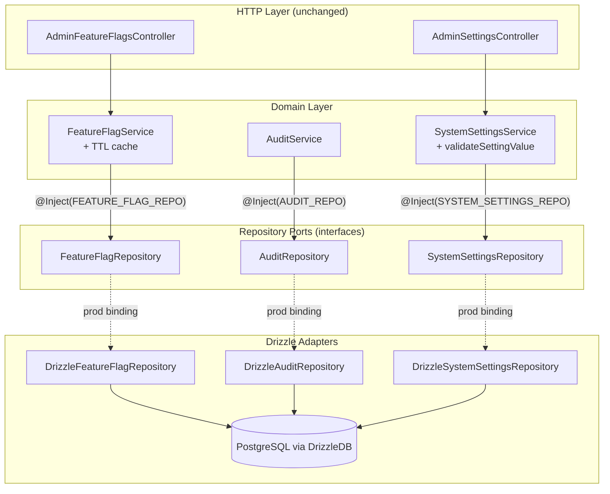
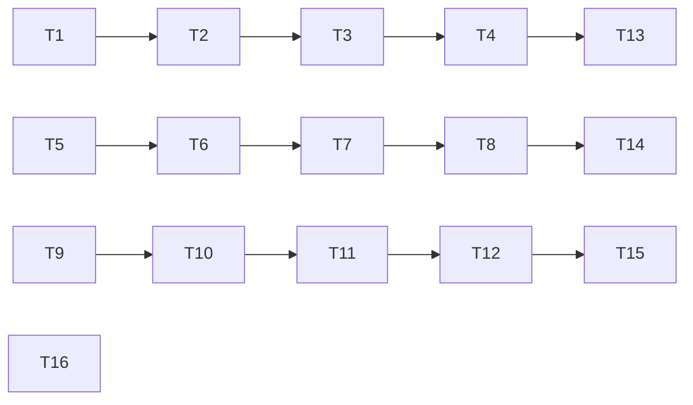

## Summary

Introduce repository ports + Drizzle adapters for three NestJS modules (FeatureFlags, Audit, SystemSettings) following the pattern established by #502 (Consent exemplar). Each service replaces `@Inject(DRIZZLE)` with a port token, Drizzle queries move into adapter classes, and tests switch from Drizzle chain mocks to port mocks.

This is Slice 4 of issue #501. Zero breaking changes to API contracts, controllers, or response shapes.

**Hard blocker:** #502 (repository foundation + Consent exemplar) must be merged first.

---

## Architecture

### Data Flow



### Port Interfaces (from ADR-005)

**FeatureFlagRepository** — 6 methods, cache stays in service:

```typescript
export const FEATURE_FLAG_REPO = Symbol('FEATURE_FLAG_REPO')

export type FeatureFlagRow = typeof featureFlags.$inferSelect

export interface FeatureFlagRepository {
  findByKey(key: string, tx?: DrizzleTx): Promise<FeatureFlagRow | null>
  findAll(tx?: DrizzleTx): Promise<FeatureFlagRow[]>
  findById(id: string, tx?: DrizzleTx): Promise<FeatureFlagRow | null>
  create(data: { name: string; key: string; description?: string }, tx?: DrizzleTx): Promise<FeatureFlagRow>
  update(id: string, data: { name?: string; description?: string; enabled?: boolean }, tx?: DrizzleTx): Promise<FeatureFlagRow | null>
  delete(id: string, tx?: DrizzleTx): Promise<FeatureFlagRow | null>
}
```

**AuditRepository** — 1 method, write-only:

```typescript
export const AUDIT_REPO = Symbol('AUDIT_REPO')

export type AuditLogEntry = {
  actorId: string
  actorType: AuditActorType
  impersonatorId?: string
  organizationId?: string
  action: AuditAction
  resource: string
  resourceId: string
  before?: Record<string, unknown> | null
  after?: Record<string, unknown> | null
  metadata?: Record<string, unknown> | null
  apiKeyId?: string
}

export interface AuditRepository {
  create(entry: AuditLogEntry, tx?: DrizzleTx): Promise<void>
}
```

**SystemSettingsRepository** — 4 low-level methods, batchUpdate orchestration stays in service:

```typescript
export const SYSTEM_SETTINGS_REPO = Symbol('SYSTEM_SETTINGS_REPO')

export type SystemSettingRow = typeof systemSettings.$inferSelect

export interface SystemSettingsRepository {
  findByKey(key: string, tx?: DrizzleTx): Promise<SystemSettingRow | null>
  findAll(tx?: DrizzleTx): Promise<SystemSettingRow[]>
  findByCategory(category: string, tx?: DrizzleTx): Promise<SystemSettingRow[]>
  updateByKey(key: string, value: unknown, tx?: DrizzleTx): Promise<SystemSettingRow | null>
}
```

### File x Function Map

| File | Functions / Members | Role |
|------|---------------------|------|
| `feature-flags/featureFlags.repository.ts` | `FEATURE_FLAG_REPO` symbol, `FeatureFlagRow` type, `FeatureFlagRepository` interface | Port definition |
| `feature-flags/repositories/drizzleFeatureFlags.repository.ts` | `DrizzleFeatureFlagRepository` — `findByKey()`, `findAll()`, `findById()`, `create()`, `update()`, `delete()` | Drizzle adapter |
| `feature-flags/featureFlags.service.ts` | `FeatureFlagService` — inject `FEATURE_FLAG_REPO`, cache stays, delegate to port | Domain service (queries removed) |
| `feature-flags/featureFlags.module.ts` | Module providers with `FEATURE_FLAG_REPO` binding | Module registration |
| `feature-flags/featureFlags.service.test.ts` | Port mock tests (replaces Drizzle chain mocks) | Unit tests (rewritten) |
| `audit/audit.repository.ts` | `AUDIT_REPO` symbol, `AuditLogEntry` type, `AuditRepository` interface | Port definition |
| `audit/repositories/drizzleAudit.repository.ts` | `DrizzleAuditRepository` — `create()` | Drizzle adapter |
| `audit/audit.service.ts` | `AuditService` — inject `AUDIT_REPO`, delegate to port | Domain service (queries removed) |
| `audit/audit.module.ts` | Module providers with `AUDIT_REPO` binding | Module registration |
| `audit/audit.service.test.ts` | Port mock tests (replaces Drizzle chain mocks) | Unit tests (rewritten) |
| `system-settings/systemSettings.repository.ts` | `SYSTEM_SETTINGS_REPO` symbol, `SystemSettingRow` type, `SystemSettingsRepository` interface | Port definition |
| `system-settings/repositories/drizzleSystemSettings.repository.ts` | `DrizzleSystemSettingsRepository` — `findByKey()`, `findAll()`, `findByCategory()`, `updateByKey()` | Drizzle adapter |
| `system-settings/systemSettings.service.ts` | `SystemSettingsService` — inject `SYSTEM_SETTINGS_REPO`, validation stays, delegate to port | Domain service (queries removed) |
| `system-settings/systemSettings.module.ts` | Module providers with `SYSTEM_SETTINGS_REPO` binding | Module registration |
| `system-settings/systemSettings.service.test.ts` | Port mock tests (replaces Drizzle chain mocks) | Unit tests (rewritten) |
| `admin/adminFeatureFlags.controller.ts` | Add `.catch()` to 3 unawaited `auditService.log()` calls (lines 99, 134, 163) | Security fix (S1) |
| `admin/adminSettings.controller.ts` | Add `.catch()` to unawaited `auditService.log()` in loop (line 79) | Security fix (S1) |

---

## Agents

| Agent | Tasks | Responsibility |
|-------|-------|----------------|
| backend-dev | T1–T12 | All production code: tokens, interfaces, adapters, service refactors, module updates |
| tester | T13–T15 | Rewrite all three test files using port mocks |
| fixer | T16 | Add `.catch()` to unawaited audit calls (security fix S1) |

---

## Consistency Report

| Issue #505 success criterion | Task(s) |
|------------------------------|---------|
| FeatureFlagService injects port token, not `DRIZZLE` | T1, T2, T3, T4 |
| AuditService injects port token, not `DRIZZLE` | T5, T6, T7, T8 |
| SystemSettingsService injects port token, not `DRIZZLE` | T9, T10, T11, T12 |
| Each repository port matches actual service query patterns | T1, T5, T9 (ADR-005) |
| Each Drizzle adapter preserves existing query logic | T2, T6, T10 |
| FeatureFlagService's TTL cache stays in service (above the port) | T3 |
| Unit tests pass with port mocks | T13, T14, T15 |
| Zero test regressions | Verified in verification checklist |

| Security/product review action | Task(s) |
|-------------------------------|---------|
| S1: `.catch()` on unawaited audit calls | T16 |
| S3: `// RLS-BYPASS` comments on adapter files | T2, T6, T10 |
| P1: `delete()` public service signature stays `Promise<void>` | T3 |
| P2: Adapter `findByKey` carries `.limit(1)` | T2, T10 |
| P4: Adapters are direct query migrations, no rewrites | T2, T6, T10 |

---

## Implementer Constraints

1. **Direct query migration only** — adapter methods must be a verbatim lift of the existing Drizzle query from the service. Any rewrite or optimization triggers a mandatory adapter integration test.
2. **`delete()` public signature** — `FeatureFlagService.delete()` stays `Promise<void>`. The port's `Promise<FeatureFlagRow | null>` return is consumed internally for cache invalidation only.
3. **`.limit(1)` preservation** — `DrizzleFeatureFlagRepository.findByKey()` and `DrizzleSystemSettingsRepository.findByKey()` must carry `.limit(1)` matching existing queries.
4. **`// RLS-BYPASS` comments** — every new Drizzle adapter file must include `// RLS-BYPASS: repository adapter — DRIZZLE scoped to this adapter only` at the class level.
5. **`AuditLogEntry` extraction** — the inline parameter type in `AuditService.log()` is extracted as a named `AuditLogEntry` type in the port file, imported by both the service and adapter.

---

## Micro-Tasks

---

### T1 — Define `FEATURE_FLAG_REPO` token + `FeatureFlagRepository` port interface

**Agent:** backend-dev · **Difficulty:** 1

**File:** `apps/api/src/feature-flags/featureFlags.repository.ts` (new)

```typescript
import type { DrizzleTx } from '../database/drizzle.provider.js'
import type { featureFlags } from '../database/schema/featureFlags.schema.js'

export const FEATURE_FLAG_REPO = Symbol('FEATURE_FLAG_REPO')

export type FeatureFlagRow = typeof featureFlags.$inferSelect

export interface FeatureFlagRepository {
  findByKey(key: string, tx?: DrizzleTx): Promise<FeatureFlagRow | null>
  findAll(tx?: DrizzleTx): Promise<FeatureFlagRow[]>
  findById(id: string, tx?: DrizzleTx): Promise<FeatureFlagRow | null>
  create(data: { name: string; key: string; description?: string }, tx?: DrizzleTx): Promise<FeatureFlagRow>
  update(id: string, data: { name?: string; description?: string; enabled?: boolean }, tx?: DrizzleTx): Promise<FeatureFlagRow | null>
  delete(id: string, tx?: DrizzleTx): Promise<FeatureFlagRow | null>
}
```

**Verify:** `bun run typecheck --filter=@repo/api 2>&1 | tail -5`

---

### T2 — Create `DrizzleFeatureFlagRepository` adapter

**Agent:** backend-dev · **Difficulty:** 2

**File:** `apps/api/src/feature-flags/repositories/drizzleFeatureFlags.repository.ts` (new)

Move Drizzle queries verbatim from `FeatureFlagService`. Each method uses `tx ?? this.db` for optional transaction pass-through.

```typescript
import { Inject, Injectable } from '@nestjs/common'
import { desc, eq } from 'drizzle-orm'
import { DRIZZLE, type DrizzleDB, type DrizzleTx } from '../../database/drizzle.provider.js'
import { featureFlags } from '../../database/schema/featureFlags.schema.js'
import type { FeatureFlagRepository, FeatureFlagRow } from '../featureFlags.repository.js'

// RLS-BYPASS: repository adapter — DRIZZLE scoped to this adapter only
@Injectable()
export class DrizzleFeatureFlagRepository implements FeatureFlagRepository {
  constructor(@Inject(DRIZZLE) private readonly db: DrizzleDB) {}

  async findByKey(key: string, tx?: DrizzleTx): Promise<FeatureFlagRow | null> {
    const qb = tx ?? this.db
    const rows = await qb.select().from(featureFlags).where(eq(featureFlags.key, key)).limit(1)
    return rows[0] ?? null
  }

  async findAll(tx?: DrizzleTx): Promise<FeatureFlagRow[]> {
    const qb = tx ?? this.db
    return qb.select().from(featureFlags).orderBy(desc(featureFlags.createdAt))
  }

  async findById(id: string, tx?: DrizzleTx): Promise<FeatureFlagRow | null> {
    const qb = tx ?? this.db
    const rows = await qb.select().from(featureFlags).where(eq(featureFlags.id, id)).limit(1)
    return rows[0] ?? null
  }

  async create(data: { name: string; key: string; description?: string }, tx?: DrizzleTx): Promise<FeatureFlagRow> {
    const qb = tx ?? this.db
    const rows = await qb
      .insert(featureFlags)
      .values({ name: data.name, key: data.key, description: data.description })
      .returning()
    return rows[0]!
  }

  async update(
    id: string,
    data: { name?: string; description?: string; enabled?: boolean },
    tx?: DrizzleTx,
  ): Promise<FeatureFlagRow | null> {
    const qb = tx ?? this.db
    const rows = await qb.update(featureFlags).set(data).where(eq(featureFlags.id, id)).returning()
    return rows[0] ?? null
  }

  async delete(id: string, tx?: DrizzleTx): Promise<FeatureFlagRow | null> {
    const qb = tx ?? this.db
    const rows = await qb.delete(featureFlags).where(eq(featureFlags.id, id)).returning()
    return rows[0] ?? null
  }
}
```

**Verify:** `bun run typecheck --filter=@repo/api 2>&1 | tail -5`

---

### T3 — Refactor `FeatureFlagService` to inject port token

**Agent:** backend-dev · **Difficulty:** 2

**File:** `apps/api/src/feature-flags/featureFlags.service.ts`

Replace `@Inject(DRIZZLE) private readonly db: DrizzleDB` with `@Inject(FEATURE_FLAG_REPO) private readonly repo: FeatureFlagRepository`. Remove all Drizzle imports. Cache logic stays. `delete()` public return stays `Promise<void>`.

```typescript
import { Inject, Injectable } from '@nestjs/common'
import { FEATURE_FLAG_REPO, type FeatureFlagRepository } from './featureFlags.repository.js'

@Injectable()
export class FeatureFlagService {
  private static readonly CACHE_TTL_MS = 60_000
  private cache = new Map<string, { value: boolean; expiresAt: number }>()

  constructor(@Inject(FEATURE_FLAG_REPO) private readonly repo: FeatureFlagRepository) {}

  async isEnabled(key: string): Promise<boolean> {
    const cached = this.cache.get(key)
    if (cached && Date.now() < cached.expiresAt) {
      return cached.value
    }
    const row = await this.repo.findByKey(key)
    if (!row) return false
    this.cache.set(key, {
      value: row.enabled,
      expiresAt: Date.now() + FeatureFlagService.CACHE_TTL_MS,
    })
    return row.enabled
  }

  async getAll() {
    return this.repo.findAll()
  }

  async getById(id: string) {
    return this.repo.findById(id)
  }

  async create(data: { name: string; key: string; description?: string }) {
    const row = await this.repo.create(data)
    this.cache.delete(data.key)
    return row
  }

  async update(id: string, data: { name?: string; description?: string; enabled?: boolean }) {
    const row = await this.repo.update(id, data)
    if (row?.key) {
      this.cache.delete(row.key)
    }
    return row
  }

  async delete(id: string): Promise<void> {
    const row = await this.repo.delete(id)
    if (row?.key) {
      this.cache.delete(row.key)
    }
  }
}
```

**Verify:** `bun run typecheck --filter=@repo/api 2>&1 | tail -5`

---

### T4 — Update `FeatureFlagsModule` bindings

**Agent:** backend-dev · **Difficulty:** 1

**File:** `apps/api/src/feature-flags/featureFlags.module.ts`

```typescript
import { Module } from '@nestjs/common'
import { FEATURE_FLAG_REPO } from './featureFlags.repository.js'
import { FeatureFlagService } from './featureFlags.service.js'
import { DrizzleFeatureFlagRepository } from './repositories/drizzleFeatureFlags.repository.js'

@Module({
  providers: [
    FeatureFlagService,
    { provide: FEATURE_FLAG_REPO, useClass: DrizzleFeatureFlagRepository },
  ],
  exports: [FeatureFlagService],
})
export class FeatureFlagsModule {}
```

**Verify:** `bun run typecheck --filter=@repo/api 2>&1 | tail -5`

---

### T5 — Define `AUDIT_REPO` token + `AuditRepository` port interface

**Agent:** backend-dev · **Difficulty:** 1

**File:** `apps/api/src/audit/audit.repository.ts` (new)

```typescript
import type { AuditAction, AuditActorType } from '@repo/types'
import type { DrizzleTx } from '../database/drizzle.provider.js'

export const AUDIT_REPO = Symbol('AUDIT_REPO')

export type AuditLogEntry = {
  actorId: string
  actorType: AuditActorType
  impersonatorId?: string
  organizationId?: string
  action: AuditAction
  resource: string
  resourceId: string
  before?: Record<string, unknown> | null
  after?: Record<string, unknown> | null
  metadata?: Record<string, unknown> | null
  apiKeyId?: string
}

export interface AuditRepository {
  create(entry: AuditLogEntry, tx?: DrizzleTx): Promise<void>
}
```

**Verify:** `bun run typecheck --filter=@repo/api 2>&1 | tail -5`

---

### T6 — Create `DrizzleAuditRepository` adapter

**Agent:** backend-dev · **Difficulty:** 1

**File:** `apps/api/src/audit/repositories/drizzleAudit.repository.ts` (new)

```typescript
import { Inject, Injectable } from '@nestjs/common'
import { DRIZZLE, type DrizzleDB, type DrizzleTx } from '../../database/drizzle.provider.js'
import { auditLogs } from '../../database/schema/audit.schema.js'
import type { AuditLogEntry, AuditRepository } from '../audit.repository.js'

// RLS-BYPASS: repository adapter — DRIZZLE scoped to this adapter only
@Injectable()
export class DrizzleAuditRepository implements AuditRepository {
  constructor(@Inject(DRIZZLE) private readonly db: DrizzleDB) {}

  async create(entry: AuditLogEntry, tx?: DrizzleTx): Promise<void> {
    const qb = tx ?? this.db
    await qb.insert(auditLogs).values({
      actorId: entry.actorId,
      actorType: entry.actorType,
      impersonatorId: entry.impersonatorId ?? null,
      organizationId: entry.organizationId ?? null,
      action: entry.action,
      resource: entry.resource,
      resourceId: entry.resourceId,
      before: entry.before ?? null,
      after: entry.after ?? null,
      metadata: entry.metadata ?? null,
      apiKeyId: entry.apiKeyId ?? null,
    })
  }
}
```

**Verify:** `bun run typecheck --filter=@repo/api 2>&1 | tail -5`

---

### T7 — Refactor `AuditService` to inject port token

**Agent:** backend-dev · **Difficulty:** 1

**File:** `apps/api/src/audit/audit.service.ts`

```typescript
import { Inject, Injectable } from '@nestjs/common'
import { AUDIT_REPO, type AuditLogEntry, type AuditRepository } from './audit.repository.js'

@Injectable()
export class AuditService {
  constructor(@Inject(AUDIT_REPO) private readonly repo: AuditRepository) {}

  async log(entry: AuditLogEntry): Promise<void> {
    await this.repo.create(entry)
  }
}
```

**Note:** The `AuditLogEntry` type is now imported from `audit.repository.ts`, removing the inline parameter definition. All callers of `AuditService.log()` continue to work — the parameter shape is identical.

**Verify:** `bun run typecheck --filter=@repo/api 2>&1 | tail -5`

---

### T8 — Update `AuditModule` bindings

**Agent:** backend-dev · **Difficulty:** 1

**File:** `apps/api/src/audit/audit.module.ts`

```typescript
import { Module } from '@nestjs/common'
import { AUDIT_REPO } from './audit.repository.js'
import { AuditService } from './audit.service.js'
import { DrizzleAuditRepository } from './repositories/drizzleAudit.repository.js'

@Module({
  providers: [
    AuditService,
    { provide: AUDIT_REPO, useClass: DrizzleAuditRepository },
  ],
  exports: [AuditService],
})
export class AuditModule {}
```

**Verify:** `bun run typecheck --filter=@repo/api 2>&1 | tail -5`

---

### T9 — Define `SYSTEM_SETTINGS_REPO` token + `SystemSettingsRepository` port interface

**Agent:** backend-dev · **Difficulty:** 1

**File:** `apps/api/src/system-settings/systemSettings.repository.ts` (new)

```typescript
import type { DrizzleTx } from '../database/drizzle.provider.js'
import type { systemSettings } from '../database/schema/systemSettings.schema.js'

export const SYSTEM_SETTINGS_REPO = Symbol('SYSTEM_SETTINGS_REPO')

export type SystemSettingRow = typeof systemSettings.$inferSelect

export interface SystemSettingsRepository {
  findByKey(key: string, tx?: DrizzleTx): Promise<SystemSettingRow | null>
  findAll(tx?: DrizzleTx): Promise<SystemSettingRow[]>
  findByCategory(category: string, tx?: DrizzleTx): Promise<SystemSettingRow[]>
  updateByKey(key: string, value: unknown, tx?: DrizzleTx): Promise<SystemSettingRow | null>
}
```

**Verify:** `bun run typecheck --filter=@repo/api 2>&1 | tail -5`

---

### T10 — Create `DrizzleSystemSettingsRepository` adapter

**Agent:** backend-dev · **Difficulty:** 2

**File:** `apps/api/src/system-settings/repositories/drizzleSystemSettings.repository.ts` (new)

```typescript
import { Inject, Injectable } from '@nestjs/common'
import { eq } from 'drizzle-orm'
import { DRIZZLE, type DrizzleDB, type DrizzleTx } from '../../database/drizzle.provider.js'
import { systemSettings } from '../../database/schema/systemSettings.schema.js'
import type { SystemSettingRow, SystemSettingsRepository } from '../systemSettings.repository.js'

// RLS-BYPASS: repository adapter — DRIZZLE scoped to this adapter only
@Injectable()
export class DrizzleSystemSettingsRepository implements SystemSettingsRepository {
  constructor(@Inject(DRIZZLE) private readonly db: DrizzleDB) {}

  async findByKey(key: string, tx?: DrizzleTx): Promise<SystemSettingRow | null> {
    const qb = tx ?? this.db
    const rows = await qb
      .select()
      .from(systemSettings)
      .where(eq(systemSettings.key, key))
      .limit(1)
    return rows[0] ?? null
  }

  async findAll(tx?: DrizzleTx): Promise<SystemSettingRow[]> {
    const qb = tx ?? this.db
    return qb.select().from(systemSettings)
  }

  async findByCategory(category: string, tx?: DrizzleTx): Promise<SystemSettingRow[]> {
    const qb = tx ?? this.db
    return qb.select().from(systemSettings).where(eq(systemSettings.category, category))
  }

  async updateByKey(key: string, value: unknown, tx?: DrizzleTx): Promise<SystemSettingRow | null> {
    const qb = tx ?? this.db
    const [row] = await qb
      .update(systemSettings)
      .set({ value })
      .where(eq(systemSettings.key, key))
      .returning()
    return row ?? null
  }
}
```

**Verify:** `bun run typecheck --filter=@repo/api 2>&1 | tail -5`

---

### T11 — Refactor `SystemSettingsService` to inject port token

**Agent:** backend-dev · **Difficulty:** 3

**File:** `apps/api/src/system-settings/systemSettings.service.ts`

Replace `@Inject(DRIZZLE)` with `@Inject(SYSTEM_SETTINGS_REPO)`. Remove Drizzle imports. `batchUpdate` orchestrates via `repo.findByKey()` + `repo.updateByKey()`. `validateSettingValue()` stays in service.

```typescript
import { Inject, Injectable } from '@nestjs/common'
import {
  SYSTEM_SETTINGS_REPO,
  type SystemSettingRow,
  type SystemSettingsRepository,
} from './systemSettings.repository.js'
import { SettingNotFoundException } from './exceptions/settingNotFound.exception.js'
import { SettingValidationException } from './exceptions/settingValidation.exception.js'

@Injectable()
export class SystemSettingsService {
  constructor(
    @Inject(SYSTEM_SETTINGS_REPO) private readonly repo: SystemSettingsRepository,
  ) {}

  async getValue<T = unknown>(key: string): Promise<T | null> {
    const row = await this.repo.findByKey(key)
    if (!row) return null
    return row.value as T
  }

  async getAll() {
    return this.repo.findAll()
  }

  async getByCategory(category: string) {
    return this.repo.findByCategory(category)
  }

  async batchUpdate(updates: Array<{ key: string; value: unknown }>): Promise<{
    updated: Array<Record<string, unknown>>
    beforeState: Record<string, unknown>
  }> {
    if (updates.length === 0) {
      return { updated: [], beforeState: {} }
    }

    // Phase 1: Read all settings and validate before any writes
    const existingSettings: SystemSettingRow[] = []

    for (const update of updates) {
      const existing = await this.repo.findByKey(update.key)
      if (!existing) {
        throw new SettingNotFoundException(update.key)
      }
      this.validateSettingValue(update.key, update.value, existing.type, existing.metadata)
      existingSettings.push(existing)
    }

    // Phase 2: Build beforeState and perform all updates
    const beforeState: Record<string, unknown> = {}
    for (const existing of existingSettings) {
      beforeState[existing.key] = existing.value
    }

    const updated: Array<Record<string, unknown>> = []
    for (const update of updates) {
      const result = await this.repo.updateByKey(update.key, update.value)
      if (result) {
        updated.push(result)
      }
    }

    return { updated, beforeState }
  }

  private validateSettingValue(
    key: string,
    value: unknown,
    type: string,
    metadata: { options?: string[] } | null,
  ): void {
    const actualType = typeof value

    switch (type) {
      case 'string':
        if (typeof value !== 'string') {
          throw new SettingValidationException(key, 'string', actualType)
        }
        break
      case 'number':
        if (typeof value !== 'number' || Number.isNaN(value)) {
          throw new SettingValidationException(key, 'number', actualType)
        }
        break
      case 'boolean':
        if (typeof value !== 'boolean') {
          throw new SettingValidationException(key, 'boolean', actualType)
        }
        break
      case 'select':
        if (typeof value !== 'string' || !metadata?.options?.includes(value)) {
          throw new SettingValidationException(key, 'select', actualType)
        }
        break
    }
  }
}
```

**Verify:** `bun run typecheck --filter=@repo/api 2>&1 | tail -5`

---

### T12 — Update `SystemSettingsModule` bindings

**Agent:** backend-dev · **Difficulty:** 1

**File:** `apps/api/src/system-settings/systemSettings.module.ts`

```typescript
import { Module } from '@nestjs/common'
import { SYSTEM_SETTINGS_REPO } from './systemSettings.repository.js'
import { SystemSettingsService } from './systemSettings.service.js'
import { DrizzleSystemSettingsRepository } from './repositories/drizzleSystemSettings.repository.js'

@Module({
  providers: [
    SystemSettingsService,
    { provide: SYSTEM_SETTINGS_REPO, useClass: DrizzleSystemSettingsRepository },
  ],
  exports: [SystemSettingsService],
})
export class SystemSettingsModule {}
```

**Verify:** `bun run typecheck --filter=@repo/api 2>&1 | tail -5`

---

**TYPECHECK GATE (T1–T12):** `bun run typecheck --filter=@repo/api && echo TYPECHECK_PASS`

---

### T13 — Rewrite `featureFlags.service.test.ts` with port mocks

**Agent:** tester · **Difficulty:** 3

**File:** `apps/api/src/feature-flags/featureFlags.service.test.ts`

Replace all Drizzle chain mock factories (`createSelectChain`, `createGetAllChain`, `createInsertChain`, `createUpdateChain`, `createDeleteChain`) with a simple port mock object:

```typescript
import type { Mock } from 'vitest'
import { describe, expect, it, vi } from 'vitest'
import type { FeatureFlagRepository, FeatureFlagRow } from './featureFlags.repository.js'
import { FeatureFlagService } from './featureFlags.service.js'

function createMockRepo() {
  return {
    findByKey: vi.fn(),
    findAll: vi.fn(),
    findById: vi.fn(),
    create: vi.fn(),
    update: vi.fn(),
    delete: vi.fn(),
  } satisfies Record<keyof FeatureFlagRepository, Mock>
}

const mockFlag: FeatureFlagRow = {
  id: 'flag-1',
  key: 'new-dashboard',
  name: 'New Dashboard',
  description: null,
  enabled: true,
  createdAt: new Date('2024-01-01'),
  updatedAt: new Date('2024-01-01'),
}
```

All 16 existing test behaviors must be preserved (isEnabled true/false/missing, cache hit, cache TTL expiry, cache invalidation after update/delete, getAll, create, update, delete). Tests become simpler — e.g., `mockRepo.findByKey.mockResolvedValue(mockFlag)` replaces the chain factory.

**Verify:** `bun run test --filter=@repo/api -- --reporter=verbose featureFlags.service`

---

### T14 — Rewrite `audit.service.test.ts` with port mocks

**Agent:** tester · **Difficulty:** 2

**File:** `apps/api/src/audit/audit.service.test.ts`

Replace `createMockDb()` with:

```typescript
import type { Mock } from 'vitest'
import { describe, expect, it, vi } from 'vitest'
import type { AuditRepository } from './audit.repository.js'
import { AuditService } from './audit.service.js'

function createMockRepo() {
  return {
    create: vi.fn().mockResolvedValue(undefined),
  } satisfies Record<keyof AuditRepository, Mock>
}
```

All 7 existing test behaviors preserved. Tests assert that `mockRepo.create` is called with the correct entry shape (required fields, optional fields, null defaults, error propagation).

**Verify:** `bun run test --filter=@repo/api -- --reporter=verbose audit.service`

---

### T15 — Rewrite `systemSettings.service.test.ts` with port mocks

**Agent:** tester · **Difficulty:** 3

**File:** `apps/api/src/system-settings/systemSettings.service.test.ts`

Replace `createMockDb()` with:

```typescript
import type { Mock } from 'vitest'
import { describe, expect, it, vi } from 'vitest'
import type { SystemSettingsRepository, SystemSettingRow } from './systemSettings.repository.js'
import { SettingNotFoundException } from './exceptions/settingNotFound.exception.js'
import { SettingValidationException } from './exceptions/settingValidation.exception.js'
import { SystemSettingsService } from './systemSettings.service.js'

function createMockRepo() {
  return {
    findByKey: vi.fn(),
    findAll: vi.fn(),
    findByCategory: vi.fn(),
    updateByKey: vi.fn(),
  } satisfies Record<keyof SystemSettingsRepository, Mock>
}
```

All 16 existing test behaviors preserved. `batchUpdate` tests call `mockRepo.findByKey` for Phase 1 reads and `mockRepo.updateByKey` for Phase 2 writes. Validation tests return mock rows with `type` and `metadata` fields from `mockRepo.findByKey`.

**Verify:** `bun run test --filter=@repo/api -- --reporter=verbose systemSettings.service`

---

### T16 — Add `.catch()` to unawaited audit calls (Security fix S1)

**Agent:** fixer · **Difficulty:** 1

**Files:**
- `apps/api/src/admin/adminFeatureFlags.controller.ts` — lines 99, 134, 163
- `apps/api/src/admin/adminSettings.controller.ts` — line 79

Pattern (matching `adminMembers.service.ts:332` and `adminInvitations.service.ts:256`):

```typescript
// Before:
this.auditService.log({ ... })

// After:
this.auditService.log({ ... }).catch((err) => {
  this.logger.error(`[audit] Failed to log <action>`, err)
})
```

Each controller needs a `private readonly logger = new Logger(ClassName.name)` if not already present.

**Verify:** `bun run typecheck --filter=@repo/api 2>&1 | tail -5`

---

**FULL TEST GATE:** `bun run test --filter=@repo/api && echo TEST_PASS`

---

## Execution Order

Tasks grouped by dependency. Tasks within a group can run in parallel.

```
Group A (parallel, no deps — port definitions):
  T1  — FeatureFlagRepository port + token
  T5  — AuditRepository port + token
  T9  — SystemSettingsRepository port + token

Group B (depends on T1, T5, T9 — adapters):
  T2  — DrizzleFeatureFlagRepository
  T6  — DrizzleAuditRepository
  T10 — DrizzleSystemSettingsRepository

Group C (depends on T1+T2, T5+T6, T9+T10 — service refactors):
  T3  — FeatureFlagService refactor
  T7  — AuditService refactor
  T11 — SystemSettingsService refactor

Group D (depends on T3, T7, T11 — module bindings):
  T4  — FeatureFlagsModule
  T8  — AuditModule
  T12 — SystemSettingsModule

--- TYPECHECK GATE ---

Group E (depends on Group D — tests):
  T13 — featureFlags.service.test.ts rewrite
  T14 — audit.service.test.ts rewrite
  T15 — systemSettings.service.test.ts rewrite

Group F (independent — security fix):
  T16 — .catch() on unawaited audit calls

--- FULL TEST GATE ---
```



**Note:** The three module pipelines (FF, Audit, SS) are fully independent and can run as 3 parallel backend-dev agents on separate file groups.

---

## Risk Register

| Risk | Likelihood | Mitigation |
|------|-----------|------------|
| #502 not merged → pattern convention not established | Medium | Hard blocker: do not start implementation until #502 is merged |
| Adapter query differs subtly from service query (e.g., missing `.limit(1)`) | Low | Constraint: direct query migration only; `.limit(1)` preservation noted in T2/T10 |
| `FeatureFlagRow` type inference breaks if schema changes | Low | Type is `$inferSelect` — updates automatically with schema |
| `AuditLogEntry` extraction changes parameter shape | Very low | Shape is identical to existing inline type — verified by typecheck |
| `SystemSettingsService.batchUpdate` partial write on DB failure | Existing | Preserved as-is; follow-up issue for tx wrapper (P3/XS) |
| Unawaited audit calls silently drop on adapter failure | Existing | Fixed in T16 — `.catch()` added to 4 call sites |
| Cache poisoning via incorrect adapter return | Very low | Adapter is statically bound, same query logic, type-checked |

---

## Follow-up Issues

| Issue | Size | Priority | Description |
|-------|------|----------|-------------|
| Wrap `SystemSettingsService.batchUpdate` in transaction | XS | P3 | Port's `tx?` params enable this as a one-line change in service |
| Document 60s FF cache staleness as accepted security trade-off | XS | P3 | Add note to `backend-patterns.mdx` per security review S4 |

---

## Verification Checklist

Run in order after all tasks complete:

```bash
# 1. Typecheck
bun run typecheck --filter=@repo/api

# 2. Unit tests
bun run test --filter=@repo/api -- --reporter=verbose

# 3. Full lint
bun run lint

# 4. Confirm services no longer import DRIZZLE
grep -r "DRIZZLE" apps/api/src/feature-flags/featureFlags.service.ts
grep -r "DRIZZLE" apps/api/src/audit/audit.service.ts
grep -r "DRIZZLE" apps/api/src/system-settings/systemSettings.service.ts
# Expected: no output for all three

# 5. Confirm adapters are the only DRIZZLE injectors in each module
grep -r "@Inject(DRIZZLE)" apps/api/src/feature-flags/
# Expected: only repositories/drizzleFeatureFlags.repository.ts
grep -r "@Inject(DRIZZLE)" apps/api/src/audit/
# Expected: only repositories/drizzleAudit.repository.ts
grep -r "@Inject(DRIZZLE)" apps/api/src/system-settings/
# Expected: only repositories/drizzleSystemSettings.repository.ts

# 6. Confirm RLS-BYPASS comments on adapters
grep -r "RLS-BYPASS" apps/api/src/feature-flags/repositories/
grep -r "RLS-BYPASS" apps/api/src/audit/repositories/
grep -r "RLS-BYPASS" apps/api/src/system-settings/repositories/
# Expected: one match per adapter file

# 7. Confirm .catch() on unawaited audit calls
grep -n "auditService.log" apps/api/src/admin/adminFeatureFlags.controller.ts
grep -n "auditService.log" apps/api/src/admin/adminSettings.controller.ts
# Expected: all calls now have .catch()
```
