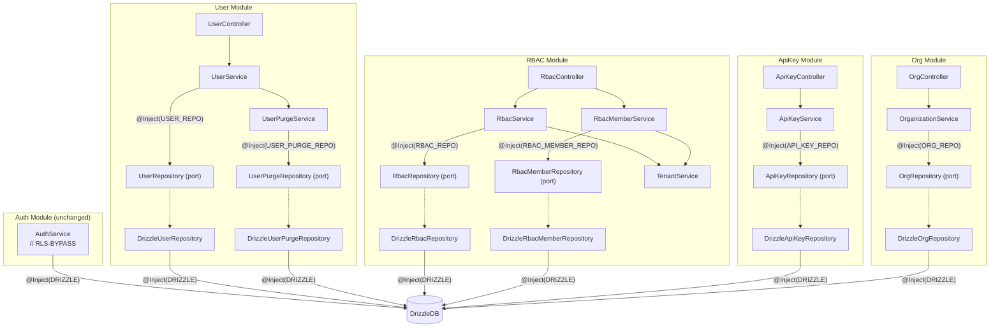
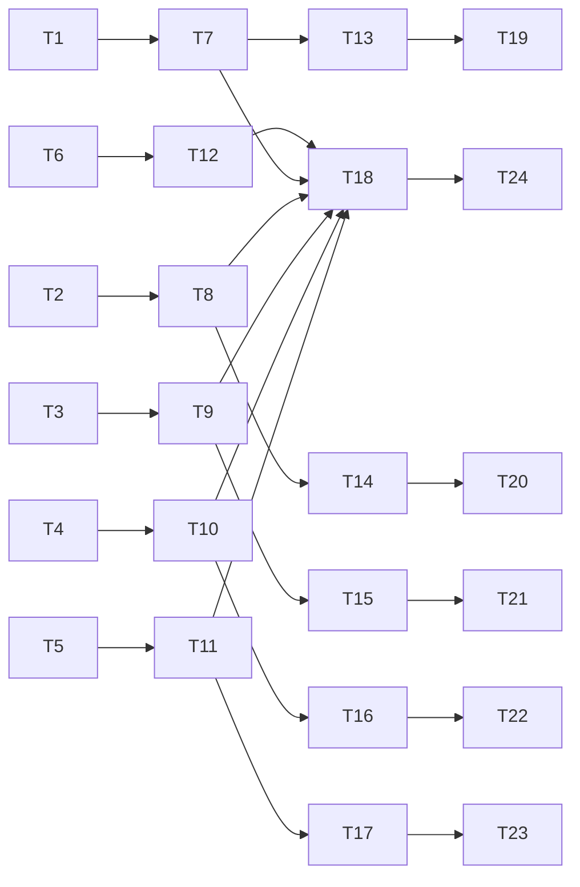

## Summary

Create repository port interfaces and Drizzle adapters for UserService, UserPurgeService, RbacService, RbacMemberService, ApiKeyService, and OrganizationService. Refactor each service to inject its port token instead of `DRIZZLE` (or instead of raw `tx` patterns for RBAC). Rewrite all service unit tests to mock the port interface. Add `// RLS-BYPASS: better-auth-adapter` comment to AuthService.

This is Slice 5 of issue #501. Zero breaking changes to existing API contracts, controllers, or module exports.

---

## Architecture

### Data Flow



### File x Function Map

| File | Key exports | Role |
|------|-------------|------|
| `user/user.repository.ts` | `UserRepository` interface, `USER_REPO` symbol | Port |
| `user/repositories/drizzleUser.repository.ts` | `DrizzleUserRepository` class | Drizzle adapter |
| `user/userPurge.repository.ts` | `UserPurgeRepository` interface, `USER_PURGE_REPO` symbol | Port |
| `user/repositories/drizzleUserPurge.repository.ts` | `DrizzleUserPurgeRepository` class | Drizzle adapter |
| `rbac/rbac.repository.ts` | `RbacRepository` interface, `RBAC_REPO` symbol | Port |
| `rbac/repositories/drizzleRbac.repository.ts` | `DrizzleRbacRepository` class | Drizzle adapter |
| `rbac/rbacMember.repository.ts` | `RbacMemberRepository` interface, `RBAC_MEMBER_REPO` symbol | Port |
| `rbac/repositories/drizzleRbacMember.repository.ts` | `DrizzleRbacMemberRepository` class | Drizzle adapter |
| `api-key/apiKey.repository.ts` | `ApiKeyRepository` interface, `API_KEY_REPO` symbol | Port |
| `api-key/repositories/drizzleApiKey.repository.ts` | `DrizzleApiKeyRepository` class | Drizzle adapter |
| `organization/org.repository.ts` | `OrgRepository` interface, `ORG_REPO` symbol | Port |
| `organization/repositories/drizzleOrg.repository.ts` | `DrizzleOrgRepository` class | Drizzle adapter |
| `user/user.service.ts` | `UserService` (inject USER_REPO) | Service refactor |
| `user/userPurge.service.ts` | `UserPurgeService` (inject USER_PURGE_REPO) | Service refactor |
| `rbac/rbac.service.ts` | `RbacService` (inject RBAC_REPO) | Service refactor |
| `rbac/rbacMember.service.ts` | `RbacMemberService` (inject RBAC_MEMBER_REPO) | Service refactor |
| `api-key/apiKey.service.ts` | `ApiKeyService` (inject API_KEY_REPO) | Service refactor |
| `organization/organization.service.ts` | `OrganizationService` (inject ORG_REPO) | Service refactor |
| `user/user.module.ts` | UserModule providers | Module binding |
| `rbac/rbac.module.ts` | RbacModule providers | Module binding |
| `api-key/apiKey.module.ts` | ApiKeyModule providers | Module binding |
| `organization/organization.module.ts` | OrgModule providers | Module binding |
| `auth/auth.service.ts` | `// RLS-BYPASS: better-auth-adapter` | Comment |

---

## Agents

| Agent | Tasks | Responsibility |
|-------|-------|----------------|
| backend-dev | T1–T18, T25 | All production code: ports, adapters, service refactors, module bindings, RLS comment |
| tester | T19–T24 | Rewrite all service unit tests with port mocks |

---

## Design Decisions

### Transaction pattern

Services that orchestrate transactions (UserService, OrganizationService) need `transaction()` on their repository port. The adapter delegates to `this.db.transaction()`. Repo methods accept `tx?: DrizzleTx` for participation in existing transactions.

### RBAC tenant scoping

RbacService/RbacMemberService keep `TenantService` injection for RLS context. The service calls `tenantService.query(tx => this.repo.method(tx))`. The adapter just receives `tx` — no TenantService injection needed in the adapter.

### UserService softDelete cross-table operations

UserService.softDelete spans users, members, organizations, sessions, invitations tables. The UserRepository port includes org-resolution helper methods (verifyOrgOwnership, transferOrgOwnership, softDeleteOrg, clearOrgSessions, expireOrgInvitations) to keep the module self-contained. This avoids adding new cross-module dependencies.

### Testing strategy

Per spec: "Subsequent slices test via mocking the port interface directly (vitest mock on injection token) — full in-memory adapters are optional." Tests use `vi.fn()` mocks on the port interface, not InMemoryAdapters.

---

## Consistency Report

| Spec success criterion | Task(s) |
|------------------------|---------|
| UserService injects port token, not DRIZZLE | T13 |
| RbacService injects port token | T15 |
| RbacMemberService injects port token | T16 |
| ApiKeyService injects port token, not DRIZZLE | T17 |
| OrgService injects port token, not DRIZZLE | T18 |
| All existing transaction call sites audited and preserved | T1, T6, T7, T12 (tx? on all methods) |
| UserRepository accommodates softDelete and findOwnedOrgs | T1, T7 |
| UserPurgeService receives tx through port methods | T2, T8, T14 |
| AuthService retains direct DRIZZLE with RLS-BYPASS comment | T25 |
| Unit tests pass with port mocks | T19–T24 |
| Zero test regressions | Verified in T19–T24 |

---

## Micro-Tasks

---

### T1 — UserRepository port interface + USER_REPO token [P]

**Phase:** GREEN · **Agent:** backend-dev · **Difficulty:** 3 · **SC:** Port matches UserService data access patterns with tx? support

**File:** `apps/api/src/user/user.repository.ts` (new)

**Description:** Define the `USER_REPO` Symbol token and `UserRepository` interface. Methods must match every `this.db` call site in `user.service.ts`. The interface is large because UserService.softDelete has cross-table org resolution operations.

**Port methods (derived from user.service.ts lines 65, 88, 132, 150, 161, 185, 206, 234, 252, 273–292, 301, 315):**

- `getSoftDeleteStatus(userId, tx?)` — select deletedAt, deleteScheduledFor
- `getProfile(userId, tx?)` — select profileColumns (no whereActive)
- `getNameFields(userId, tx?)` — select firstName, lastName, fullNameCustomized
- `updateProfile(userId, data, tx?)` — update with whereActive, returning profileColumns
- `findForValidation(userId, tx?)` — select id, email, deletedAt
- `softDeleteUser(userId, now, deleteScheduledFor, tx?)` — update set deletedAt, returning profileColumns
- `reactivateUser(userId, tx?)` — update set deletedAt=null, returning profileColumns
- `getOwnedOrganizations(userId, tx?)` — select from members join orgs where role=owner
- `deleteUserSessions(userId, tx?)` — delete sessions where userId
- `verifyOrgOwnership(orgId, userId, tx?)` — select role from members
- `verifyTargetMember(orgId, userId, tx?)` — select id from members
- `transferOrgOwnership(orgId, targetUserId, now, tx?)` — update members set role=owner
- `softDeleteOrg(orgId, now, deleteScheduledFor, tx?)` — update organizations
- `clearOrgSessions(orgId, tx?)` — update sessions set activeOrgId=null
- `expireOrgInvitations(orgId, tx?)` — update invitations set status=expired
- `transaction<T>(fn: (tx: DrizzleTx) => Promise<T>): Promise<T>`

**Import types from:** `drizzle.provider.js` (DrizzleTx), service-local types for return shapes.

**Verify:** `bun run typecheck --filter=@repo/api 2>&1 | tail -5`

---

### T2 — UserPurgeRepository port interface + USER_PURGE_REPO token [P]

**Phase:** GREEN · **Agent:** backend-dev · **Difficulty:** 2 · **SC:** Port matches UserPurgeService data access; tx parameter on all mutating methods

**File:** `apps/api/src/user/userPurge.repository.ts` (new)

**Description:** Define `USER_PURGE_REPO` Symbol and `UserPurgeRepository` interface. Methods match `userPurge.service.ts` data operations. Use higher-level method signatures matching the service's existing method boundaries.

**Port methods (derived from userPurge.service.ts lines 30, 52, 80):**

- `findForPurgeValidation(userId, tx?)` — select id, email, deletedAt from users
- `anonymizeUserRecords(userId, originalEmail, now, tx?)` — anonymize user + delete sessions/accounts/verifications/invitations
- `purgeOwnedOrganizations(userId, now, tx?)` — find owned deleted orgs + anonymize + delete members/invitations/roles + remove user memberships

**Verify:** `bun run typecheck --filter=@repo/api 2>&1 | tail -5`

---

### T3 — RbacRepository port interface + RBAC_REPO token [P]

**Phase:** GREEN · **Agent:** backend-dev · **Difficulty:** 3 · **SC:** Port matches RbacService query-level operations; all methods accept tx

**File:** `apps/api/src/rbac/rbac.repository.ts` (new)

**Description:** Define `RBAC_REPO` Symbol and `RbacRepository` interface. Methods are query-level (not service-level) because RbacService has business logic (slug generation, default role constraints) that stays in the service.

**Port methods (derived from rbac.service.ts):**

- `listRoles(tx?)` — select * from roles
- `findRoleById(roleId, tx?)` — select from roles where id
- `findRoleBySlug(tenantId, slug, tx?)` — select from roles where tenantId+slug
- `findViewerRole(tenantId, tx?)` — select from roles where slug=viewer+tenantId
- `insertRole(data, tx?)` — insert into roles returning
- `updateRoleFields(roleId, fields, tx?)` — update roles set fields
- `deleteRole(roleId, tx?)` — delete from roles where id
- `getAllPermissions(tx?)` — select * from permissions
- `getRolePermissions(roleId, tx?)` — select from rolePermissions join permissions
- `insertRolePermissions(entries: {roleId, permissionId}[], tx?)` — insert into rolePermissions
- `deleteRolePermissions(roleId, tx?)` — delete from rolePermissions where roleId
- `reassignMembers(fromRoleId, toRoleId, tx?)` — update members set roleId

**Verify:** `bun run typecheck --filter=@repo/api 2>&1 | tail -5`

---

### T4 — RbacMemberRepository port interface + RBAC_MEMBER_REPO token [P]

**Phase:** GREEN · **Agent:** backend-dev · **Difficulty:** 2 · **SC:** Port matches RbacMemberService data access patterns

**File:** `apps/api/src/rbac/rbacMember.repository.ts` (new)

**Description:** Define `RBAC_MEMBER_REPO` Symbol and `RbacMemberRepository` interface.

**Port methods (derived from rbacMember.service.ts):**

- `findDefaultRolesByTenant(tenantId, tx?)` — select from roles where tenantId+isDefault
- `findMemberByUserAndRole(userId, tenantId, roleId, tx?)` — select from members
- `findMemberByIdAndRole(memberId, tenantId, roleId, tx?)` — select from members
- `findMemberById(memberId, tenantId, tx?)` — select from members where id+orgId
- `findRoleById(roleId, tenantId, tx?)` — select from roles where id+tenantId
- `findRoleBySlug(slug, tenantId, tx?)` — select from roles where slug+tenantId
- `updateMemberRole(memberId, roleId, tx?)` — update members set roleId
- `countMembersByRole(tenantId, roleId, tx?)` — select count from members

**Verify:** `bun run typecheck --filter=@repo/api 2>&1 | tail -5`

---

### T5 — ApiKeyRepository port interface + API_KEY_REPO token [P]

**Phase:** GREEN · **Agent:** backend-dev · **Difficulty:** 2 · **SC:** Port matches ApiKeyService data access; no transaction method needed

**File:** `apps/api/src/api-key/apiKey.repository.ts` (new)

**Description:** Define `API_KEY_REPO` Symbol and `ApiKeyRepository` interface. ApiKeyService has no transactions — simple CRUD + validate pattern.

**Port methods (derived from apiKey.service.ts):**

- `create(data, tx?)` — insert into apiKeys returning
- `list(orgId, tx?)` — select from apiKeys where tenantId
- `findByIdAndOrg(id, orgId, tx?)` — select from apiKeys where id+tenantId
- `revoke(id, now, tx?)` — update apiKeys set revokedAt
- `findCandidatesByLastFour(lastFour, tx?)` — select from apiKeys join users where lastFour+active
- `touchLastUsedAt(id)` — fire-and-forget update (no tx, returns void)
- `revokeAllForUser(userId, now, tx?)` — update apiKeys where userId+not revoked
- `revokeAllForOrg(orgId, now, tx?)` — update apiKeys where tenantId+not revoked

**Verify:** `bun run typecheck --filter=@repo/api 2>&1 | tail -5`

---

### T6 — OrgRepository port interface + ORG_REPO token [P]

**Phase:** GREEN · **Agent:** backend-dev · **Difficulty:** 2 · **SC:** Port matches OrganizationService data access with tx? and transaction() support

**File:** `apps/api/src/organization/org.repository.ts` (new)

**Description:** Define `ORG_REPO` Symbol and `OrgRepository` interface.

**Port methods (derived from organization.service.ts):**

- `listForUser(userId, tx?)` — select from members join orgs where userId+active
- `findActiveOrThrow(orgId, tx?)` — select from orgs where id+active
- `findById(orgId, tx?)` — select from orgs where id (includes deleted)
- `softDelete(orgId, now, deleteScheduledFor, tx?)` — update orgs set deletedAt, returning
- `reactivate(orgId, tx?)` — update orgs set deletedAt=null, returning
- `requireOwnership(orgId, userId, tx?)` — select from members, throw if not owner
- `clearSessions(orgId, tx?)` — update sessions set activeOrgId=null
- `expireInvitations(orgId, tx?)` — update invitations set status=expired
- `countMembers(orgId, tx?)` — select count from members
- `countPendingInvitations(orgId, tx?)` — select count from invitations
- `countCustomRoles(orgId, tx?)` — select count from roles where not default
- `transaction<T>(fn: (tx: DrizzleTx) => Promise<T>): Promise<T>`

**Verify:** `bun run typecheck --filter=@repo/api 2>&1 | tail -5`

---

**GREEN GATE (T1–T6):** `bun run typecheck --filter=@repo/api && echo PORT_TYPECHECK_PASS`

---

### T7 — DrizzleUserRepository adapter

**Phase:** GREEN · **Agent:** backend-dev · **Difficulty:** 4 · **SC:** Adapter implements UserRepository; all query logic moved from UserService verbatim

**File:** `apps/api/src/user/repositories/drizzleUser.repository.ts` (new)

**Description:** Move all Drizzle query logic from `user.service.ts` into this adapter. Inject `@Inject(DRIZZLE)`. Each method uses `const qb = tx ?? this.db`. Move `profileColumns` constant here. Transaction method: `async transaction<T>(fn) { return this.db.transaction(fn) }`.

**Key patterns to preserve:**
- `getSoftDeleteStatus`: TTL cache stays in UserService (above the port), NOT in the adapter
- `getProfile`: intentionally no `whereActive` (auth guard handles this)
- `updateProfile`: uses `whereActive` filter
- `softDeleteOrg`: same 3-step pattern from `processOrgDeletion` (update org + clear sessions + expire invitations)

**Verify:** `bun run typecheck --filter=@repo/api 2>&1 | tail -5`

---

### T8 — DrizzleUserPurgeRepository adapter

**Phase:** GREEN · **Agent:** backend-dev · **Difficulty:** 3 · **SC:** Adapter implements UserPurgeRepository; multi-step operations match existing service logic

**File:** `apps/api/src/user/repositories/drizzleUserPurge.repository.ts` (new)

**Description:** Move Drizzle query logic from `userPurge.service.ts` into this adapter. Inject `@Inject(DRIZZLE)`.

**Key patterns to preserve:**
- `anonymizeUserRecords`: 5-step sequence (update user + delete sessions/accounts/verifications/invitations) — move verbatim
- `purgeOwnedOrganizations`: query owned deleted orgs + loop per-org (anonymize slug, delete members/invitations/roles) + remove all user memberships — move verbatim with the TODO comment about batch optimization

**Verify:** `bun run typecheck --filter=@repo/api 2>&1 | tail -5`

---

### T9 — DrizzleRbacRepository adapter [P]

**Phase:** GREEN · **Agent:** backend-dev · **Difficulty:** 3 · **SC:** Adapter implements RbacRepository; receives tx from TenantService.query()

**File:** `apps/api/src/rbac/repositories/drizzleRbac.repository.ts` (new)

**Description:** Implement all RbacRepository methods. Inject `@Inject(DRIZZLE)`. Each method uses `const qb = tx ?? this.db`. In practice, RBAC methods always receive `tx` from `tenantService.query()`, but the fallback to `this.db` is preserved for consistency.

**Note:** Move `slugify()` helper to RbacService (it's business logic, not data access). The adapter does not generate slugs.

**Verify:** `bun run typecheck --filter=@repo/api 2>&1 | tail -5`

---

### T10 — DrizzleRbacMemberRepository adapter [P]

**Phase:** GREEN · **Agent:** backend-dev · **Difficulty:** 2 · **SC:** Adapter implements RbacMemberRepository

**File:** `apps/api/src/rbac/repositories/drizzleRbacMember.repository.ts` (new)

**Description:** Implement all RbacMemberRepository methods. Inject `@Inject(DRIZZLE)`. Simple select/update patterns from `rbacMember.service.ts`.

**Verify:** `bun run typecheck --filter=@repo/api 2>&1 | tail -5`

---

### T11 — DrizzleApiKeyRepository adapter [P]

**Phase:** GREEN · **Agent:** backend-dev · **Difficulty:** 3 · **SC:** Adapter implements ApiKeyRepository; security-sensitive query patterns preserved

**File:** `apps/api/src/api-key/repositories/drizzleApiKey.repository.ts` (new)

**Description:** Move Drizzle query logic from `apiKey.service.ts`. Inject `@Inject(DRIZZLE)`.

**Key patterns to preserve:**
- `findCandidatesByLastFour`: innerJoin with users table, `isNull(users.deletedAt)` filter, `.limit(10)`
- `touchLastUsedAt`: fire-and-forget pattern (no await, `.catch()` in service)
- `create`: returns the inserted row (service adds the full key)

**Note:** `hmacHash()`, `generateBase62()`, `KEY_PREFIX`, `SALT_BYTES`, validation methods (`requireOrgId`, `validateScopes`, `parseExpiresAt`, `generateKeyMaterial`) and `logAudit` stay in ApiKeyService — they're business/security logic, not data access.

**Verify:** `bun run typecheck --filter=@repo/api 2>&1 | tail -5`

---

### T12 — DrizzleOrgRepository adapter [P]

**Phase:** GREEN · **Agent:** backend-dev · **Difficulty:** 3 · **SC:** Adapter implements OrgRepository; softDelete transaction pattern preserved

**File:** `apps/api/src/organization/repositories/drizzleOrg.repository.ts` (new)

**Description:** Move Drizzle query logic from `organization.service.ts`. Inject `@Inject(DRIZZLE)`.

**Key patterns to preserve:**
- `listForUser`: innerJoin members+organizations, `whereActive(organizations)`
- `requireOwnership`: select from members, throw `OrgNotOwnerException` if not owner
- `countCustomRoles`: joins `roles` table with `eq(roles.tenantId, orgId)` + `eq(roles.isDefault, false)`
- `findActiveOrThrow`: throws `OrgNotFoundException`

**Verify:** `bun run typecheck --filter=@repo/api 2>&1 | tail -5`

---

**GREEN GATE (T7–T12):** `bun run typecheck --filter=@repo/api && echo ADAPTER_TYPECHECK_PASS`

---

### T13 — Refactor UserService to inject USER_REPO

**Phase:** REFACTOR · **Agent:** backend-dev · **Difficulty:** 3 · **SC:** UserService injects USER_REPO, no direct DRIZZLE usage; cache stays in service

**File:** `apps/api/src/user/user.service.ts`

**Description:** Replace `@Inject(DRIZZLE) private readonly db: DrizzleDB` with `@Inject(USER_REPO) private readonly repo: UserRepository`. Remove all Drizzle imports. Delegate all query operations to `this.repo`. The in-memory TTL cache for `getSoftDeleteStatus` stays in the service (above the port, per spec cache rule). `profileColumns` constant moves to the adapter (T7).

**Key refactors:**
- `getSoftDeleteStatus`: `this.repo.getSoftDeleteStatus(userId)` (cache wraps the call)
- `getProfile`: `this.repo.getProfile(userId)`
- `updateProfile`: two calls — `this.repo.getNameFields(userId)` for current values, then `this.repo.updateProfile(userId, data)`
- `softDelete`: `this.repo.transaction(async (tx) => { ...repo calls with tx... })`
- `reactivate`: `this.repo.reactivateUser(userId)`
- `getOwnedOrganizations`: `this.repo.getOwnedOrganizations(userId)`
- `purge`: `this.repo.transaction(async (tx) => { ...userPurgeService calls with tx... })`
- Remove private `processOrgTransfer`, `processOrgDeletion`, `processOrgResolution` — logic inlined using `this.repo` calls within the transaction callback

**Verify:** `bun run typecheck --filter=@repo/api 2>&1 | tail -5`

---

### T14 — Refactor UserPurgeService to inject USER_PURGE_REPO

**Phase:** REFACTOR · **Agent:** backend-dev · **Difficulty:** 2 · **SC:** UserPurgeService injects USER_PURGE_REPO, no direct DRIZZLE usage

**File:** `apps/api/src/user/userPurge.service.ts`

**Description:** Replace `@Inject(DRIZZLE) private readonly db: DrizzleDB` with `@Inject(USER_PURGE_REPO) private readonly repo: UserPurgeRepository`. Remove all Drizzle imports.

**Key refactors:**
- `validatePurgeEligibility`: `this.repo.findForPurgeValidation(userId)` + throw logic stays in service
- `anonymizeUserRecords(tx, userId, email, now)`: `this.repo.anonymizeUserRecords(userId, email, now, tx)`
- `purgeOwnedOrganizations(tx, userId, now)`: `this.repo.purgeOwnedOrganizations(userId, now, tx)`

**Note:** tx parameter moves from first position to last (port convention: `tx?` is always the last param). Update the call sites in UserService.purge() accordingly.

**Verify:** `bun run typecheck --filter=@repo/api 2>&1 | tail -5`

---

### T15 — Refactor RbacService to inject RBAC_REPO

**Phase:** REFACTOR · **Agent:** backend-dev · **Difficulty:** 3 · **SC:** RbacService injects RBAC_REPO; TenantService + ClsService remain; all operations delegate to repo within tenantService.query()

**File:** `apps/api/src/rbac/rbac.service.ts`

**Description:** Add `@Inject(RBAC_REPO) private readonly repo: RbacRepository` to constructor. Remove all Drizzle imports (drizzle-orm, schema imports). Keep TenantService and ClsService.

**Key refactors:**
- `listRoles`: `tenantService.query((tx) => this.repo.listRoles(tx))`
- `createRole`: `tenantService.query(async (tx) => { check slug via repo, insert via repo, sync permissions via repo })`
- `syncPermissions` private method: rewrite to use `this.repo.getAllPermissions(tx)` + `this.repo.insertRolePermissions(entries, tx)`
- `updateRole`: delegates to repo for each step within `tenantService.query()`
- `deleteRole`: delegates to repo for each step within `tenantService.query()`
- `getRolePermissions`: `tenantService.query(async (tx) => { check exists via repo, get perms via repo })`
- `seedDefaultRoles`: `tenantService.queryAs(orgId, async (tx) => { insert via repo, sync perms via repo })`

**Note:** `slugify()` stays in the service (business logic).

**Verify:** `bun run typecheck --filter=@repo/api 2>&1 | tail -5`

---

### T16 — Refactor RbacMemberService to inject RBAC_MEMBER_REPO

**Phase:** REFACTOR · **Agent:** backend-dev · **Difficulty:** 2 · **SC:** RbacMemberService injects RBAC_MEMBER_REPO; TenantService + ClsService remain

**File:** `apps/api/src/rbac/rbacMember.service.ts`

**Description:** Add `@Inject(RBAC_MEMBER_REPO) private readonly repo: RbacMemberRepository`. Remove all Drizzle imports and schema imports. Keep TenantService and ClsService.

**Key refactors:**
- `transferOwnership`: `tenantService.query(async (tx) => { find roles via repo, verify owner via repo, verify target via repo, update both via repo })`
- `changeMemberRole`: `tenantService.query(async (tx) => { verify role via repo, find member via repo, check last owner via repo, update via repo })`
- Remove private helpers (`findOwnerAdminRoles`, `verifyCurrentOwner`, `verifyTargetAdmin`) — logic inlined using repo calls

**Verify:** `bun run typecheck --filter=@repo/api 2>&1 | tail -5`

---

### T17 — Refactor ApiKeyService to inject API_KEY_REPO

**Phase:** REFACTOR · **Agent:** backend-dev · **Difficulty:** 2 · **SC:** ApiKeyService injects API_KEY_REPO, no direct DRIZZLE usage

**File:** `apps/api/src/api-key/apiKey.service.ts`

**Description:** Replace `@Inject(DRIZZLE) private readonly db: DrizzleDB` with `@Inject(API_KEY_REPO) private readonly repo: ApiKeyRepository`. Remove Drizzle imports.

**Key refactors:**
- `create`: `this.repo.create(data)` — service adds the full key to the result
- `list`: `this.repo.list(orgId)`
- `revoke`: `this.repo.findByIdAndOrg(id, orgId)` + `this.repo.revoke(id, now)`
- `validateBearerToken`: `this.repo.findCandidatesByLastFour(lastFour)` + crypto validation stays in service
- `touchLastUsedAt`: `this.repo.touchLastUsedAt(id)` — fire-and-forget `.catch()` stays in service
- `revokeAllForUser/ForOrg`: direct delegate to repo

**Note:** `generateBase62`, `hmacHash`, `KEY_PREFIX`, `requireOrgId`, `validateScopes`, `parseExpiresAt`, `generateKeyMaterial`, `logAudit` all stay in the service.

**Verify:** `bun run typecheck --filter=@repo/api 2>&1 | tail -5`

---

### T18 — Refactor OrganizationService to inject ORG_REPO + Update all module bindings

**Phase:** REFACTOR · **Agent:** backend-dev · **Difficulty:** 3 · **SC:** OrganizationService injects ORG_REPO; all 4 module files updated with provider bindings

**Files:**
- `apps/api/src/organization/organization.service.ts` — replace DRIZZLE with ORG_REPO
- `apps/api/src/user/user.module.ts` — add `{ provide: USER_REPO, useClass: DrizzleUserRepository }`, `{ provide: USER_PURGE_REPO, useClass: DrizzleUserPurgeRepository }`
- `apps/api/src/rbac/rbac.module.ts` — add `{ provide: RBAC_REPO, useClass: DrizzleRbacRepository }`, `{ provide: RBAC_MEMBER_REPO, useClass: DrizzleRbacMemberRepository }`
- `apps/api/src/api-key/apiKey.module.ts` — add `{ provide: API_KEY_REPO, useClass: DrizzleApiKeyRepository }`
- `apps/api/src/organization/organization.module.ts` — add `{ provide: ORG_REPO, useClass: DrizzleOrgRepository }`

**OrganizationService refactors:**
- `listForUser`: `this.repo.listForUser(userId)`
- `softDelete`: validate via `this.repo.findActiveOrThrow(orgId)` + `this.repo.requireOwnership(orgId, userId)`, then `this.repo.transaction(async (tx) => { softDelete + clearSessions + expireInvitations via repo })`, then emit event
- `reactivate`: `this.repo.findById(orgId)` for validation, `this.repo.reactivate(orgId)` for update, `this.repo.requireOwnership(orgId, userId)` for auth
- `getDeletionImpact`: `this.repo.findActiveOrThrow(orgId)` + 3 count methods

**Verify:** `bun run typecheck --filter=@repo/api 2>&1 | tail -5`

---

**REFACTOR GATE:** `bun run typecheck --filter=@repo/api && echo REFACTOR_TYPECHECK_PASS`

---

### T19 — Rewrite user.service.test.ts with port mocks [P]

**Phase:** RED → GREEN · **Agent:** tester · **Difficulty:** 3 · **SC:** All existing test cases pass using mocked UserRepository; zero behavior change

**File:** `apps/api/src/user/user.service.test.ts`

**Description:** Replace `createMockDb()` pattern with `vi.fn()` mocks on `UserRepository` interface. Create a factory: `createMockUserRepo()` that returns `{ getSoftDeleteStatus: vi.fn(), getProfile: vi.fn(), ... }`. Test module: `new UserService(mockRepo as never, mockEventEmitter as never, mockPurgeService)`.

**Test cases to preserve (all existing):**
- getSoftDeleteStatus: soft-deleted user, active user, nonexistent user
- getProfile: success, not found
- updateProfile: auto-update fullName, custom fullName, not found
- softDelete: email mismatch, user not found, transfer target not member, transfer success, delete success, case-insensitive email
- reactivate: success, not found
- getOwnedOrganizations: has orgs, empty
- purge: propagation of exceptions, happy path, cache invalidation

**Key change:** Tests now mock repo methods directly (`mockRepo.getProfile.mockResolvedValue(...)`) instead of chaining mock db calls. Much simpler and more readable.

**Verify:** `bun run test --filter=@repo/api -- --reporter=verbose user.service`

---

### T20 — Rewrite userPurge.service.test.ts with port mocks [P]

**Phase:** RED → GREEN · **Agent:** tester · **Difficulty:** 2 · **SC:** All existing test cases pass using mocked UserPurgeRepository

**File:** `apps/api/src/user/userPurge.service.test.ts`

**Description:** Replace mock db with `createMockUserPurgeRepo()`. Mock `findForPurgeValidation`, `anonymizeUserRecords`, `purgeOwnedOrganizations`.

**Verify:** `bun run test --filter=@repo/api -- --reporter=verbose userPurge.service`

---

### T21 — Rewrite rbac.service.test.ts with port mocks [P]

**Phase:** RED → GREEN · **Agent:** tester · **Difficulty:** 3 · **SC:** All existing test cases pass using mocked RbacRepository + TenantService

**File:** `apps/api/src/rbac/rbac.service.test.ts`

**Description:** Replace `chain()` mock pattern with `createMockRbacRepo()`. The service still uses `tenantService.query()` — the mock TenantService calls the callback with the tx (which is the mockRepo itself or null). Tests mock repo methods like `mockRepo.findRoleBySlug.mockResolvedValue(null)`.

**Key change:** `mockTenantService.query` implementation passes a dummy tx to the callback. The service calls `this.repo.method(tx)` — tests mock the repo method return values.

**Test cases to preserve:**
- listRoles, createRole (success, insert fail, slug conflict), updateRole (success, not found), deleteRole (success, default role, not found), getRolePermissions (success, not found), seedDefaultRoles

**Verify:** `bun run test --filter=@repo/api -- --reporter=verbose rbac.service`

---

### T22 — Rewrite rbacMember.service.test.ts with port mocks [P]

**Phase:** RED → GREEN · **Agent:** tester · **Difficulty:** 2 · **SC:** All existing test cases pass using mocked RbacMemberRepository

**File:** `apps/api/src/rbac/rbacMember.service.test.ts`

**Description:** Replace mock tx patterns with `createMockRbacMemberRepo()`. The service still uses TenantService — same pattern as T21.

**Verify:** `bun run test --filter=@repo/api -- --reporter=verbose rbacMember.service`

---

### T23 — Rewrite apiKey.service.test.ts with port mocks [P]

**Phase:** RED → GREEN · **Agent:** tester · **Difficulty:** 3 · **SC:** All existing test cases pass using mocked ApiKeyRepository

**File:** `apps/api/src/api-key/apiKey.service.test.ts`

**Description:** Replace mock db with `createMockApiKeyRepo()`. ApiKeyService has security-sensitive methods (validateBearerToken with timing-safe comparison) — those tests must verify the crypto logic stays in the service, not the repo.

**Verify:** `bun run test --filter=@repo/api -- --reporter=verbose apiKey.service`

---

### T24 — Rewrite organization.service.test.ts with port mocks [P]

**Phase:** RED → GREEN · **Agent:** tester · **Difficulty:** 2 · **SC:** All existing test cases pass using mocked OrgRepository

**File:** `apps/api/src/organization/organization.service.test.ts`

**Description:** Replace mock db with `createMockOrgRepo()`. OrganizationService has a transaction in softDelete — mock `mockRepo.transaction.mockImplementation(async (fn) => fn(null))`.

**Verify:** `bun run test --filter=@repo/api -- --reporter=verbose organization.service`

---

**FULL TEST GATE:** `bun run test --filter=@repo/api && echo TEST_PASS`

---

### T25 — Add RLS-BYPASS comment to AuthService

**Phase:** REFACTOR · **Agent:** backend-dev · **Difficulty:** 1 · **SC:** AuthService has `// RLS-BYPASS: better-auth-adapter` comment on its DRIZZLE injection

**File:** `apps/api/src/auth/auth.service.ts`

**Description:** Add `// RLS-BYPASS: better-auth-adapter` comment above or next to the `@Inject(DRIZZLE)` line in AuthService's constructor. AuthService retains direct DRIZZLE — Better Auth requires the DB handle for its internal adapter.

**Verify:** `grep "RLS-BYPASS" apps/api/src/auth/auth.service.ts`

**Expected output:** `// RLS-BYPASS: better-auth-adapter`

---

## Execution Order

```
Group A (parallel, no deps):
  T1 — UserRepository port
  T2 — UserPurgeRepository port
  T3 — RbacRepository port
  T4 — RbacMemberRepository port
  T5 — ApiKeyRepository port
  T6 — OrgRepository port

Group B (parallel, depends on Group A):
  T7  — DrizzleUserRepository adapter (depends on T1)
  T8  — DrizzleUserPurgeRepository adapter (depends on T2)
  T9  — DrizzleRbacRepository adapter (depends on T3)
  T10 — DrizzleRbacMemberRepository adapter (depends on T4)
  T11 — DrizzleApiKeyRepository adapter (depends on T5)
  T12 — DrizzleOrgRepository adapter (depends on T6)

Group C (parallel, depends on Group B):
  T13 — UserService refactor (depends on T7)
  T14 — UserPurgeService refactor (depends on T8)
  T15 — RbacService refactor (depends on T9)
  T16 — RbacMemberService refactor (depends on T10)
  T17 — ApiKeyService refactor (depends on T11)
  T18 — OrgService refactor + ALL module bindings (depends on T12, T7-T11)

Group D (parallel, depends on Group C):
  T19 — user.service.test.ts (depends on T13)
  T20 — userPurge.service.test.ts (depends on T14)
  T21 — rbac.service.test.ts (depends on T15)
  T22 — rbacMember.service.test.ts (depends on T16)
  T23 — apiKey.service.test.ts (depends on T17)
  T24 — organization.service.test.ts (depends on T18)
  T25 — AuthService RLS-BYPASS comment (no code deps, parallel)
```



---

## Risk Register

| Risk | Likelihood | Mitigation |
|------|-----------|------------|
| UserRepository interface too large (16 methods) | Certain, acceptable | Matches actual service data access patterns; alternative (splitting) adds module dependencies |
| RBAC adapter receives `tx` but never uses `this.db` directly | Certain, non-issue | The `tx ?? this.db` fallback is convention; in practice RBAC always provides tx from TenantService |
| UserPurgeService `tx` parameter position change (first → last) | Low risk | Mechanical change; compiler catches all call sites |
| Org resolution methods duplicated between UserRepo and OrgRepo | Low (different methods) | UserRepo has transfer/verification methods; OrgRepo has softDelete/clearSessions. Minimal overlap |
| Controller tests break due to changed constructor signatures | None | Controller tests mock the service class, not its constructor. Service public API unchanged |
| `touchLastUsedAt` fire-and-forget pattern lost | Low | Pattern stays in service (`.catch()` handler); repo method is sync-returning void |

---

## Verification Checklist

Run in order after all tasks complete:

```bash
# 1. Typecheck
bun run typecheck --filter=@repo/api

# 2. Unit tests
bun run test --filter=@repo/api -- --reporter=verbose

# 3. Full lint
bun run lint

# 4. Confirm no direct DRIZZLE in refactored services
grep -r "@Inject(DRIZZLE)" apps/api/src/user/user.service.ts apps/api/src/user/userPurge.service.ts apps/api/src/rbac/rbac.service.ts apps/api/src/rbac/rbacMember.service.ts apps/api/src/api-key/apiKey.service.ts apps/api/src/organization/organization.service.ts
# Expected: no output

# 5. Confirm DRIZZLE only in adapter files + auth + admin + permission
grep -rn "@Inject(DRIZZLE)" apps/api/src/ --include="*.ts" | grep -v "repositories/" | grep -v "admin/" | grep -v "permission.service" | grep -v "auth.service" | grep -v "drizzle.provider" | grep -v "tenant.service" | grep -v ".test.ts"
# Expected: no output (all DRIZZLE injection is in allowed files)

# 6. Confirm AuthService has RLS-BYPASS comment
grep "RLS-BYPASS" apps/api/src/auth/auth.service.ts
# Expected: // RLS-BYPASS: better-auth-adapter

# 7. Confirm all module bindings present
grep -l "CONSENT_REPO\|USER_REPO\|USER_PURGE_REPO\|RBAC_REPO\|RBAC_MEMBER_REPO\|API_KEY_REPO\|ORG_REPO" apps/api/src/*//*.module.ts
# Expected: consent.module.ts, user.module.ts, rbac.module.ts, apiKey.module.ts, organization.module.ts
```
