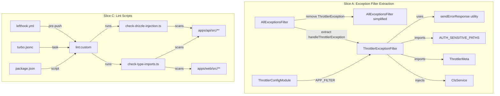
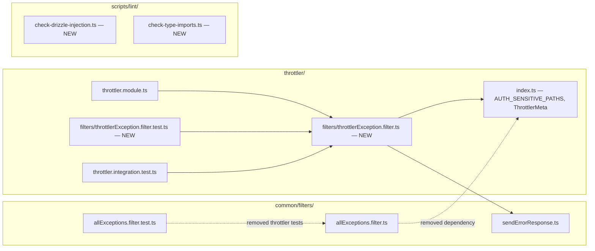

## Summary

Extract ThrottlerException handling into a dedicated per-domain filter, annotate all RLS-bypassing services with standardized comments, create two Bun TS lint scripts enforcing DRIZZLE injection paths and @repo/types import boundaries, and update documentation. Four slices: A+B run in parallel, C depends on B, D depends on all.

## Architecture





## Agents

| Agent | Task Count | Files |
|-------|-----------|-------|
| backend-dev | 9 (Slice A impl + Slice B) | allExceptions.filter.ts, throttlerException.filter.ts, throttler.module.ts, 15 service files |
| tester | 3 (Slice A tests) | throttlerException.filter.test.ts, throttler.integration.test.ts, allExceptions.filter.test.ts |
| devops | 5 (Slice C) | scripts/lint/*.ts, lefthook.yml, turbo.jsonc, package.json |
| doc-writer | 3 (Slice D) | code-review.mdx, CLAUDE.md, apps/api/CLAUDE.md |

## Consistency Report

17 success criteria in spec → 17 tasks in plan. All criteria mapped.

| Criteria | Task |
|----------|------|
| SC-1: AllExceptionsFilter zero instanceof beyond HttpException | T3 |
| SC-2: ThrottlerExceptionFilter registered in ThrottlerConfigModule | T1, T2 |
| SC-3: Throttled requests return correct response | T1 |
| SC-4: ThrottlerExceptionFilter unit tests | T4 |
| SC-5: Integration test updated | T5 |
| SC-6: All 15 services have RLS-BYPASS | T7, T8, T9 |
| SC-7: check-drizzle-injection exits 0 | T10 |
| SC-8: check-drizzle-injection exits 1 on violation | T10 |
| SC-9: check-type-imports exits 0 | T11 |
| SC-10: check-type-imports exits 1 on violation | T11 |
| SC-11: bun run lint:custom runs both | T12 |
| SC-12: Pre-push hook | T14 |
| SC-13: CI runs lint:custom | T13 |
| SC-14: code-review.mdx checklist | T15 |
| SC-15: CLAUDE.md documents lint:custom | T16 |
| SC-16: apps/api/CLAUDE.md documents conventions | T17 |
| SC-17: Zero test regressions | T4, T5, T6 |

## Micro-Tasks

### Slice A: ThrottlerExceptionFilter Extraction

---

#### T1: Create ThrottlerExceptionFilter [P]
**Agent:** backend-dev
**Spec trace:** SC-2, SC-3
**File:** `apps/api/src/throttler/filters/throttlerException.filter.ts` (NEW)
**Phase:** RED → GREEN
**Difficulty:** 3

Create `@Catch(ThrottlerException)` filter. Inject `ClsService`. Move full `handleThrottlerException` logic from `AllExceptionsFilter`:
- Extract `ThrottlerMeta` from `request.throttlerMeta`
- Compute `retryAfterSeconds` from `meta.reset`
- Set `Retry-After` header always
- Suppress `X-RateLimit-*` headers for `AUTH_SENSITIVE_PATHS`
- Build error response with `errorCode: RATE_LIMIT_EXCEEDED`
- Structured warn log: `RATE_LIMIT tracker= path= tier=`
- Call `sendErrorResponse()` + set additional headers

```typescript
// Expected shape
@Catch(ThrottlerException)
export class ThrottlerExceptionFilter implements ExceptionFilter {
  constructor(private readonly cls: ClsService) {}
  catch(exception: ThrottlerException, host: ArgumentsHost) { /* ... */ }
}
```

**Verify:** `bun run typecheck --filter=@repo/api`
**Expected:** Exit 0

**Reference patterns:**
- `apps/api/src/rbac/filters/rbacException.filter.ts` — per-domain filter pattern
- `apps/api/src/common/filters/allExceptions.filter.ts:111-155` — logic to move

---

#### T2: Register ThrottlerExceptionFilter in ThrottlerConfigModule
**Agent:** backend-dev
**Spec trace:** SC-2
**File:** `apps/api/src/throttler/throttler.module.ts` (MODIFY)
**Depends:** T1
**Phase:** GREEN
**Difficulty:** 1

Add `{ provide: APP_FILTER, useClass: ThrottlerExceptionFilter }` to module providers.

**Verify:** `grep -n "ThrottlerExceptionFilter" apps/api/src/throttler/throttler.module.ts`
**Expected:** Provider registration line found

---

#### T3: Strip ThrottlerException handling from AllExceptionsFilter
**Agent:** backend-dev
**Spec trace:** SC-1
**File:** `apps/api/src/common/filters/allExceptions.filter.ts` (MODIFY)
**Depends:** T1
**Phase:** REFACTOR
**Difficulty:** 2

Remove:
- `import { ThrottlerException }` and `import { AUTH_SENSITIVE_PATHS, ThrottlerMeta }`
- `instanceof ThrottlerException` branch (lines 55-59)
- `handleThrottlerException()` private method (lines 111-155)
- `import { ErrorCode }` if only used by throttler handler

**Verify:** `grep -c "ThrottlerException\|handleThrottlerException\|AUTH_SENSITIVE_PATHS" apps/api/src/common/filters/allExceptions.filter.ts`
**Expected:** 0

---

#### T4: Create ThrottlerExceptionFilter unit test [P]
**Agent:** tester
**Spec trace:** SC-4
**File:** `apps/api/src/throttler/filters/throttlerException.filter.test.ts` (NEW)
**Phase:** RED → GREEN
**Difficulty:** 3

Test cases:
- Returns 429 with correct response shape (statusCode, timestamp, path, correlationId, message, errorCode)
- Sets `Retry-After` header
- Sets `X-RateLimit-*` headers when meta present and path is not auth-sensitive
- Suppresses `X-RateLimit-*` headers for auth-sensitive paths
- Structured warn log with tracker, path, tier

**Reference:** `apps/api/src/common/filters/allExceptions.filter.test.ts:194-296` (existing throttler tests to adapt)

**Verify:** `cd apps/api && bun run test -- --run src/throttler/filters/throttlerException.filter.test.ts`
**Expected:** All tests pass

---

#### T5: Update throttler integration test
**Agent:** tester
**Spec trace:** SC-5
**File:** `apps/api/src/throttler/throttler.integration.test.ts` (MODIFY)
**Depends:** T1, T3
**Phase:** GREEN
**Difficulty:** 2

Co-register `ThrottlerExceptionFilter` alongside `AllExceptionsFilter` in the test module setup. Ensure existing 429 test cases still pass with the new filter handling ThrottlerException.

**Verify:** `cd apps/api && bun run test -- --run src/throttler/throttler.integration.test.ts`
**Expected:** All tests pass

---

#### T6: Remove throttler test cases from AllExceptionsFilter test
**Agent:** tester
**Spec trace:** SC-17
**File:** `apps/api/src/common/filters/allExceptions.filter.test.ts` (MODIFY)
**Depends:** T3
**Phase:** REFACTOR
**Difficulty:** 1

Remove `describe('ThrottlerException handling', ...)` block (lines ~194-296). AllExceptionsFilter no longer handles ThrottlerException — those tests live in T4 now.

**Verify:** `cd apps/api && bun run test -- --run src/common/filters/allExceptions.filter.test.ts`
**Expected:** All remaining tests pass

---

**RED-GATE: Slice A** — Verify all exception filter tests pass before proceeding:
```bash
cd apps/api && bun run test -- --run src/throttler/ src/common/filters/
```

### Slice B: RLS-BYPASS Annotations (parallel with Slice A)

---

#### T7: Add RLS-BYPASS to 9 admin service files [P]
**Agent:** backend-dev
**Spec trace:** SC-6
**Phase:** GREEN
**Difficulty:** 1

Add `// RLS-BYPASS: superadmin — org-scoped queries across all tenants` (or appropriate reason) to the `@Inject(DRIZZLE)` line in each:

| File | Reason |
|------|--------|
| `apps/api/src/admin/adminMembers.service.ts` | superadmin — cross-tenant member queries |
| `apps/api/src/admin/adminUsers.service.ts` | superadmin — cross-tenant user management |
| `apps/api/src/admin/adminUsers.query.ts` | superadmin — cross-tenant user queries |
| `apps/api/src/admin/adminUsers.lifecycle.ts` | superadmin — user lifecycle (ban/unban/delete) |
| `apps/api/src/admin/adminOrganizations.service.ts` | superadmin — cross-tenant org management |
| `apps/api/src/admin/adminOrganizations.query.ts` | superadmin — cross-tenant org queries |
| `apps/api/src/admin/adminOrganizations.deletion.ts` | superadmin — org deletion across tenants |
| `apps/api/src/admin/adminInvitations.service.ts` | superadmin — cross-tenant invitation management |
| `apps/api/src/admin/adminAuditLogs.service.ts` | superadmin — cross-tenant audit log queries |

**Verify:** `grep -c "RLS-BYPASS" apps/api/src/admin/*.ts`
**Expected:** 9 files with matches

---

#### T8: Add RLS-BYPASS to 4 non-admin service files [P]
**Agent:** backend-dev
**Spec trace:** SC-6
**Phase:** GREEN
**Difficulty:** 1

| File | Reason |
|------|--------|
| `apps/api/src/rbac/permission.service.ts` | RBAC resolution — cross-tenant permission queries |
| `apps/api/src/tenant/tenant.service.ts` | tenant setup — manages RLS via SET LOCAL ROLE |
| `apps/api/src/tenant/tenant.interceptor.ts` | tenant resolution — org lookup before RLS context |
| `apps/api/src/gdpr/gdpr.service.ts` | GDPR export — cross-tenant data access |

**Verify:** `grep -rn "RLS-BYPASS" apps/api/src/rbac/ apps/api/src/tenant/ apps/api/src/gdpr/`
**Expected:** 4 files with matches

---

#### T9: Verify existing RLS-BYPASS annotations [P]
**Agent:** backend-dev
**Spec trace:** SC-6
**Phase:** GREEN
**Difficulty:** 1

Confirm `auth.service.ts` and `purge.service.ts` already have `// RLS-BYPASS:` comments. Standardize format if needed.

**Verify:** `grep -rn "RLS-BYPASS" apps/api/src/auth/auth.service.ts apps/api/src/purge/purge.service.ts`
**Expected:** 2 matches

---

**RED-GATE: Slice B** — Verify total RLS-BYPASS count:
```bash
grep -rn "RLS-BYPASS" apps/api/src/ | wc -l
# Expected: 15
```

### Slice C: Lint Scripts + CI Integration (depends on Slice B)

---

#### T10: Create check-drizzle-injection.ts [P]
**Agent:** devops
**Spec trace:** SC-7, SC-8
**File:** `scripts/lint/check-drizzle-injection.ts` (NEW)
**Phase:** RED → GREEN
**Difficulty:** 3

Bun TS script that:
1. Globs `apps/api/src/**/*.ts` for files containing `@Inject(DRIZZLE)`
2. For each match, checks if the file path (relative to `apps/api/src/`) matches an allowed pattern:
   - `**/*.repository.ts`
   - `admin/**`
   - `rbac/permission.service.ts`
   - `auth/auth.service.ts`
   - `tenant/tenant.service.ts`
   - `tenant/tenant.interceptor.ts`
   - `purge/purge.service.ts`
   - `gdpr/gdpr.service.ts`
3. If any file doesn't match → print violation with file:line → exit 1
4. If all match → print "✓ No DRIZZLE injection violations" → exit 0

**Verify:** `bun run scripts/lint/check-drizzle-injection.ts`
**Expected:** Exit 0, prints success message

---

#### T11: Create check-type-imports.ts [P]
**Agent:** devops
**Spec trace:** SC-9, SC-10
**File:** `scripts/lint/check-type-imports.ts` (NEW)
**Phase:** RED → GREEN
**Difficulty:** 2

Bun TS script that:
1. Greps `apps/web/src/**/*.{ts,tsx}` for `@repo/types/api` imports → violation
2. Greps `apps/api/src/**/*.ts` for `@repo/types/ui` imports → violation
3. Print violations with file:line → exit 1 if any found
4. Otherwise → print "✓ No @repo/types import boundary violations" → exit 0

**Verify:** `bun run scripts/lint/check-type-imports.ts`
**Expected:** Exit 0 (no violations exist yet)

---

#### T12: Add lint:custom script to root package.json
**Agent:** devops
**Spec trace:** SC-11
**File:** `package.json` (MODIFY)
**Depends:** T10, T11
**Phase:** GREEN
**Difficulty:** 1

Add: `"lint:custom": "bun run scripts/lint/check-drizzle-injection.ts && bun run scripts/lint/check-type-imports.ts"`

**Verify:** `bun run lint:custom`
**Expected:** Both scripts run, exit 0

---

#### T13: Add lint:custom task to turbo.jsonc
**Agent:** devops
**Spec trace:** SC-13
**File:** `turbo.jsonc` (MODIFY)
**Depends:** T12
**Phase:** GREEN
**Difficulty:** 1

Add `lint:custom` task with `inputs: ["apps/api/src/**", "apps/web/src/**", "packages/types/src/**"]` so Turbo caches correctly and CI runs it.

**Verify:** `grep -A5 "lint:custom" turbo.jsonc`
**Expected:** Task definition with inputs

---

#### T14: Add lint:custom to lefthook pre-push
**Agent:** devops
**Spec trace:** SC-12
**File:** `lefthook.yml` (MODIFY)
**Depends:** T12
**Phase:** GREEN
**Difficulty:** 1

Add `lint:custom` command to the `pre-push` section: `run: bun run lint:custom`

**Verify:** `grep -A2 "lint.custom\|lint:custom" lefthook.yml`
**Expected:** Entry in pre-push commands

---

**RED-GATE: Slice C** — Verify full lint pipeline:
```bash
bun run lint:custom
# Expected: exit 0
```

### Slice D: Doc Updates (depends on A+B+C)

---

#### T15: Add RLS bypass checklist to code-review.mdx
**Agent:** doc-writer
**Spec trace:** SC-14
**File:** `docs/standards/code-review.mdx` (MODIFY)
**Phase:** GREEN
**Difficulty:** 1

Add to the review checklist (Security category): "If `@Inject(DRIZZLE)` is used, verify file is in allowed paths and has `// RLS-BYPASS: <reason>` comment"

---

#### T16: Document lint:custom in root CLAUDE.md
**Agent:** doc-writer
**Spec trace:** SC-15
**File:** `CLAUDE.md` (MODIFY)
**Phase:** GREEN
**Difficulty:** 1

Add `lint:custom` to the Commands table. Add note about `@repo/types` import boundary under Gotchas.

---

#### T17: Document conventions in apps/api/CLAUDE.md
**Agent:** doc-writer
**Spec trace:** SC-16
**File:** `apps/api/CLAUDE.md` (MODIFY)
**Phase:** GREEN
**Difficulty:** 1

Add to Gotchas section:
- `// RLS-BYPASS: <reason>` convention and when to use it
- Allowed `@Inject(DRIZZLE)` paths
- `bun run lint:custom` for enforcement
