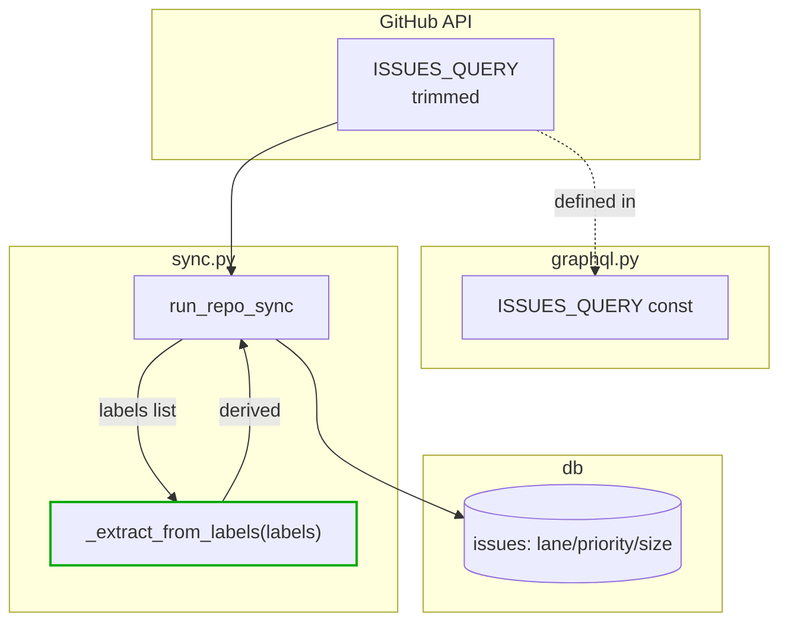
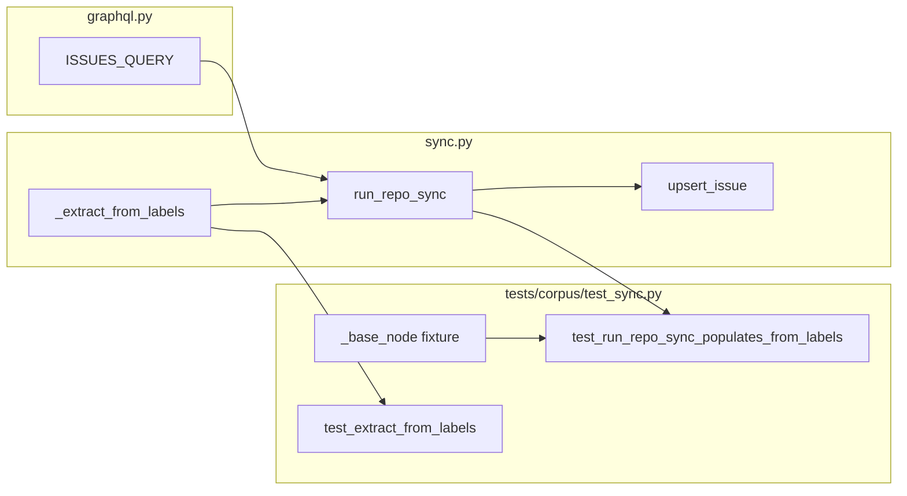

## Summary

Replace the `projectItems` GraphQL branch with a label-based derivation in
corpus sync. Three slices, single backend domain, ~4 files touched.

## Architecture





## Bootstrap Context

- `src/roxabi_live/corpus/graphql.py` — `ISSUES_QUERY` currently has
  `projectItems(first: 5) { nodes { project { title } fieldValues { ... } } }`
  to strip (lines 38–56). Keep `labels(first: 30)` (line 33).
- `src/roxabi_live/corpus/sync.py` — `_parse_project_fields` (lines 29–67)
  to delete; caller at line 235 (`issue.update(_parse_project_fields(node, repo))`)
  to swap for `issue.update(_extract_from_labels(labels_list)); issue["status"] = None`.
- Label normalization logic already exists in
  `src/roxabi_live/dep_graph/v6/parse.py::derive_priority/derive_lane_size`.
  **Do NOT import from dep_graph into corpus** (layering: corpus is lower).
  Copy a small variant into `corpus/sync.py` (adds `size:*` canonical vocab
  `S|F-lite|F-full` alongside legacy `XS|S|M|L|XL`; covers legacy `size:M` →
  `F-lite` per spec mapping table).
- `tests/corpus/test_sync.py` — `_base_node` at line 65 carries
  `"projectItems": {"nodes": []}` (line 81); drop it. Tests at lines 225+ and
  269+ are ProjectV2-specific and must be removed/rewritten.
- `src/roxabi_live/corpus/schema.py` — `status` column stays (line not
  changed). `run_repo_sync` writes `status=None`.

## Agents

| Agent | Task count | Files |
|-------|------------|-------|
| backend-dev | 6 | `corpus/graphql.py`, `corpus/sync.py` |
| tester | 3 | `tests/corpus/test_sync.py` |

## Consistency Report

- Covered: 7/7 success criteria mapped to tasks
- Uncovered: 0
- Untraced tasks: 0
- Exemptions: none

| SC | Task(s) |
|----|---------|
| SC-1 (ISSUES_QUERY trimmed) | T3 |
| SC-2 (_extract_from_labels API) | T1, T2 |
| SC-3 (_parse_project_fields deleted) | T6 |
| SC-4 (status written NULL) | T5 |
| SC-5 (test fixture cleanup + new tests) | T2, T4, T7 |
| SC-6 (post-rebuild lane populated) | T8 (manual verify) |
| SC-7 (pytest green) | T9 (gate) |

## Task IDs

<!-- Generated by /plan. Used by /implement to resume tasks on session restart. -->
- T1: 1 — [RED] write failing unit tests for _extract_from_labels
- T2: 2 — [GREEN] implement _extract_from_labels in corpus/sync.py
- T3: 3 — [RED-GATE] V1 slice gate
- T4: 4 — [RED] drop projectItems from fixture + add label-driven populate test
- T5: 5 — [GREEN] trim ISSUES_QUERY, swap caller, write status=None
- T6: 6 — [REFACTOR] delete dead _parse_project_fields
- T7: 7 — [RED-GATE] V2 slice gate
- T8: 8 — manual corpus rebuild + smoke check
- T9: 9 — [GATE] full test suite

## Micro-Tasks

### Slice V1 — `_extract_from_labels` helper + unit tests

**T1 [RED] — write failing unit tests for `_extract_from_labels`**
- File: `tests/corpus/test_sync.py`
- Verify: `uv run pytest tests/corpus/test_sync.py::test_extract_from_labels -x`
- Expected: `AttributeError` / `ImportError` — helper not yet exported
- Cases: canonical size (`size:S|F-lite|F-full`), canonical priority
  (`priority:P0..P3`), legacy priority (`P1-high`, `priority:high`, etc.),
  legacy `size:M` → `F-lite`, lane (`graph:lane/a1`), empty labels → all None.
- Agent: tester · Slice: V1 · Phase: RED · Difficulty: 2 · Parallel-safe: Y
- Spec trace: SC-2, SC-5

**T2 [GREEN] — implement `_extract_from_labels` in `corpus/sync.py`**
- File: `src/roxabi_live/corpus/sync.py`
- Snippet:
  ```python
  _CANONICAL_SIZES = {"S", "F-lite", "F-full"}
  _LEGACY_SIZE_RAW = {"XS", "S", "M", "L", "XL"}
  _LEGACY_SIZE_MAP = {"M": "F-lite"}  # closed-issue drift → canonical

  def _extract_from_labels(labels: list[str]) -> dict[str, str | None]:
      lane: str | None = None
      priority: str | None = None
      size: str | None = None
      for lbl in labels:
          if lane is None and lbl.startswith("graph:lane/"):
              lane = lbl[len("graph:lane/"):]
          if priority is None:
              if lbl == "P0" or lbl == "priority:P0":
                  priority = "P0"
              elif lbl in ("P1-high", "priority:high", "priority:P1"):
                  priority = "P1"
              elif lbl in ("P2-medium", "priority:medium", "priority:P2"):
                  priority = "P2"
              elif lbl in ("P3-low", "priority:low", "priority: low", "priority:P3"):
                  priority = "P3"
          if size is None and lbl.startswith("size:"):
              raw = lbl[len("size:"):]
              size = _LEGACY_SIZE_MAP.get(raw, raw) if raw in _CANONICAL_SIZES or raw in _LEGACY_SIZE_MAP else raw
      if size is None:
          for lbl in labels:
              if lbl in _LEGACY_SIZE_RAW:
                  size = lbl
                  break
      return {"lane": lane, "priority": priority, "size": size}
  ```
- Verify: `uv run pytest tests/corpus/test_sync.py::test_extract_from_labels -x`
- Expected: all cases pass
- Agent: backend-dev · Slice: V1 · Phase: GREEN · Difficulty: 3 · Parallel-safe: N
- Spec trace: SC-2 · Depends: T1

**T3 [RED-GATE] — V1 slice gate**
- Verify: `uv run pytest tests/corpus/test_sync.py -x && uv run ruff check src/roxabi_live/corpus/sync.py`
- Expected: green; no unused imports; extractor covered
- Agent: tester · Slice: V1 · Phase: RED-GATE · Difficulty: 1
- Depends: T1, T2

### Slice V2 — trim GraphQL query + swap caller

**T4 [RED] — update test fixture `_base_node` to drop `projectItems`**
- File: `tests/corpus/test_sync.py` (line 81)
- Action: delete `"projectItems": {"nodes": []},`; rewrite/remove the two
  project-specific tests at ~line 225 and ~line 269 (replace with a
  label-driven populate test: labels `[size:F-lite, priority:P2, graph:lane/a1]`
  → assert `issues.lane='a1', priority='P2', size='F-lite'`).
- Verify: `uv run pytest tests/corpus/test_sync.py -x`
- Expected: **FAIL** — sync still expects `projectItems` key, and new
  label-driven test sees NULLs because caller still uses
  `_parse_project_fields`.
- Agent: tester · Slice: V2 · Phase: RED · Difficulty: 3 · Parallel-safe: N
- Spec trace: SC-5 · Depends: T3

**T5 [GREEN] — trim `ISSUES_QUERY` + swap caller + write `status=None`**
- Files: `src/roxabi_live/corpus/graphql.py` (lines 38–56),
  `src/roxabi_live/corpus/sync.py` (line 235 region in `run_repo_sync`)
- Actions:
  1. In `graphql.py`: remove the entire `projectItems(first: 5) { ... }`
     block from `ISSUES_QUERY`.
  2. In `sync.py`: replace `issue.update(_parse_project_fields(node, repo))`
     with:
     ```python
     label_names = [n["name"] for n in node["labels"]["nodes"]]
     issue.update(_extract_from_labels(label_names))
     issue["status"] = None
     ```
     (This computes `label_names` once; the existing line at ~238 that
     rebuilds the same list for `upsert_labels` can be updated to reuse
     `label_names`.)
- Verify: `uv run pytest tests/corpus/test_sync.py -x`
- Expected: green
- Agent: backend-dev · Slice: V2 · Phase: GREEN · Difficulty: 3 · Parallel-safe: N
- Spec trace: SC-1, SC-4 · Depends: T4

**T6 [REFACTOR] — delete dead `_parse_project_fields`**
- File: `src/roxabi_live/corpus/sync.py` (lines 29–67)
- Verify: `grep -n _parse_project_fields src/ tests/ | grep -v '^$'` → empty
- Expected: no remaining references
- Agent: backend-dev · Slice: V2 · Phase: REFACTOR · Difficulty: 1 · Parallel-safe: N
- Spec trace: SC-3 · Depends: T5

**T7 [RED-GATE] — V2 slice gate**
- Verify: `uv run pytest tests/corpus/test_sync.py -x && uv run ruff check . && uv run pyright src/roxabi_live/corpus/`
- Expected: all green, no unused-import warnings
- Agent: tester · Slice: V2 · Phase: RED-GATE · Difficulty: 1
- Depends: T4, T5, T6

### Slice V3 — Post-sync verification

**T8 — manual corpus rebuild + smoke check**
- Action: `rm ~/.roxabi/corpus.db && uv run python -c "from roxabi_live.corpus.sync import run_sync; from roxabi_live.corpus.schema import bootstrap, connect; import pathlib; p=pathlib.Path.home()/'.roxabi/corpus.db'; bootstrap(p); print(run_sync(connect(p), 'Roxabi'))"`
- Verify: `sqlite3 ~/.roxabi/corpus.db "SELECT COUNT(*) FROM issues WHERE lane IS NOT NULL"` > 0
- Expected: non-zero count (today = 0)
- Agent: backend-dev · Slice: V3 · Phase: GREEN · Difficulty: 2 · Parallel-safe: N
- Spec trace: SC-6 · Depends: T7

**T9 [GATE] — full test suite**
- Verify: `uv run pytest && uv run ruff check . && uv run ruff format --check .`
- Expected: all green
- Agent: tester · Slice: V3 · Phase: RED-GATE · Difficulty: 1
- Spec trace: SC-7 · Depends: T8
