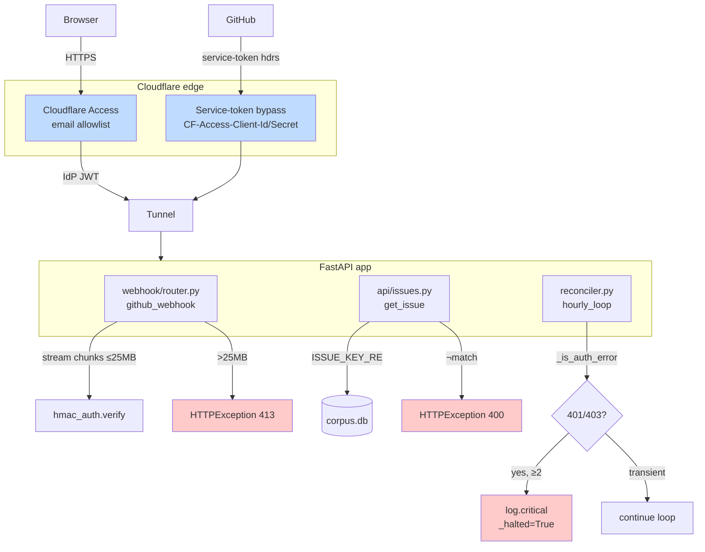
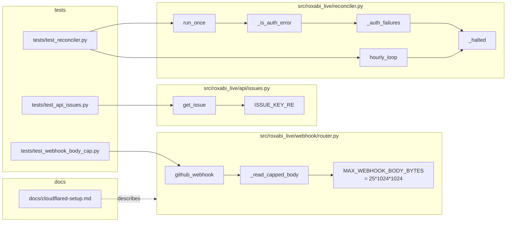

## Summary

Four defense-in-depth findings from PR #55 review: streamed-read body cap on `/webhook/github` (SEC-1), regex guard on `GET /api/issues/{key:path}` (SEC-2), auth-aware halt in the reconciler (SEC-3), and Cloudflare Access on `dashboard.roxabi.dev` with a service-token bypass for GitHub webhook delivery (SEC-4). Locked design choices from planning: streamed-read check inside `github_webhook` (simpler than ASGI middleware) and service-token exemption (cleaner identity boundary than WAF IP allowlist).

## Architecture

### Data flow



### File × Function map



## Bootstrap Context

- Spec: `artifacts/specs/56-harden-public-api-spec.mdx` (4 slices, 11 acceptance criteria)
- Frame: `artifacts/frames/56-harden-public-api-frame.mdx` (F-lite)
- Reference patterns:
  - `src/roxabi_live/webhook/router.py:48` — current unbounded `await request.body()` call site
  - `src/roxabi_live/api/issues.py:124-139` — current `get_issue` path handler (add guard as first line)
  - `src/roxabi_live/reconciler.py:32-49` — current `run_once` except-branch (insert auth classifier here)
  - `tests/test_webhook_router.py` — HMAC + event dispatch test patterns (signature, body, TestClient)
  - `tests/test_reconciler.py` — mocking `corpus_sync.run_sync` with `MagicMock` side_effect
  - `tests/test_api_issues.py` — `httpx.AsyncClient` + ASGI fixture
- Design locks:
  - **SEC-1:** streamed-read check inside `github_webhook` via `async for chunk in request.stream()`
  - **SEC-4:** service-token exemption (GitHub webhook sends `CF-Access-Client-Id` + `CF-Access-Client-Secret` headers; Access app has service-token policy that allows delivery without IdP)

## Agents

| Agent | Tasks | Files |
|-------|-------|-------|
| tester | T1, T4, T7 | `tests/test_webhook_body_cap.py` (new), `tests/test_api_issues.py`, `tests/test_reconciler.py` |
| backend-dev | T2, T5, T8 | `src/roxabi_live/webhook/router.py`, `src/roxabi_live/api/issues.py`, `src/roxabi_live/reconciler.py` |
| doc-writer | T10 | `docs/cloudflared-setup.md` |
| devops | T11 support | (manual Cloudflare dashboard step, user executes) |

RED-GATE sentinels (T3, T6, T9, T12) are self-executed verification tasks, not agent-owned.

## Consistency Report

| Acceptance criterion | Task | Covered |
|----------------------|------|---------|
| body >25 MB → 413 + warning, not fully read | T1, T2 | ✓ |
| body ≤25 MB → unchanged behavior | T1, T2 | ✓ |
| `/api/issues/foo` → 400 + detail | T4, T5 | ✓ |
| `/api/issues/..%2F..%2Fetc%2Fpasswd` → 400 | T4, T5 | ✓ |
| valid key → 200/404 | T4, T5 | ✓ |
| two consecutive 401 → loop exits + CRITICAL | T7, T8 | ✓ |
| transient errors do not increment counter | T7, T8 | ✓ |
| `docs/cloudflared-setup.md` Access section | T10 | ✓ |
| Access live, `curl -sI` → 302 | T11, T12 | ✓ (manual) |
| GitHub webhook still succeeds | T11, T12 | ✓ (manual) |
| `pytest` / `ruff` / `pyright` clean | RED-GATE T3/T6/T9 + final T12 | ✓ |

Coverage: **11/11**. No untraced tasks. Exemptions: none.

## Micro-Tasks

### Slice V1 — Webhook body cap (SEC-1)

**T1 [P] [RED] · tester · V1 · diff=2 · trace=SC-1,SC-2**
- File: `tests/test_webhook_body_cap.py` (new)
- Shape: three async tests using `httpx.AsyncClient` + `ASGITransport`
  - `test_post_body_over_cap_returns_413` — body of `26 * 1024 * 1024` bytes + valid signature → 413
  - `test_post_body_at_cap_passes_through` — body just below cap → 401 (bad sig) or 200, proving size gate was not the reject site
  - `test_post_body_under_cap_unchanged` — normal small payload with valid HMAC → 200 (or the existing dispatch behavior)
- Verify: `uv run pytest tests/test_webhook_body_cap.py -x` — all three fail (RED)
- Expected: import error or assertion on missing 413 behavior

**T2 [GREEN] · backend-dev · V1 · diff=3 · trace=SC-1,SC-2 · deps=T1**
- File: `src/roxabi_live/webhook/router.py`
- Shape:
  ```python
  MAX_WEBHOOK_BODY_BYTES = 25 * 1024 * 1024  # 25 MB

  async def _read_capped_body(request: Request) -> bytes:
      total = 0
      chunks: list[bytes] = []
      async for chunk in request.stream():
          total += len(chunk)
          if total > MAX_WEBHOOK_BODY_BYTES:
              log.warning("webhook body exceeded %d bytes; rejecting", MAX_WEBHOOK_BODY_BYTES)
              raise HTTPException(status_code=413, detail="payload too large")
          chunks.append(chunk)
      return b"".join(chunks)
  ```
  Replace line 48 `body = await request.body()` with `body = await _read_capped_body(request)`. Reuse `body` for later `request.json()` via `json.loads(body)` (avoid re-reading the stream).
- Verify: `uv run pytest tests/test_webhook_body_cap.py tests/test_webhook_router.py -x`
- Expected: V1 tests pass; existing webhook router tests still pass

**T3 [RED-GATE] · V1**
- Verify: `uv run ruff check src/roxabi_live/webhook/router.py && uv run pyright src/roxabi_live/webhook/router.py && uv run pytest tests/test_webhook_body_cap.py tests/test_webhook_router.py`
- Expected: clean + green

### Slice V2 — Issue key validation (SEC-2)

**T4 [P] [RED] · tester · V2 · diff=2 · trace=SC-3,SC-4,SC-5**
- File: `tests/test_api_issues.py` (extend)
- Shape: add three parametrized tests against `/api/issues/{key:path}`
  - `test_get_issue_invalid_key_returns_400` — keys like `"foo"`, `"not-a-key"`, `"owner/repo"` (missing `#N`) → 400 with detail naming the regex shape
  - `test_get_issue_traversal_returns_400` — `..%2F..%2Fetc%2Fpasswd` → 400
  - `test_get_issue_valid_present_returns_200` — valid seeded key → 200 (already exists; keep as regression baseline)
  - `test_get_issue_valid_absent_returns_404` — valid shape but no row → 404 (existing behavior preserved)
- Verify: `uv run pytest tests/test_api_issues.py -x`
- Expected: two new tests fail (RED)

**T5 [GREEN] · backend-dev · V2 · diff=2 · trace=SC-3,SC-4,SC-5 · deps=T4**
- File: `src/roxabi_live/api/issues.py`
- Shape: add at module scope near `_parse_key`:
  ```python
  ISSUE_KEY_RE = re.compile(r"^[A-Za-z0-9._-]+/[A-Za-z0-9._-]+#[0-9]+$")
  ```
  First line of `get_issue` body:
  ```python
  if not ISSUE_KEY_RE.fullmatch(key):
      raise HTTPException(
          status_code=400,
          detail="invalid issue key; expected '<owner>/<repo>#<number>'",
      )
  ```
- Verify: `uv run pytest tests/test_api_issues.py -x`
- Expected: all green

**T6 [RED-GATE] · V2**
- Verify: `uv run ruff check src/roxabi_live/api/issues.py && uv run pyright src/roxabi_live/api/issues.py && uv run pytest tests/test_api_issues.py`
- Expected: clean + green

### Slice V3 — Reconciler auth-aware halt (SEC-3)

**T7 [P] [RED] · tester · V3 · diff=3 · trace=SC-6,SC-7**
- File: `tests/test_reconciler.py` (extend)
- Shape:
  - `test_two_consecutive_auth_errors_halt_loop` — patch `corpus_sync.run_sync` with `side_effect` raising a fake `HTTPError` with `.response.status_code = 401` twice; `hourly_loop(interval_seconds=0.01)` task completes (loop exited) within ~100ms; `caplog` captures a `CRITICAL` record on the `roxabi_live.reconciler` logger
  - `test_single_auth_error_then_success_resets_counter` — 401 then success, counter back to 0, loop keeps running (cancel manually)
  - `test_transient_oserror_does_not_increment_counter` — `OSError("connection reset")` → counter unchanged, `_halted` stays False
  - `test_module_state_resets_between_tests` fixture (autouse) — resets `reconciler._auth_failures` and `reconciler._halted` before each test
- Verify: `uv run pytest tests/test_reconciler.py -x`
- Expected: new tests fail (RED)

**T8 [GREEN] · backend-dev · V3 · diff=4 · trace=SC-6,SC-7 · deps=T7**
- File: `src/roxabi_live/reconciler.py`
- Shape:
  ```python
  _AUTH_FAILURE_THRESHOLD = 2
  _auth_failures: int = 0
  _halted: bool = False


  def _is_auth_error(exc: BaseException) -> bool:
      status = getattr(getattr(exc, "response", None), "status_code", None)
      if status in (401, 403):
          return True
      status = getattr(exc, "status", None)  # PyGithub GithubException
      return status in (401, 403)


  async def run_once() -> None:
      global _auth_failures, _halted
      if _halted:
          return
      try:
          db = _db_path()
          org = _org()
          conn = sqlite3.connect(db)
          try:
              await asyncio.to_thread(corpus_sync.run_sync, conn, org)
          finally:
              conn.close()
          _auth_failures = 0
      except Exception as exc:
          if _is_auth_error(exc):
              _auth_failures += 1
              if _auth_failures >= _AUTH_FAILURE_THRESHOLD:
                  _halted = True
                  log.critical(
                      "reconciler halted: %d consecutive auth failures",
                      _auth_failures,
                  )
                  return
          log.exception("reconciler run_once failed")
  ```
  Update `hourly_loop._loop`:
  ```python
  async def _loop() -> None:
      while not _halted:
          await asyncio.sleep(interval_seconds)
          if _halted:
              break
          await run_once()
  ```
- Verify: `uv run pytest tests/test_reconciler.py -x`
- Expected: all green

**T9 [RED-GATE] · V3**
- Verify: `uv run ruff check src/roxabi_live/reconciler.py && uv run pyright src/roxabi_live/reconciler.py && uv run pytest tests/test_reconciler.py`
- Expected: clean + green

### Slice V4 — Cloudflare Access policy + docs (SEC-4)

**T10 [P] [DOC] · doc-writer · V4 · diff=2 · trace=SC-8**
- File: `docs/cloudflared-setup.md`
- Shape: append a new top-level section after existing tunnel provisioning:
  ```
  ## Cloudflare Access (zero-trust gate)

  ### Step A — create the Access application
  - Zero Trust dashboard → Access → Applications → Add → Self-hosted
  - Name: `Roxabi Live Dashboard`
  - Subdomain: `dashboard` · Domain: `roxabi.dev`
  - Session duration: `24h`
  - Policies → Add policy
    - Name: `Allow owner`
    - Action: `Allow`
    - Selector: `Emails` → `mickael@bouly.io`

  ### Step B — webhook bypass via service token
  - Zero Trust → Access → Service Auth → Service Tokens → Create
  - Name: `github-webhook`
  - Copy `Client ID` + `Client Secret` (shown once)
  - Back on the Access application → Policies → Add policy
    - Name: `GitHub webhook bypass`
    - Action: `Service Auth`
    - Selector: `Service Token` → `github-webhook`

  ### Step C — configure GitHub webhook headers
  - Repo settings → Webhooks → `/webhook/github` → Edit
  - Content type: `application/json`
  - Add headers via the `Secret` UI is not enough — use a GitHub App or repo-level webhook with `custom headers` (GitHub Enterprise) OR route via a small trampoline if unavailable
  - Headers:
    - `CF-Access-Client-Id: <client-id>`
    - `CF-Access-Client-Secret: <client-secret>`

  ### Step D — verify
  - Unauth: `curl -sI https://dashboard.roxabi.dev/api/issues` → `HTTP/2 302` to `cloudflareaccess.com`
  - Webhook: repo Settings → Webhooks → `…` → Recent Deliveries → Redeliver → `200 OK`
  ```
- Verify: `test -f docs/cloudflared-setup.md && grep -q "Cloudflare Access" docs/cloudflared-setup.md`
- Expected: file present + new section

**T11 [MANUAL] · user (devops support) · V4 · diff=4 · trace=SC-9,SC-10**
- Execute Cloudflare dashboard steps A–D from T10 above.
- Verify: `curl -sI https://dashboard.roxabi.dev/api/issues | head -1` → 302 to `cloudflareaccess.com`; redeliver a test webhook from repo settings → 200.
- Expected: both checks pass. Report back to the assistant so T12 can close.

**T12 [RED-GATE] · V4 final gate**
- Verify: run full suite + lint + typecheck:
  ```bash
  uv run ruff check . && uv run ruff format --check . && uv run pyright && uv run pytest
  ```
- Additionally: confirm user reported T11 checks pass.
- Expected: all green.

## Task IDs

<!-- Generated by /plan. Used by /implement to resume tasks on session restart. -->
- T1: 1 — [RED] Webhook body cap — failing tests
- T2: 2 — [GREEN] Webhook body cap — streamed-read guard
- T3: 3 — [RED-GATE] V1 verification
- T4: 4 — [RED] Issue key validation — failing tests
- T5: 5 — [GREEN] Issue key regex guard in get_issue
- T6: 6 — [RED-GATE] V2 verification
- T7: 7 — [RED] Reconciler auth-halt — failing tests
- T8: 8 — [GREEN] Reconciler auth classifier + halt flag
- T9: 9 — [RED-GATE] V3 verification
- T10: 10 — [DOC] Cloudflare Access section in cloudflared-setup.md
- T11: 11 — [MANUAL] Cloudflare dashboard: Access app + service token
- T12: 12 — [RED-GATE] V4 + final full-suite verification
