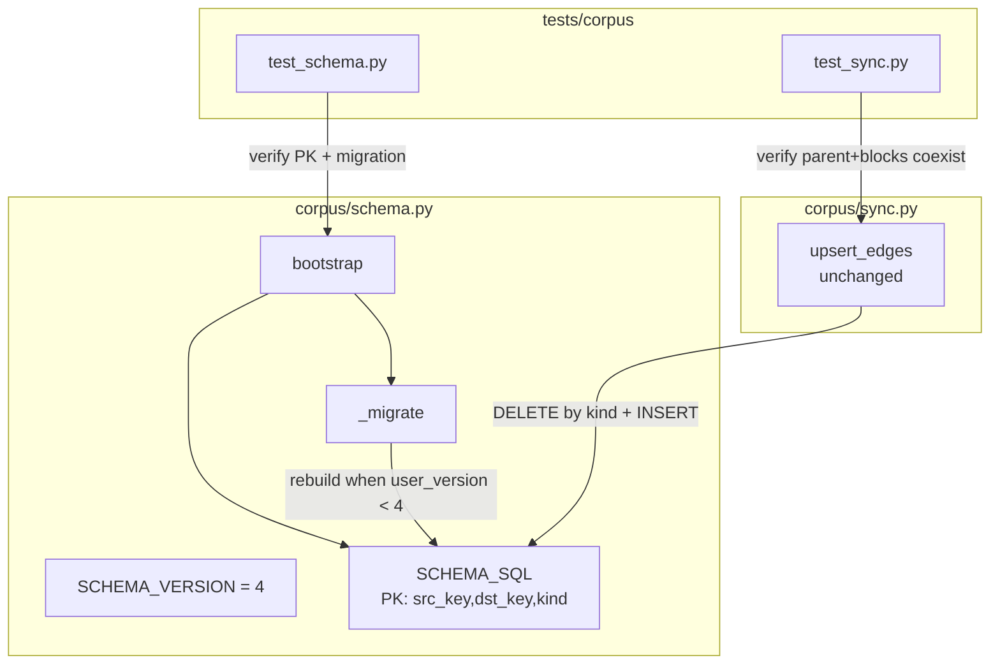
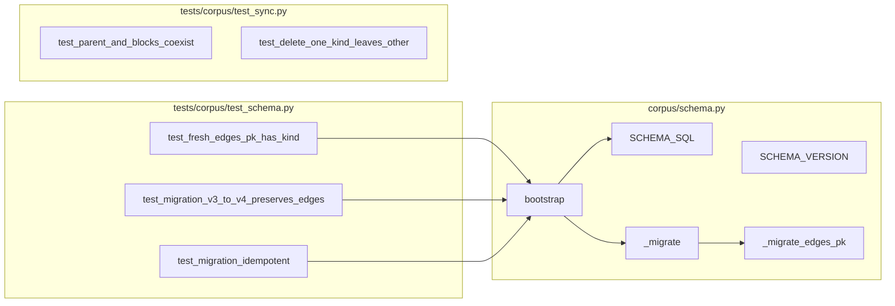

## Summary

Bump `SCHEMA_VERSION` 3→4, change `edges` PK to `(src_key, dst_key, kind)` in `SCHEMA_SQL`, add a table-rebuild migration for existing v3 DBs, and extend tests to cover the parent+blocks collision scenario.

## Architecture

### Data flow

### File × Function map

## Agents

| Agent | Tasks | Files |
|---|---|---|
| tester | T1, T2, T3, T6, T7 | tests/corpus/test_schema.py, tests/corpus/test_sync.py |
| backend-dev | T4, T5 | src/roxabi_live/corpus/schema.py |

Sequential: RED → GREEN phases block each other.

## Consistency Report

| Success Criterion | Tasks |
|---|---|
| SC-1: fresh DB has 3-col PK | T1, T4 |
| SC-2: SCHEMA_VERSION == 4 | T4 |
| SC-3: v3 DB migrates preserving rows | T2, T5 |
| SC-4: migration idempotent | T3, T5 |
| SC-5: parent+blocks coexist test | T6 |
| SC-6: delete-one-kind preserves other | T7 |
| SC-7: pytest green | T8 |
| SC-8: ruff + pyright green | T8 |

Covered: 8/8. Untraced tasks: 0. Exemptions: none.

## Micro-Tasks

### Slice V1 — Schema + migration

**T1 [P] [RED] [tester] [SC-1] [difficulty: 1]**
- **Description:** Add failing test `test_fresh_edges_pk_has_kind` to `tests/corpus/test_schema.py`. Bootstrap a fresh DB, query `PRAGMA table_info(edges)` + `PRAGMA index_list(edges)` or `sqlite_master` for the PK, assert it includes `kind`.
- **File:** `tests/corpus/test_schema.py`
- **Verify:** `uv run pytest tests/corpus/test_schema.py::test_fresh_edges_pk_has_kind -x`
- **Expected:** FAIL (current PK is `(src_key, dst_key)`)
- **Est:** 4 min

**T2 [P] [RED] [tester] [SC-3] [difficulty: 2]**
- **Description:** Add failing test `test_migration_v3_to_v4_preserves_edges`: create DB with v3 schema (inline DDL + `PRAGMA user_version = 3`), seed N edges, run `bootstrap`, assert all edges present + PK is 3-col.
- **File:** `tests/corpus/test_schema.py`
- **Verify:** `uv run pytest tests/corpus/test_schema.py::test_migration_v3_to_v4_preserves_edges -x`
- **Expected:** FAIL
- **Est:** 5 min

**T3 [P] [RED] [tester] [SC-4] [difficulty: 1]**
- **Description:** Add failing test `test_migration_v3_to_v4_idempotent`: call `bootstrap` twice on a seeded v3 DB, assert final state identical (row count + PK).
- **File:** `tests/corpus/test_schema.py`
- **Verify:** `uv run pytest tests/corpus/test_schema.py::test_migration_v3_to_v4_idempotent -x`
- **Expected:** FAIL
- **Est:** 3 min

**RED-GATE V1:** T1, T2, T3 all FAIL as expected before proceeding to GREEN.

**T4 [GREEN] [backend-dev] [SC-1, SC-2] [difficulty: 1]**
- **Description:** In `src/roxabi_live/corpus/schema.py`: change `edges` PK in `SCHEMA_SQL` to `PRIMARY KEY (src_key, dst_key, kind)`; bump `SCHEMA_VERSION = 4`.
- **File:** `src/roxabi_live/corpus/schema.py`
- **Verify:** `uv run pytest tests/corpus/test_schema.py::test_fresh_edges_pk_has_kind -x`
- **Expected:** PASS (T2/T3 still FAIL — need migration)
- **Est:** 2 min
- **Depends on:** T1

**T5 [GREEN] [backend-dev] [SC-3, SC-4] [difficulty: 3]**
- **Description:** Add `_migrate_edges_pk(conn)` to `schema.py`. Check `PRAGMA user_version`. When `< 4`: `CREATE TABLE edges_new (…PK 3-col…); INSERT INTO edges_new SELECT src_key, dst_key, kind FROM edges; DROP TABLE edges; ALTER TABLE edges_new RENAME TO edges; recreate ix_edges_dst` — all inside a transaction. Call from `_migrate` after existing migrations. Set `user_version = 4` in bootstrap (already does via `SCHEMA_VERSION`).
- **File:** `src/roxabi_live/corpus/schema.py`
- **Verify:** `uv run pytest tests/corpus/test_schema.py -x`
- **Expected:** T1, T2, T3 all PASS
- **Est:** 8 min
- **Depends on:** T2, T3, T4

### Slice V2 — End-to-end collision test

**T6 [P] [RED→GREEN] [tester] [SC-5] [difficulty: 2]**
- **Description:** Add test `test_parent_and_blocks_edges_coexist` to `tests/corpus/test_sync.py`. Bootstrap DB, upsert an issue, call `upsert_edges(conn, "K", ["P"], ["C"], kind="parent")` then `upsert_edges(conn, "K", ["B"], ["D"], kind="blocks")`. Query `SELECT src_key, dst_key, kind FROM edges WHERE dst_key='K' OR src_key='K'`, assert both kinds are present.
- **File:** `tests/corpus/test_sync.py`
- **Verify:** `uv run pytest tests/corpus/test_sync.py::test_parent_and_blocks_edges_coexist -x`
- **Expected:** PASS after V1 lands
- **Est:** 5 min
- **Depends on:** T5

**T7 [P] [RED→GREEN] [tester] [SC-6] [difficulty: 2]**
- **Description:** Add test `test_upsert_edges_delete_one_kind_preserves_other` to `tests/corpus/test_sync.py`. Seed both `parent` and `blocks` edges between same (src, dst). Call `upsert_edges(conn, ..., kind="parent")` with empty parents/children for the issue. Assert `blocks` edge still exists.
- **File:** `tests/corpus/test_sync.py`
- **Verify:** `uv run pytest tests/corpus/test_sync.py::test_upsert_edges_delete_one_kind_preserves_other -x`
- **Expected:** PASS after V1 lands
- **Est:** 5 min
- **Depends on:** T5

**T8 [REFACTOR] [backend-dev] [SC-7, SC-8] [difficulty: 1]**
- **Description:** Run full suite + lints.
- **Verify:** `uv run pytest && uv run ruff check . && uv run ruff format --check . && uv run pyright`
- **Expected:** all green
- **Est:** 3 min
- **Depends on:** T6, T7

## Task IDs

<!-- Generated by /plan. Used by /implement to resume tasks on session restart. -->
- T1: 12 — test_fresh_edges_pk_has_kind (RED)
- T2: 13 — test_migration_v3_to_v4_preserves_edges (RED)
- T3: 14 — test_migration_v3_to_v4_idempotent (RED)
- T4: 15 — bump SCHEMA_VERSION + PK (GREEN)
- T5: 16 — _migrate_edges_pk rebuild (GREEN)
- T6: 17 — test_parent_and_blocks_edges_coexist
- T7: 18 — test_upsert_edges_delete_one_kind_preserves_other
- T8: 19 — full pytest + lints green
