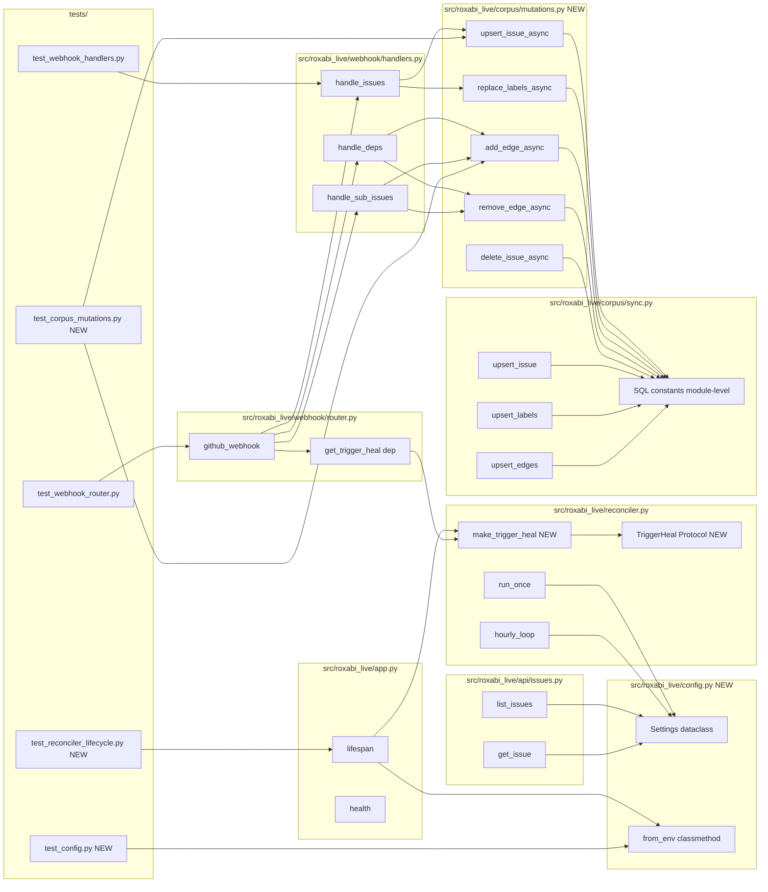

## Summary

Land 7 PR #55 review findings as a single coherent backend refactor: extract `roxabi_live.config.Settings`, push webhook writes through a new `corpus.mutations` async layer that shares SQL constants with `corpus.sync`, decouple the router from `reconciler` via a `TriggerHeal` protocol, and track all background tasks for clean shutdown + exception logging.

## Architecture

### Data flow

```mermaid
flowchart TD
    subgraph EnvLayer[env]
      E[CORPUS_DB_PATH<br/>GITHUB_ORG<br/>GITHUB_WEBHOOK_SECRET<br/>CORPUS_SYNC_INTERVAL_SECONDS]
    end
    subgraph ConfigLayer[config.py]
      S[Settings.from_env]
    end
    subgraph AppLayer[app.py lifespan]
      A[settings = Settings.from_env]
      W[app.state.background_tasks: WeakSet]
      F[trigger_heal = make_trigger_heal settings, W]
      DEP[app.dependency_overrides setup]
    end
    subgraph Reconciler[reconciler.py]
      R1[run_once settings]
      R2[hourly_loop settings]
      R3[make_trigger_heal factory]
    end
    subgraph Router[webhook/router.py]
      RT[github_webhook]
      JL[json.loads body]
      H[handle_*]
    end
    subgraph Handlers[webhook/handlers.py]
      HI[handle_issues async with conn]
      HD[handle_deps]
      HS[handle_sub_issues]
    end
    subgraph Mutations[corpus/mutations.py NEW]
      M1[upsert_issue_async]
      M2[replace_labels_async]
      M3[add_edge_async]
      M4[remove_edge_async]
      M5[delete_issue_async]
    end
    subgraph Sync[corpus/sync.py]
      SQL[(SQL constants<br/>UPSERT_ISSUE_SQL<br/>UPSERT_EDGE_SQL<br/>DELETE_EDGE_SQL<br/>DELETE_LABELS_SQL<br/>INSERT_LABEL_SQL)]
      RS[run_sync — sync path]
    end
    subgraph DB[(corpus.db)]
      T[issues, labels, edges, sync_state]
    end

    E --> S
    S --> A
    A --> W
    A --> F
    A --> DEP
    DEP -. injects .-> RT
    F --> R3
    R3 --> R1
    R1 --> RS
    RT --> JL --> H
    H --> HI
    H --> HD
    H --> HS
    HI --> M1
    HI --> M2
    HD --> M3
    HD --> M4
    HS --> M3
    HS --> M4
    M1 --> SQL
    M2 --> SQL
    M3 --> SQL
    M4 --> SQL
    M5 --> SQL
    RS --> SQL
    SQL --> T
    F -. asyncio.create_task .-> W
    style Mutations fill:#e8f5e9
    style ConfigLayer fill:#fff3e0
    style W fill:#e3f2fd
```

### File × function map



## Bootstrap Context

- **Reference patterns:**
  - `src/roxabi_live/corpus/sync.py:93-183` — `upsert_issue`, `upsert_labels`, `upsert_edges` (sync path; SQL strings to extract).
  - `src/roxabi_live/webhook/handlers.py:25-59` — current raw-SQL upsert + label DELETE+INSERT (target for `corpus.mutations` consolidation).
  - `src/roxabi_live/app.py:31-43` — current lifespan with single tracked task (model for WeakSet expansion).
  - `src/roxabi_live/dep_graph/v6/repos.py` — example of an `APIRouter` reading from `app.state` (pattern for `Settings` access).
- **Spec references:** breadboard nodes N1–N11 in `artifacts/specs/58-webhook-layer-cleanup-spec.mdx`.
- **Schema:** `edges` PK is `(src_key, dst_key, kind)` after #57 — per-edge add/remove must include `kind`.

## Agents

| Agent | Tasks | Files |
|-------|-------|-------|
| backend-dev | All implementation + tests | `src/roxabi_live/**`, `tests/**` |

Single-domain refactor; sequential within slice (config → mutations → router → tracking). Runs in worktree.

## Consistency Report

| Spec criterion | Covered by |
|----------------|------------|
| SC1 (`Settings` exists with 4 fields + `from_env`) | T1, T2 |
| SC2 (no inline `os.environ.get` outside `config`) | T3, T4 |
| SC3 (single `_db_path()` definition) | T3, T4 |
| SC4 (router has no `reconciler` import) | T9, T12 |
| SC5 (`TriggerHeal` protocol + DI) | T10, T11, T12 |
| SC6 (`corpus/mutations.py` 5 helpers) | T7 |
| SC7 (SQL constants shared by sync + async) | T6, T7 |
| SC8 (handlers.py zero raw SQL) | T13 |
| SC9 (`handle_issues` transactional) | T13 |
| SC10 (single body read + `json.loads`) | T12 |
| SC11 (`app.state.background_tasks` WeakSet) | T15, T16 |
| SC12 (lifespan cancels + awaits) | T17 |
| SC13 (non-payload columns preserved) | T5, T13 |
| SC14 (heal task exception logged) | T14, T16 |
| SC15 (shutdown cancels in <1s) | T14, T17 |
| SC16 (lint/type/tests green) | T-RGATE-4, validate gate |

Coverage: 16/16. Untraced tasks: 0. Exemptions: 0.

## Micro-Tasks

### Slice V1 — Central config (5 tasks)

**T1** `[RED] [P]` — Test `Settings.from_env` reads env vars with defaults
- File: `tests/test_config.py` (new)
- Verify: `uv run pytest tests/test_config.py -x` → **fails** (module missing)
- Spec trace: SC1 | Difficulty: 2 | Time: 5 min

**T2** `[GREEN]` — Implement `roxabi_live.config.Settings`
- File: `src/roxabi_live/config.py` (new)
- Shape: frozen dataclass with `corpus_db_path: Path`, `github_org: str = "Roxabi"`, `github_webhook_secret: str = ""`, `corpus_sync_interval_seconds: float = 3600.0`; `@classmethod from_env(cls, env=os.environ) -> Settings`
- Verify: `uv run pytest tests/test_config.py -x` → **passes**
- Spec trace: SC1 | Difficulty: 2 | Time: 5 min

**T3** `[GREEN]` — Wire `Settings` through `app.py` lifespan into `app.state.settings`; pass to reconciler entry points
- Files: `src/roxabi_live/app.py`, `src/roxabi_live/reconciler.py`
- Shape: `run_once(settings: Settings)`, `hourly_loop(settings: Settings) -> Task`. Lifespan: `app.state.settings = Settings.from_env()`. Drop `_db_path()`/`_org()` helpers from `reconciler.py` and `app.py`.
- Verify: `grep -nE "os\.environ\.get|def _db_path|def _org" src/roxabi_live/{app,reconciler}.py` → **no matches**
- Spec trace: SC1, SC2, SC3 | Difficulty: 3 | Time: 8 min

**T4** `[GREEN]` — Replace inline env reads in `api/issues.py` and `webhook/router.py` with `request.app.state.settings`
- Files: `src/roxabi_live/api/issues.py`, `src/roxabi_live/webhook/router.py`
- Shape: handlers take `request: Request`, do `settings: Settings = request.app.state.settings` (or accept via `Depends`).
- Verify: `grep -rnE "os\.environ\.get|def _db_path" src/roxabi_live --include='*.py' | grep -v config.py | grep -v dep_graph` → **no matches**
- Spec trace: SC2, SC3 | Difficulty: 3 | Time: 8 min

**T-RGATE-V1** `[RED-GATE]` — Slice V1 acceptance: `uv run pytest tests/test_config.py tests/test_health.py -x` green; grep clean.

### Slice V2 — Mutations module + SQL extraction (4 tasks)

**T5** `[RED] [P]` — Test `corpus.mutations` parity + non-payload preservation
- File: `tests/test_corpus_mutations.py` (new)
- Tests: (a) `upsert_issue_async` then `upsert_issue` (sync) on same key produce identical row; (b) `upsert_issue_async` called twice with first call setting `milestone`/`lane`, second call from webhook payload (without those fields) → `milestone`/`lane` retained; (c) `add_edge_async` is idempotent; (d) `remove_edge_async` only removes matching `kind`.
- Verify: `uv run pytest tests/test_corpus_mutations.py -x` → **fails** (module missing)
- Spec trace: SC6, SC7, SC13 | Difficulty: 3 | Time: 10 min

**T6** `[GREEN]` — Extract SQL constants in `corpus/sync.py`
- File: `src/roxabi_live/corpus/sync.py`
- Shape: module-level constants `UPSERT_ISSUE_SQL`, `UPSERT_ISSUE_FROM_WEBHOOK_SQL` (subset, omits `milestone/is_stub/lane/priority/size/status` from UPDATE clause), `DELETE_LABELS_SQL`, `INSERT_LABEL_SQL`, `DELETE_EDGES_BY_KIND_SQL`, `INSERT_EDGE_SQL`, `DELETE_EDGE_SQL`. Refactor `upsert_issue`/`upsert_labels`/`upsert_edges` to use them.
- Verify: `uv run pytest tests/ -x -k "corpus or sync"` → **passes** (existing sync tests still green)
- Spec trace: SC7 | Difficulty: 3 | Time: 10 min

**T7** `[GREEN]` — Implement `corpus/mutations.py` async helpers
- File: `src/roxabi_live/corpus/mutations.py` (new)
- Shape: `async def upsert_issue_async(conn, issue_partial: dict)` uses `UPSERT_ISSUE_FROM_WEBHOOK_SQL`; `async def replace_labels_async(conn, key, names)`; `async def add_edge_async(conn, src, dst, kind)`; `async def remove_edge_async(conn, src, dst, kind)`; `async def delete_issue_async(conn, key)`. No `commit()` inside helpers — caller controls transaction.
- Verify: `uv run pytest tests/test_corpus_mutations.py -x` → **passes**
- Spec trace: SC6, SC7, SC13 | Difficulty: 3 | Time: 10 min

**T-RGATE-V2** `[RED-GATE]` — Slice V2 acceptance: `uv run pytest tests/test_corpus_mutations.py tests/ -k "sync or corpus" -x` green.

### Slice V3 — Router decoupling + body fix + transactional handlers (5 tasks)

**T8** `[RED] [P]` — Test router decoupling, transactional rollback, single body read
- Files: `tests/test_webhook_router.py`, `tests/test_webhook_handlers.py`
- Tests: (a) static check `"reconciler" not in open("src/roxabi_live/webhook/router.py").read()` for `import` lines; (b) `handle_issues` with a label-write that raises mid-loop leaves prior labels intact (transaction rolled back); (c) webhook end-to-end with valid HMAC succeeds without errors (proves `json.loads(body)` path works).
- Verify: `uv run pytest tests/test_webhook_*.py -x` → **fails** (changes not yet made)
- Spec trace: SC4, SC9, SC10 | Difficulty: 3 | Time: 10 min

**T9** `[GREEN]` — Define `TriggerHeal` protocol + `reconciler.make_trigger_heal` factory
- File: `src/roxabi_live/reconciler.py`
- Shape: `class TriggerHeal(Protocol): async def __call__(self, repo: str, conn: aiosqlite.Connection) -> None: ...`. `def make_trigger_heal(settings: Settings, background_tasks: WeakSet[asyncio.Task]) -> TriggerHeal:` returning a closure that contains the stale-check + `asyncio.create_task` with WeakSet registration + done_callback.
- Verify: `uv run pyright src/roxabi_live/reconciler.py` → **passes**
- Spec trace: SC5, SC11, SC14 | Difficulty: 3 | Time: 10 min

**T10** `[GREEN]` — Wire `trigger_heal` into router via FastAPI dependency
- Files: `src/roxabi_live/app.py`, `src/roxabi_live/webhook/router.py`
- Shape: `app.py` lifespan creates `app.state.background_tasks = WeakSet()` and `app.state.trigger_heal = make_trigger_heal(settings, app.state.background_tasks)`. Router declares `def get_trigger_heal(request: Request) -> TriggerHeal: return request.app.state.trigger_heal` and uses `Depends(get_trigger_heal)` in `github_webhook`.
- Verify: `grep -nE "from roxabi_live import reconciler|from roxabi_live\.reconciler" src/roxabi_live/webhook/router.py` → **no matches**
- Spec trace: SC4, SC5 | Difficulty: 3 | Time: 8 min

**T11** `[GREEN]` — Replace `await request.json()` with `json.loads(body)`
- File: `src/roxabi_live/webhook/router.py`
- Shape: `import json`; after HMAC verify: `payload = json.loads(body or b"{}")`. Drop the second `await request.json()` call. Remove the `from roxabi_live import reconciler` import and the `_maybe_trigger_heal` helper (now in factory).
- Verify: `grep -nE "request\.json\(\)" src/roxabi_live/webhook/router.py` → **no matches**
- Spec trace: SC10 | Difficulty: 1 | Time: 3 min

**T12** `[GREEN]` — Replace raw SQL in `webhook/handlers.py` with `corpus.mutations`; wrap `handle_issues` in transaction
- File: `src/roxabi_live/webhook/handlers.py`
- Shape: `handle_issues`: build `issue_partial` from payload → `async with conn:` → `await delete_issue_async(...)` (if action=='deleted') OR `await upsert_issue_async(conn, issue_partial)` + `await replace_labels_async(conn, key, names)`. `handle_deps`/`handle_sub_issues`: replace inline `INSERT OR IGNORE`/`DELETE` with `add_edge_async`/`remove_edge_async`. No `await conn.commit()` — `async with conn:` handles it.
- Verify: `grep -nE "INSERT|UPDATE|DELETE" src/roxabi_live/webhook/handlers.py` → **no matches**
- Spec trace: SC8, SC9 | Difficulty: 4 | Time: 12 min

**T-RGATE-V3** `[RED-GATE]` — Slice V3 acceptance: `uv run pytest tests/test_webhook_*.py -x` green; grep gates pass.

### Slice V4 — Tracked background tasks (3 tasks)

**T13** `[RED] [P]` — Tests for task tracking + shutdown
- File: `tests/test_reconciler_lifecycle.py` (new)
- Tests: (a) heal factory schedules a task that raises → `caplog` captures the exception via done_callback; (b) lifespan shutdown with one in-flight `asyncio.sleep(60)` heal task cancels and awaits it within 1s, no `Task was destroyed but it is pending` runtime warning.
- Verify: `uv run pytest tests/test_reconciler_lifecycle.py -x` → **fails** (cancellation not yet wired)
- Spec trace: SC14, SC15 | Difficulty: 4 | Time: 12 min

**T14** `[GREEN]` — done_callback in `make_trigger_heal` logs exceptions; lifespan cancels WeakSet on exit
- Files: `src/roxabi_live/reconciler.py`, `src/roxabi_live/app.py`
- Shape: factory's `task = asyncio.create_task(...)` followed by `background_tasks.add(task)` and `task.add_done_callback(_log_exc)` where `_log_exc(t)` calls `t.exception()` and logs non-None. `app.py` lifespan finally block: snapshot `tasks = list(app.state.background_tasks)`; cancel all; `await asyncio.gather(*tasks, return_exceptions=True)`.
- Verify: `uv run pytest tests/test_reconciler_lifecycle.py -x` → **passes**
- Spec trace: SC11, SC12, SC14, SC15 | Difficulty: 4 | Time: 10 min

**T-RGATE-V4** `[RED-GATE]` — Slice V4 acceptance + full quality gates: `uv run ruff check . && uv run pyright && uv run pytest -x` all green.

## Dependency graph

```
T1 → T2 → T3 → T4 → T-RGATE-V1
                      ↓
                   T5 → T6 → T7 → T-RGATE-V2
                                    ↓
                                 T8 → T9 → T10 → T11 → T12 → T-RGATE-V3
                                                                ↓
                                                             T13 → T14 → T-RGATE-V4
```

Within each slice: RED tasks block GREEN tasks. RED-GATE blocks next slice.

## Task IDs

<!-- Generated by /plan. Used by /implement to resume tasks on session restart. -->
- T1: 12 — T1 [RED] Test Settings.from_env reads env vars with defaults
- T2: 13 — T2 [GREEN] Implement roxabi_live.config.Settings
- T3: 14 — T3 [GREEN] Wire Settings through app.py + reconciler.py
- T4: 15 — T4 [GREEN] Replace inline env reads in api/issues.py + webhook/router.py
- T-RGATE-V1: 16 — Slice V1 acceptance
- T5: 17 — T5 [RED] Test corpus.mutations parity + non-payload preservation
- T6: 18 — T6 [GREEN] Extract SQL constants in corpus/sync.py
- T7: 19 — T7 [GREEN] Implement corpus/mutations.py async helpers
- T-RGATE-V2: 20 — Slice V2 acceptance
- T8: 21 — T8 [RED] Tests for router decoupling, transactional rollback, single body read
- T9: 22 — T9 [GREEN] Define TriggerHeal Protocol + reconciler.make_trigger_heal factory
- T10: 23 — T10 [GREEN] Wire trigger_heal into router via FastAPI dependency
- T11: 24 — T11 [GREEN] Replace await request.json() with json.loads(body)
- T12: 25 — T12 [GREEN] Replace raw SQL in webhook/handlers.py + transactional handle_issues
- T-RGATE-V3: 26 — Slice V3 acceptance
- T13: 27 — T13 [RED] Tests for task tracking + shutdown
- T14: 28 — T14 [GREEN] done_callback exception logging + lifespan cancels WeakSet
- T-RGATE-V4: 29 — Slice V4 + full quality gates
