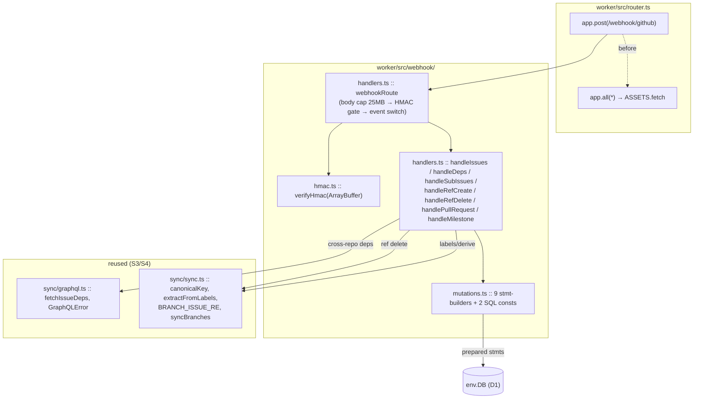
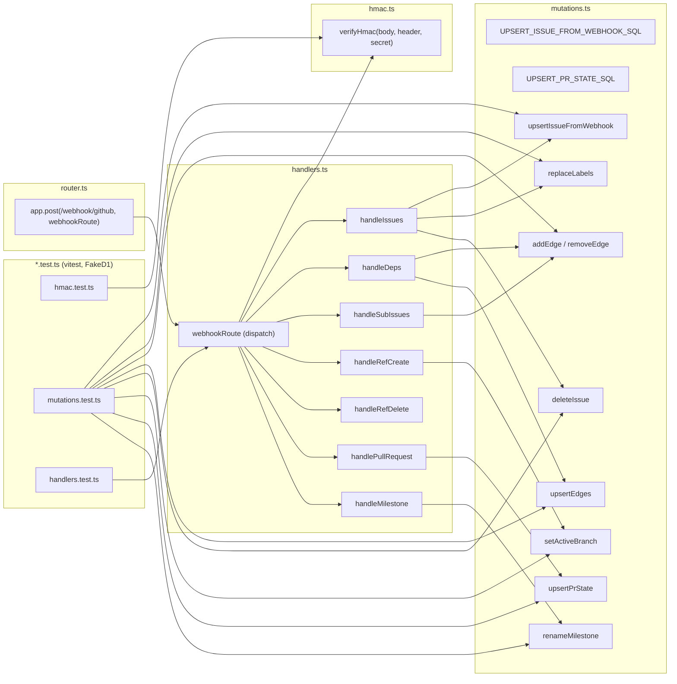

## Summary

Port `POST /webhook/github` (HMAC-gated, real-time corpus updates) from the FastAPI app to the
Cloudflare Worker. Add 9 per-row D1 write helpers + 2 SQL constants (`mutations.ts`), Web-Crypto HMAC
verify (`hmac.ts`), 7 event handlers + a dispatch entry (`handlers.ts`), and wire the route into
`router.ts` before the `ASSETS` fallback. Port verbatim from the Python SSoT — the only redesigns are
forced by the runtime: D1 has no interactive transactions (use `db.batch`), and there is no in-process
reconciler (drop `trigger_heal`).

## Architecture

### Data flow



### File × Function map



## Agents

| Agent instance | Tasks | Files |
|---|---|---|
| backend-dev-A | T1, T2 | `webhook/mutations.ts`, `webhook/hmac.ts` |
| backend-dev-B | T3, T4 | `webhook/handlers.ts`, `router.ts` |
| tester-A | T5, T6, T7 | `webhook/hmac.test.ts`, `webhook/mutations.test.ts`, `webhook/handlers.test.ts` |

Split A/B respects the per-instance ≤2-subject cap: A owns the leaf primitives (sql, crypto), B owns
dispatch + wiring. B reads A's committed `mutations.ts`/`hmac.ts` exports from disk → import coherence
preserved via the filesystem, not shared context.

## Wave Structure

3 waves, max 2 parallel agents. Elapsed ~3 units vs ~7 sequential.

| Wave | Trigger | Agents | Tasks |
|------|---------|--------|-------|
| 1 | start | 1 | backend-dev-A: T1, T2 |
| 2 | Wave 1 done | 2 ∥ | backend-dev-B: T3→T4 · tester-A: T5, T6 |
| 3 | T3 done | 1 | tester-A: T7 |

### Budget — per task

| Task | Items | Class | Est. ops | Split? |
|------|-------|-------|----------|--------|
| T1 mutations.ts | 9 helpers + 2 SQL | judgmental | 8 | — |
| T2 hmac.ts | 1 fn (spec §4.9 verbatim) | bounded | 3 | — |
| T3 handlers.ts | 7 handlers + dispatch | judgmental | 12 | — |
| T4 router.ts wiring | 1 edit | bounded | 3 | — |
| T5 hmac.test.ts | ~6 cases | bounded | 4 | — |
| T6 mutations.test.ts | 9 helper asserts | judgmental | 8 | — |
| T7 handlers.test.ts | 7 handlers + dispatch | judgmental | 12 | — |

**Total estimated ops: ~50**

### Budget — per agent instance

| Instance | Tasks | Σ ops | Subjects | Split? |
|----------|-------|-------|----------|--------|
| backend-dev-A | T1, T2 | 11 | sql, crypto | — |
| backend-dev-B | T3, T4 | 15 | dispatch, wiring | — |
| tester-A | T5, T6, T7 | 24 | tests | — |

## Task Seeding Blueprint

<!-- Used by /implement to seed TaskCreate calls on session start.
     Format: T{n} | agent-instance | blockedBy | subject -->

### Wave 1 — no deps, 1 agent

| Task | Agent instance | blockedBy | Subject |
|------|---------------|-----------|---------|
| T1 | backend-dev-A | — | mutations (sql) |
| T2 | backend-dev-A | — | hmac (crypto) |

### Wave 2 — after Wave 1, 2 agents ∥

| Task | Agent instance | blockedBy | Subject |
|------|---------------|-----------|---------|
| T3 | backend-dev-B | T1, T2 | handlers (dispatch) |
| T4 | backend-dev-B | T3 | router (wiring) |
| T5 | tester-A | T2 | tests (hmac) |
| T6 | tester-A | T1 | tests (mutations) |

### Wave 3 — after T3, 1 agent

| Task | Agent instance | blockedBy | Subject |
|------|---------------|-----------|---------|
| T7 | tester-A | T3 | tests (handlers) |

---

## Micro-Tasks

### T1 — `webhook/mutations.ts` — SQL constants + 9 stmt-builders  [backend-dev-A · subject: mutations · diff 3]

**Port source:** `src/roxabi_live/corpus/mutations.py`. **Spec:** §4.8 (`UPSERT_ISSUE_FROM_WEBHOOK_SQL`).
**Contract:** every helper *returns* `D1PreparedStatement` (or `D1PreparedStatement[]`); the caller
(handler) runs/batches them. No `.run()` inside helpers — the handler owns the transaction boundary
(mirrors the Python "no commit() in helpers" contract; D1's batch is the tx).

Column names (confirmed from `sync/sync.ts` inline SQL): `labels(issue_key, name)`,
`edges(src_key, dst_key, kind)`, `pr_state(repo, number, state, has_reviewed_label, closing_issue_keys, updated_at)` PK `(repo, number)`, `issues(... key, repo, number, title, state, url, created_at, updated_at, closed_at, milestone, is_stub, lane, priority, size, status, has_active_branch)`.

```typescript
// SQL constants
export const UPSERT_ISSUE_FROM_WEBHOOK_SQL = `…`;  // spec §4.8 — preserves status, no has_active_branch in SET
export const UPSERT_PR_STATE_SQL = `…`;            // identical to sync.ts module-local const (not exported there)

export interface WebhookIssue {  // 13 bound fields
  key: string; repo: string; number: number; title: string; state: string;
  url: string | null; created_at: string | null; updated_at: string | null;
  closed_at: string | null; milestone: string | null;
  lane: string | null; priority: string | null; size: string | null;
}

export function upsertIssueFromWebhook(db: D1Database, i: WebhookIssue): D1PreparedStatement;
export function replaceLabels(db: D1Database, key: string, names: string[]): D1PreparedStatement[]; // [DELETE, ...INSERT OR IGNORE]
export function addEdge(db: D1Database, src: string, dst: string, kind: string): D1PreparedStatement;       // INSERT OR IGNORE INTO edges VALUES(?,?,?)
export function removeEdge(db: D1Database, src: string, dst: string, kind: string): D1PreparedStatement;    // DELETE … WHERE src_key=? AND dst_key=? AND kind=?
export function upsertEdges(db: D1Database, key: string, blockedBy: string[], blocking: string[], kind: string): D1PreparedStatement[]; // [DELETE (src=? OR dst=?) AND kind=?, ...INSERTs]
export function deleteIssue(db: D1Database, key: string): D1PreparedStatement;            // DELETE FROM issues WHERE key=?
export function setActiveBranch(db: D1Database, repo: string, number: number, value: 0 | 1): D1PreparedStatement;
export function upsertPrState(db: D1Database, repo: string, number: number, state: string, hasReviewed: 0 | 1, closingKeysJson: string, updatedAt: string): D1PreparedStatement;
export function renameMilestone(db: D1Database, repo: string, oldTitle: string, newTitle: string): D1PreparedStatement; // UPDATE issues SET milestone=? WHERE repo=? AND milestone=?
```

**`upsertEdges` direction (port from `upsert_edges_async`):** for each `b` in `blockedBy` → `(src=b, dst=key)`; for each `b` in `blocking` → `(src=key, dst=b)`. Always emit the DELETE-by-kind first.
**Verify:** `cd worker && npx tsc --noEmit` (clean). **Spec trace:** issue §helpers, §4.8. **Slice:** V1. **Phase:** GREEN.

### T2 — `webhook/hmac.ts` — `verifyHmac`  [backend-dev-A · subject: hmac · diff 2]

Port spec §4.9 verbatim. `verifyHmac(body: ArrayBuffer, header: string | null, secret: string): Promise<boolean>`.
Null-safe (`!header?.startsWith("sha256=")` → false), exactly-32-byte hex (`hexBytes.length !== 32` → false),
`crypto.subtle.importKey`/`verify` (constant-time). **Verify:** `npx tsc --noEmit`. **Spec trace:** §4.9. **Slice:** V1. **Phase:** GREEN.

### T3 — `webhook/handlers.ts` — 7 handlers + `webhookRoute` dispatch  [backend-dev-B · subject: dispatch · diff 4]

**Port source:** `src/roxabi_live/webhook/handlers.py` + `router.py`. Reads T1 (`mutations.ts`) + T2 (`hmac.ts`) from disk.

**`webhookRoute(c: Context<{ Bindings: Env }>)`** (Hono handler — the `router.py` dispatch):
1. `const body = await c.req.arrayBuffer()`; if `body.byteLength > 25*1024*1024` → `c.json(…, 413)`.
2. `const secret = c.env.GITHUB_WEBHOOK_SECRET`; if `!secret` → **503**.
3. `if (!(await verifyHmac(body, c.req.header("x-hub-signature-256") ?? null, secret)))` → **401**.
4. `try { payload = JSON.parse(new TextDecoder().decode(body)) } catch → 400`.
5. switch `c.req.header("x-github-event")`:
   `issues`→handleIssues · `issue_dependencies`→handleDeps(…,env) · `sub_issues`→handleSubIssues ·
   `create`→handleRefCreate · `delete`→handleRefDelete(…,env) · `pull_request`→handlePullRequest ·
   `milestone`→handleMilestone · default → `c.json({ ok: true, ignored: event })`.
6. handled → `c.json({ ok: true })`.

**Handler ports (signatures take `db: D1Database`, deps/ref-delete also `env`/`token`):**
- `handleIssues(payload, db)`: `deleted`/`transferred` → `await deleteIssue(db,key).run()`. Else build
  `issue_partial` (milestone title, `extractFromLabels(names)` → lane/priority/size) →
  **atomic** `await db.batch([upsertIssueFromWebhook(db,i), ...replaceLabels(db,key,names)])` (SC9).
- `handleDeps(payload, db, env)`: ignore `blocking_*`; act on `blocked_by_added/removed`. `blocking_issue`
  present (same-repo) → `addEdge`/`removeEdge` kind=`blocks` (`.run()`). Absent (cross-repo) → point-fetch
  `fetchIssueDeps(owner,name,number, env.GITHUB_TOKEN)` → `db.batch(upsertEdges(db,key,blocked_by,blocking,"blocks"))`.
  Wrap point-fetch in try/catch(GraphQLError) → log + no-op (webhooks always 200).
- `handleSubIssues(payload, db)`: act on `sub_issue_added/removed` (ignore `parent_*`); top-level
  `parent_issue`/`parent_issue_repo`/`sub_issue`/`sub_issue_repo` keys → `addEdge`/`removeEdge` kind=`parent`.
  Malformed → log + return (no throw).
- `handleRefCreate(payload, db)`: `ref_type==="branch"` ∧ `BRANCH_ISSUE_RE.exec(ref)` → `setActiveBranch(db,repo,number,1).run()`.
- `handleRefDelete(payload, db, env)`: `ref_type==="branch"` ∧ regex match → split `repo` "owner/name" →
  `await syncBranches(db, env.GITHUB_TOKEN, owner, name)` (re-query — deletion event not trusted alone).
  **Delta vs Python:** no fresh sqlite3 conn — use `env.DB` directly.
- `handlePullRequest(payload, db)`: state `closed` if `state==="closed"` OR `merged`; `has_reviewed_label`
  = `labels` includes `"reviewed"`; `closing_issue_keys` = `_CLOSING_KEYWORD_RE` matches in body →
  `[{repo}#{n}]` JSON; `updated_at` = `new Date().toISOString()` → `upsertPrState(…).run()`.
  Port regex: `/(?:close[sd]?|fix(?:e[sd])?|resolve[sd]?)\s+#(\d+)/gi`.
- `handleMilestone(payload, db)`: `action==="edited"` ∧ `changes.title` present → `renameMilestone(db, repo,
  changes.title.from, payload.milestone.title).run()`. Else no-op.

**DROP:** all `trigger_heal()` calls. **Verify:** `npx tsc --noEmit`. **Spec trace:** issue events table. **Slice:** V1. **Phase:** GREEN.

### T4 — `router.ts` wiring  [backend-dev-B · subject: wiring · diff 2]

Import `webhookRoute` from `./webhook/handlers`; register `app.post("/webhook/github", webhookRoute)`
**before** `app.all("*", …ASSETS…)`. Update the S1 scaffold comment (S5 done). **Verify:** `npx tsc --noEmit`. **Slice:** V1. **Phase:** GREEN.

### RED-GATE V1 — `cd worker && npx tsc --noEmit && npx vitest run` green before tests count as done.

### T5 — `webhook/hmac.test.ts`  [tester-A · subject: tests · diff 2]

Cases: null header → false; wrong prefix → false; <32-byte hex → false; valid sig (compute expected via
`crypto.subtle` in-test) → true; tampered body → false; tampered sig → false. **Verify:** `npx vitest run hmac`. **Phase:** RED→GREEN.

### T6 — `webhook/mutations.test.ts`  [tester-A · subject: tests · diff 3]

FakeD1 (clone pattern from `sync/sync.test.ts`). Assert each builder produces the expected SQL + bind
order: `upsertIssueFromWebhook` (13 binds, status NOT in SET), `replaceLabels` (DELETE + N INSERTs),
`addEdge`/`removeEdge` (kind passthrough), `upsertEdges` direction (blocker→key, key→blockee; DELETE-by-kind first),
`deleteIssue`, `setActiveBranch` (1/0), `upsertPrState` (6 binds), `renameMilestone`. **Verify:** `npx vitest run mutations`. **Phase:** RED→GREEN.

### T7 — `webhook/handlers.test.ts`  [tester-A · subject: tests · diff 4]

FakeD1 + mock `fetchIssueDeps`/`syncBranches`. Per handler: issues opened (atomic batch upsert+labels),
issues deleted (deleteIssue), deps same-repo add/remove, deps cross-repo point-fetch path, sub_issues
add/remove (kind=parent), ref create (setActiveBranch=1), ref delete (syncBranches called), pull_request
(merged→closed, reviewed label, body close-keyword parse), milestone edited+title (rename) vs non-title (no-op).
Dispatch: missing secret→503, bad sig→401, bad JSON→400, unknown event→`{ok:true,ignored}`, body>25MB→413.
**Verify:** `npx vitest run handlers`. **Phase:** RED→GREEN.

---

## Consistency Report

| Spec/issue element | Covered by | Status |
|---|---|---|
| 7 events (issues, deps, sub_issues, create, delete, pull_request, milestone) | T3 | ✓ |
| 9 write helpers | T1 | ✓ |
| 2 SQL constants (§4.8) | T1 | ✓ |
| HMAC §4.9 (null-safe, 32-byte, constant-time) | T2 | ✓ |
| Router wiring before ASSETS fallback | T4 | ✓ |
| Status codes (200/401/503/400/413, ignored:true) | T3 + T7 | ✓ |
| Atomic issue upsert+labels (SC9) | T3 (db.batch) + T7 | ✓ |
| Cross-repo deps point-fetch | T3 (fetchIssueDeps) + T7 | ✓ |
| DROP trigger_heal | T3 | ✓ |
| handle_ref_delete uses env.DB (no fresh conn) | T3 | ✓ |
| vitest per handler + HMAC | T5, T6, T7 | ✓ |
| tsc clean | RED-GATE V1 | ✓ |

**Out of code scope (post-merge ops — manual, NOT a CI gate):** `wrangler secret put GITHUB_WEBHOOK_SECRET --env staging`
(value ≠ prod); CF Access **App 2** `/webhook/*` → **Bypass**; register GitHub **org** webhook → staging
Worker URL (events: issues, issue_dependencies, sub_issues, create, delete, pull_request, milestone);
live test delivery → **200**. These are tracked under #92 deploy and verified at cutover, not in this PR.

**Untraced tasks:** none. **Exemptions:** worker TS is outside `file_length`/`folder_size` gates (glob `src/**/*.py` / `src/**`).

## Task IDs

<!-- Generated by /plan. Used by /implement to resume tasks on session restart. -->
- T1: 9 — mutations (backend-dev-A, wave 1)
- T2: 10 — hmac (backend-dev-A, wave 1)
- T3: 11 — dispatch (backend-dev-B, wave 2, blockedBy T1,T2)
- T4: 12 — wiring (backend-dev-B, wave 2, blockedBy T3)
- T5: 13 — tests/hmac (tester-A, wave 2, blockedBy T2)
- T6: 14 — tests/mutations (tester-A, wave 2, blockedBy T1)
- T7: 15 — tests/handlers (tester-A, wave 3, blockedBy T3)
