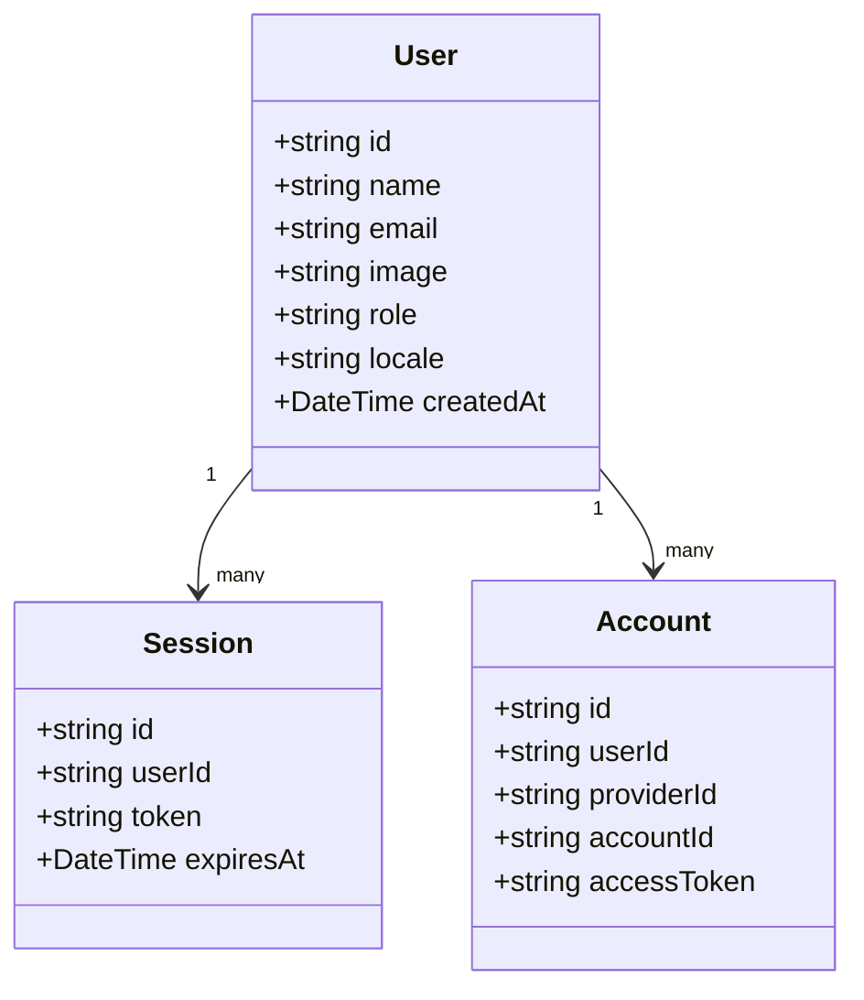
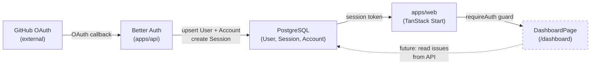

## Context

Promoted from [analysis](../analyses/1-extract-dashboard-standalone-analysis.mdx).

The Roxabi dashboard currently lives inside `roxabi-plugins` as a Bun/TypeScript terminal app. This issue establishes `roxabi-dashboard` as a standalone web application by forking `roxabi_boilerplate` (TanStack Start + NestJS + Fastify + PostgreSQL + Better Auth + Tailwind v4). No dashboard data is wired in this issue — scaffolding and auth only.

Chosen approach: **Shape A — upstream remote tracking** (copy files once, add `upstream` git remote for future boilerplate updates via `git merge upstream/main`).

## Goal

Produce a running monorepo with GitHub OAuth sign-in and a static placeholder dashboard route, fully CI-green, with an `upstream` remote tracking `roxabi_boilerplate`.

## Users

- **Roxabi team members** — sign in via GitHub OAuth, land on the placeholder dashboard
- **The boilerplate** — tracked as `upstream` remote; updates pulled periodically via `git merge upstream/main`

## Expected Behavior

1. Developer clones `roxabi-dashboard`, runs `bun install`, then `bun run dev`
2. Both `apps/web` (TanStack Start, port 3000) and `apps/api` (NestJS, port 4000) start without errors
3. Visiting `/` shows a login page with a "Sign in with GitHub" button
4. Clicking it triggers GitHub OAuth; after authorization, user is redirected to `/dashboard`
5. `/dashboard` is auth-gated — unauthenticated visitors are redirected to login
6. The dashboard page renders a static skeleton layout: header with app name + user avatar, placeholder cards for "Issues", "Pull Requests", "Deployments" — no live data
7. Running `git fetch upstream` returns commits from `roxabi_boilerplate` (remote is properly configured)
8. Running `bun run lint`, `bun run typecheck`, `bun run build` all pass

Boilerplate modules are kept as-is for this issue (no stripping). Module cleanup is deferred to separate issues.

## Data Model & Consumers

> Note: `Account.accessToken` stores the GitHub OAuth token in plain text (Better Auth default). Token encryption at rest is deferred to a future security hardening issue.

| Consumer | Fields used | When | Status |
|----------|-------------|------|--------|
| `apps/web` auth client | `session.token`, `user.name`, `user.image` | Every page load | This issue |
| `DashboardPage` | `user.name`, `user.image` | After login | This issue |
| GitHub data fetcher | `account.accessToken` | Issue/PR fetching | Future issue |

## Breadboard

### UI affordances

| ID | Element | Handler | Data |
|----|---------|---------|------|
| U1 | "Sign in with GitHub" button on `/login` | `authClient.signIn.social({ provider: "github" })` | — |
| U2 | GitHub OAuth callback redirect | Better Auth `callbackURL` → `/dashboard` | `User`, `Session`, `Account` upserted |
| U3 | `/dashboard` route (auth-gated) | `requireAuth` route guard → redirect to `/login` if no session | `session.token` |
| U4 | Dashboard header | Render `user.name` + `user.avatar` | `User` from session |
| U5 | Placeholder cards (Issues, PRs, Deployments) | Static render, no data fetch | — |

### API affordances

| ID | Endpoint | Handler | Data |
|----|----------|---------|------|
| N1 | `GET /api/auth/callback/github` | Better Auth social callback | Upserts `User`, `Account`; creates `Session` |
| N2 | `GET /api/auth/session` | Better Auth session check | Returns current `User` + `Session` |
| N3 | `POST /api/auth/sign-out` | Better Auth sign-out | Deletes `Session` |

### Environment

| ID | Var | Source | Notes |
|----|-----|--------|-------|
| S1 | `GITHUB_CLIENT_ID` | GitHub OAuth App | Created in GitHub → Settings → Developer settings |
| S2 | `GITHUB_CLIENT_SECRET` | GitHub OAuth App | Same app |
| S3 | `DATABASE_URL` | Local PostgreSQL | Schema owner connection. Via `docker compose up -d` |
| S4 | `DATABASE_APP_URL` | Local PostgreSQL | Runtime app-role connection (RLS enforced) |
| S5 | `BETTER_AUTH_SECRET` | Generated | `openssl rand -hex 16` |
| S6 | `BETTER_AUTH_URL` | `http://localhost:3000` | **Frontend URL** — Nitro proxies `/api/**` to the API; must match web app origin |
| S7 | `APP_URL` | `http://localhost:3000` | Used for OAuth redirect URL and post-login redirects |
| S8 | `API_URL` | `http://localhost:4000` | Used by frontend for API calls |
| S9 | `CORS_ORIGIN` | `http://localhost:3000` | Must match `APP_URL` exactly |

## Slices

| # | Name | Affordances | Demo-able outcome |
|---|------|-------------|------------------|
| 1 | **Seed boilerplate** | — | `bun install` + `bun run dev` starts both apps with no errors |
| 2 | **Add upstream remote** | — | `git fetch upstream` returns boilerplate commits |
| 3 | **Configure GitHub OAuth** | U1, U2, N1, N2, N3, S1–S9 | Sign in with GitHub → session created → redirected to `/dashboard` |
| 4 | **Placeholder dashboard route** | U3, U4, U5 | `/dashboard` auth-gated, renders skeleton with user avatar + placeholder cards |
| 5 | **CI green** | — | `bun run lint && bun run typecheck && bun run build` all pass |

## Success Criteria

- [ ] `bun install` completes with no errors from repo root
- [ ] `bun run dev` starts `apps/web` on port 3000 and `apps/api` on port 4000 without errors
- [ ] `git remote get-url upstream` returns the `roxabi_boilerplate` GitHub URL
- [ ] `git fetch upstream` succeeds and lists boilerplate commits
- [ ] Visiting `http://localhost:3000` shows a login page with "Sign in with GitHub" button
- [ ] Clicking "Sign in with GitHub" redirects to GitHub OAuth authorization page
- [ ] Completing GitHub OAuth redirects to `http://localhost:3000/dashboard`
- [ ] A `User` row is created in PostgreSQL after first login
- [ ] Cancelling GitHub OAuth (clicking "Cancel" on the GitHub authorization page) returns to the login page without an unhandled error
- [ ] Visiting `/dashboard` without a session redirects to the login page
- [ ] `/dashboard` renders a header with the authenticated user's name and avatar
- [ ] `/dashboard` renders at least 3 placeholder cards (Issues, Pull Requests, Deployments) — cards contain static copy only, no API calls to `/api` are made on page load
- [ ] Sign-out button (from boilerplate) ends the session and redirects to login
- [ ] `bun run lint` passes with no errors
- [ ] `bun run typecheck` passes with no errors
- [ ] `bun run build` completes successfully
- [ ] `.env.example` lists all required variables (S1–S9) with empty placeholder values and comments matching the boilerplate pattern

> Note: Boilerplate modules (i18n/Paraglide, email/magic-link auth, consent banner, org management, admin panel) are kept as-is in this issue. Module cleanup is tracked as follow-on issues to be created after this issue closes.
