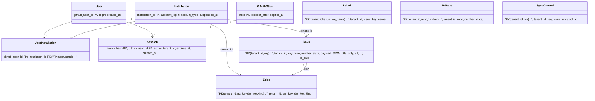
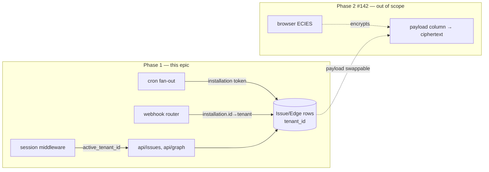

## Context

Source: `artifacts/analyses/141-multi-tenant-github-app-auth-analysis.mdx` (approved, review-hardened)
→ ADR `artifacts/analyses/zk-encryption-spike-analysis.mdx` (Shape D, Phase 1). Frame:
`artifacts/frames/141-multi-tenant-github-app-auth-frame.mdx`.

Turn the single-tenant cockpit (CF Worker + D1 behind CF Access for one identity) into a multi-user
tool: any GitHub user logs in, links their account, sees **only their own** issues + dep-graph.
Server-centric (operator *can* read — honest in UX); a single **GitHub App** serves both this phase
and the future Phase-2 ZK mode (#142). Decision set = the analysis's 24 settled sub-decisions.

## Goal

A second GitHub user can log in, link their account, and see only their own issues + graph in prod,
with tenant isolation verified — without an auth rewrite when Phase-2 ZK lands.

## Users

- **Primary:** any GitHub user (installs the App + authorizes) → scoped cockpit of their own issues.
- **Secondary:** operator (mickael) — runs/maintains sync, holds D1; must enforce isolation and
  honestly disclose Phase-1 operator-readability.

## Expected Behavior

1. **Logged-out** visitor hits `/` → unauthenticated landing with a **Log in with GitHub** button.
2. **Login:** `/login` → GitHub authorize (with single-use `state`) → `/oauth/callback` exchanges
   `code`→token (`client_secret`), creates/updates the `users` row, mints a **fresh** session
   (cookie `HttpOnly; Secure; SameSite=Lax; Domain=<exact host>`).
3. **Not installed yet:** if the user has no installation, callback lands on an **"install the App"**
   CTA → GitHub App install page → on return, `installation` webhook (or callback re-check) populates
   `installations` + `user_installations`.
4. **Consent:** before any issue data renders, the user must **acknowledge** a notice — "the operator
   can read your issue data in this phase; don't paste secrets into issue bodies." A persistent
   dashboard notice repeats it.
5. **Active tenant:** exactly one installation → it becomes the active tenant; more than one → an
   **org-picker** sets the active `tenant_id` (switchable). The session carries one active `tenant_id`.
6. **Viewing:** `/api/issues`, `/api/issues/:key`, `/api/graph` return **only** rows where
   `tenant_id = session.active_tenant`. No session → **401 before any DB query**.
7. **Sync:** hourly cron loops installations, mints an installation token (App-JWT RS256) per install,
   syncs that install's repos, writes rows tagged with the installation's `tenant_id`. The org webhook
   delivers to one endpoint (one App secret); each event is routed to a tenant by `installation.id`;
   an unknown installation → 200 OK, **no write**.
8. **Logout / uninstall:** logout deletes the session row; GitHub App `installation.deleted` deletes
   all sessions + data for that `tenant_id`.

## Data Model & Consumers

> **`payload` (D24, Phase-2 ZK seam):** `issues` has **no top-level `title` column** — `title` lives
> inside `payload` JSON (`JSON_EXTRACT(payload,'$.title')`); `body` is **absent** in Phase 1. Composite
> PKs (table-recreation, D9) apply to `issues`, `edges`, **`labels`**, **`pr_state`**. `tenant_id` is
> also added to existing `sync_state`, `repos`, `repo_allowlist` (D8).

| Consumer | Fields consumed | When | Status |
|---|---|---|---|
| session middleware | `Session.token_hash`, `active_tenant_id`, `expires_at` | every `/api/*` | this issue |
| `api/graph` | `Issue.{tenant_id,key,state,payload.title}`, `Edge.*` | page load / refresh | this issue |
| `api/issues` | `Issue.*` (tenant-scoped) | list / detail | this issue |
| cron sync | `Installation.installation_id`, per-tenant `SyncControl` | hourly | this issue |
| webhook router | `Installation.installation_id` → `tenant_id` | on event | this issue |
| Phase-2 client | `Issue.payload` (→ ciphertext) | opt-in ZK | **future (#142)** — payload column accessible |

## Breadboard

**Routes / handlers (N):**

| ID | Affordance | Handler | Data touched |
|----|-----------|---------|--------------|
| N1 | `GET /login` | redirect→GitHub authorize + write `OAuthState` | `oauth_state` |
| N2 | `GET /oauth/callback` | verify+delete `state`, `code`→token, upsert `User`, mint `Session` | `oauth_state`,`users`,`sessions` |
| N3 | `GET /api/me` | session→user + installations + active tenant | `sessions`,`user_installations` |
| N4 | `POST /logout` | delete session row | `sessions` |
| N5 | `POST /api/active-tenant` | set `Session.active_tenant_id` (membership-checked) | `sessions`,`user_installations` |
| N6 | `POST /webhook/github` (extend) | HMAC → `installation.id`→tenant → scoped mutate; `installation`/`installation.deleted` events | all tenant tables,`installations`,`sessions` |
| N7 | `GET /api/issues` (extend) | middleware → `WHERE tenant_id=?` | `issues`,`labels` |
| N8 | `GET /api/issues/:key` (extend) | middleware → `WHERE key=? AND tenant_id=?` | `issues`,`edges`,`labels` |
| N9 | `GET /api/graph` (extend) | middleware → all 5 queries `WHERE tenant_id=?` | `issues`,`edges`,`labels`,`pr_state`,`repos` |
| N10 | `scheduled` cron (extend) | loop installations → mint token → per-tenant sync | `installations`,`issues`,`edges`,per-tenant `sync_control` |

**UI (U):**

| ID | Affordance | Wires to |
|----|-----------|----------|
| U1 | Logged-out landing | N1 |
| U2 | Log in with GitHub | N1 |
| U3 | Install-App CTA (authorized-not-installed) | links to **GitHub App install URL (external)** → user installs → GitHub fires `installation` webhook → N6 |
| U4 | Org-picker (>1 installation) | N5 |
| U5 | Operator-read consent (acknowledge) | gates data render |
| U6 | Persistent dashboard notice | — |
| U7 | Logout | N4 |

**Middleware/util (M):** M1 session middleware (fail-closed 401) on `/api/*`; M2 App-JWT RS256 signer;
M3 installation-token minter (cache ≤1h); M4 HMAC verify (existing, reused).

## Slices

Vertical increments, dependency-ordered. **Each slice = one child issue.**

| # | Slice | Demo-able outcome | Depends |
|---|-------|-------------------|---------|
| **S1** | **Schema & auth-table migrations + CI/infra** | **M-a** migration: `tenant_id` **nullable** on `issues`/`edges`/`labels`/`pr_state`/`sync_state`/`repos`/`repo_allowlist` + **composite-PK table-recreation** (`CREATE→INSERT…SELECT→DROP→RENAME`) on `issues`/`edges`/`labels`/`pr_state` + new tables `users`/`installations`/`user_installations`/`sessions`/`oauth_state` + per-tenant `sync_control`; **`title` moved into `payload` JSON** (no top-level `title`; `body` absent). `ci.yml`: add `wrangler d1 migrations apply DB [--env staging]` **inside the `CF_API_TOKEN` guard, in the `deploy:` job, between `npm ci` and `wrangler deploy`** + a `GITHUB_APP_*` secret-presence guard (same pattern as `CF_API_TOKEN`). `wrangler.toml`: `[[env.staging.r2_buckets]] bucket_name="roxabi-live-logs-staging"` + `[env.staging] workers_dev=true`. **Excludes the NOT-NULL migration (ships in S7).** | — |
| **S2** | **GitHub App + OAuth login + sessions** | user OAuths → fresh session cookie; `GET /api/me` returns identity; logout revokes; `state` single-use+TTL; new secrets wired (per-env) | S1 |
| **S3** | **Installation linking + per-installation sync (PAT retired) + backfill** | App install webhook populates `installations`/`user_installations`; `runSync` per-installation fan-out (App-JWT → install token); per-tenant `sync_control`/auth-halt; `closedHopPass` scoped per-tenant; **`GITHUB_TOKEN` removed from `Env`/`wrangler.toml`/`handleDeps`/`handleRefDelete` — no fallback**; **backfill** existing rows to the operator's **real installation_id** (runtime op — admin endpoint or `wrangler d1 execute "UPDATE … WHERE tenant_id IS NULL"`, chunked to D1 limits; orphan-row rollback defined) → verify `COUNT(*) WHERE tenant_id IS NULL = 0` | S2 |
| **S4** | **Webhook tenant routing + stub policy** | webhook event from install A writes only A's rows (route by `installation.id`); unknown install → 200 no-write; cross-tenant dep ref → tenant-local title-less stub; `installation.deleted` wipes tenant | S3 |
| **S5** | **Tenant-filtered reads + active-tenant + org-picker** | `/api/*` behind fail-closed middleware; all reads `WHERE tenant_id=?` (IDOR on `/:key` closed); active tenant in session; org-picker for >1 install — **second user sees only their own issues + graph** | S2, S3 |
| **S6** | **Login / account-link / consent UI** | full browser flow logged-out → login → install CTA → consent acknowledge → org-picker → scoped dashboard | S5 |
| **S7** | **NOT-NULL migration + CF Access cutover + runbook** | re-verify `COUNT NULL = 0` → commit + apply **M-b `000N_tenant_not_null.sql`** (the NOT-NULL file is authored in S1's design but **committed here**, so CI never applies it before backfill); staging smoke-test gate passes (sessions return 401 unauth) → Access scoped to `/admin/*` only (`/webhook/*` keeps its bypass) → prod cutover; rollback runbook (re-enable Access rule) written to a tracked file | S6 |

**Pre-impl validation (gates S2/S3, do first):** RS256 sign in workerd (`crypto.subtle` RSASSA-PKCS1-v1_5);
`subIssues`/`parent` GraphQL via installation token (no preview header post-GA).

## Success Criteria

- [ ] **M-a** migration applies cleanly on **staging D1**: `tenant_id` nullable on issues/edges/labels/pr_state/sync_state/repos/repo_allowlist; **composite PKs via table-recreation on `issues`, `edges`, `labels`, `pr_state`**; 5 new auth tables; per-tenant `sync_control`.
- [ ] `issues` has **no top-level `title` column** — `title` is stored inside `payload` and read via `JSON_EXTRACT(payload,'$.title')`; **`body` is absent** from the Phase-1 payload schema. (D24 ZK seam.)
- [ ] `ci.yml` `deploy:` job runs `wrangler d1 migrations apply DB [--env staging]` **inside the `CF_API_TOKEN` guard, between `npm ci` and `wrangler deploy`**; a CI secret-presence step (same pattern as `CF_API_TOKEN`) fails the deploy when any `GITHUB_APP_*` secret is empty.
- [ ] `wrangler.toml` sets `[[env.staging.r2_buckets]] bucket_name="roxabi-live-logs-staging"` and `[env.staging] workers_dev=true` (staging reachable for end-to-end auth test).
- [ ] A user completes GitHub OAuth and receives a session; `GET /api/me` returns their GitHub identity + installations; `POST /logout` deletes the session row (subsequent `/api/*` → 401).
- [ ] OAuth `state` is single-use (deleted on verify), TTL ≤ 10 min, and `redirect_uri` is Worker-hard-coded; a replayed `state` is rejected.
- [ ] **Session security:** the token issued after OAuth is **freshly minted** (no pre-auth value reused); `sessions.token_hash` stores the **SHA-256 hash** of the token (never the token); the cookie is `HttpOnly; Secure; SameSite=Lax; Domain=<exact host>` (not `.roxabi.dev`); presenting an old pre-auth value after login returns 401.
- [ ] Cron sync mints a **per-installation** token (App-JWT RS256) and writes issues/edges tagged with that installation's `tenant_id`; `GITHUB_TOKEN` is removed from `Env`, `wrangler.toml`, `handleDeps`, `handleRefDelete` with **no fallback**; RS256 sign errors log the message only (never key/JWT).
- [ ] Webhook resolves `payload.installation.id` → `tenant_id` via DB lookup **before** any INSERT/UPDATE/DELETE; unknown — or known-but-missing-`tenant_id` — installation → 200, **no write**; `installation.deleted` deletes that tenant's sessions + data.
- [ ] A cross-tenant dependency reference materializes only as a `tenant_id`=requester, `is_stub=1`, `title=NULL` row — never another tenant's real title/body.
- [ ] Every `/api/*` route is gated by fail-closed session middleware (no/invalid session → 401 **before** any DB statement).
- [ ] `GET /api/issues/:key` and its label/edge sub-queries include `AND tenant_id=?` bound to the session's `active_tenant_id` **in the SQL** (code-review-verified); `GET /api/issues` + all 5 `GET /api/graph` queries filter by `tenant_id`; fetching a key that exists for another tenant returns **404** (not 200/500). [IDOR closed]
- [ ] A user with >1 installation gets an org-picker; the session carries exactly one active `tenant_id`; **no query UNIONs across tenants**.
- [ ] Before any issue data renders, the user must acknowledge the operator-read consent notice; a persistent dashboard notice is present.
- [ ] **Acceptance:** a *second* GitHub account logs in, links its account, sees **only its own** issues + dep-graph; the operator account sees only `Roxabi`'s — verified live on staging.
- [ ] **S7 cutover:** backfill re-verified (`COUNT NULL = 0`) → **M-b NOT-NULL migration** committed + applied (NOT-NULL file ships in S7, never earlier); app sessions verified returning 401 unauth on staging → CF Access scoped to `/admin/*` only (`/webhook/*` keeps bypass); rollback (re-enable Access) documented in a tracked runbook file.

## Out of Scope (→ #142 or follow-up)

Client-side ZK / operator-blind content; syncing issue `body`; merged cross-installation view;
Cloudflare Queues fan-out; billing/quotas.
