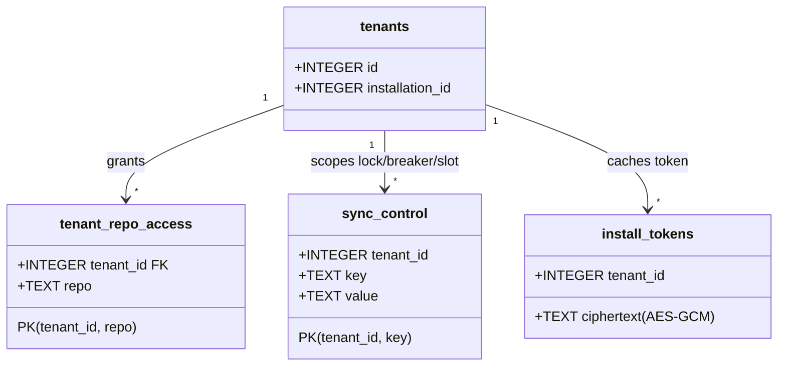
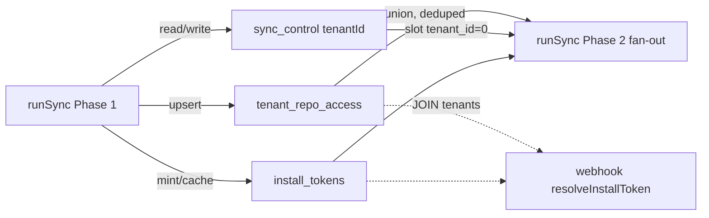

## Context

Promoted from `artifacts/analyses/160-per-installation-runsync-cutover-analysis.mdx`
(architect-reviewed, verdict: sound-with-changes). Split from #146 (S3a shipped).
S3a landed the install-token plumbing; this slice cuts `runSync` over to it and
retires the org PAT.

## Goal

`runSync` syncs every installed tenant's repos using per-installation GitHub App
tokens — deduped to 1 GraphQL bundle call per unique repo, windowed under the
~50-subrequest cap, lock/breaker isolated per tenant — and reads **zero**
`env.GITHUB_TOKEN`; the PAT is removed from code/config and deleted from secrets.

## Users

- **Primary:** the hourly Cron sync + operator (Mickael) — D1 issue/edge data
  must keep reconciling after the PAT is gone.
- **Secondary:** future multi-tenant installations — each install's repos sync
  via its own token; no cross-tenant lock/breaker bleed.

## Expected Behavior

A cron tick:

1. Global tick lock `acquireSyncLock(db, 0)` (existing) — serialises the run;
   `isHalted(db, 0)` short-circuits a halted system. Released in `finally`.
2. **Phase 1 — discovery (per tenant):** for each tenant row with an
   `installation_id`, `INSERT OR IGNORE` its `sync_control(tenantId,
   'sync_running')` row (else the next step silently no-ops), then attempt
   `acquireSyncLock(db, tenantId)` (discovery skip-guard); on success
   `getInstallationToken(db, env, tenantId, installationId)` →
   `listInstallationRepos(token)` (hardened) → upsert
   `tenant_repo_access(tenant_id, repo)` (and delete rows no longer returned).
   Accumulate `Map<repo, Array<{tenantId, installationId}>>` (sorted ascending by
   `tenantId`; lowest = owning) — carry `installationId` so Phase 2 mints tokens
   with no extra query.
3. **Phase 2 — fan-out (global, deduped, windowed):** sort the unique-repo set
   lexicographically by `owner/name`; take the window `[slot*WINDOW,
   (slot+1)*WINDOW)`; for each repo resolve a token via
   `getInstallationToken(db, env, owningTenantId, installationId)` from the head
   of the repo's tenant list, falling back to the next `{tenantId, installationId}`
   on a revoked/suspended install (only `incrementAuthFailures(tenantId)` for the
   thrower; all fail → skip repo + log, never abort the run) → `syncRepoBundle`.
   Then `closedHopPass(db, resolveToken)` with the same per-(owner,name)
   resolver. Advance `sync_slot = (slot+1) % NUM_SLOTS`.
4. Prune issues/edges/pr_state/sync_state/repos against the **union of
   `tenant_repo_access`**; skip prune (warn) if the union is empty (guard).
5. `writeRunAudit` to R2; release all acquired locks.

Empty discovery (no installs / empty union) → no-op + warn (NOT the old empty-
allowlist short-circuit). PAT stays live in secrets until a verified staging tick
(RT2); deletion (RT3) is the post-merge operational tail.

## Data Model & Consumers

No migration — schema landed in 0004/0005. This slice fills + reads existing
tables.

| Consumer | Reads | When | Status |
|---|---|---|---|
| `runSync` Phase 1 | `tenants.installation_id` | every tick | this issue |
| `runSync` Phase 2 | `tenant_repo_access` union, `sync_control.sync_slot` | every tick | this issue |
| prune | `tenant_repo_access` union | every tick | this issue |
| webhook handlers | `tenant_repo_access` via `resolveInstallToken` | on event | S3a (unchanged) |

## Breadboard

Affordances are the sync entry points + helpers (no UI). Wiring:

| ID | Affordance | Handler | Data |
|---|---|---|---|
| N1 | `runSync(env)` | rewritten orchestrator | global lock → Phase 1 → Phase 2 → prune → audit |
| N2 | `discoverTenants(db, env)` *(new)* | Phase 1 | `tenants{id,installation_id}` → `INSERT OR IGNORE sync_control` → `getInstallationToken` → `listInstallationRepos` → upsert `tenant_repo_access`; returns `Map<repo, Array<{tenantId,installationId}>>` |
| N3 | lock/breaker helpers ×7 | `+tenantId=0` param | `sync_control(tenant_id,key)` |
| N4 | `closedHopPass(db, resolveToken)` | resolver-callback signature | per-(owner,name) token |
| N5 | `listInstallationRepos(token)` | W2 hardening | `MAX_PAGES` + `AbortSignal.timeout` |
| N6 | `Env` (T10) | drop `GITHUB_TOKEN: string` from `types.ts` + all `sync/` reads + stale `graphql.ts` doc-comments | no fallback. **`wrangler.toml` has no `GITHUB_TOKEN` (it is a secret, not a `[vars]` entry) → no toml edit** |
| N7 | `WINDOW`, `NUM_SLOTS` | exported consts | `WINDOW=20`, `NUM_SLOTS=3` |
| N8 | `sync.test.ts` | un-skip 4 RED + reconcile 11 old-flow | `vi.mock("../auth/installToken")` |

## Slices

Internal build-order increments — **one cohesive PR** (test suite cannot be
green mid-way if split: the 4 RED cases require the impl; already split from #146).

| # | Slice | Affordances | Demo-able by |
|---|---|---|---|
| 1 | W2 harden `listInstallationRepos` | N5 | unit test: caps at `MAX_PAGES`, aborts on timeout |
| 2 | Thread `tenantId` (default 0) through 7 helpers | N3 | existing helper tests stay green |
| 3 | `closedHopPass` resolver callback | N4 | unit test: resolver invoked per (owner,name) |
| 4 | Phase 1 `discoverTenants`: `INSERT OR IGNORE sync_control` per tenant → `Map<repo,Array<{tenantId,installationId}>>` + `tenant_repo_access` upsert | N2 | RED-adjacent: `tenant_repo_access` populated; new tenant's lock row seeded |
| 5 | Phase 2 deduped windowed fan-out + token fallback; drop 4 PAT reads | N1, N7 | RED cases 1,2,4 green |
| 6 | Drop `GITHUB_TOKEN` from `Env` (`types.ts`) + stale `graphql.ts` doc-comments (T10; no wrangler.toml edit) | N6 | typecheck green; `grep GITHUB_TOKEN worker/src` clean |
| 7 | Test reconciliation: un-skip 4 RED + `vi.mock` + reconcile 11 old-flow | N8 | full `sync.test.ts` green |

## Success Criteria

Code (CI-verifiable):

- [ ] **SC-3** — a tick with 2 tenants sharing repo `o/r` issues exactly **1**
  `REPO_BUNDLE_QUERY` for `o/r` (RED case 1, L1496, green).
- [ ] **SC-4** — `sync_slot` advances `(slot+1) % NUM_SLOTS` per tick; fan-out
  window ≤ `WINDOW` repos so the ~50-subrequest cap is not breached (RED case 2,
  L1531, green).
- [ ] **Lock isolation** — tenant A holding `sync_running=1` does NOT prevent
  tenant B's `acquireSyncLock` attempt (RED case 3, L1565, green).
- [ ] **SC-6** — `GITHUB_TOKEN` absent from `Env` (`types.ts`), `wrangler.toml`
  (both envs), and every `worker/src/sync/` path; no fallback. RED case 4
  (L1601) green: `patAccessCount === 0`.
- [ ] **W2** — `listInstallationRepos` bounded by `MAX_PAGES` + per-fetch
  `AbortSignal.timeout`; unit-tested.
- [ ] `tenant_repo_access` is upserted by Phase 1 each tick (rows for every
  accessible repo; stale rows removed).
- [ ] Prune sources the live set from the `tenant_repo_access` **union**; the
  0-union guard prevents prune-all on empty/failed discovery.

CI gate (structural, not a behavioral assertion):

- [ ] All 4 RED cases un-skipped; top-level `vi.mock("../auth/installToken")`
  present; the ~11 old-flow `runSync` cases (L924-1408) reconciled; full suite +
  `npm run typecheck` green.

Operational (deploy-gated, verified on staging post-merge — not CI):

- [ ] **SC-9 / RT2** — `subIssues`/`parent` resolve via an installation token on
  an empirical staging tick (R2 audit shows a clean run, no PAT read).
- [ ] **SC-7 / RT3** — `GITHUB_TOKEN` deleted from secrets, **code-deploy-first**
  (delete-before-deploy = guaranteed sync outage on `env.GITHUB_TOKEN===undefined`):
  merge→deploy staging → verify clean tick (RT2) → `wrangler secret delete
  GITHUB_TOKEN --env staging` → verify 2nd tick. **Prod leg hard-gated** on #164
  (`7dbf512`) reaching `main` + CI re-injecting `GITHUB_APP_*`/`INSTALL_TOKEN_KEY`
  on prod, then prod deploy → verify → `wrangler secret delete GITHUB_TOKEN`.
  (CI has no `GITHUB_TOKEN` inject step — only the `TODO(RT3)` comment at
  `ci.yml:181`; removal breaks no CI step.)

## Gate 2.5 — Smart Splitting

|slices| = 7 (> 3) triggers consideration → **declined**. Slices are
test-coupled build increments of one sync rewrite (the RED cases go green only
once Phase 1+2 land); the issue was already split from #146 precisely to make
this the atomic unit. Keep as a single PR.
