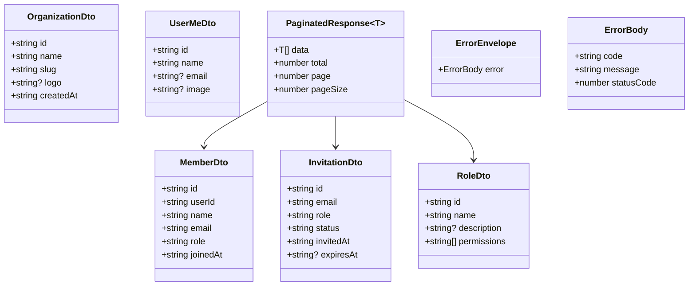
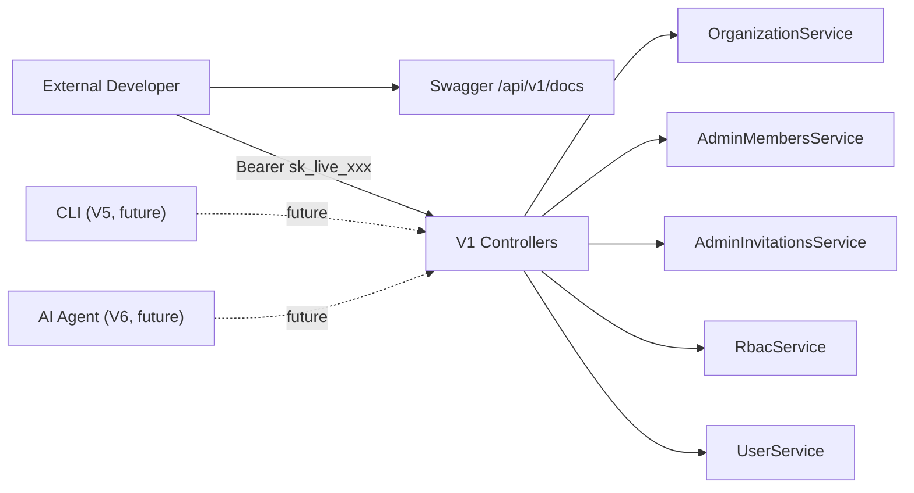

## Context

Slice V3 from the [Public API & Developer Platform spec](../specs/194-public-api-developer-platform.mdx). Issue #319 (auth guard, PR #448) is merged — `@RequireApiKey()` and API key authentication are functional. This spec covers the 5 versioned public controllers and the dual Swagger instance.

## Goal

Deliver 5 versioned, key-authenticated REST controllers under `/api/v1/` with purpose-built response DTOs, a public error envelope, and a separate Swagger instance at `/api/v1/docs` — giving external developers a stable, documented public API surface.

## Users

- **External developers** — integrate via `Authorization: Bearer sk_live_xxx` to manage orgs, members, invitations, roles
- **AI agents** (future V6) — same `/api/v1/` endpoints consumed programmatically
- **CLI** (future V5) — generated client wrapping these endpoints

## Expected Behavior

### Happy path

1. Developer creates an API key via the settings UI (V1, already shipped)
2. Developer calls `GET /api/v1/members` with `Authorization: Bearer sk_live_xxx`
3. AuthGuard validates the key (#319) → constructs synthetic session with scoped permissions
4. V1 MembersController receives the request, calls `AdminMembersService.listMembers()`
5. Controller maps the internal response to a purpose-built `MemberResponseDto`
6. Response returned as JSON with the public contract shape
7. Developer browses `/api/v1/docs` for interactive Swagger documentation with "Authorize" button for API key

### Error path

1. Developer calls `GET /api/v1/members` without a valid API key
2. AuthGuard rejects → V1 exception filter catches and returns the public error envelope:
   ```json
   { "error": { "code": "API_KEY_REQUIRED", "message": "...", "statusCode": 401 } }
   ```

### Edge cases

| Scenario | Behavior |
|----------|----------|
| Session cookie on V1 route | 401 — `@RequireApiKey()` rejects session auth |
| Valid key, insufficient scopes | 403 — `API_KEY_SCOPE_DENIED` |
| Valid key, resource not found | 404 — `NOT_FOUND` with resource type in message |
| Malformed request body | 400 — validation pipe errors in error envelope |
| Internal service error | 500 — generic error envelope, no internal details leaked |

## Data Model & Consumers

### Response DTO Structure



### Consumer Map



### Consumer Summary

| Consumer | Fields consumed | When | Status |
|----------|----------------|------|--------|
| External developers | All DTO fields via REST | V3 (this issue) | This issue |
| CLI (V5) | Same REST endpoints, `--json` output | Future | Future |
| AI tool registry (V6) | OpenAPI spec → tool definitions | Future | Future |
| Swagger UI | OpenAPI spec for interactive docs | V3 (this issue) | This issue |

## Breadboard

### API Affordances

| ID | Handler | Route | Logic |
|----|---------|-------|-------|
| N5 | `V1OrganizationsController` | `GET /api/v1/organizations` | List caller's orgs → `OrganizationService.listForUser()` → map to `OrganizationDto[]` |
| N6a | `V1MembersController` | `GET /api/v1/members` | List members → `AdminMembersService.listMembers()` → `PaginatedResponse<MemberDto>` |
| N6b | `V1MembersController` | `DELETE /api/v1/members/:id` | Remove member → `AdminMembersService.removeMember()` |
| N6c | `V1MembersController` | `PATCH /api/v1/members/:id/role` | Change role → `AdminMembersService.changeMemberRole()` |
| N7a | `V1InvitationsController` | `GET /api/v1/invitations` | List pending → `AdminInvitationsService.listPendingInvitations()` → `InvitationDto[]` |
| N7b | `V1InvitationsController` | `POST /api/v1/invitations` | Invite → `AdminInvitationsService.inviteMember()` → `InvitationDto` |
| N7c | `V1InvitationsController` | `DELETE /api/v1/invitations/:id` | Revoke → `AdminInvitationsService.revokeInvitation()` |
| N8a | `V1RolesController` | `GET /api/v1/roles` | List roles → `RbacService.listRoles()` → `RoleDto[]` (read-only — create/update/delete roles is out of scope for V1) |
| N9 | `V1UsersController` | `GET /api/v1/users/me` | Get caller profile → `UserService.getProfile()` → `UserMeDto` |
| S2 | Dual Swagger | `GET /api/v1/docs` | Second `SwaggerModule.setup()` with `addApiKey()`, filtered to V1 controllers via `include` option |

### Wiring

| From | To | Data |
|------|-----|------|
| AuthGuard | V1 Controllers | `AuthenticatedSession` (actorType: 'api_key') |
| V1 Controllers | Existing Services | orgId, userId, pagination params |
| Existing Services | V1 Controllers | Internal domain objects |
| V1 Controllers | Client | Purpose-built DTOs (mapped from internal shapes) |
| V1ExceptionFilter | Client | `ErrorEnvelope` |

## Slices

This spec is a single slice (V3 from the parent spec). Implementation order within V3:

| Sub-slice | Description | Affordances | Demo |
|-----------|-------------|-------------|------|
| V3.1 | V1 module scaffold + error envelope + `/users/me` | N9, filter | `GET /api/v1/users/me` returns `UserMeDto`. Errors return `{ error: { code, message, statusCode } }`. |
| V3.2 | Organizations + Members controllers | N5, N6a-c | `GET /api/v1/organizations`, `GET /api/v1/members`, `DELETE /api/v1/members/:id`, `PATCH /api/v1/members/:id/role` |
| V3.3 | Invitations + Roles controllers | N7a-c, N8a | `GET /api/v1/invitations`, `POST /api/v1/invitations`, `DELETE /api/v1/invitations/:id`, `GET /api/v1/roles` |
| V3.4 | Dual Swagger instance | S2 | `/api/v1/docs` shows all V1 endpoints with API key auth scheme. Internal `/api/docs` unchanged. |

## Success Criteria

- [ ] 5 resource groups functional under `/api/v1/` (organizations, members, invitations, roles, users/me)
- [ ] All V1 controllers use `@RequireApiKey()` at controller level
- [ ] All V1 controllers use purpose-built response DTOs (not internal service shapes)
- [ ] Public error envelope: `{ error: { code, message, statusCode } }` on all V1 error responses
- [ ] `@Permissions()` checks enforced on V1 routes (matching internal admin route permissions)
- [ ] Public API docs available at `/api/v1/docs` with API key security scheme
- [ ] Internal `/api/docs` unchanged (no V1 routes mixed in)
- [ ] Session auth rejected on all V1 routes (401 with `API_KEY_REQUIRED`)
- [ ] Pagination params (page, pageSize, search) supported on list endpoints
- [ ] `V1_SWAGGER_ENABLED` env var controls public docs independently from internal `SWAGGER_ENABLED`

## Out of Scope

- Role CRUD via V1 (`POST/PATCH/DELETE /api/v1/roles`) — V1 exposes read-only role listing
- Rate limiting per API key (#321, V4)
- CLI codegen (#322, V5)
- AI tool registry (#325, V6)
- API key self-management via V1 (already shipped in V1 slice via internal routes)
- `updatedAt` on DTOs — minimal public surface for V1
- Webhook notifications for API events

## Design Decisions

### Public error envelope vs existing format

**Decision:** V1 routes use a dedicated `V1ExceptionFilter` that wraps errors in `{ error: { code, message, statusCode } }`. The existing internal `AllExceptionsFilter` (which uses `{ statusCode, timestamp, path, correlationId, message, errorCode }`) remains unchanged for internal routes.

**Rationale:** The public API contract should be minimal and stable. Internal fields like `correlationId`, `timestamp`, and `path` are implementation details. The V1 filter catches exceptions from existing domain error classes and maps them to the public envelope.

### Controller-level `@RequireApiKey()` not route-level

**Decision:** Apply `@RequireApiKey()` on every V1 controller class, not on individual methods.

**Rationale:** Per parent spec technical decision — every new route added to a V1 controller automatically requires API key auth. No risk of forgetting the decorator.

### V1Module structure

**Decision:** Create a dedicated `V1Module` that imports existing feature modules (`OrganizationModule`, `AdminModule`, `RbacModule`, `UserModule`) and declares its own V1 controllers. `V1Module` is registered in `AppModule.imports[]`. V1 controllers inject existing services (exported by their modules) and apply their own DTOs + exception filter.

**Rationale:** This gives clean Swagger isolation via `SwaggerModule.createDocument(app, v1Config, { include: [V1Module] })` — the `include` option scopes the OpenAPI document to controllers registered under the specified module. V1 controllers live in `src/v1/` as a separate module tree, not mixed into existing domain modules.

### V1 Swagger always enabled (not gated by `SWAGGER_ENABLED`)

**Decision:** The public API Swagger at `/api/v1/docs` is always enabled when the app starts, independent of the `SWAGGER_ENABLED` env var (which controls internal `/api/docs` only). A separate `V1_SWAGGER_ENABLED` env var (default `true`) controls public docs independently.

**Rationale:** External developers need documentation to integrate. Gating public docs behind the same flag as internal docs would make the public API unusable in production. Separate control allows internal docs to stay disabled while public docs remain available.

### DTO mapping in controllers (not a separate mapper layer)

**Decision:** Controllers contain inline mapping from service results to DTOs. No separate `mapper` classes.

**Rationale:** F-lite scope, ~5 controllers with simple field selection. A mapper layer adds indirection without value at this scale. If mapping logic grows, mappers can be extracted later.
