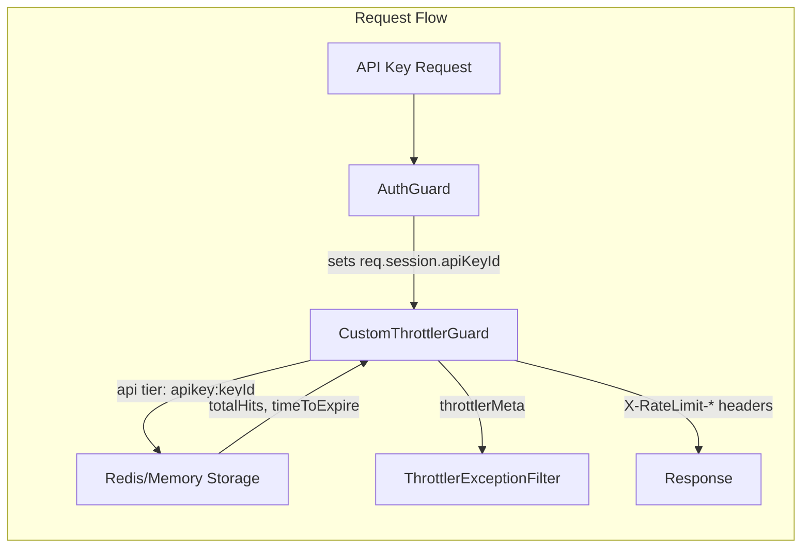

## Context

Slice V4 from the public API developer platform (#194). Depends on #319 (V2 — auth guard API key fallback), which is merged. The throttler infrastructure (Upstash Redis, `CustomThrottlerGuard`, `ThrottlerExceptionFilter`) was built in #53.

## Goal

API key requests are rate-limited per key (not per IP), with standard rate limit headers on every response and a typed 429 when exceeded — so API consumers can implement backoff and platform operators get per-key isolation.

## Users

- **API consumers:** third-party developers using API keys — need predictable limits and headers to self-regulate
- **Platform operators:** need per-key isolation so one noisy consumer doesn't degrade service for others

## Expected Behavior

1. When a request authenticates via API key (Bearer token → `actorType: 'api_key'`), the `api` throttler tier activates
2. The tracking key is `apikey:${keyId}` — each key has its own independent counter, regardless of source IP. The `api` tier branch must **skip `getTracker()`** and read `req.session?.apiKeyId` directly (a UUID string set by `AuthGuard.buildApiKeySession` in #319), then call `generateKey(context, 'apikey:${keyId}', 'api')`. This avoids `getTracker` returning `user:${userId}` which would give per-user instead of per-key isolation
3. Non-API-key requests (browser sessions, unauthenticated) skip the `api` tier entirely (return `true`)
4. Every API key response includes `X-RateLimit-Limit`, `X-RateLimit-Remaining`, `X-RateLimit-Reset` headers. `X-RateLimit-Reset` is a **Unix epoch timestamp in seconds** (matches existing `throttlerMeta.reset` format). Headers are set by calling `res.header(...)` on the Fastify reply object directly inside `handleRequest` (success path), analogous to how the exception filter sets them on 429
5. When the limit is exceeded, a 429 response is returned with:
   - Error code: `API_KEY_RATE_LIMITED`
   - `Retry-After` header (seconds until reset)
   - `X-RateLimit-Remaining: 0`
6. Default limits: 100 requests per 60 seconds (configurable via `RATE_LIMIT_API_TTL` and `RATE_LIMIT_API_LIMIT` env vars, already defined with per-environment defaults)
7. Atomicity is guaranteed by the Upstash Redis `INCR` primitive (used by existing `storageService.increment`). No additional concurrency handling needed
8. The `api` tier must be **appended last** in `throttlers[]` (after `global` and `auth`). The last tier's `throttlerMeta` overwrites earlier tiers — this ensures success responses show API key limits, not global limits

## Data Model & Consumers

No new database tables or schema changes. This feature uses the existing in-memory/Redis throttler storage.

**Consumer summary:**

| Consumer | Fields | When | Status |
|----------|--------|------|--------|
| `CustomThrottlerGuard.handleRequest` | `req.session.apiKeyId`, `throttler.name` | Every request | This issue |
| `ThrottlerExceptionFilter` | `req.throttlerMeta.tierName` | On 429 | This issue (extend error code) |
| Rate limit headers interceptor/guard | `throttlerMeta.{limit,remaining,reset}` | Every API key response | This issue |

## Breadboard

### Affordances

| ID | Element | Location |
|----|---------|----------|
| N1 | `api` throttler entry | `throttler.module.ts` `throttlers[]` |
| N2 | API key tracker override | `customThrottler.guard.ts` `handleRequest()` |
| N3 | API tier skip for non-API-key | `customThrottler.guard.ts` `handleRequest()` |
| N4 | `API_KEY_RATE_LIMITED` error code | `errorCodes.ts` |
| N5 | Tier-specific error code in filter | `throttlerException.filter.ts` |
| N6 | Rate limit headers on success | `customThrottler.guard.ts` `handleRequest()` |

### Wiring

| From | To | Action |
|------|----|--------|
| N1 | N2 | `api` tier config triggers `handleRequest` with `throttler.name === 'api'` |
| N2 | N3 | When `throttler.name === 'api'`, check `req.session?.apiKeyId` — skip if absent |
| N2 | N6 | After storage increment, set `X-RateLimit-*` headers on the response |
| N2 | N5 | On limit exceeded, set `throttlerMeta.tierName = 'api'` before throwing |
| N5 | N4 | Filter reads `tierName === 'api'` → uses `API_KEY_RATE_LIMITED` error code |

## Slices

| # | Slice | Affordances | Independently testable |
|---|-------|-------------|----------------------|
| 1 | API throttler tier + per-key tracking | N1, N2, N3 | Yes — API key requests tracked by key ID, non-API-key requests skip tier |
| 2 | Rate limit headers + typed 429 | N4, N5, N6 | Yes — headers on success, `API_KEY_RATE_LIMITED` on 429. Changes: `errorCodes.ts` (add code), `throttlerException.filter.ts` (branch on `tierName === 'api'`) |

## Success Criteria

- [ ] `api` throttler tier entry exists in `throttlers[]` with `RATE_LIMIT_API_TTL` / `RATE_LIMIT_API_LIMIT`
- [ ] `handleRequest` uses `apikey:${keyId}` as tracker when `throttler.name === 'api'` and request has `apiKeyId`
- [ ] `handleRequest` returns `true` (skip) when `throttler.name === 'api'` and request has no `apiKeyId`
- [ ] `X-RateLimit-Limit`, `X-RateLimit-Remaining`, `X-RateLimit-Reset` headers on every API key response (success and 429)
- [ ] 429 response uses `API_KEY_RATE_LIMITED` error code when tier is `api`
- [ ] `Retry-After` header present on 429 responses (already handled by existing filter)
- [ ] Existing global and auth tiers unaffected (no regression)
- [ ] Unit tests for guard logic (api tier skip, per-key tracking, header setting)
- [ ] Integration test for 429 with correct error code and headers
