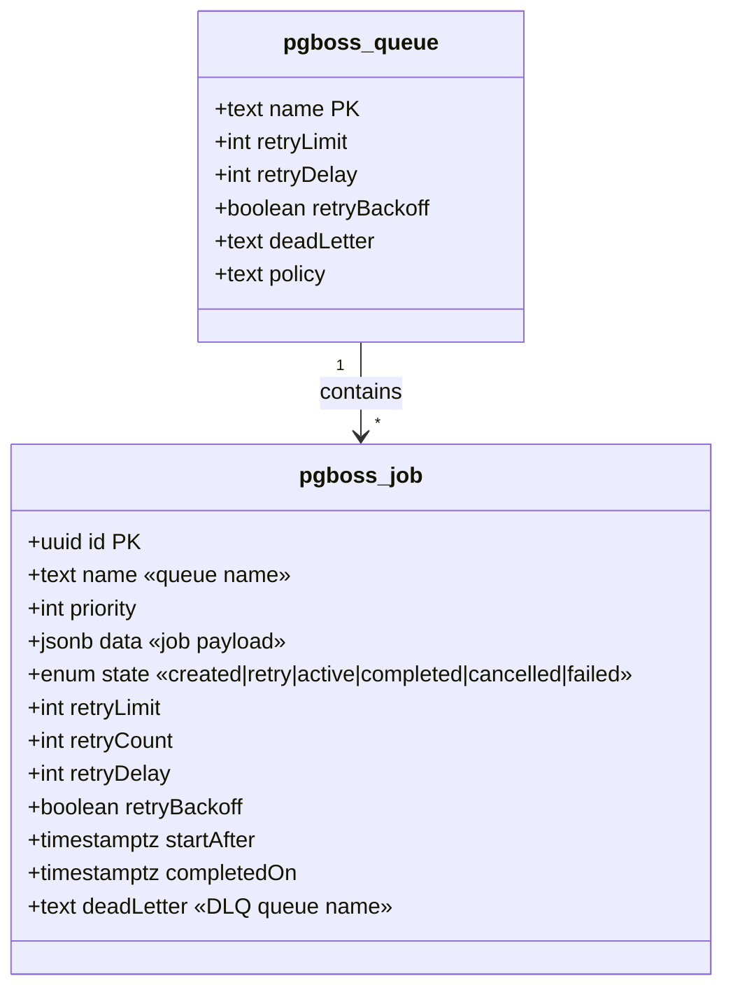
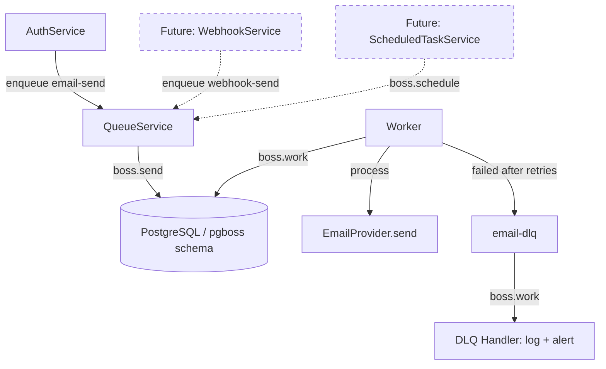

## Context

Promoted from [analysis](../analyses/329-queue-provider-worker-infra-analysis.mdx). Provider decision: **pg-boss** (PostgreSQL-native, zero new infra). See analysis Fit Check for rationale.

## Goal

Provide a composable background job processing module that any NestJS service can use to enqueue and process jobs asynchronously, with retry, dead-letter handling, concurrency control, and graceful shutdown.

## Users

- **Backend developers** — enqueue jobs from services, define job handlers
- **DevOps / deployers** — configure worker mode (in-process vs separate), monitor queues
- **End users** — benefit from faster API responses (email moves to background)

## Out of Scope

- Webhook job implementation (future consumer — queue module supports it, but handler is not built here)
- Scheduled/cron jobs (pg-boss supports `boss.schedule()`, but not wired in this issue)
- Dashboard/monitoring UI (Bull Board equivalent — future enhancement)
- Multi-region or distributed queue topology
- Standalone worker deployment recipe (Dockerfile, Railway/Fly config) — deferred to a follow-up issue
- Worker auto-scaling or horizontal scaling configuration

## Expected Behavior

### Enqueue flow

A service injects `QueueService` and calls `enqueue('email-send', { to, subject, html })`. The job is persisted to PostgreSQL via pg-boss. The API response returns immediately without waiting for the job to complete.

### Processing flow

The worker (running in-process or as a separate entry point) picks up queued jobs via pg-boss polling. Each queue has a registered handler function. Handlers receive an **array of jobs** (pg-boss v10+ signature: `(jobs: Job[]) => Promise<void>`). The handler processes each job. On success, pg-boss marks it complete. On failure, pg-boss retries with exponential backoff up to the queue's `retryLimit`. After all retries are exhausted, the job moves to the dead-letter queue.

### Shutdown flow

On SIGTERM, the module calls `boss.stop({ graceful: true, timeout: 30000 })`. In-flight jobs finish (up to 30s), then the process exits cleanly.

### Worker modes

| Mode | Entry point | Use case |
|------|------------|----------|
| **In-process** | `QUEUE_WORKER_ENABLED=true` in env | Dev, single-server deploys |
| **Enqueue-only** | `QUEUE_WORKER_ENABLED=false` (default) | Vercel serverless — enqueue works, processing happens elsewhere |
| **Standalone worker** | `apps/api/src/worker.ts` entry point | Production — separate process for job processing |

The same `QueueModule` is imported in all modes. The env flag controls whether `boss.work()` is called.

**Standalone worker bootstrap** (W2):

```ts
// apps/api/src/worker.ts — no HTTP server, queue processing only
const app = await NestFactory.createApplicationContext(WorkerAppModule)
app.enableShutdownHooks()
// WorkerAppModule imports: ConfigModule, DatabaseModule, QueueModule, EmailModule
// QUEUE_WORKER_ENABLED=true is required in the worker's env
```

**Version requirement:** `pg-boss@^10.0.0` (v10+ requires explicit `createQueue()` before `send()`, handlers receive job arrays). Target latest stable (v10.x as of March 2026).

## Data Model & Consumers

### Data structure

pg-boss manages its own schema (`pgboss.*` tables) — no Drizzle schema needed. Key tables (auto-created by `boss.start()`):



### Consumer map



### Consumer summary

| Consumer | Queue | Fields consumed | When | Status |
|----------|-------|----------------|------|--------|
| EmailWorker | `email-send` | `data.to`, `data.subject`, `data.html`, `data.text` | On dequeue | This issue |
| DLQ Handler | `email-dlq` | Full job data + error | After retry exhaustion | This issue |
| WebhookWorker | `webhook-send` | `data.url`, `data.payload`, `data.headers` | On dequeue | Future |
| ScheduledTasks | various | Job-specific | Cron trigger | Future |

## Breadboard

### Module affordances

| ID | Affordance | Type | Handler | Data |
|----|-----------|------|---------|------|
| N1 | `QueueModule.forRoot(config)` | NestJS module | Initializes pg-boss, registers provider | `{ connectionString }` |
| N2 | `QueueModule.registerQueue(options)` | NestJS module | Creates queue with retry/DLQ config | `{ name, retryLimit, retryDelay, retryBackoff, deadLetter, concurrency }` |
| N3 | `QUEUE_SERVICE` token | DI provider | Injection token for QueueService | — |
| N4 | `QueueService.enqueue(name, data, opts?)` | Service method | Delegates to `boss.send()`. Returns `Promise<string \| null>` (null if throttled by queue policy). | Job name + payload |
| N5 | `QueueService.registerHandler(name, handler, opts?)` | Service method | Delegates to `boss.work()`. Handler signature: `(jobs: Job[]) => Promise<void>` (pg-boss v10+ array format). | Handler fn + `{ batchSize?, pollingIntervalSeconds? }` |
| N6 | `QueueService.getQueueStats(name)` | Service method | Delegates to `boss.getQueueStats()` | Queue name |
| N7 | `OnModuleInit` → `boss.start()` then `boss.createQueue()` for each registered queue | Lifecycle | Starts pg-boss, then creates all declared queues (required before any `send()`) | — |
| N8 | `OnApplicationShutdown` → `boss.stop()` | Lifecycle | Graceful drain | `{ graceful: true, timeout: 30000 }` |

### Worker affordances

| ID | Affordance | Type | Handler | Data |
|----|-----------|------|---------|------|
| W1 | `QUEUE_WORKER_ENABLED` env var | Config | Controls whether `boss.work()` is called | boolean |
| W2 | `apps/api/src/worker.ts` | Entry point | Standalone worker process | Imports QueueModule + handlers |

### Email integration affordances

| ID | Affordance | Type | Handler | Data |
|----|-----------|------|---------|------|
| E1 | `EmailQueueHandler` | Job handler | Calls `EmailProvider.send()` | `{ to, subject, html, text }` |
| E2 | `email-send` queue | Queue config | `retryLimit: 3, retryDelay: 30, retryBackoff: true, deadLetter: 'email-dlq', batchSize: 5, pollingIntervalSeconds: 2` | — |
| E3 | `email-dlq` queue | DLQ config | Logs failed email, emits `EMAIL_SEND_FAILED` event via existing `EventEmitter2` | — |

### Wiring

```
AuthService → N4 (enqueue 'email-send') → PostgreSQL
Worker (W1=true) → N5 (registerHandler) → boss.work → E1 (EmailQueueHandler) → EmailProvider.send
E1 fails 3x → E2 deadLetter → E3 (DLQ handler) → log + EVENT_EMAIL_SEND_FAILED
```

## Slices

| # | Slice | Affordances | Demo |
|---|-------|-------------|------|
| 1 | **Queue module core** | N1, N2, N3, N4, N5, N6, N7, N8 | `QueueService.enqueue('test', { hello: 'world' })` → job appears in `pgboss.job` table. Worker picks it up and logs it. |
| 2 | **Worker modes** | W1, W2 | In-process: set `QUEUE_WORKER_ENABLED=true`, jobs process automatically. Standalone: run `bun apps/api/src/worker.ts`, jobs process in separate process. Enqueue-only: `QUEUE_WORKER_ENABLED=false`, jobs stay queued. |
| 3 | **Email queue integration** | E1, E2, E3, N4 | `AuthService.sendVerification()` enqueues instead of calling `EmailProvider.send()` directly. Email arrives via worker. Failed emails land in DLQ. |

## Success Criteria

- [ ] `pg-boss` is installed and `boss.start()` runs on module init without errors
- [ ] pg-boss creates its schema (`pgboss.*` tables) in the existing PostgreSQL database
- [ ] `QueueService.enqueue(name, data)` persists a job to PostgreSQL and returns a job ID
- [ ] A registered handler is invoked and completes after `QueueService.enqueue()` is called (within 5s at default 2s polling interval)
- [ ] Failed jobs retry with exponential backoff (delay doubles per attempt)
- [ ] Jobs that exhaust `retryLimit` move to the configured dead-letter queue
- [ ] `QueueService.getQueueStats(name)` returns `{ queued, active, completed, failed }` counts
- [ ] Concurrency is respected — no more than N jobs processed simultaneously per queue
- [ ] `QUEUE_WORKER_ENABLED=false` allows enqueue without starting workers (Vercel-safe)
- [ ] `QUEUE_WORKER_ENABLED=true` starts workers in-process (dev/single-server mode)
- [ ] `apps/api/src/worker.ts` runs as a standalone process and processes jobs
- [ ] On SIGTERM, in-flight jobs complete before the process exits (up to 30s timeout)
- [ ] `AuthService` enqueues emails via `QueueService` instead of calling `EmailProvider.send()` directly
- [ ] Enqueued emails are delivered (verified via Mailpit in dev)
- [ ] Failed emails (after retries) land in `email-dlq` and emit `EMAIL_SEND_FAILED` event
- [ ] Environment variables (`QUEUE_WORKER_ENABLED`) are validated via Zod in `env.validation.ts`
- [ ] `.env.example` updated with `QUEUE_WORKER_ENABLED=true`
- [ ] `QUEUE_WORKER_ENABLED=false` set in Vercel preview/production environments
- [ ] pg-boss connects, enqueues, and processes jobs under Bun 1.3.9 without errors
- [ ] pg-boss self-managed schema (`pgboss.*`) does not interfere with Drizzle `db:generate` (no Drizzle schema for queue tables)
- [ ] CI E2E tests use `QUEUE_WORKER_ENABLED=true` (in-process mode) so email flows continue to work
- [ ] Unit tests cover: enqueue, handler registration, retry logic, DLQ routing, graceful shutdown
- [ ] Integration test: enqueue email → worker processes → email arrives in Mailpit

## Edge Cases

| Scenario | Handling |
|----------|----------|
| PostgreSQL unavailable at startup | `boss.start()` throws → NestJS fails to bootstrap (desired: fail fast) |
| Job handler throws | pg-boss retries per queue config. After `retryLimit`, moves to DLQ. |
| Worker killed mid-job (SIGKILL) | pg-boss marks job as expired after `expireInSeconds` → retried by another worker |
| Duplicate job enqueue | pg-boss assigns unique ID per job. No dedup by default (acceptable for email). |
| Database connection lost mid-processing | pg-boss reconnects automatically. In-flight job may expire and retry. |
| Bun compatibility | pg-boss uses `node-pg` driver. Bun supports `pg` natively. Hard requirement: verify in Slice 1 — if incompatible, escalate before proceeding. |
| Graceful shutdown returns early | Known pg-boss issue: `boss.stop({ graceful: true })` may return before in-flight jobs finish. Accept: jobs re-queued via expiry mechanism. Document as known limitation. |
| pg-boss schema vs Drizzle | pg-boss self-manages `pgboss.*` tables. Do not add to Drizzle schema. `db:generate` is unaffected. |
