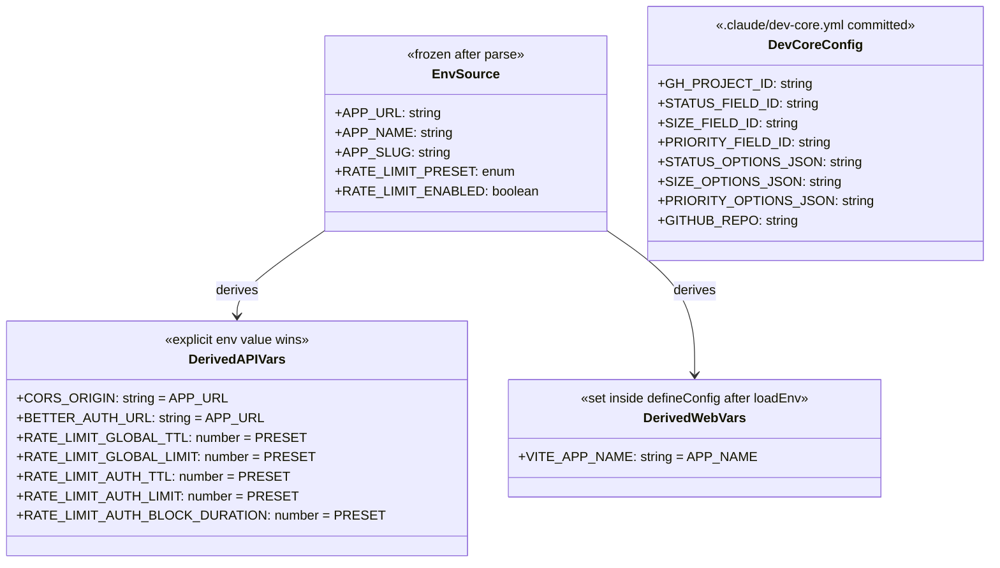
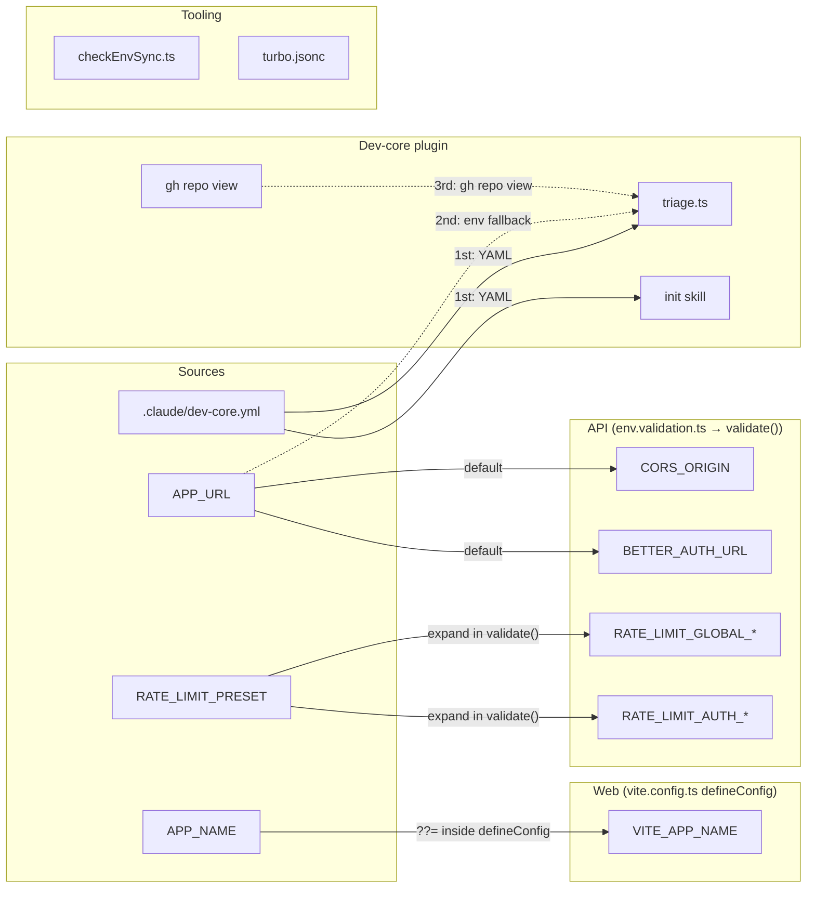

## Context

Promoted from analysis for #498. Shape 2 (Full Simplification) was selected: derive redundant vars, deduplicate tokens, move dev-core field IDs to plugin config, introduce rate limit presets. Target: ~60 → ~37 env vars.

## Goal

Reduce `.env.example` from ~60 to ~37 variables so new developers configure only genuinely required vars, with all derivable/optional vars resolved automatically.

## Users

- **Primary:** New developers onboarding — fewer vars to configure, fewer misconfiguration opportunities.
- **Secondary:** Existing developers and CI pipelines — zero breakage; explicit values silently take precedence.

## Expected Behavior

A developer clones the repo, copies `.env.example` to `.env`, and sees ~37 vars organized in clear sections. Variables like `CORS_ORIGIN`, `BETTER_AUTH_URL`, and `VITE_APP_NAME` are absent from required sections — they derive from `APP_URL` and `APP_NAME` at startup. Rate limiting is controlled by a single `RATE_LIMIT_PRESET` var instead of 7 granular tuning vars. Dev-core field IDs live in `.claude/dev-core.yml` (committed), not `.env`. Docker container/volume names are clearly documented as auto-derived from `APP_SLUG`.

When the developer runs `bun run dev`, the API starts with `CORS_ORIGIN` resolved from `APP_URL`, `BETTER_AUTH_URL` resolved from `APP_URL`, and rate limits configured by the `default` preset. The web app starts with `VITE_APP_NAME` resolved from `APP_NAME`. Running `bun run env:check` passes clean with no false positives for derived vars.

If a developer explicitly sets `CORS_ORIGIN=https://custom.example.com` in their `.env`, that value silently wins — no warnings, no errors.

## Data Model & Consumers

### Derivation Chain

### Consumer Map

### Consumer Summary

| Consumer | Fields consumed | When | Status |
|----------|----------------|------|--------|
| `env.validation.ts` validate() | CORS_ORIGIN ← APP_URL, BETTER_AUTH_URL ← APP_URL | API startup (Zod parse) | This issue |
| `env.validation.ts` validate() | RATE_LIMIT_* ← RATE_LIMIT_PRESET (post-parse transform) | API startup (after Zod parse) | This issue |
| `throttler.module.ts` useFactory | RATE_LIMIT_GLOBAL_*, RATE_LIMIT_AUTH_* | Module init (reads resolved values, own fallbacks removed) | This issue |
| `vite.config.ts` defineConfig | VITE_APP_NAME ← APP_NAME | Inside defineConfig callback, after `loadEnv()` | This issue |
| `env.shared.ts` clientEnv | VITE_APP_NAME (via import.meta.env) | Client bundle | No change (already optional) |
| `triage.ts` + dev-core scripts | GH_PROJECT_ID, *_FIELD_ID, *_OPTIONS_JSON, GITHUB_REPO | Claude Code agent runtime | This issue (YAML → env → gh) |
| `checkEnvSync.ts` | All schema keys | `bun run env:check` | This issue (DERIVED_VARS allowlist) |
| `deploy-preview.yml` | CORS_ORIGIN (explicit --env injection) | Vercel deploy | No change (preserved as-is) |

## Breadboard

### B1: API Env Derivation

| Affordance | ID | Handler | Data |
|------------|-----|---------|------|
| APP_URL env var | U1 | Zod schema (optional) | `process.env.APP_URL` |
| CORS_ORIGIN field | N1 | `z.preprocess`: if undefined, read `config.APP_URL` | Falls back to U1 value, then `'http://localhost:3000'` |
| BETTER_AUTH_URL field | N2 | `z.preprocess`: if undefined, read `config.APP_URL` | Falls back to U1 value, then `'http://localhost:3000'` |
| validate() function | S1 | Parses config with derivation applied | Returns resolved EnvironmentVariables |

Wiring: U1 → N1 (if CORS_ORIGIN not set, use APP_URL; if APP_URL also not set, fall back to `'http://localhost:3000'`); U1 → N2 (same logic); N1+N2 → S1.

Note: `BETTER_AUTH_URL` default changes from `http://localhost:4000` to derived-from-APP_URL (`http://localhost:3000` when APP_URL unset). This fixes a long-standing mismatch between the schema default and `.env.example`. `env.validation.test.ts` must be updated to reflect the new default.

### B2: Vite APP_NAME Derivation

| Affordance | ID | Handler | Data |
|------------|-----|---------|------|
| APP_NAME env var | U2 | `process.env.APP_NAME` | Server-side only |
| loadEnv() call | N3a | `loadEnv(mode, envDir, 'VITE_')` inside defineConfig | Loads .env VITE_* vars into process.env |
| VITE_APP_NAME assignment | N3b | `process.env.VITE_APP_NAME ??= process.env.APP_NAME ?? 'App'` | After N3a — explicit .env value wins |
| import.meta.env.VITE_APP_NAME | S2 | Vite picks up from process.env | Client bundle uses resolved value |

Wiring: N3a loads dotenv (explicit `VITE_APP_NAME` from `.env` populates `process.env`); N3b applies `??=` (only assigns if not already set by dotenv); S2 reads resolved value. This preserves "explicit wins" because dotenv runs first.

Critical: the `??=` must execute **after** `loadEnv()`, not at module top-level. Vite evaluates `vite.config.ts` before loading dotenv — top-level `??=` would always overwrite.

Tests: `vi.stubEnv('VITE_APP_NAME', ...)` in `appName.test.ts` patches `import.meta.env` directly (Vitest intercept), independent of vite.config.ts. Tests are unaffected.

`VITE_APP_NAME` must remain in both `clientEnvSchema` (`env.shared.ts`) and the vite.config.ts inline validation schema as `.optional()` — only the `.env.example` line is removed.

### B3: Rate Limit Presets

| Affordance | ID | Handler | Data |
|------------|-----|---------|------|
| RATE_LIMIT_PRESET env var | U3 | Zod enum field | `default` \| `strict` \| `relaxed` |
| Individual RATE_LIMIT_* fields | N5 | Zod `.optional()` (no `.default()`) | `undefined` when not set by user |
| Preset expansion | N4 | Post-parse transform in `validate()`: `applyRateLimitPreset(config)` | For each `undefined` individual field, apply preset value |
| ThrottlerModule useFactory | S3 | `config.get()` | Reads resolved individual values (own fallbacks removed) |

Wiring: Zod parses U3 (preset enum with default `'default'`) and N5 (individual fields, all optional). `validate()` calls `applyRateLimitPreset()` after `envSchema.safeParse()`: for each individual field that is `undefined`, fill from preset lookup table. Explicit individual vars (not `undefined`) are preserved. S3 reads fully-resolved values from ConfigService.

**Why `.optional()` is required:** Current fields use `.default(60)` etc. — Zod fills the default before the preset step runs, making it impossible to distinguish "user set 60" from "Zod defaulted to 60". Changing to `.optional()` with post-parse expansion solves this.

**ThrottlerModule impact:** `useFactory` currently has its own fallback defaults (`config.get<number>('RATE_LIMIT_GLOBAL_TTL', 60_000)`). After this change, `validate()` always returns concrete values, making these fallbacks dead code. Remove them for clarity.

**`RATE_LIMIT_ENABLED` is independent:** The preset controls limit values only. `RATE_LIMIT_ENABLED` remains the single on/off toggle, checked by `CustomThrottlerGuard`. CI sets `RATE_LIMIT_ENABLED=false` directly — this is unaffected by presets.

Preset definitions:

| Preset | GLOBAL_TTL | GLOBAL_LIMIT | AUTH_TTL | AUTH_LIMIT | AUTH_BLOCK | API_TTL | API_LIMIT |
|--------|-----------|-------------|---------|-----------|-----------|---------|----------|
| `default` | 60000 | 60 | 60000 | 5 | 300000 | 60000 | 100 |
| `strict` | 60000 | 30 | 60000 | 3 | 600000 | 60000 | 50 |
| `relaxed` | 60000 | 120 | 60000 | 10 | 60000 | 60000 | 200 |

### B4: Dev-core Config Migration

| Affordance | ID | Handler | Data |
|------------|-----|---------|------|
| `.claude/dev-core.yml` | U4 | YAML file reader | Field IDs, option JSONs, GITHUB_REPO |
| Plugin script config loader | N6 | 3-tier fallback: YAML → env → `gh repo view` | Checks file first, then process.env, then CLI |
| `gh repo view` fallback | N6b | `gh repo view --json nameWithOwner --jq '.nameWithOwner'` | Requires authenticated `gh` CLI |
| `/init` skill | S4 | Writes to `.claude/dev-core.yml` | Auto-detected values |

Wiring: N6 reads U4 (YAML file); if field missing → reads `process.env.GH_PROJECT_ID` etc.; for `GITHUB_REPO` specifically, if both missing → N6b calls `gh repo view` (requires auth). S4 writes U4 on `/init`.

`.claude/dev-core.yml` is **committed** to the repo — field IDs are project-specific but not sensitive. Each developer runs `/init` to populate their project's values. CI does not invoke dev-core scripts, so no CI impact.

### B5: env:check + Tooling Updates

| Affordance | ID | Handler | Data |
|------------|-----|---------|------|
| DERIVED_VARS set | U5 | New constant in checkEnvSync.ts | `CORS_ORIGIN`, `BETTER_AUTH_URL`, `VITE_APP_NAME` |
| Schema-vs-example check | N7 | Modified loop | Skips DERIVED_VARS in both .env.example check AND turbo declaration check |
| TOOLING_ALLOWLIST update | N8 | Remove dev-core vars | No longer in .env.example |
| turbo.jsonc update | N9 | Remove CORS_ORIGIN, BETTER_AUTH_URL from globalPassThroughEnv; add RATE_LIMIT_PRESET; keep individual RATE_LIMIT_* for override backward compat | Runtime passthrough (not cache-keyed) |

Wiring: U5 → N7 (skip derived vars in both sync checks); N8 updated (dev-core vars removed from allowlist); N9 updates turbo passthrough.

### B6: .env.example Deduplication + Docker Docs

| Affordance | ID | Handler | Data |
|------------|-----|---------|------|
| Vercel/GitHub token consolidation | N10 | Merge app + dev-core sections | Single "External Services" section |
| Docker derivation docs | N11 | Clarify existing APP_SLUG derivation | Comments-only change in .env.example + docker-compose.yml |

## Slices

| # | Slice | Affordances | Demo |
|---|-------|-------------|------|
| 1 | API env derivation | B1 (U1, N1, N2, S1) | Start API without CORS_ORIGIN/BETTER_AUTH_URL set → app starts, CORS works |
| 2 | Vite APP_NAME derivation | B2 (U2, N3a, N3b, S2) | Start web without VITE_APP_NAME → app shows APP_NAME value |
| 3 | Rate limit presets | B3 (U3, N4, N5, S3) | Set RATE_LIMIT_PRESET=strict → API logs strict limits |
| 4 | Dev-core config migration | B4 (U4, N6, N6b, S4) | Run `/init` → writes .claude/dev-core.yml; triage.ts reads from it |
| 5 | Tooling + dedup + docs + cleanup | B5 (U5, N7, N8, N9) + B6 (N10, N11) + turbo.jsonc + .env.example final + configuration.mdx | `bun run env:check` passes clean; .env.example has ~37 vars |

**Dependency order:** Slices 1, 2, 3, 4 → Slice 5 (env:check and turbo.jsonc need all derivations in place first).

**File conflict note:** Slices 1 and 3 both modify `env.validation.ts`. Sequence: Slice 1 before Slice 3, or batch together.

## Success Criteria

### API Derivation (Slice 1)
- [ ] `CORS_ORIGIN` defaults to `APP_URL` when not explicitly set in `.env`
- [ ] `BETTER_AUTH_URL` defaults to `APP_URL` when not explicitly set in `.env`
- [ ] When `APP_URL` is also unset, both fall back to `'http://localhost:3000'`
- [ ] Explicit `CORS_ORIGIN` or `BETTER_AUTH_URL` in `.env` silently takes precedence over derivation
- [ ] `env.validation.test.ts` updated: `BETTER_AUTH_URL` default assertion reflects new derived value

### Vite Derivation (Slice 2)
- [ ] `VITE_APP_NAME` derived from `APP_NAME` via `process.env.VITE_APP_NAME ??= process.env.APP_NAME ?? 'App'`
- [ ] Assignment placed inside `defineConfig` callback after `loadEnv()` (not at module top-level)
- [ ] Explicit `VITE_APP_NAME` in `.env` silently takes precedence (dotenv loads before `??=`)
- [ ] `VITE_APP_NAME` remains in `clientEnvSchema` and vite.config.ts inline schema as `.optional()`
- [ ] `appName.test.ts` passes without modification (`vi.stubEnv` is independent of vite.config.ts)

### Rate Limit Presets (Slice 3)
- [ ] `RATE_LIMIT_PRESET` enum (`default`|`strict`|`relaxed`) added to `env.validation.ts`
- [ ] Individual `RATE_LIMIT_*` Zod fields changed from `.default(N)` to `.optional()`
- [ ] `applyRateLimitPreset()` post-parse transform in `validate()` fills `undefined` fields from preset
- [ ] Explicit individual `RATE_LIMIT_*` env vars override preset values
- [ ] `RATE_LIMIT_ENABLED` remains unchanged — independent toggle, not affected by presets
- [ ] `ThrottlerModule.useFactory` fallback defaults removed (reads fully-resolved values from ConfigService)

### Dev-core Migration (Slice 4)
- [ ] `.claude/dev-core.yml` stores GH_PROJECT_ID, STATUS/SIZE/PRIORITY_FIELD_ID, *_OPTIONS_JSON, GITHUB_REPO
- [ ] `.claude/dev-core.yml` committed to repo (non-sensitive field IDs)
- [ ] Dev-core plugin scripts use 3-tier fallback: YAML → env var → `gh repo view` (for GITHUB_REPO)
- [ ] Dev-core field IDs removed from `.env.example`

### Tooling + Cleanup (Slice 5)
- [ ] `bun run env:check` passes clean with no false positives for derived vars
- [ ] `DERIVED_VARS` allowlist added to `checkEnvSync.ts` — suppresses both .env.example check and turbo declaration check
- [ ] Dev-core vars removed from `TOOLING_ALLOWLIST` in `checkEnvSync.ts`
- [ ] `turbo.jsonc`: `CORS_ORIGIN`, `BETTER_AUTH_URL` removed from `globalPassThroughEnv`
- [ ] `turbo.jsonc`: `RATE_LIMIT_PRESET` added to `globalPassThroughEnv`; individual `RATE_LIMIT_*` vars kept for override backward compat
- [ ] Vercel/GitHub tokens appear once in `.env.example` (no duplicates between app and dev-core sections)
- [ ] Docker vars in `.env.example` clarified as auto-derived from `APP_SLUG`; `docker-compose.yml` comments updated
- [ ] `deploy-preview.yml` CORS_ORIGIN `--env` injection preserved (not removed)
- [ ] `docs/configuration.mdx` updated with derivation logic, presets, advanced overrides
- [ ] `.env.example` reduced to ~37 vars / ~100 lines

### Quality Gates
- [ ] All existing tests pass (`bun run test`)
- [ ] `bun run typecheck` passes
- [ ] `bun run lint` passes
