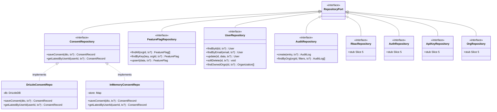
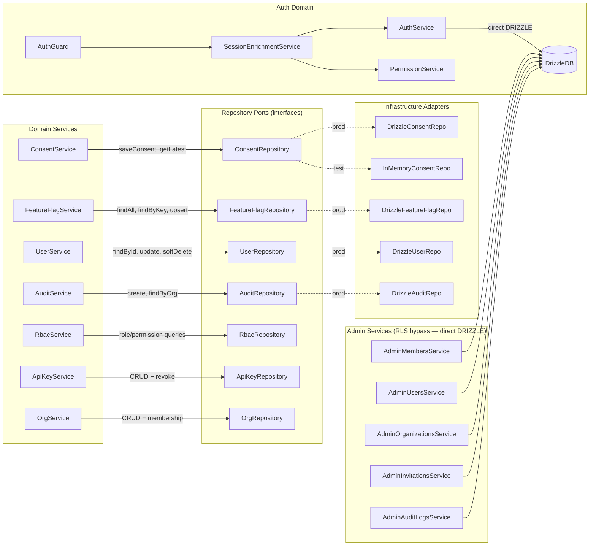

# Spec: Backend Design Quality

## Context

External review identified structural debt in the backend: no repository abstraction (DIP violation), AuthService dual responsibility, mixed concerns in @repo/types, unenforced RLS bypass rules, growing exception filter, and documentation-enforcement gap. Full analysis: `artifacts/analyses/501-backend-design-quality.mdx`.

The codebase is well-decomposed (17 modules, 20 services, 15 controllers) with no critical god classes. These are proactive improvements, not urgent fixes.

## Goal

Introduce repository abstraction for all database-accessing services, split AuthService into focused units, namespace shared types with import boundaries, and add tooling enforcement for architectural patterns — enabling provider swaps, improving testability, and reducing coupling.

## Users

- **Developers** — cleaner service boundaries, easier testing with in-memory repos, clearer import paths
- **Future maintainers** — documented and enforced patterns reduce onboarding friction
- **Ops/Security** — explicit RLS bypass tracking, per-domain error handling

## Not in Scope

- **`@repo/config` cleanup** (analysis F6, item 6) — deferred to a follow-up issue. The package is functional; cleanup is cosmetic.
- **Broader enforcement lint rules** (analysis F6, phases 1 and 3) — service line-count rules, module import limits, and `eslint-plugin-boundaries` are deferred. This spec covers only the RLS bypass lint rule and @repo/types import boundaries.
- **Frontend architecture** — covered by separate issue #409.

## Expected Behavior

### Repository Pattern

Each domain module exposes a **repository port** (TypeScript interface) defining data access methods. A **Drizzle adapter** implements the port with actual queries. Services inject the port token, never Drizzle directly.

Transaction support is preserved: repository methods accept an optional `tx?: DrizzleTx` parameter (type already exported from `drizzle.provider.ts`). Services that orchestrate transactions pass the tx handle through.

Module binding is a one-liner: `{ provide: CONSENT_REPO, useClass: DrizzleConsentRepository }`. Swapping to a different ORM means replacing the adapter class — zero service changes.

**Port design rule:** port interfaces must match the actual data access patterns of the current service — no speculative methods. For example, `ConsentRepository` exposes `saveConsent()` and `getLatestByUserId()` (matching the append-only insert pattern), not a generic `upsert()`.

**Cache rule:** in-process caches (e.g., `FeatureFlagService`'s TTL cache) stay in the service above the port. Repository ports expose only raw read/write operations — no caching logic.

**Testing strategy:** Slice 1 creates a full `InMemoryConsentRepository` as a reference implementation. Subsequent slices (4, 5) test via mocking the port interface directly (e.g., `jest.fn()` / vitest mock on the injection token) — full in-memory adapters are optional per module.

### AuthService Split

`AuthService` retains auth initialization (Better Auth instance, email provider, config) and domain event emission. Post-split dependencies: `DRIZZLE` (Better Auth needs DB handle), `EmailProvider`, `ConfigService`, `EventEmitter2` (4 deps — `PermissionService` removed).

A new `SessionEnrichmentService` takes over `getSession()` enrichment (session fetch + permission resolution). Dependencies: `AuthService`, `PermissionService` (2 deps). `AuthGuard` switches to `SessionEnrichmentService` for enriched session context.

**Circular dependency check:** `SessionEnrichmentService` depends on `AuthService` (same module) and `PermissionService` (RbacModule). This matches the existing import direction (`AuthModule` already imports permission resolution). No new circular dependency introduced — `RbacModule` does not import `AuthModule`.

### Type Namespace

`@repo/types` restructures into three sub-paths:
- `@repo/types` (default) — shared types used by both apps (User, Permission, ApiKey, Consent, Pagination)
- `@repo/types/api` — backend-only (AuditAction, SENSITIVE_FIELDS, ERROR_CODES)
- `@repo/types/ui` — frontend-only (DICEBEAR_CDN_BASE, AVATAR_STYLES, AvatarStyle)

Import boundary: `apps/web` cannot import from `@repo/types/api`; `apps/api` cannot import from `@repo/types/ui`. `apps/docs` must also be checked for any `@repo/types` imports and updated.

**Note:** Import boundary enforcement via lint rule is deferred until after Slices 4+5 complete (repository adapters will legitimately import from `@repo/types/api` for schema types). Slice 3 restructures the package and updates all import sites; the lint rule activates in Slice 6.

### Exception Filters

Per-domain `@Catch()` filters replace the `instanceof` chain in `AllExceptionsFilter`. The global filter becomes a thin fallback for truly unexpected errors. The admin module already has 3 domain filters — this extends the pattern.

### RLS Bypass Enforcement

All services bypassing RLS get explicit `// RLS-BYPASS: <reason>` comments. A custom **ESLint rule** (Biome does not support custom rules) flags `@Inject(DRIZZLE)` outside of: (a) repository adapter files (`*.repository.ts`), (b) admin service files (`admin/**`), (c) `permission.service.ts`, (d) `auth.service.ts` (Better Auth requires direct DB handle). Lint rule severity: **error** (blocks CI).

## Data Model & Consumers

### Repository Port Architecture

> Note: Only `ConsentRepository` shows both Drizzle and in-memory adapters (Slice 1 exemplar). Batch 2 repositories (RBAC, Auth, ApiKey, Org) are stubbed — defined in Slice 5.

### Consumer Map

### Repository Consumer Summary

| Consumer | Repository Port | Key Methods | Slice |
|----------|----------------|-------------|-------|
| ConsentService | ConsentRepository | saveConsent, getLatestByUserId | 1 |
| FeatureFlagService | FeatureFlagRepository | findAll, findByKey, upsert | 4 |
| AuditService | AuditRepository | create, findByOrg | 4 |
| SystemSettingsService | SystemSettingsRepository | findAll, findByKey, upsert | 4 |
| UserService + UserPurgeService | UserRepository | findById, update, softDelete, findOwnedOrgs | 5 |
| RbacService + RbacMemberService | RbacRepository | role/permission queries | 5 |
| AuthService | Direct DRIZZLE (RLS-BYPASS: better-auth-adapter) | Better Auth init | stays direct |
| ApiKeyService | ApiKeyRepository | CRUD + revoke | 5 |
| OrgService | OrgRepository | CRUD + membership | 5 |

### Direct DRIZZLE Services (RLS Bypass — Stays Direct)

| Service | Reason |
|---------|--------|
| AdminMembersService | Cross-tenant member management |
| AdminUsersService + AdminUsersQueryService + AdminUsersLifecycleService | Cross-tenant user admin |
| AdminOrganizationsService + AdminOrganizationsQueryService + AdminOrganizationsDeletionService + AdminOrganizationsHierarchyService | Cross-tenant org admin |
| AdminInvitationsService | Cross-tenant invitation management |
| AdminAuditLogsService | Cross-tenant audit log access |
| PermissionService | Cross-tenant permission resolution |
| AuthService | Better Auth requires direct DB handle |

### Service Decomposition (Non-Repository)

| New Service | Consumes | Purpose | Slice |
|-------------|----------|---------|-------|
| SessionEnrichmentService | AuthService + PermissionService | Session fetch + permission enrichment | 2 |

## Breadboard

### N1: Repository Port Definition

| Affordance | Handler | Data |
|------------|---------|------|
| Repository interface file | Define per-module port matching actual service queries | Method signatures + return types |
| NestJS injection token | `Symbol('CONSENT_REPO')` per module | Token constant |
| Optional tx parameter | All methods accept `tx?: DrizzleTx` | Transaction handle |

### N2: Drizzle Adapter

| Affordance | Handler | Data |
|------------|---------|------|
| Adapter class | Implements port interface | `@Inject(DRIZZLE) db: DrizzleDB` |
| Query methods | Drizzle ORM builders (moved from service) | Schema tables + relations |
| Module binding | `{ provide: TOKEN, useClass: Adapter }` | Provider registration |

### N3: In-Memory Adapter (Test)

| Affordance | Handler | Data |
|------------|---------|------|
| In-memory class | Implements ConsentRepository | `Map<string, Entity>` store |
| Test module | `{ provide: TOKEN, useClass: InMemory }` | Test provider |
| Reset method | `clear()` for test isolation | Store state |

### N4: SessionEnrichmentService

| Affordance | Handler | Data |
|------------|---------|------|
| getEnrichedSession() | Fetch session via AuthService, enrich via PermissionService | Session + permissions |
| AuthGuard integration | Guard calls SessionEnrichmentService | Enriched session on request |
| AuthModule registration | Declare + export SessionEnrichmentService in AuthModule | Module provider list |

### N5: Type Namespace

| Affordance | Handler | Data |
|------------|---------|------|
| Package exports map | `"."`, `"./api"`, `"./ui"` in package.json | Sub-path resolution |
| Shared types | `@repo/types` default import | User, Permission, etc. |
| API types | `@repo/types/api` explicit import | AuditAction, ERROR_CODES |
| UI types | `@repo/types/ui` explicit import | AVATAR_STYLES, DICEBEAR |
| Import-site migration | Find + update all `@repo/types` imports across apps/web, apps/api, apps/docs | Updated import paths |

### N6: Exception Filters

| Affordance | Handler | Data |
|------------|---------|------|
| DomainException base | Extended by per-domain exceptions | errorCode, statusCode |
| Per-domain @Catch filter | Maps domain exception → HTTP response | Structured error |
| Global fallback | AllExceptionsFilter handles unknown | Generic 500 |

### N7: RLS Bypass Enforcement

| Affordance | Handler | Data |
|------------|---------|------|
| `// RLS-BYPASS: reason` comment | Documentation marker on each bypassing service | Service file |
| ESLint custom rule | Flags `@Inject(DRIZZLE)` outside allowed paths | ESLint plugin config |
| Lint severity | Error level — blocks CI | `.eslintrc` / `eslint.config.js` |

### N8: Documentation Updates

| Affordance | Handler | Data |
|------------|---------|------|
| backend-patterns.mdx | Add repository pattern section: port interface, Drizzle adapter, module binding example | Docs |
| code-review.mdx | Add RLS bypass review checklist | Docs |
| testing.mdx | Add in-memory repository testing pattern + port mock examples | Docs |
| CLAUDE.md | Update gotchas: new @repo/types import paths, repository pattern | Project config |

## Slices

| # | Slice | Scope | Deps | Demo |
|---|-------|-------|------|------|
| 1 | Repository foundation + Consent | Base interfaces, ConsentRepo port + Drizzle adapter + in-memory adapter, ConsentService refactor, unit test with in-memory repo, backend-patterns.mdx + testing.mdx updates | None | `ConsentService` unit test passes using `InMemoryConsentRepository` registered in NestJS test module |
| 2 | AuthService SRP split | Extract SessionEnrichmentService, register + export from AuthModule, update AuthGuard | None | `SessionEnrichmentService` unit test with stub AuthService passes; AuthGuard returns enriched session |
| 3 | @repo/types namespace | Restructure into shared/api/ui sub-paths, update package.json exports, update all import sites (apps/web, apps/api, apps/docs) | None | `bun run build` succeeds; `apps/web` has zero `@repo/types/api` imports; `apps/api` has zero `@repo/types/ui` imports |
| 4 | Repository rollout — batch 1 | FeatureFlags, Audit, SystemSettings repos (simpler modules, no cross-table tx) | Slice 1 | Each service's unit test passes with port mock; zero direct DRIZZLE injection in these services |
| 5 | Repository rollout — batch 2 | User (complex: softDelete/purge span multiple tables via UserPurgeService), RBAC, ApiKey, Org repos | Slice 1 | Each service's unit test passes with port mock; zero direct DRIZZLE injection in these services (except AuthService: RLS-BYPASS) |
| 6 | Exception filters + RLS enforcement | Per-domain @Catch filters, slim AllExceptionsFilter, RLS-BYPASS comments on all bypassing services, ESLint rule, @repo/types import boundary lint, doc updates (code-review.mdx, CLAUDE.md) | Slices 4 + 5 | ESLint rule passes in CI; `AllExceptionsFilter` has zero `instanceof` beyond `HttpException` |

## Success Criteria

### Repository Pattern (Slices 1, 4, 5)
- [ ] Every non-admin service (except AuthService) injects a repository port token, not `DRIZZLE` directly
- [ ] Each repository port is a TypeScript interface in the module's directory, matching actual service query patterns
- [ ] Each Drizzle adapter implements the port with existing query logic preserved
- [ ] `InMemoryConsentRepository` is registered in a NestJS test module and used by ConsentService unit tests
- [ ] Transaction support preserved: all existing `tx` call sites identified and mapped to repository method signatures
- [ ] `UserRepository` port accommodates `softDelete` and `findOwnedOrgs` for the multi-table purge flow; `UserPurgeService` receives tx through port methods
- [ ] Module bindings use `{ provide: TOKEN, useClass: DrizzleAdapter }`
- [ ] `backend-patterns.mdx` documents repository pattern with: one complete port interface, one Drizzle adapter, and the NestJS module binding

### AuthService Split (Slice 2)
- [ ] AuthService handles only Better Auth initialization and domain events (no session enrichment)
- [ ] SessionEnrichmentService handles session fetch + permission enrichment (2 deps: AuthService, PermissionService)
- [ ] AuthGuard delegates to SessionEnrichmentService
- [ ] No new circular dependency introduced between AuthModule and RbacModule

### Type Namespace (Slice 3)
- [ ] `@repo/types` package.json has exports for `.`, `./api`, `./ui`
- [ ] All import sites updated across apps/web, apps/api, apps/docs
- [ ] `apps/web` has zero imports from `@repo/types/api`
- [ ] `apps/api` has zero imports from `@repo/types/ui`

### Exception Filters (Slice 6)
- [ ] `AllExceptionsFilter` contains zero `instanceof` checks beyond base `HttpException`
- [ ] Per-domain exception filters exist for throttler and remaining domains

### RLS Enforcement (Slice 6)
- [ ] All RLS-bypassing services (see Direct DRIZZLE Services table) have `// RLS-BYPASS: <reason>` comments
- [ ] ESLint rule flags `@Inject(DRIZZLE)` outside allowed file paths (adapters, admin/, permission.service.ts, auth.service.ts)
- [ ] ESLint rule runs in CI at error severity
- [ ] @repo/types import boundary lint rule active

### Cross-cutting
- [ ] Zero test regressions (`bun run test` passes)
- [ ] Zero type errors (`bun run typecheck` passes)
- [ ] All existing API contracts unchanged (no breaking changes)
- [ ] All existing transaction call sites audited and preserved in adapter method signatures before service refactoring begins
