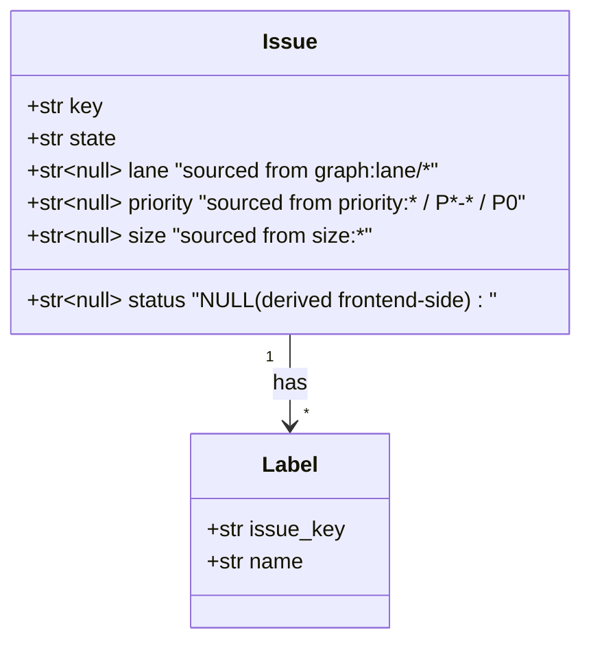
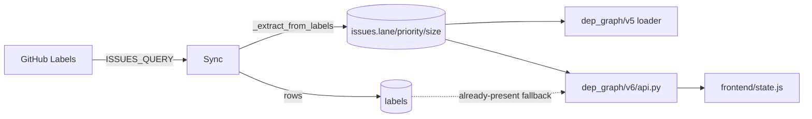

## Context

Source: frame `54-drop-projectv2-source-from-labels-frame.mdx` (approved).

`corpus/sync.py` sources `lane/priority/size/status` via ProjectV2 board lookup
(`_parse_project_fields`, `ISSUES_QUERY > projectItems`). Audit (215 open
issues): `lane` empty in 100%, `size` filled 55%, `priority` 44%. Backfill
script (#53) already normalized labels across the org using dev-core canonical
vocab (`size:S|F-lite|F-full`, `priority:P0|P1|P2|P3`, `graph:lane/X`). Labels
are now the better source; ProjectV2 branch is redundant GraphQL cost.

A label-based extractor already exists in `dep_graph/v6/parse.py`
(`derive_priority`, `derive_lane_size`) but is only consumed by the v6 API
layer, not by corpus sync.

## Goal

Remove ProjectV2 from corpus sync; derive `lane/priority/size` from labels at
ingest time so the DB columns carry the same values without the GraphQL
fragment.

## Users

- **Mickael** — runs `roxabi-live` sync + dashboard; gains a lighter GraphQL
  query and one SSoT for issue metadata.
- **`dep_graph/v6/api.py`** — already falls back to labels for `lane`; after
  this change `lane` column is always populated so the fallback becomes a
  no-op (kept for defense-in-depth).
- **`dev-core:issue-triage`** — unchanged; it already dual-writes labels +
  ProjectV2.

## Expected Behavior

1. `ISSUES_QUERY` returns only `labels(first: 30)` (no `projectItems`).
2. On each issue node, sync calls `_extract_from_labels(labels)` →
   `{lane, priority, size}`.
3. `status` column stays in schema but is written as NULL by sync (frontend
   computes status from `state` + edges; DB value was never consumed).
4. `upsert_issue` writes the derived values to `issues.lane/priority/size`;
   `status` written NULL.
5. Webhook path unchanged — it already rebuilds issues via the same sync
   helpers.
6. Dep-graph v5 loader (`v5/data/corpus.py:_project_fields`) continues to read
   from DB columns — no v5 change needed.

Vocabulary mapping (derivation at sync time, labels untouched in DB):

| Label                              | → column `size`     |
|------------------------------------|---------------------|
| `size:S`                           | `S`                 |
| `size:F-lite`                      | `F-lite`            |
| `size:F-full`                      | `F-full`            |
| `size:M` (legacy, closed only)     | `F-lite`            |
| raw `XS|S|M|L|XL` (legacy)         | passthrough (rare)  |

| Label                              | → column `priority` |
|------------------------------------|---------------------|
| `priority:P0` / `P0`               | `P0`                |
| `priority:P1` / `P1-high` / `priority:high`   | `P1`     |
| `priority:P2` / `P2-medium` / `priority:medium` | `P2`   |
| `priority:P3` / `P3-low` / `priority:low` / `priority: low` | `P3` |

| Label                              | → column `lane`     |
|------------------------------------|---------------------|
| `graph:lane/<x>`                   | `<x>`               |

## Data Model & Consumers

Consumers:

| Consumer                          | Fields consumed        | When         | Status |
|-----------------------------------|------------------------|--------------|--------|
| `dep_graph/v5/data/corpus.py`     | lane, priority, size, status | CLI build | this issue (verify passthrough) |
| `dep_graph/v6/api.py`             | lane, priority, size   | live API     | this issue (lane no longer null) |
| `frontend/state.js`               | status (computed)      | render       | unchanged |
| `reconciler.py` (hourly sync)     | labels → derived cols  | heal loop    | this issue |
| `webhook/handlers.py`             | labels → derived cols  | realtime     | this issue |

## Breadboard

| Affordance  | Kind   | Handler                              | Reads / Writes |
|-------------|--------|--------------------------------------|----------------|
| N1 ISSUES_QUERY        | network | `corpus/graphql.py::ISSUES_QUERY`       | reads GH labels only |
| N2 extract_from_labels | pure   | `corpus/sync.py::_extract_from_labels`   | labels list → `{lane, priority, size}` |
| N3 run_repo_sync       | loop   | `corpus/sync.py::run_repo_sync`          | calls N2 per node, upserts issues |
| S1 tests/corpus/test_sync.py | test | pytest | asserts N2 + trimmed GraphQL fixture |

Wiring: N1 (trimmed) → N3 → N2 → `upsert_issue`. S1 exercises N2 directly and
verifies N3 writes correct columns from fixture labels.

## Slices

| # | Slice                                      | Files touched | Demo                     |
|---|--------------------------------------------|---------------|--------------------------|
| 1 | Add `_extract_from_labels` + unit tests    | `corpus/sync.py`, `tests/corpus/test_sync.py` | pytest green on new extractor |
| 2 | Trim `ISSUES_QUERY` + swap caller          | `corpus/graphql.py`, `corpus/sync.py`, `tests/corpus/test_sync.py` (fixture) | pytest green; ad-hoc sync run populates `lane/priority/size` |
| 3 | Remove dead `_parse_project_fields` + assert `status` NULL | `corpus/sync.py`, tests | regression tests green; DB row shows lane populated |

Slices 1→2→3 strictly sequential (2 depends on 1's helper; 3 cleans up after 2).

## Success Criteria

- [ ] `corpus/graphql.py::ISSUES_QUERY` no longer contains `projectItems` or
      `fieldValues`
- [ ] `corpus/sync.py::_extract_from_labels(labels: list[str])` returns
      `{"lane": ..., "priority": ..., "size": ...}` with normalized values per
      mapping tables above
- [ ] `corpus/sync.py::_parse_project_fields` deleted (no remaining callers)
- [ ] `run_repo_sync` writes NULL to `issues.status` (column retained)
- [ ] `tests/corpus/test_sync.py`: fixture no longer contains `projectItems`;
      ≥1 new test covers `_extract_from_labels` across the 4 label families
      (canonical size, canonical priority, legacy priority, lane)
- [ ] After rebuild of `~/.roxabi/corpus.db`: `SELECT COUNT(*) FROM issues
      WHERE lane IS NOT NULL` > 0 (today = 0), and `lane/priority/size` on
      open issues match what `dep_graph/v6/parse.py` would derive from the
      same labels
- [ ] All existing tests green (`uv run pytest`)

## Open Questions

- [ ] Reuse `dep_graph/v6/parse.py::derive_priority/derive_lane_size` from
      `corpus/sync.py` vs. inline-copy in `corpus/` to keep corpus layer free
      of `dep_graph` imports? **Default: inline-copy a small helper in
      `corpus/sync.py`** (corpus is the lower layer and must not import up).
      Confirm at plan time.
