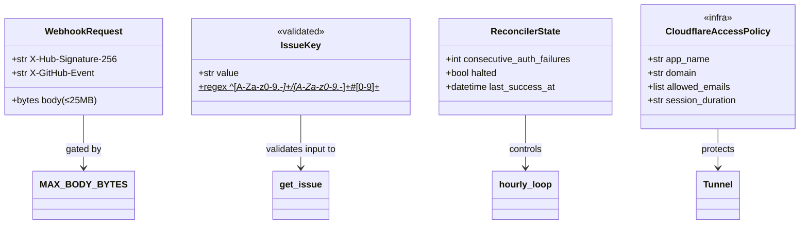
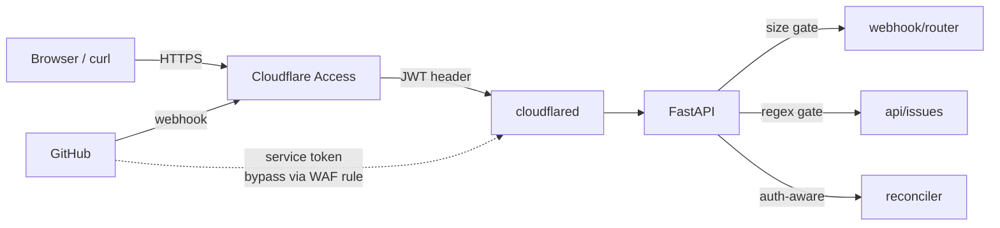

## Context

Promoted from `artifacts/frames/56-harden-public-api-frame.mdx`. Four defense-in-depth findings from the PR #55 review need to land before the tunnel at `dashboard.roxabi.dev` is used more broadly:

- **SEC-4** — Cloudflare Access zero-trust policy in front of the tunnel (infra)
- **SEC-1** — request body size cap before HMAC verify on `/webhook/github`
- **SEC-2** — strict path validation on `GET /api/issues/{key:path}`
- **SEC-3** — reconciler must stop + alert on repeated GitHub auth failures

Relevant modules (landed in PR #55, on `origin/staging`):
- `src/roxabi_live/webhook/router.py` — unbounded `await request.body()` at line 46
- `src/roxabi_live/api/issues.py` — `get_issue(key: str)` at `/issues/{key:path}` passes the raw `key` to the DB
- `src/roxabi_live/reconciler.py` — `run_once` swallows all exceptions with `log.exception`; no auth/transient distinction
- `docs/cloudflared-setup.md` — existing tunnel provisioning doc (extend for Access)

## Goal

Every request to `dashboard.roxabi.dev` passes a zero-trust identity check, no single request can pin the webhook with unbounded bytes, malformed issue keys are rejected at the edge of our code, and the reconciler halts loudly instead of failing silently when GitHub credentials break.

## Users

- **Primary:** Mickael — operator of the tunnel. Wants private-repo data never served to an unauthenticated caller, and wants to know immediately when the reconciler's token stops working.
- **Secondary:** future dashboard consumers (new tabs over `/api/*`) — inherit the Access gate and input validation for free.

## Expected Behavior

1. An unauthenticated browser hitting `https://dashboard.roxabi.dev/api/issues` is redirected by Cloudflare Access to the identity provider; only after successful auth does the request reach FastAPI.
2. A `POST /webhook/github` request with a 30 MB body is rejected with `413 Payload Too Large` before FastAPI reads the body into memory and before HMAC verify runs.
3. `GET /api/issues/Roxabi/roxabi-live#56` returns 200; `GET /api/issues/..%2F..%2Fetc%2Fpasswd` or `GET /api/issues/foo` returns `400 Bad Request` with a validation error message.
4. When GitHub returns 401/403 on `reconciler.run_once()` for two consecutive cycles, `hourly_loop` cancels itself, emits a `CRITICAL` log line, and sets a module-level flag/event that the lifespan shutdown can observe.

## Data Model & Consumers

| Consumer | Fields / surface | When | Status |
|----------|------------------|------|--------|
| `webhook/router.py` | `MAX_WEBHOOK_BODY_BYTES` (25 MB) | Every POST `/webhook/github` | this issue |
| `api/issues.py::get_issue` | `ISSUE_KEY_RE` | Every GET `/api/issues/{key:path}` | this issue |
| `reconciler.py::hourly_loop` | `_auth_failure_count`, CRITICAL log | Every scheduler tick after 401/403 | this issue |
| Cloudflare dashboard | Access app on `dashboard.roxabi.dev` | Every inbound request | this issue |
| GitHub → webhook | Service-token bypass or public route exception | Incoming webhook deliveries | this issue |
| Future `/api/*` endpoints | Inherits Access + validation patterns | When added | future |

## Breadboard

### Affordances

| ID | Affordance | Handler | Data |
|----|-----------|---------|------|
| N1 | 25 MB request-body cap | new `size_limit_middleware` in `webhook/router.py` or `app.py` | `Content-Length` header + streamed-read guard |
| N2 | Compiled issue-key regex | new `ISSUE_KEY_RE` in `api/issues.py` | `^[A-Za-z0-9._-]+/[A-Za-z0-9._-]+#[0-9]+$` |
| N3 | `get_issue` input guard | `api/issues.py::get_issue` — raise 400 on mismatch | `ISSUE_KEY_RE.fullmatch(key)` |
| N4 | Auth-error classifier | new `_is_auth_error(exc)` in `reconciler.py` | `GithubException.status ∈ {401, 403}` or `HTTPError.response.status_code` |
| N5 | Halt flag | module-level `_halted: bool` + `_auth_failures: int` in `reconciler.py` | Read by `hourly_loop`, observable to tests |
| N6 | CRITICAL log emitter | `log.critical("reconciler halted: repeated auth failure")` | Standard logger |
| S1 | Cloudflare Access app policy | Cloudflare dashboard (or Terraform) | Email allowlist incl. `mickael@bouly.io` |
| S2 | Webhook public bypass | Access app exclusion for `POST /webhook/github` with service-token OR WAF rule | GitHub's IP ranges |
| D1 | Setup doc extension | `docs/cloudflared-setup.md` | Steps + screenshots |

### Wiring

- N1 runs **before** HMAC verify (fail-fast on oversized bodies; HMAC would still correctly reject, but we don't want to buffer 1 GB).
- N3 runs **first line** of `get_issue` body; all existing DB calls remain untouched.
- N4 / N5 / N6 fire inside the `except Exception` block of `run_once`; `hourly_loop` checks `_halted` before each `run_once()` call and exits the loop when true.
- S1 / S2 are infra; S2 must allow GitHub webhook deliveries (Cloudflare Access' "service token" or WAF-based IP allowlist for GitHub's published hook IPs).

## Slices

| # | Slice | Scope | Demo |
|---|-------|-------|------|
| 1 | **Webhook body cap** (SEC-1) | Add `MAX_WEBHOOK_BODY_BYTES=25*1024*1024`, middleware or early-read guard in `webhook/router.py`, test `POST` with 26 MB → 413 | `curl -X POST --data-binary @big.bin /webhook/github` → 413 |
| 2 | **Issue key validation** (SEC-2) | Add `ISSUE_KEY_RE`, guard in `get_issue`, test valid + invalid + URL-encoded traversal | `curl /api/issues/foo` → 400; `curl /api/issues/Roxabi/roxabi-live%2356` → 200/404 |
| 3 | **Reconciler auth-aware halt** (SEC-3) | `_is_auth_error`, counter, halt flag, CRITICAL log, `hourly_loop` respects flag; unit tests for 401 / 403 / network error | Test injects 401 from `corpus_sync.run_sync` twice → loop exits, CRITICAL logged |
| 4 | **Cloudflare Access policy** (SEC-4) | Configure Access app in Cloudflare dashboard, set email allowlist, exempt `POST /webhook/github` via service token or IP rule, extend `docs/cloudflared-setup.md` with exact steps | Unauthenticated browser → redirected to IdP; GitHub webhook delivery still reaches `/webhook/github` |

Slice order: **1 → 2 → 3 → 4**. Slices 1–3 are code + tests and land in one PR. Slice 4 is infra + docs; the dashboard config step is manual on Cloudflare, the doc update lands in the same PR so future reruns are deterministic.

## Success Criteria

- [ ] `POST /webhook/github` with body > 25 MB returns `413` and logs a single warning line; body is NOT fully read into memory.
- [ ] `POST /webhook/github` with body ≤ 25 MB behaves exactly as today (HMAC verify, dispatch, heal trigger).
- [ ] `GET /api/issues/foo` returns `400` with a JSON `{"detail": "..."}` body naming the regex.
- [ ] `GET /api/issues/..%2F..%2Fetc%2Fpasswd` returns `400` (never 404, never 500).
- [ ] `GET /api/issues/Roxabi/roxabi-live#56` still returns 200 for a present issue and 404 for an absent one.
- [ ] Test simulating two consecutive `run_once()` calls where `corpus_sync.run_sync` raises a 401-shaped error → `hourly_loop` task completes (loop exited) and a `CRITICAL` record is emitted by the `roxabi_live.reconciler` logger.
- [ ] Transient errors (network `OSError`, 5xx from GitHub) do NOT increment the auth-failure counter and do NOT halt the loop.
- [ ] `docs/cloudflared-setup.md` contains a new "Cloudflare Access" section with step-by-step Access app config and the webhook exemption strategy.
- [ ] Cloudflare Access app is live on `dashboard.roxabi.dev` (verified by `curl -sI https://dashboard.roxabi.dev/api/issues` → 302 to IdP) — Mickael confirms manually.
- [ ] GitHub webhook delivery continues to succeed after Access is enabled (confirmed via a test delivery from the repo's Webhooks settings, 200 ack visible).
- [ ] `uv run pytest` passes all new + existing tests.
- [ ] `uv run ruff check .` + `uv run pyright` clean.

## Open Questions

- [NEEDS CLARIFICATION] SEC-4 exemption: service token (GitHub configures `CF-Access-Client-Id/Secret` headers on webhook) vs. WAF rule allowlisting GitHub's published hook IP ranges. Service token is cleaner; IP allowlist is zero-config on the GitHub side. Decide in plan.
- [NEEDS CLARIFICATION] Size-cap enforcement site: custom ASGI middleware (reads `Content-Length`, rejects early) vs. `fastapi`'s `Request.body()` with a streamed size check. Middleware is more bulletproof; streamed check is simpler. Decide in plan.
