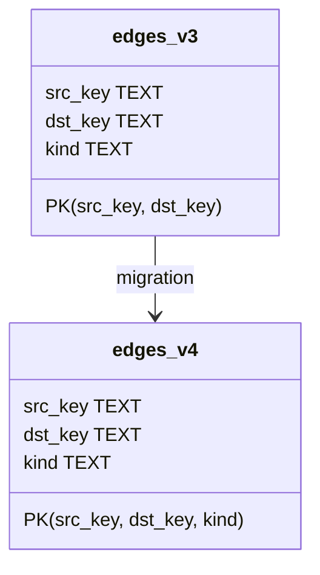
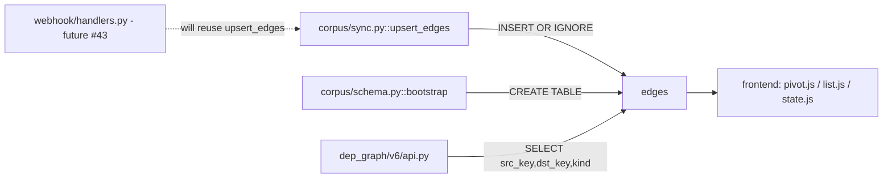

## Context

Promoted from [frame](../frames/57-migrate-edges-pk-to-include-kind-frame.mdx). Follow-up from PR #55 review (BE-2, C=88%).

Current PK on `edges` is `(src_key, dst_key)`. When the same issue pair has both a `parent` and a `blocks` edge, `INSERT OR IGNORE` drops the second row, and `DELETE ... WHERE (src_key OR dst_key) AND kind = ?` can only target one surviving row — so the wrong row may be kept.

**Scope correction (vs. issue body):** `src/roxabi_live/webhook/handlers.py` does not yet exist in the repo. Only `corpus/sync.py` calls `upsert_edges`. When webhooks land (issue #43), they will reuse the same helper; no separate callsite update is needed now.

## Goal

Allow the `edges` table to hold two rows with the same `(src_key, dst_key)` but different `kind` values, with zero data loss across existing dev/prod DBs.

## Users

- **Primary:** dep-graph v6 frontend — consumes `/api/graph`, filters edges by `kind` (see `pivot.js`, `list.js`, `state.js`). Currently would mis-classify nodes silently.
- **Secondary:** corpus sync reconciler — reruns must converge idempotently after the PK change.

## Expected Behavior

1. Existing DB with only `(src, dst)` rows migrates in place without data loss; `kind` column values preserved.
2. A new sync that processes an issue with both `parent` and `blocks` relationships to the same counterpart produces two `edges` rows differing only by `kind`.
3. `upsert_edges` deleting one `kind` does not touch rows of the other `kind` for the same pair.
4. `SCHEMA_VERSION` bumps to 4; `bootstrap` on a fresh DB produces the new PK directly.
5. `/api/graph` returns both edges when both exist for a pair.

## Data Model & Consumers

### Structure (before → after)

### Consumers

### Consumer table

| Consumer | Fields read | When | Status |
|---|---|---|---|
| `upsert_edges` | src_key, dst_key, kind | every sync, per issue | this issue |
| `api.py` | src_key, dst_key, kind | `/api/graph` request | no change needed |
| frontend `state.js` | kind === 'blocks' | status computation | no change needed |
| webhook handlers | src_key, dst_key, kind | push event | future (#43) |

## Breadboard

### Affordances

| ID | Element | Handler | Data |
|---|---|---|---|
| S1 | `edges` table DDL | `schema.py::SCHEMA_SQL` | PK(src_key, dst_key, kind) |
| S2 | Migration runner | `schema.py::_migrate` | SCHEMA_VERSION 3→4 path |
| S3 | `upsert_edges` DELETE+INSERT | `sync.py::upsert_edges` | unchanged signature, relies on 3-col PK |
| S4 | Schema version constant | `schema.py::SCHEMA_VERSION` | bump 3 → 4 |

### Wiring

- Fresh DB: bootstrap runs `SCHEMA_SQL` with new PK → S1.
- Existing DB (v3): `_migrate` detects via `PRAGMA table_info` or version table, runs rebuild: `CREATE TABLE edges_new → INSERT INTO edges_new SELECT * FROM edges → DROP edges → ALTER RENAME → recreate indexes` → S2.
- Sync callsite: `upsert_edges` unchanged — DELETE-by-kind + INSERT OR IGNORE now works correctly because PK includes `kind` → S3.

## Slices

| # | Slice | Files | Demo |
|---|---|---|---|
| 1 | Schema + migration | `schema.py` + test | Fresh DB + v3 DB both end with 3-col PK; no data loss |
| 2 | Callsite verification | test only | Seed issue pair with both `parent` + `blocks`, run sync, assert both rows survive |

Slices are independently landable. Slice 2 proves the fix end-to-end; Slice 1 is the mechanism.

## Success Criteria

- [ ] `edges` table on fresh DB has `PRIMARY KEY (src_key, dst_key, kind)`.
- [ ] `SCHEMA_VERSION == 4`.
- [ ] Migration from v3 DB preserves all existing rows (count before == count after).
- [ ] Migration is idempotent: running `bootstrap` twice on a v3 DB produces the same final state as running it once.
- [ ] Test `tests/corpus/test_edges_pk.py` (or equivalent) seeds a pair with both `parent` and `blocks` edges, runs `upsert_edges` for both kinds, asserts both rows exist with correct `kind` values.
- [ ] Test asserts deleting one `kind` via `upsert_edges` leaves the other `kind` row intact.
- [ ] `uv run pytest` green.
- [ ] `uv run ruff check .` + `uv run pyright` green.

## Risks

- SQLite table-rebuild migration requires FK-disable dance if FKs reference `edges` — none do (verified: no `REFERENCES edges` in schema).
- `ix_edges_dst` index must be recreated after rename.
- Concurrent access during migration: bootstrap runs at process start under single connection; no concurrency issue.
