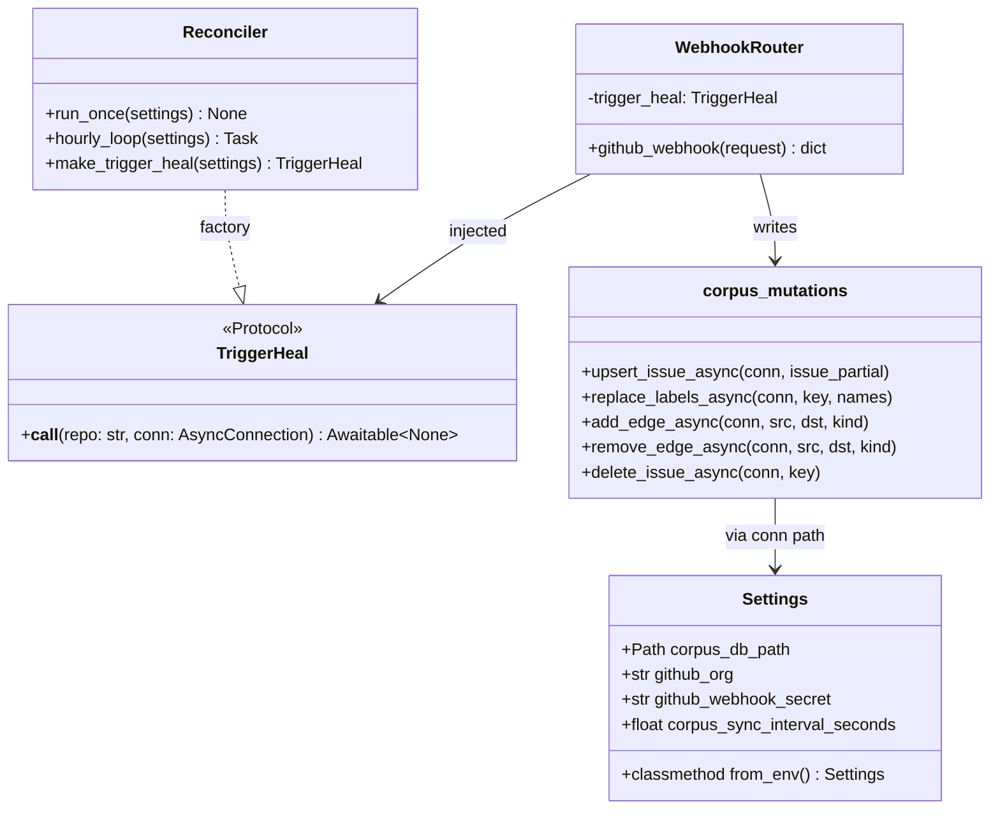
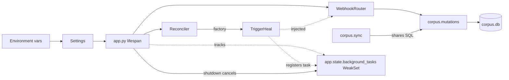

## Context

Source: [frame #58](../frames/58-webhook-layer-cleanup-frame.mdx). Seven correlated review findings on PR #55 covering config duplication, untracked async tasks, layer coupling, SQL drift between webhook + sync paths, missing transactionality, and a double-read of the request body. Blocker #57 (edges PK including `kind`) is closed — SQL consolidation can land on the correct PK.

## Goal

Bring the webhook layer to parity with `corpus.sync` write semantics, behind a single configuration module, with tracked async tasks and zero direct coupling between webhook → reconciler.

## Users

- **Primary:** Backend developers maintaining corpus writes — one writer module to update when schema or invariants change.
- **Secondary:** Operators of `dashboard.roxabi.dev` — webhook task failures surface in logs (no silent drops); shutdown stops cleanly without dangling tasks.

## Expected Behavior

1. Application boot reads env vars **once** (in `roxabi_live.config.Settings`). Every consumer (`api/issues`, `webhook/router`, `reconciler`, `app.py`) gets paths/secrets/intervals from the Settings object — no inline `os.environ.get` outside `config`.
2. Webhook receives an event → HMAC-verifies → parses JSON from the already-read body → dispatches to a handler.
3. Handler writes to corpus via shared `corpus.mutations` async helpers (which reuse `corpus.sync` SQL strings). Issue upserts go through `upsert_issue_async` so new schema columns added in `sync.py` are honored. Label updates run inside an explicit transaction.
4. After write, router calls a `TriggerHeal` callable injected at app wiring time — no `from roxabi_live import reconciler` in the router.
5. Heal callable does `asyncio.create_task(...)` and registers the task in `app.state.background_tasks` (WeakSet). On task completion: log any exception. On app shutdown (`lifespan` exit): cancel all tracked tasks, await with `CancelledError` swallow.
6. End-state of corpus rows after a webhook event matches what `corpus.sync.run_sync` would produce for the same issue (modulo fields not present in webhook payload — those keep prior values).

## Data Model & Consumers

### Module structure

### Consumer map

### Consumer summary

| Consumer | Reads from | When | Status |
|----------|------------|------|--------|
| `api/issues` | `Settings.corpus_db_path` | Every request | this issue |
| `webhook/router` | `Settings.github_webhook_secret`, injected `TriggerHeal`, `corpus.mutations` | Every webhook | this issue |
| `reconciler` | `Settings.corpus_db_path`, `Settings.github_org`, `Settings.corpus_sync_interval_seconds` | Hourly + startup | this issue |
| `app.py` | `Settings.from_env()`, builds `TriggerHeal`, owns WeakSet | Startup / shutdown | this issue |
| `corpus.sync` (existing) | `corpus.mutations` SQL constants | Bulk sync | this issue (refactor to reuse) |
| Future MCP tools | `corpus.mutations` async API | Future writes | future (out of scope) |

## Breadboard

### Affordances

| ID | Surface | Element | Wires to |
|----|---------|---------|----------|
| N1 | `roxabi_live/config.py` | `Settings` dataclass + `from_env()` | env vars |
| N2 | `app.py` | `Settings` constructed once in lifespan; stored on `app.state` | N1, N6 |
| N3 | `app.py` | `app.state.background_tasks: WeakSet[Task]` | N6, N7 |
| N4 | `webhook/router.py` | Router accepts `trigger_heal` via DI (closure or `Depends`) | N5, N6 |
| N5 | `webhook/router.py` | `payload = json.loads(body)` (no second `await request.json()`) | — |
| N6 | `reconciler.py` | `make_trigger_heal(settings) -> TriggerHeal` factory | N1, N3 |
| N7 | `reconciler.py` | Heal task registers in WeakSet, attaches `done_callback` logging exceptions | N3 |
| N8 | `corpus/mutations.py` (new) | Async helpers: `upsert_issue_async`, `replace_labels_async`, `add_edge_async`, `remove_edge_async`, `delete_issue_async` | N9 |
| N9 | `corpus/sync.py` | Extract SQL strings to module-level constants reused by N8 | — |
| N10 | `webhook/handlers.py` | `handle_issues` wraps DELETE+INSERT label dance in `async with conn:` | N8 |
| N11 | `webhook/handlers.py` | All raw SQL replaced by N8 calls | N8 |

### Wiring narrative

App start → `Settings.from_env()` → reconciler factory builds `trigger_heal` closure capturing `app.state.background_tasks` → router router included with `trigger_heal` available via dependency. On webhook: body read once → `json.loads(body)` → HMAC verify → handler called with shared aiosqlite conn → handler delegates to `corpus.mutations` async helpers (which share SQL with `corpus.sync` constants) → router invokes `trigger_heal(repo, conn)` → factory schedules `asyncio.create_task` → task added to WeakSet with done-callback logging exceptions. Lifespan exit → cancel all tasks in WeakSet → await each.

## Slices

| # | Name | Increment | Files (≈) | Demo |
|---|------|-----------|-----------|------|
| 1 | Central config | Add `roxabi_live.config.Settings` + `from_env()`. Replace inline `_db_path()` and env reads in `api/issues`, `webhook/router`, `reconciler`, `app.py`. | `config.py` (new), `api/issues.py`, `webhook/router.py`, `reconciler.py`, `app.py`, tests | `grep -r "os.environ.get" src/roxabi_live` returns only `config.py`; `_db_path()` defined once. |
| 2 | Mutations module + sync refactor | Create `corpus/mutations.py` with async helpers reusing SQL constants extracted from `corpus/sync.py`. `corpus.sync` continues to work via the same constants (sync path). Unit tests for both async + sync writers produce identical rows. | `corpus/mutations.py` (new), `corpus/sync.py` (extract constants), tests | `pytest tests/corpus/test_mutations.py` green; round-trip test: webhook upsert + sync upsert produce equal rows. |
| 3 | Router decoupling + body fix + transactional handlers | Define `TriggerHeal` protocol; reconciler exposes factory; `app.py` wires it; router accepts via DI. Drop `from roxabi_live import reconciler` from router. Replace `await request.json()` with `json.loads(body)`. Wrap `handle_issues` in `async with conn:`. Handlers use `corpus.mutations` (no raw SQL). | `webhook/router.py`, `webhook/handlers.py`, `reconciler.py`, `app.py`, tests | Router file has no `import reconciler`; integration test simulates HMAC-verified `issues` webhook → row in DB matches `upsert_issue` schema; mid-write crash leaves labels intact (transaction rolled back). |
| 4 | Tracked background tasks | `app.state.background_tasks: WeakSet[Task]`. Heal factory registers tasks + `done_callback` logging exceptions. Lifespan shutdown cancels + awaits. | `app.py`, `reconciler.py`, tests | Test: spawn heal task that raises → exception logged via `caplog`. Test: lifespan exit cancels pending heal task within 1s. |

Slice ordering: 1 → 2 → 3 → 4. Slice 3 depends on 1 (config) + 2 (mutations) + 4's WeakSet shape only nominally (factory exists, registration in slice 4).

## Success Criteria

- [ ] `roxabi_live.config.Settings` exists with `corpus_db_path`, `github_org`, `github_webhook_secret`, `corpus_sync_interval_seconds`, and a `from_env()` classmethod.
- [ ] `grep -nE "os\.environ\.get" src/roxabi_live` returns only matches inside `config.py` (and existing dep_graph modules out of scope).
- [ ] `_db_path()` function defined exactly once across `src/roxabi_live` (in `config.py` or replaced by `Settings.corpus_db_path`).
- [ ] `webhook/router.py` does not contain `from roxabi_live import reconciler` (or any `roxabi_live.reconciler` import).
- [ ] A `TriggerHeal` protocol is defined and the router's heal callable is injected via `Depends` or closure at wiring time.
- [ ] `corpus/mutations.py` exposes async helpers `upsert_issue_async`, `replace_labels_async`, `add_edge_async`, `remove_edge_async`, `delete_issue_async`.
- [ ] `corpus.sync` SQL for issue upsert and edge upsert is defined once (module-level constants) and consumed by both `corpus.sync` (sync path) and `corpus.mutations` (async path).
- [ ] `webhook/handlers.py` contains zero raw `INSERT`/`UPDATE`/`DELETE` SQL strings (only calls into `corpus.mutations`).
- [ ] `handle_issues` wraps the issue + labels write in `async with conn:` (transactional commit/rollback).
- [ ] `webhook/router.py` reads the body once and parses JSON via `json.loads(body)` (no second `await request.json()` after `await request.body()`).
- [ ] `app.state.background_tasks` is a `WeakSet[asyncio.Task]` populated by the heal factory; tasks have a `done_callback` that calls `task.exception()` and logs non-None results.
- [ ] FastAPI `lifespan` exit cancels every task in `app.state.background_tasks` and awaits them (swallowing `CancelledError`).
- [ ] Test: simulated `issues` webhook produces a row whose non-payload columns (`milestone`, `is_stub`, `lane`, `priority`, `size`, `status`) keep their pre-existing values, never silently NULL.
- [ ] Test: a heal task that raises during processing has its exception captured in logs (verified via `caplog`).
- [ ] Test: app shutdown cancels a sleeping heal task within 1s and exits cleanly (no `Task was destroyed but it is pending` warning).
- [ ] All existing tests still green; `uv run pytest` passes; `uv run ruff check .` passes; `uv run pyright` passes.

## Out of Scope

- Frontend changes.
- New webhook event types beyond `issues`/`issue_dependencies`/`sub_issues`.
- Switching aiosqlite/SQLite for another store.
- Reconciler scheduling changes (interval, jitter).
- Adding metrics/Prometheus/OpenTelemetry beyond logging task exceptions.
