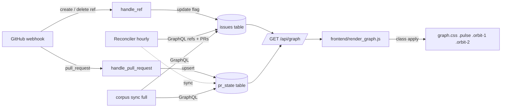

## Context

Promoted from `artifacts/frames/82-dep-graph-animations-frame.mdx` (approved 2026-05-26). Implements the data plumbing behind the already-deployed visual prototype at `forge.roxabi.dev/roxabi-live/visuals/node-animation-proposals` (Halo Pulse + Orbiting Dot variants).

## Goal

Animate dep-graph v6 issue nodes to reveal live work-in-flight state via two cumulative signals: **pulse** (branch exists) and **satellites** (open PR / reviewed PR).

## Users

- **Primary:** Mickael (operator) — opens the dep-graph dashboard to scan multi-repo work.
- **Read-only consumption** — no team-wide consumers, no auth required for v1.

## Expected Behavior

For each open issue node in the dep-graph:

| Trigger | Visual |
|---|---|
| No linked branch + no open PR | unchanged (existing tone dot) |
| ≥1 branch matches `^(?:[a-z]+/)?{N}-` in the issue's repo | **halo pulse** added |
| + ≥1 open PR linked (no `reviewed` label) | pulse + **1 orbiting dot** |
| + ≥1 open PR with `reviewed` label | pulse + **2 orbiting dots** |

State transitions propagate to the rendered graph within:
- ≤ 1 min via webhook (`create`/`delete` ref, `pull_request` events)
- ≤ 1 h via reconciler heal (drift safety net)

Existing `done` (grey) / `blocked` (dashed) / `ready` states render exactly as today — no regression.

## Data Model & Consumers

### Data structure

```mermaid
classDiagram
  class Issue {
    str key
    str repo
    int number
    str state
    int has_active_branch
  }
  class PrState {
    str repo
    int number
    str state
    int has_reviewed_label
    str closing_issue_keys
    str updated_at
  }
  note for PrState "closing_issue_keys: JSON array of \"owner/repo#N\" strings.\nPopulated from GraphQL PullRequest.closingIssuesReferences —\nonly PRs using magic keywords (closes/fixes/resolves #N) appear here."
  class GraphNode {
    str key
    str state
    str dev_state
  }
  Issue --> GraphNode : projected
  PrState ..> Issue : closing_issue_keys references
  note for Issue "has_active_branch: NEW column"
  note for PrState "NEW table"
  note for GraphNode "dev_state: NEW field, idle|dev|pr_open|pr_reviewed"
```

### Consumer map



### Consumer summary

| Consumer | Fields | When | Status |
|---|---|---|---|
| `GET /api/graph` | `issues.has_active_branch`, `pr_state.state`, `pr_state.has_reviewed_label`, `pr_state.closing_issue_keys` | every request | this issue |
| `frontend/render_graph.js` | `node.dev_state` | render tick | this issue |
| `reconciler.py` heal | branches + PRs via GraphQL | hourly | this issue |
| `corpus/sync.py` (full) | branches + PRs via GraphQL | nightly / boot | this issue |
| future stats / list / matrix consumers | `dev_state` aggregate | TBD | future (out of scope, but field must be queryable) |

## Breadboard

| ID | Affordance | Handler | Data |
|---|---|---|---|
| U1 | open-issue node, branch only | `render_graph.applyDevState()` | `dev_state="dev"` → `.pulse` class |
| U2 | open-issue node, PR (no reviewed) | `render_graph.applyDevState()` | `dev_state="pr_open"` → `.pulse .orbit-1` |
| U3 | open-issue node, PR with reviewed | `render_graph.applyDevState()` | `dev_state="pr_reviewed"` → `.pulse .orbit-2` |
| N1 | `GET /api/graph` | `api/graph.py` (or existing endpoint extension) | per-node `dev_state` computed from join |
| N2 | `POST /webhook/github` — `create` ref (branch) | `webhook/handlers.handle_ref` | parse ref, regex-match issue #N, set `has_active_branch=1` |
| N3 | `POST /webhook/github` — `delete` ref (branch) | `webhook/handlers.handle_ref` | parse ref, re-scan remaining branches for issue, update flag |
| N4 | `POST /webhook/github` — `pull_request` | `webhook/handlers.handle_pull_request` | upsert `pr_state`, parse `closing_issue_keys` from body |
| S1 | corpus sync — branches | `corpus/sync.sync_branches(repo)` | GraphQL `repository.refs(refPrefix:"refs/heads/")` with `pageInfo{hasNextPage,endCursor}` pagination (same pattern as existing `run_repo_sync` in `sync.py:276-356`) |
| S2 | corpus sync — PRs | `corpus/sync.sync_prs(repo)` | GraphQL `repository.pullRequests(states:OPEN)` with `closingIssuesReferences` + `labels` |
| S3 | reconciler heal | `reconciler.heal_pr_branch_state()` | hourly tick — re-run S1+S2 per allowlisted repo (see `repo_allowlist` table in `corpus.db`); reconciler is canonical source on race with webhook |
| S4 | schema migration | `corpus/schema.py` | additive: column on `issues` via existing `_alter_column` helper (idempotent, mirrors Migration 2); `CREATE TABLE IF NOT EXISTS pr_state` |
| S5 | forge artifact update | `artifacts/frames/node-animation-proposals.html` + `make deploy` | relabel demo to 4 cumulative states |

## Slices

8 slices total. Breadboard IDs back-referenced; vertical demo-ability noted per slice.

| # | Slice | Breadboard | Files | Demo |
|---|---|---|---|---|
| 1 | Schema migration | S4 | `corpus/schema.py` | `python -c "from roxabi_live.corpus.schema import init_schema; init_schema()"` → DB has new column + `pr_state` table; idempotent re-run no-op |
| 2 | GraphQL fetch + sync | S1, S2 | `corpus/graphql.py`, `corpus/sync.py` (**also update `UPSERT_ISSUE_SQL` at `sync.py:34` + `UPSERT_ISSUE_FROM_WEBHOOK_SQL` at `sync.py:64` to include `has_active_branch` — otherwise column reverts to 0 on every upsert**) | `roxabi-live --sync` populates `has_active_branch` and `pr_state` for ≥1 known issue with a live branch |
| 3 | Webhook handlers | N2, N3, N4 | `webhook/handlers.py`, `webhook/router.py` | replay-curl `create` ref + `pull_request` payloads → DB mutates as expected |
| 4 | API exposure | N1 | extend existing endpoint serving `/api/graph` (`src/roxabi_live/dep_graph/v6/api.py`) | `curl /api/graph` returns `dev_state` per node ∈ {idle, dev, pr_open, pr_reviewed} |
| 5 | Reconciler heal | S3 | `reconciler.py` | manual tick → corrects DB if I edit a flag to a wrong value; reconciler always wins over webhook on conflict |
| 6 | Frontend CSS + JS | U1, U2, U3 | `frontend/graph.css`, `state.js`, `render_graph.js` | open dep-graph → nodes show pulse/satellites for any open issue with live branch/PR; existing states unchanged |
| 7 | Forge artifact + redeploy | S5 | `artifacts/frames/node-animation-proposals.html` | `forge.roxabi.dev` page shows 4 cumulative state cards (idle/dev/pr_open/pr_reviewed) |
| 8 | Tests | all | `tests/test_corpus_*.py`, `tests/test_webhook_*.py`, `tests/test_api_graph.py`, `tests/test_reconciler.py` | `uv run pytest` green; ≥1 unit per new function + integration test per webhook event |

## Success Criteria

- [ ] Branch matching `^(?:[a-z]+/)?{N}-` created/deleted in any allowlisted repo → corresponding node's `dev_state` flips to/from `"dev"` within 1 min (webhook) or 1 h (reconciler)
- [ ] Open PR with `closes #N` (or `fixes`/`resolves`) in body → linked issue's `dev_state` advances to `"pr_open"`; adding `reviewed` label advances to `"pr_reviewed"`; removing `reviewed` reverts to `"pr_open"`
- [ ] PR closed or merged → `dev_state` reverts to `"dev"` (if branch lives) or `"idle"` (if branch deleted)
- [ ] Existing `done` / `blocked` / `ready` rendering unchanged — manual eyeball diff (solo-operator project, no automated baseline tool) confirms no regression outside the new animation layer
- [ ] `corpus/schema.py` migration runs idempotently on existing `~/.roxabi/corpus.db` (1460 rows) without data loss
- [ ] **End-to-end accuracy sample** (matches frame's >20% falsifiability check): pick 10 random open issues with active branches via `gh api repos/.../branches | grep`; for each, cross-reference `/api/graph` `dev_state` against expected state from GitHub UI — ≥8/10 must match
- [ ] `forge.roxabi.dev/roxabi-live/visuals/node-animation-proposals` shows 4 cumulative state cards (idle/dev/pr_open/pr_reviewed) — old "in-progress / paired" labeling removed
- [ ] `uv run pytest` exits 0 with new test files covering corpus branch regex, pr_state upsert, webhook handlers, API field, reconciler heal
- [ ] No regression on existing `/api/graph` consumers — frontend renders unchanged for nodes whose `dev_state` is `"idle"` (default for issues without branch/PR)

## Race & Precedence Rules

**Webhook ↔ reconciler race on `has_active_branch`** — both write paths exist (webhook async via aiosqlite; reconciler sync via `asyncio.to_thread`). WAL mode serializes writers, no corruption. **Rule:** on conflict, reconciler wins because it re-queries GitHub as canonical source. Webhook `delete` ref handler MUST re-scan remaining branches via GraphQL before writing `0` — do not trust local state alone.

**Multi-PR per issue precedence** — when `closing_issue_keys` for issue N contains multiple open PRs, `dev_state` is computed by priority:

```
pr_reviewed   if any open PR has has_reviewed_label = 1
pr_open       else if any open PR exists
dev           else if has_active_branch = 1
idle          else
```

SQL: priority join in `/api/graph` query (or computed in app layer post-fetch).

## Smart-splitting (Gate 2.5)

Triggers fire: `slices=8 > 3`. Splitting evaluated and **rejected**:

- Slices 1→4 are a single backend pipeline (schema → sync → webhook → API) — each depends on prior, no independent value
- Slice 5 (reconciler) only matters once 2+3 exist (it heals their state)
- Slices 6→7 are the user-visible payoff; splitting them out leaves backend changes without observable value
- Slice 8 is companion to 1–6 — pulling tests into a second issue would be a "no-tests merged" risk
- The whole feature is one demo: pulse + satellites appearing on the live dashboard. A sub-issue split would just create coordination cost without partition value.

Decision: keep as single F-lite, single PR, one feature branch.
