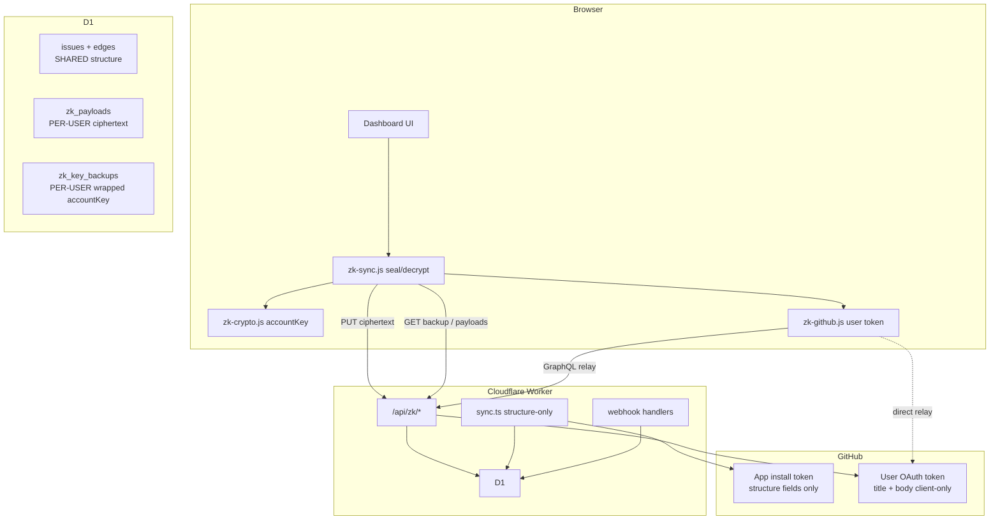
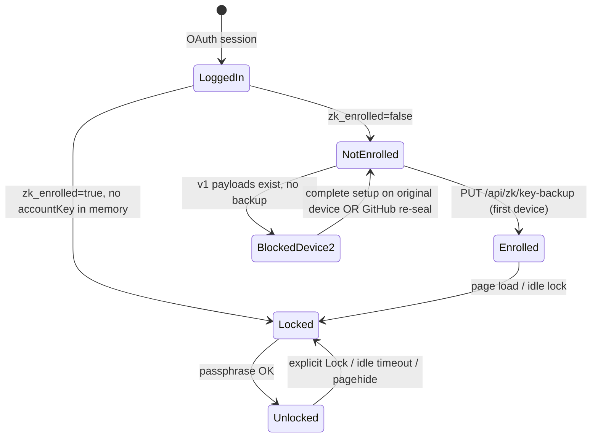
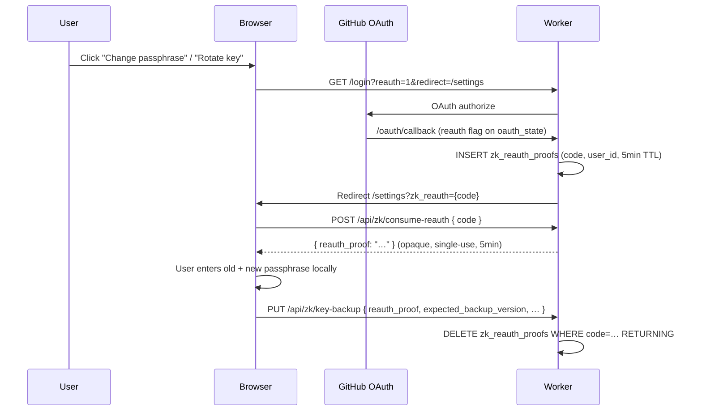
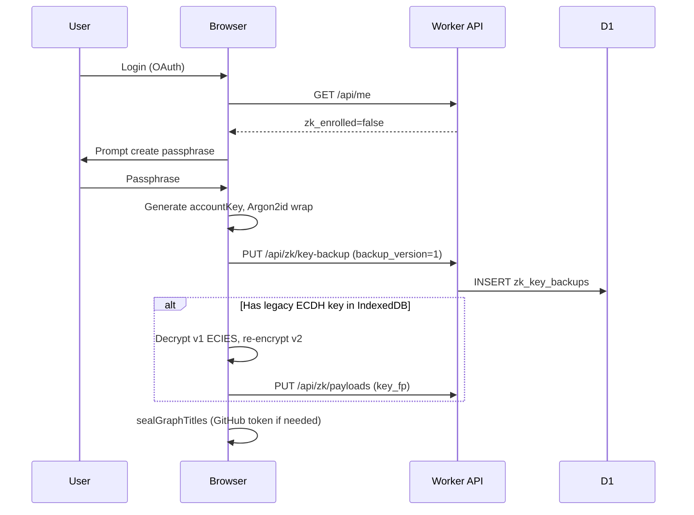
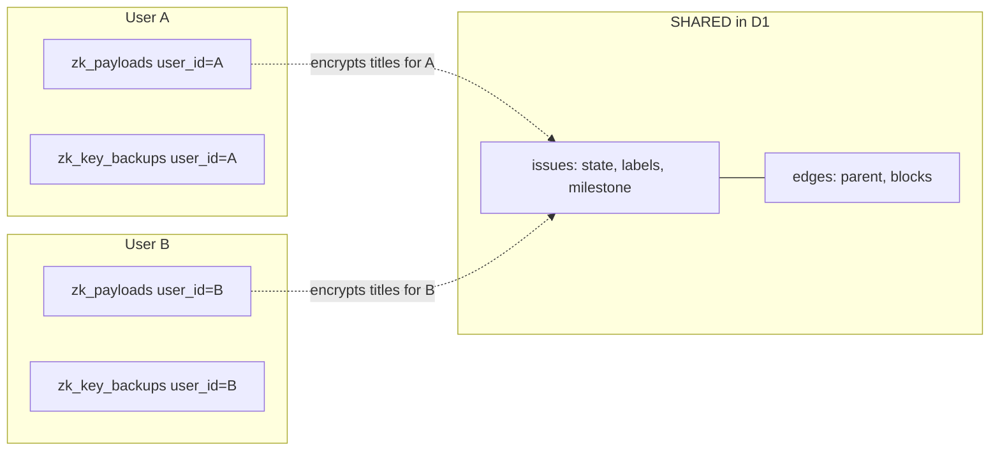

# Passphrase + D1 Key Backup + Structure-Only Sync (ZK Multi-Device, Hybrid Multi-User)

| Field | Value |
|-------|-------|
| **Author** | Roxabi Engineering |
| **Date** | 2026-06-18 |
| **Status** | Approved (design review consensus 2026-06-18) |
| **GitHub** | [#216](https://github.com/Roxabi/roxabi-live/issues/216) (parent [#142](https://github.com/Roxabi/roxabi-live/issues/142)) |
| **Repo** | Roxabi/roxabi-live — Cloudflare Worker + D1 + static frontend (`live.roxabi.dev`) |

---

## Overview

Roxabi Live’s private mode (#142 S2/S3) encrypts issue **content** (title, body) client-side and stores per-user ciphertext in D1 (`zk_payloads`). Today the encryption key is a **per-device ECDH P-256 key pair** in IndexedDB (`frontend/zk-crypto.js` → `ensureZkKeyPair`), which cannot be recovered on a new browser or after clearing site data. Meanwhile, the **server sync path** still fetches `title` from GitHub via the App installation token (`worker/src/sync/queries.ts` → `ISSUES_QUERY`), meaning the operator can read content at sync time despite D1 redaction.

This design closes both gaps:

1. **Multi-device recovery** — Bitwarden-style **passphrase → Argon2id (WASM) → AES-GCM wrapped `accountKey`** stored in a new D1 table `zk_key_backups`. The passphrase never leaves the browser; the server stores only the wrapped blob.
2. **Structure-only server sync** — Cron, webhook, and stub-resolution paths persist **graph structure and metadata only** (state, edges, labels, milestone, repo flags). No `title`/`body` from GitHub on the server path for any issue once this ships.
3. **Hybrid multi-user** — Graph structure remains **shared/canonical** (one row per `issue_key` in `issues` + `edges`). Content remains **per-user encrypted** (`zk_payloads(user_id, issue_key)`). No team/org shared encryption key.

Marketing must describe this as **“client-side encryption”**, not strict zero-knowledge. The operator cannot read stored ciphertext or passphrase, but structural metadata leaks, GitHub App sync sees structure, OAuth token relay exists, and served-JS integrity is a residual trust surface (see spike ADR in `artifacts/analyses/zk-encryption-spike-analysis.mdx`).

---

## Background & Motivation

### Current state (verified in codebase)

| Area | Implementation | Limitation |
|------|----------------|------------|
| **Key material** | ECDH P-256 key pair per `github_login` in IndexedDB `roxabi-zk-v1` / `keypairs` | No cross-device recovery; new device = new key = cannot decrypt old ciphertext |
| **Content crypto** | ECIES: ephemeral ECDH → HKDF → AES-GCM (`eciesEncrypt` / `sealContent`) | Self-encrypt-to-own-pubkey works on one device only |
| **Ciphertext store** | `zk_payloads PRIMARY KEY (user_id, issue_key)` + `pubkey_fp NOT NULL` | Per-user rows; User B cannot read User A’s blobs |
| **D1 redaction** | API: `loadZkSealedIssueKeysForUser` → `redactIssueTitle`; sync: `loadZkSealedIssueKeys` → `d1PayloadTitle`; `scrubIssuePayloads` wipes `issues.payload` on seal | API redaction per user; sync scrub global |
| **Private mode** | Always on (`0013_zk_always_on.sql`); `ensurePrivateMode` in `app.js` on every load | Assumes single-device key; `zk_opt_in` forced to 1 client-side |
| **GitHub content fetch** | User OAuth token in `sessionStorage` (`zk-github.js`); relay via `POST /api/zk/github/graphql` | Required for bodies and re-seal; token in tab memory |
| **Graph structure** | Repo-canonical `issues` + `edges`; no `tenant_id` on data rows (#141) | Correct foundation for hybrid model |

### Pain points

1. **Device loss** — Clearing IndexedDB or switching laptops breaks decryption with no recovery path.
2. **Operator plaintext exposure at sync** — `ISSUES_QUERY` requests `title`; Worker memory sees plaintext during cron even when D1 stores `null` for sealed keys.
3. **Legacy plaintext in D1** — `0012_scrub_zk_sealed_payloads.sql` scrubs only issues **with** `zk_payloads` rows; unsealed issues still expose `JSON_EXTRACT(payload,'$.title')` via `/api/graph` (`graph.ts` line 178).
4. **Multi-user onboarding** — Each teammate must independently Link GitHub + fetch + seal; API redaction is per user (teammate seals no longer redact your API titles). No shared team key by design.
5. **Weak passphrase story** — No KDF-backed backup exists yet; future export needs Argon2id, not PBKDF2-only.

---

## Goals & Non-Goals

### Goals

- Introduce **`accountKey`** (AES-256-GCM) as the sole content-encryption key per user, recoverable via passphrase + D1 backup.
- Support **Device 1 enroll**, **Device 2 unlock**, and document **lost passphrase** + **transitional multi-device** behavior.
- **Migrate** existing ECDH-encrypted `zk_payloads` to `accountKey` envelopes without data loss on the enrolling device.
- **Structure-only server sync**: server GraphQL and webhooks never persist title/body; **purge legacy plaintext** in D1.
- Preserve **hybrid multi-user**: shared graph, per-user ciphertext, per-user API redaction; global D1 scrub on seal.
- Ship **threat model table** suitable for security review and marketing copy.
- Incremental PR plan mergeable behind **`ZK_ACCOUNT_KEY` feature flag from PR 1b**.

### Non-Goals

- **Team/org shared encryption key** — rejected (operational + key-escrow complexity).
- **Gist backup** — rejected (URL-leakable, revision history; spike ADR §Decision 4).
- **GitHub org-repo key backup** — rejected (operator/GitHub-visible storage).
- **Server-side decryption** — never.
- **Full zero-knowledge claim** — out of scope; honesty requirement.
- **Phase 2 items** in this epic: WebAuthn PRF, QR pairing, `.roxabi-recovery` export (spec’d, not implemented here).

---

## Proposed Design

### Architecture (target state)



### User lifecycle: `zk_opt_in` vs `zk_enrolled` vs unlock

Migration `0013_zk_always_on.sql` sets `zk_opt_in = 1` for all users. The client (`app.js` → `ensurePrivateMode`) still POSTs `zk_opt_in: true` on every load. **`zk_opt_in` is legacy/internal** — kept for API compatibility (`GET /api/zk/payloads` 403 gate) but **not** the enrollment gate.

| Concept | Storage | Meaning | Gate |
|---------|---------|---------|------|
| **`zk_opt_in`** | `users.zk_opt_in` | Private mode preference (always `1` since #142 always-on) | Legacy 403 on `/api/zk/payloads` GET; deprecated for UX |
| **`zk_enrolled`** | `zk_key_backups` row exists | User has a passphrase-wrapped backup on server | Blocks dashboard until enrolled (when flag on) |
| **`unlocked`** | In-memory `accountKey` only | Passphrase entered this session | Blocks decrypt/seal until unlock |



**PR 4 change:** Remove client calls to `POST /api/zk-opt-in` from the critical path (or make idempotent no-op). Gate on `zk_enrolled` + unlock, not `zk_opt_in`.

---

### Key hierarchy: `accountKey`

```
passphrase (user memory only, never transmitted)
    │
    ▼ Argon2id WASM (random 16-byte salt per backup)
wrappingKey (256-bit AES-GCM CryptoKey, derived — see KDF contract below)
    │
    ▼ AES-GCM wrap
wrappedAccountKey blob ──► D1 zk_key_backups.wrapped_key (+ wrap_iv, kdf_params)
    │
    ▼ unwrap after passphrase
accountKey (AES-256-GCM, 32 bytes random)
    │
    ▼ AES-GCM encrypt JSON { title, body? }
encrypted_payload ──► D1 zk_payloads.encrypted_payload (per user_id, issue_key)
```

#### KDF output contract

**Fixed Argon2id parameters (all platforms):** `{ m: 65536, t: 3, p: 1 }` — **no adaptive downgrade** on mobile or low-RAM devices (user decision 2026-06-18). Every enrollment, unlock, and passphrase rotation uses the same params; `kdf_params` stored in D1 must match. Rationale: single golden test vector, cross-device determinism, and consistent offline brute-force cost; low-RAM phones may see longer unlock (~1–3 s) but remain within PR 3 acceptance targets.

```javascript
// frontend/zk-kdf.js — exported constant; never branch on deviceMemory
export const ARGON2_PARAMS = { m: 65536, t: 3, p: 1 };
```

Argon2id (via `hash-wasm`) must produce **exactly 32 bytes** of key material. Import as AES-256-GCM wrapping key:

```javascript
// frontend/zk-kdf.js — deterministic contract
async function deriveWrappingKey(passphrase, salt, params) {
  const raw = await argon2id({
    password: passphrase,
    salt,
    parallelism: params.p,
    iterations: params.t,
    memorySize: params.m, // KiB
    hashLength: 32,       // MUST be 32 — AES-256
    outputType: 'binary',
  });
  if (raw.byteLength !== 32) throw new Error('KDF output length mismatch');
  return crypto.subtle.importKey(
    'raw',
    raw,
    { name: 'AES-GCM', length: 256 },
    false, // non-extractable wrapping key
    ['encrypt', 'decrypt'],
  );
}
```

**PBKDF2 fallback** (WASM load failure only — enrollment blocked in production):

```javascript
const wrappingKey = await crypto.subtle.importKey(
  'raw',
  await crypto.subtle.deriveBits(
    {
      name: 'PBKDF2',
      salt,
      iterations: 600_000,
      hash: 'SHA-256',
    },
    await crypto.subtle.importKey('raw', enc.encode(passphrase), 'PBKDF2', false, ['deriveBits']),
    256,
  ),
  { name: 'AES-GCM', length: 256 },
  false,
  ['encrypt', 'decrypt'],
);
```

**Test vector (cross-browser determinism — PR 3 acceptance):**

| Field | Value |
|-------|-------|
| Passphrase | `test-passphrase-roxabi` |
| Salt (hex) | `0123456789abcdef0123456789abcdef` |
| Argon2id params | `{ m: 65536, t: 3, p: 1 }` |
| Raw output (hex, 32 B) | `393129b988be5445dc701ce6901813357b507550eff59d7dae0c023dc1a47a3c` |
| Fixture file | `frontend/test/fixtures/zk-kdf-vectors.json` (same values; PR 3 imports) |
| Wrapped-key round-trip | Fixed `accountKey` (hex) + `wrap_iv` → known `wrapped_key` ciphertext (computed in PR 3 tests) |

_Computed with `hash-wasm@4.x` `argon2id()`, 2026-06-18._

**Generation (enrollment):**

```javascript
const accountKey = await crypto.subtle.generateKey(
  { name: 'AES-GCM', length: 256 },
  true, // extractable only long enough to wrap
  ['encrypt', 'decrypt'],
);
const salt = crypto.getRandomValues(new Uint8Array(16));
const wrappingKey = await deriveWrappingKey(passphrase, salt, ARGON2_PARAMS);
const wrapIv = crypto.getRandomValues(new Uint8Array(12));
const rawAccountKey = await crypto.subtle.exportKey('raw', accountKey);
const wrapped = await crypto.subtle.encrypt({ name: 'AES-GCM', iv: wrapIv }, wrappingKey, rawAccountKey);
// Re-import accountKey as non-extractable session key after wrap
```

**Content envelope (v2 — replaces ECIES v1):**

```json
{
  "v": 2,
  "alg": "AES-GCM-256",
  "iv": "<b64 12 bytes>",
  "ct": "<b64 ciphertext of UTF-8 JSON {title, body?}>"
}
```

**Fingerprint:** `key_fp = SHA-256(rawAccountKey)[0:16]` hex — stored in `zk_payloads.key_fp` and `zk_key_backups.key_fp`.

#### Session handling and idle lock

| Event | Behavior |
|-------|----------|
| **Unlock** | Passphrase → unwrap → non-extractable `accountKey` in module memory |
| **Explicit Lock** | Clear `accountKey`; UI returns to unlock prompt |
| **Idle timeout** | **15 minutes** without user input (`pointerdown`, `keydown`, `touchstart`) → auto-lock |
| **`visibilitychange` → hidden** | Start idle timer; do **not** clear key immediately (background tab may return) |
| **`pagehide` / `beforeunload`** | Clear `accountKey` immediately |
| **Session cookie** | `SESSION_TTL_SECONDS = 28800` (8 h, `worker/src/auth/types.ts`) — user may re-unlock without re-login while session valid |

IndexedDB (`roxabi-zk-v2` / `account_meta`) stores only `{ key_fp, enrolled_at }` — never raw key or passphrase.

#### Argon2id WASM bundling (committed approach)

The `frontend/` tree is **static ES modules** served via Wrangler `[assets]` — no bundler (`frontend/package.json` is vitest-only).

| Decision | Choice |
|----------|--------|
| Library | **`hash-wasm`** vendored as ESM |
| Layout | `frontend/vendor/hash-wasm/esm/` (committed, pinned version in `package-lock` at repo root or vendor README) |
| Wrapper | `frontend/zk-kdf.js` — single `deriveWrappingKey` export |
| WASM load | `argon2id()` from hash-wasm uses `WebAssembly.instantiate` internally; **no COOP/COEP** headers required |
| CSP | No change needed today (no `unsafe-eval`); WASM compiles from same-origin static asset |
| Size | ~25 KB gzip WASM + ~3 KB JS — well within Workers asset limits |

**PR 3 acceptance criteria:**
- Enrollment + unlock round-trip in vitest with mocked `crypto.subtle` + real hash-wasm.
- Staging manual: cold load enrollment completes in **< 3 s** on mid-tier mobile (Pixel 6 class), **< 1 s** desktop.
- `zk.kdf_fallback` counter stays 0 in staging for 1 week before prod flag flip.

---

### D1 schema changes

**New table `zk_key_backups`:**

```sql
CREATE TABLE IF NOT EXISTS zk_key_backups (
  user_id        INTEGER NOT NULL REFERENCES users(id) PRIMARY KEY,
  backup_version INTEGER NOT NULL DEFAULT 1,
  kdf_alg        TEXT NOT NULL DEFAULT 'argon2id',
  kdf_params     TEXT NOT NULL,
  wrap_iv        TEXT NOT NULL,
  wrapped_key    TEXT NOT NULL,
  key_fp         TEXT NOT NULL,
  created_at     TEXT NOT NULL DEFAULT (datetime('now')),
  updated_at     TEXT NOT NULL DEFAULT (datetime('now'))
);
```

**`zk_payloads` — migration 0014 (add column):**

```sql
ALTER TABLE zk_payloads ADD COLUMN key_fp TEXT;
UPDATE zk_payloads SET key_fp = pubkey_fp WHERE key_fp IS NULL AND pubkey_fp IS NOT NULL;
```

#### `pubkey_fp` → `key_fp` transition period

| Phase | Duration | Server PUT behavior | Server read |
|-------|----------|---------------------|-------------|
| **Dual-accept** | Weeks 1–4 after PR 7 | Accept `key_fp` **or** `pubkey_fp`; **dual-write** both columns with same fingerprint value | Return both fields |
| **key_fp primary** | Weeks 5–8 | Require `key_fp`; accept `pubkey_fp` alias, map to `key_fp` | `key_fp` only in JSON |
| **Drop legacy** | Migration 0017+ | `pubkey_fp` column dropped | `key_fp NOT NULL` |

Dual-write SQL in `putZkPayloadsRoute`:

```sql
INSERT INTO zk_payloads (user_id, issue_key, pubkey_fp, key_fp, encrypted_payload, updated_at)
VALUES (?, ?, ?, ?, ?, datetime('now'))
ON CONFLICT(user_id, issue_key) DO UPDATE SET
  pubkey_fp = excluded.key_fp,
  key_fp = excluded.key_fp,
  ...
```

This satisfies `pubkey_fp NOT NULL` (`0004_tenancy_auth.sql`) until column drop.

**Legacy plaintext scrub — migration 0015 (separate PR, manually gated):**

```sql
-- One-shot: remove all issue titles from D1 (not only sealed issues).
-- NOT bundled with PR 6 — see PR 11 and Rollout Plan.
UPDATE issues SET payload = json_object();
```

Extends `0012_scrub_zk_sealed_payloads.sql` which only targeted issues with `zk_payloads` rows.

> **CI auto-apply warning:** `.github/workflows/ci.yml` runs `wrangler d1 migrations apply DB --remote` on every merge to `main`. **Migration file presence ≠ apply time.** The `0015` SQL file must not land on `main` until enrollment threshold is met (PR 11 held as draft or merged only in Phase D). Until 0015 applies, structure-only sync (PR 6) stops **new** title writes; legacy plaintext in `issues.payload` remains readable via `/api/graph` for unsealed issues.

---

### API / Interface Changes

| Method | Path | Auth | Purpose |
|--------|------|------|---------|
| `GET` | `/api/zk/key-backup` | session | Return wrapped backup for unlock (ungated — enrollment check is client-side; 404 if no row) |
| `PUT` | `/api/zk/key-backup` | session | Create backup (enroll) or rotate passphrase (see semantics below) |
| `GET` | `/api/zk/payloads` | session + `zk_opt_in` | List user’s ciphertext rows (legacy gate; always passes since 0013) |
| `PUT` | `/api/zk/payloads` | session | Bulk upsert; triggers `scrubIssuePayloads` |
| `GET` | `/api/me` | session | Add `zk_enrolled`, `zk_account_key_enabled` (flag) |

> **Auth asymmetry (intentional):** `PUT /api/zk/key-backup` is session-only so first enrollment works before any backup row exists. `GET` is also session-only (404 when not enrolled). The `zk_opt_in` check on `GET /api/zk/payloads` is a legacy 403 path retained for API compatibility, not an enrollment gate.

#### `PUT /api/zk/key-backup` semantics

| Case | Request | Server behavior |
|------|---------|-----------------|
| **First enroll** | No existing row; body includes `key_fp`, `backup_version: 1` | `INSERT` — **no `reauth_proof` required** |
| **Passphrase change** | Row exists; same `key_fp`; new `wrapped_key`; `expected_backup_version` matches; **`reauth_proof` valid** | `UPDATE`, increment `backup_version` |
| **Compromise recovery** | Row exists; `rotation: true` + new `key_fp`; **`expected_backup_version` matches**; **`reauth_proof` valid** | `UPDATE` (client must re-seal all payloads separately) |
| **Duplicate enroll** | Row exists; different `key_fp`; no `rotation: true` | **`409 { error: "enrolled" }`** — second device must unlock, not enroll |
| **Stale overwrite** | Row exists; `expected_backup_version` mismatch | **`409 { error: "backup_version_conflict" }`** |
| **Missing re-auth** | Row exists; any UPDATE without valid `reauth_proof` | **`403 { error: "reauth_required" }`** |

**Passphrase rotation (decided):** **Re-wrap same `accountKey`** (Bitwarden-style). Client unwraps locally with old passphrase, re-wraps with new passphrase, sends new `wrapped_key` with same `key_fp`, matching `expected_backup_version`, and fresh `reauth_proof`. **No payload re-encryption.** Reserve new `key_fp` + GitHub re-seal for compromise recovery only (`rotation: true`).

#### Step-up re-auth for backup UPDATE (v1 blocking mitigation)

Any `PUT` that **updates** an existing `zk_key_backups` row (passphrase change or `rotation: true`) requires a server-validated **`reauth_proof`** — a single-use token proving the user completed GitHub OAuth within the last **5 minutes**. This is the primary server-enforceable control against passive session hijack; CAS alone is insufficient because the attacker can `GET /api/zk/key-backup` to read `backup_version`.

**Flow** (mirrors `user_token_handoffs` in `worker/src/auth/userTokenHandoff.ts`):



**New table `zk_reauth_proofs`** (migration 0014 or 0014b):

```sql
CREATE TABLE IF NOT EXISTS zk_reauth_proofs (
  code       TEXT PRIMARY KEY,
  user_id    INTEGER NOT NULL REFERENCES users(id),
  expires_at TEXT NOT NULL,
  created_at TEXT NOT NULL DEFAULT (datetime('now'))
);
```

**New routes:** `POST /api/zk/consume-reauth` (session + code → single-use `reauth_proof` token); OAuth callback branch when `oauth_state.reauth = 1`.

**`rotation: true` requirements (all mandatory):**
- `expected_backup_version` must match current row (CAS — rejects stale/confused writes)
- Valid `reauth_proof` (fresh OAuth)
- Explicit `rotation: true` in body
- New `key_fp` + new `wrapped_key`

**Rate limiting (defense in depth):** Max **5 `PUT` attempts per `user_id` per hour**. Returns `429`.

**Audit trail:** On every successful PUT, log `{ event: "zk.backup.updated", user_id, key_fp, backup_version, rotation: bool }` — never log `wrapped_key` or `reauth_proof`.

#### Residual risk (honest)

| Scenario | Blocked by re-auth? | Notes |
|----------|---------------------|-------|
| Passive stolen session cookie | **Yes** | Attacker cannot UPDATE backup without fresh GitHub OAuth |
| XSS driving re-auth while user is active | **Partially** | If XSS triggers `/login?reauth=1` and user completes GitHub prompt unaware, overwrite possible — same class as OAuth phishing |
| XSS exfiltrating `accountKey` from memory | **No** | Re-auth does not help; mitigated by idle lock + CSP |
| Physical access, unlocked tab, user enters passphrase | **No** | Out of scope for server controls |
| First enroll (INSERT) with hijacked session | **No** | Attacker enrolls victim before victim does — victim sees 409 on real enroll; **monitor `zk.enroll.success` anomalies** |

HMAC proof from `accountKey` was considered but rejected for v1: the server cannot verify without storing challenges per session and the proof still originates from a compromised browser. OAuth re-auth is stronger because it requires GitHub-side user interaction.

---

### Structure-only server sync

**Principle:** The GitHub **App installation token** may fetch only fields required for dep-graph operations. **Title and body are never requested or written.**

#### GraphQL fields — before / after

| Query constant | File | Remove | Keep |
|----------------|------|--------|------|
| `ISSUES_QUERY` | `worker/src/sync/queries.ts` | `title` | `number`, `state`, `url`, timestamps, `milestone { title }`, `labels`, deps fields |
| `REPO_BUNDLE_QUERY` | same | `title` | same + `refs`, `pullRequests` |
| `STUB_ISSUE_QUERY` | same | `title` | `number`, `state`, `url`, timestamps |
| `SINGLE_ISSUE_DEPS_QUERY` | same | _(none)_ | `blockedBy`, `blocking` |
| `PRS_QUERY` | same | _(unchanged)_ | PR metadata |

#### Write path changes (all title-bearing paths)

| Path | File | Change |
|------|------|--------|
| Cron / admin sync | `worker/src/sync/sync.ts` | `UPSERT_ISSUE_SQL` → `json_object()`; remove `d1PayloadTitle` at lines ~376, 812, 995 |
| Stub resolver | `sync.ts` `resolveStubs` | `payload = {}` |
| Webhook `issues` | `worker/src/webhook/handlers.ts` | Always `title: null`; remove `isIssueZkSealed` title branch (lines 116–117) |
| API read | `worker/src/api/graph.ts`, `issues.ts` | `redactIssueTitle` until 0015 applied; after 0015 all titles null server-side |
| Legacy scrub | PR 11 migration `0015` (separate deploy) | One-shot purge — **not** in PR 6 |

**Gated by `ZK_ACCOUNT_KEY` + `ZK_STRUCTURE_ONLY` env vars** (see Rollout). Structure-only writes disabled when flag off.

---

### Multi-device flows

#### Device 1 — Enroll (new user or first visit post-migration)



#### Device 2 — Unlock (post-enrollment)

Only valid **after** Device 1 has enrolled and uploaded `zk_key_backups`. Passphrase unwraps the same `accountKey`; v2 payloads decrypt on any device.

#### Transitional period — pre-migration / v1 ciphertext

**Problem:** v1 ECIES blobs in `zk_payloads` decrypt only with the **originating device’s** ECDH private key. Device 2 cannot unlock with passphrase until Device 1 migrates v1→v2.

| Client state | Server state | UX |
|--------------|--------------|-----|
| Device 2, no local ECDH key | `zk_key_backups` absent; payloads may be v1 | **Block:** “Complete encryption setup on your original device first.” |
| Device 2, no local ECDH key | `zk_key_backups` present; all payloads v2 | Normal unlock flow |
| Device 2, no local ECDH key | `zk_key_backups` present; mixed v1/v2 | Unlock works for v2 rows; v1 rows show `(needs migration)`; prompt “Use original device or Link GitHub to re-seal” |
| Any device | v1-only, user has GitHub token | **Recovery:** Link GitHub → `syncZkContentFromGitHub` → seal v2 (no ECDH needed) |

**Server-side v1 detection (optional helper on `GET /api/zk/payloads`):** add `has_v1_payloads: boolean` — true if any row’s `encrypted_payload` parses to `"v":1`. Drives transitional UX without leaking content.

**Rollout comms:** Email/changelog: “Before switching devices, open Roxabi on your primary browser once to complete the encryption upgrade.”

#### Lost passphrase

| Scenario | Recovery |
|----------|----------|
| Passphrase forgotten, no export | **No crypto recovery.** New passphrase + new `accountKey` requires `rotation: true` on PUT; old payloads undecryptable. |
| GitHub access retained | Link GitHub → re-seal from GitHub |
| `.roxabi-recovery` file (Phase 2) | Import wrapped blob client-side |

---

### Migration: ECDH per-device → `accountKey`

**Trigger:** First successful enrollment on a device with `roxabi-zk-v1` keypair and/or v1 payloads.

**Steps (client-only):**

1. `GET /api/zk/payloads`
2. Decrypt v1 with local ECDH private key
3. `PUT /api/zk/key-backup`
4. Re-encrypt v2; `PUT /api/zk/payloads` with `key_fp`
5. Delete ECDH keypair; open `roxabi-zk-v2`

**One-way per user:** After step 5, rollback to ECDH decrypt is **impossible** even if feature flag is disabled. v2 read path remains enabled permanently once PR 4 ships.

**Ordering:** PR 1–7 → enrollment (PR 4–5) → structure-only code (PR 6, flag-gated) → **PR 11 (0015 scrub)** after enrollment > 95% → prod flag flip (Phase D).

---

### Hybrid multi-user flows

**Invariant:** `issues.key` is globally unique; `edges` are shared. `zk_payloads` is keyed by `(user_id, issue_key)`. No `tenant_id` on data rows (#141 repo-canonical model).

#### User A seals a repo

1. User A enrolls (`PUT /api/zk/key-backup`), unlocks, optionally links GitHub for bodies.
2. `PUT /api/zk/payloads` writes ciphertext rows for `user_id=A` with User A’s `accountKey`.
3. `scrubIssuePayloads` (`worker/src/auth/zk.ts`) sets `issues.payload = {}` for those `issue_key`s (global — shared `issues` row).
4. **User A only** receives `title: null` from `/api/graph` and `/api/issues` (`loadZkSealedIssueKeysForUser` + `redactIssueTitle`).

#### User B joins same tenant (org installation)

1. User B logs in via same GitHub App installation (shared tenant, shared graph).
2. User B enrolls with **own passphrase** → distinct `accountKey` and `zk_key_backups` row (`user_id=B`).
3. Graph loads: structure visible (state, edges, labels, milestone, dev_state).
4. For issues User A sealed but User B has not: API may still return a title if D1 holds plaintext; with `ZK_STRUCTURE_ONLY`, titles are null until User B links GitHub.
5. User B clicks **Link GitHub** (`/login?zk=1` → `consumeZkHandoffFromUrl`) → `syncZkContentFromGitHub` fetches title/body with User B’s OAuth token.
6. User B seals → new `zk_payloads` rows for `user_id=B`; User B decrypts own rows on any enrolled device.
7. User B **cannot** decrypt User A’s ciphertext (different `accountKey`). User A **cannot** decrypt User B’s.

#### Per-user API redaction vs global D1 scrub

- **API reads** (`/api/graph`, `/api/issues`): `loadZkSealedIssueKeysForUser(user_id)` — only issues **this user** sealed return `title: null`.
- **Sync writes**: `loadZkSealedIssueKeys` (global `DISTINCT issue_key`) — once **any** user seals, sync does not write plaintext titles back into D1 (`d1PayloadTitle`).
- **On seal** (`PUT /api/zk/payloads`): `scrubIssuePayloads` wipes shared `issues.payload` for those keys (defense in depth).



**Product copy:** “Each teammate encrypts their own copy of issue titles. Link GitHub and sync to seal on your account.”

**Support FAQ:**
- *Why does my teammate see titles but I do not?* — They completed enroll + Link GitHub + seal; you have not yet.
- *Does my teammate’s seal hide titles from me?* — No. API redaction is per user; only issues you sealed are redacted for you.
- *Can we share one team passphrase?* — No (by design). See Alternatives: team key rejected.

---

### Alternatives Considered

| Alternative | Verdict | Rationale |
|-------------|---------|-----------|
| **Team/org shared encryption key** | **Rejected** | Single passphrase for org = key escrow, offboarding leaks, violates hybrid decision. High operational burden. |
| **Gist / GitHub repo key backup** | **Rejected** | Gist URLs leak; revision history; operator can fetch URL. Spike ADR explicit. |
| **Keep ECDH + QR device pairing only** | **Rejected as primary** | No server backup; pairing requires both devices online. QR viable as Phase 2 supplement only. |
| **PBKDF2-only KDF (no WASM)** | **Rejected as primary** | GPU-vulnerable at 600k iterations; fails spike Phase-2 go/no-go. Acceptable emergency fallback only. |
| **Server-side encrypted DEK (INSTALL_TOKEN_KEY-style)** | **Rejected** | Operator holds DEK in Worker secrets → not client-side encryption story. |
| **Structure-only + keep webhook titles for unsealed** | **Rejected** | Leaves operator-readable window; conflicts with private-mode-always-on direction. |
| **HMAC backup-update proof (no OAuth re-auth)** | **Rejected for v1** | Proof originates from same compromised browser as XSS; server cannot distinguish attacker. OAuth re-auth requires GitHub interaction. |

---

### Security & Privacy Considerations

#### Threat model

| Threat | Asset | Exposure today | After #216 | Mitigation |
|--------|-------|----------------|------------|------------|
| D1 database dump | Ciphertext, wrapped keys | Titles scrubbed if sealed | Ciphertext + wrapped backups; no titles after 0015 | AES-GCM + Argon2id |
| Weak passphrase | `accountKey` | N/A | Offline brute-force on `wrapped_key` | Argon2id; strength meter |
| **Active session attacker** | **`zk_key_backups` overwrite** | N/A | Stolen cookie alone cannot UPDATE backup; INSERT-before-victim enroll still possible | **OAuth re-auth for UPDATE, 409 enroll guard, `backup_version` CAS on rotation + passphrase change, 5 PUT/hour, audit log** — residual: XSS+user OAuth, first-enroll race |
| Operator with Worker deploy | Users | JS exfil | Same | CSP, honest marketing |
| Operator during cron sync | Issue titles | Plaintext in memory | Not fetched | Structure-only |
| GitHub App install token | Structure | Metadata | Same minus title | Client fetches content |
| GitHub user OAuth token | Title, body | sessionStorage | Same | Tab-scoped; 5 min handoff TTL |
| XSS | `accountKey` in memory | Decrypt/exfil | Same | 15 min idle lock; CSP |
| JS supply chain | Crypto | CDN trust | Same | Pinned vendor deps |
| Multi-user cross-decrypt | Ciphertext | Per-user keys | Same | No team key |
| Metadata inference | Graph | Structure visible | Unchanged | Documented |
| Lost passphrase | Ciphertext | Permanent | Permanent | UX + GitHub re-seal |

---

### Observability

**Implementation target:** Reuse existing **R2 `LOGS` bucket** pattern from `writeRunAudit` (`worker/src/sync/sync.ts`) — no new Analytics Engine binding in v1.

| Mechanism | Use |
|-----------|-----|
| **`console.log` JSON** | Workers Logs (~3 day retention); prefix `[zk]` |
| **R2 `LOGS`** | Durable audit: `zk/events/YYYY-MM-DD/{ts}.json` for backup updates, enrollment milestones |
| **Frontend** | `console.info('[zk]', { event, ... })` in dev; staging only |

#### Metrics

| Signal | Launch-blocking? | Implementation |
|--------|------------------|----------------|
| `zk.enroll.success` / `.failure` | **Yes** | `console.log` + R2 on enroll |
| `zk.unlock.failure` | **Yes** | Client log; alert on spike via Workers Logs |
| `zk.backup.put.409` / `.429` | **Yes** | Worker `console.log` |
| `zk.kdf.duration_ms` | **Yes** | Client log in staging |
| `zk.kdf_fallback` | **Yes** | Block prod flag if > 0 |
| `zk.migrate.v1_to_v2.count` | No (Phase 2) | Client log |
| `zk.payloads.upsert.batch_size` | No | Worker log |
| `zk.lock.idle` | No | Client log |
| `zk.sync.structure_only.title_skipped` | **Yes** (PR 6+) | Worker sync log |

**Logging rules:** Never log passphrase, raw keys, `wrapped_key`, GitHub token, decrypted content.

---

### Rollout Plan

1. **PR 1b:** `ZK_ACCOUNT_KEY` env var + `/api/me` exposure — **default off staging/prod**.
2. **Phase A (flag on in dev):** PR 1–3, 7, 4–5 — crypto, API, enrollment.
3. **Phase B:** Enable flag in staging; blocking enrollment for test users.
4. **Phase C:** Enable `ZK_STRUCTURE_ONLY` in staging (PR 6 code only — no 0015 yet). Verify new syncs write `payload = {}`.
5. **Phase D:** After enrollment rate > 95% on staging, merge **PR 11** (`0015` migration) → CI auto-applies on `main` → enable `ZK_STRUCTURE_ONLY` in production.

**Migration apply discipline:** CI (`.github/workflows/ci.yml` L125–127) auto-applies **all pending** migrations on merge to `main`. PR 6 must **not** include `0015_*.sql`. PR 11 is held until Phase D criteria are met; document in PR 11 body: “Do not merge until enrollment ≥ 95%.”

#### Rollback (revised)

| Action | Safe? | Effect |
|--------|-------|--------|
| Disable `ZK_ACCOUNT_KEY` | Partial | Stops **new** enrollments; existing users keep v2 decrypt path (**always on** post-PR 4) |
| Disable `ZK_STRUCTURE_ONLY` | **Yes** | Re-adds `title` to GraphQL — **reintroduces operator plaintext exposure** but restores server-side titles for unsealed issues |
| “Revert to ECDH” | **No** | Impossible after user migrates — ECDH key deleted client-side |
| Migration 0015 | **No** | Irreversible title purge — run only when client sealing confirmed |

**Migration is one-way per user.** Rollback does not undo ciphertext format or deleted ECDH keys.

---

### Open Questions

1. ~~Argon2id `m` on mobile~~ — **Decided:** `m=65536` fixed everywhere (`t=3`, `p=1`); no adaptive downgrade on mobile (user decision 2026-06-18).
2. **Enrollment gate strictness** — **Decided:** block dashboard until enrolled when flag on; read-only graph deferred.
3. ~~Passphrase rotation~~ — **Decided:** re-wrap same `accountKey` (Key Decision #11).
4. ~~Legacy plaintext~~ — **Decided:** migration `0015` in **PR 11** (separate from PR 6; merge only after enrollment threshold).
5. ~~Rate limit on PUT~~ — **Decided:** 5/hour/user (Key Decision #12).

---

### References

- `docs/ARCHITECTURE.md`, `artifacts/analyses/zk-encryption-spike-analysis.mdx`
- `frontend/zk-crypto.js`, `worker/src/api/zk-payloads.ts`, `worker/src/sync/sync.ts`
- `worker/migrations/0004_tenancy_auth.sql`, `0012_scrub_zk_sealed_payloads.sql`
- GitHub #142, #141, #216

---

## Key Decisions

| # | Decision | Rationale |
|---|----------|-----------|
| 1 | **`accountKey` (AES-256-GCM) replaces ECDH for content** | Symmetric key enables multi-device via wrapped backup. |
| 2 | **Passphrase + Argon2id WASM → D1 `zk_key_backups`** | Bitwarden-proven; passphrase never on server. |
| 3 | **Structure-only server sync** | Closes operator plaintext exposure during cron/webhook. |
| 4 | **Hybrid multi-user: shared structure, per-user ciphertext** | Matches existing schema; no team key. |
| 5 | **Per-user API redaction; global sync scrub** | API: `loadZkSealedIssueKeysForUser`. Sync/scrub: global `DISTINCT issue_key` so D1 plaintext is not restored after any seal. |
| 6 | **GitHub user token for content; App token for structure** | Minimal server content exposure. |
| 7 | **Marketing: “client-side encryption” not “zero-knowledge”** | Honest residual trust labeling. |
| 8 | **Reject team key, Gist, GitHub repo backup** | Escrow / URL leakage. |
| 9 | **`accountKey` in memory only; 15 min idle lock** | Reduces XSS window; aligned with 8 h session. |
| 10 | **Client-driven v1→v2 migration; one-way** | Server cannot decrypt ECDH blobs. |
| 11 | **Passphrase rotation = re-wrap same `accountKey`** | No mass re-encryption; Bitwarden-style. New key only for compromise recovery. |
| 12 | **Backup UPDATE requires OAuth re-auth proof** | Server-enforceable; blocks passive session hijack on passphrase change and rotation. CAS + 429 are defense-in-depth. |
| 13 | **`zk_enrolled` replaces `zk_opt_in` for UX gating** | Always-on flag made `zk_opt_in` legacy. |
| 14 | **0015 in PR 11, not PR 6** | CI auto-applies migrations on `main` merge; decouple scrub from structure-only code. |
| 15 | **`hash-wasm` vendored ESM; no frontend bundler** | Matches static `[assets]` deployment model. |
| 16 | **Observability via R2 LOGS + Workers Logs** | Reuses `writeRunAudit` pattern; no new binding in v1. |
| 17 | **Argon2id `m=65536` fixed on all devices** | No `deviceMemory` branching; one KDF contract, one golden vector, consistent security margin on mobile and desktop. |

---

## PR Plan

> **Order constraint:** PR 7 must land **before** PR 4/5 (frontend sends `key_fp` on enroll). PR 1b (flag) lands **before** PR 4 (rollback lever).

### PR 1 — D1 migration: `zk_key_backups` + `key_fp` column

**Title:** `feat(zk): add zk_key_backups table and key_fp column (#216)`

**Files:** `worker/migrations/0014_zk_key_backups.sql`, `worker/src/migrations.test.ts`

**Dependencies:** None

**Description:** Add `zk_key_backups`. Add nullable `key_fp` to `zk_payloads`; backfill from `pubkey_fp`. Document dual-write transition in migration comment.

---

### PR 1b — Feature flag scaffold (early)

**Title:** `chore(zk): ZK_ACCOUNT_KEY flag on /api/me (#216)`

**Files:** `wrangler.toml`, `worker/src/types.ts`, `worker/src/api/me.ts`, `frontend/app.js` (no-op check)

**Dependencies:** None

**Description:** `ZK_ACCOUNT_KEY` env var (default `0`). Expose `zk_account_key_enabled` on `/api/me`. Frontend skips enrollment UI when flag off. **No behavior change in prod until flipped.**

---

### PR 2 — Worker API: key backup routes + re-auth

**Title:** `feat(zk): GET/PUT /api/zk/key-backup with enroll guard and re-auth (#216)`

**Files:**
- `worker/migrations/0014_zk_key_backups.sql` — include `zk_reauth_proofs` table (or `0014b` if 0014 already merged)
- `worker/src/api/zk-key-backup.ts`, `worker/src/api/zk-key-backup.test.ts`
- `worker/src/api/zk-reauth.ts`, `worker/src/api/zk-reauth.test.ts` (consume-reauth)
- `worker/src/auth/oauth.ts` — `?reauth=1` branch on callback
- `worker/src/router.ts`, `worker/src/api/me.ts` (`zk_enrolled`)

**Dependencies:** PR 1

**Description:** Session-gated backup routes. **INSERT** (first enroll) session-only. **UPDATE** (passphrase change or `rotation: true`) requires valid `reauth_proof` + `expected_backup_version` CAS. **409 `enrolled`** on duplicate enroll. **403 `reauth_required`** without proof. **5 PUT/hour/user** rate limit. Tests: enroll, rotate with reauth, rotate without reauth (403), version conflict, 429.

---

### PR 3 — Frontend: hash-wasm + `accountKey` crypto core

**Title:** `feat(zk): accountKey hierarchy with hash-wasm Argon2id (#216)`

**Files:** `frontend/vendor/hash-wasm/esm/`, `frontend/zk-kdf.js`, `frontend/zk-crypto.js`, `frontend/zk-crypto.test.js`

**Dependencies:** None (parallel)

**Description:** Vendored hash-wasm ESM. KDF contract + golden vector (`393129b988be5445dc701ce6901813357b507550eff59d7dae0c023dc1a47a3c` in `frontend/test/fixtures/zk-kdf-vectors.json`). v2 seal/open. v1 dual-read. **Acceptance:** unlock < 3 s mobile staging cold load.

---

### PR 7 — `zk_payloads` API: `key_fp` dual-accept + dual-write

**Title:** `feat(zk): accept key_fp in payloads API with pubkey_fp dual-write (#216)`

**Files:** `worker/src/api/zk-payloads.ts`, `worker/src/api/zk-payloads.test.ts`

**Dependencies:** PR 1

**Description:** Accept `key_fp` or `pubkey_fp` on PUT; dual-write both columns. Validate v2 envelope for new writes when flag on. **Must merge before PR 4.**

---

### PR 4 — Frontend: enrollment + unlock UI

**Title:** `feat(zk): passphrase enrollment and lock screen (#216)`

**Files:** `frontend/zk-enroll.js`, `frontend/zk-sync.js`, `frontend/app.js`, `frontend/index.html`, `frontend/auth.js`

**Dependencies:** PR 1b, PR 2, PR 3, **PR 7**

**Description:** Enrollment gated on `ZK_ACCOUNT_KEY`. 15 min idle lock. Remove `zk_opt_in` toggle from critical path. Transitional Device 2 block UX. Integration with v2 seal path.

---

### PR 5 — Frontend: ECDH → accountKey migration

**Title:** `feat(zk): migrate legacy ECDH payloads to accountKey on enroll (#216)`

**Files:** `frontend/zk-crypto.js`, `frontend/zk-sync.js`, `frontend/zk-crypto.test.js`

**Dependencies:** PR 3, PR 4, PR 7

**Description:** v1→v2 migration on enroll. Clear `roxabi-zk-v1`. Log `zk.migrate.v1_to_v2.count`.

---

### PR 6 — Structure-only sync (code only; no 0015)

**Title:** `feat(sync): structure-only issue sync — no title/body on server path (#216)`

**Files:**
- `worker/src/sync/queries.ts`
- `worker/src/sync/sync.ts` (all `d1PayloadTitle` call sites ~376, 812, 995)
- `worker/src/sync/sync.test.ts` (rewrite `json_object('title', ?)` expectations)
- `worker/src/webhook/handlers.ts`, `handlers.test.ts` (regression: `issues.opened` → `payload = {}`)
- `worker/src/api/graph.ts`, `issues.ts`
- `worker/src/auth/zk.ts`
- `wrangler.toml` — `ZK_STRUCTURE_ONLY` flag

**Dependencies:** PR 4 (client sealing path), PR 1b

**Description:** Remove `title` from all GraphQL queries when flag on. UPSERT `json_object()`. Webhook always `title: null`. **Does not include 0015 migration** — legacy plaintext remains in D1 until PR 11. Gated by `ZK_STRUCTURE_ONLY`.

---

### PR 8 — Hybrid multi-user UX + docs + integration tests

**Title:** `feat(zk): multi-user UX, docs, and enrollment integration tests (#216)`

**Files:**
- `frontend/zk-sync.js`, `frontend/auth.js`
- `docs/ARCHITECTURE.md`, `docs/ZK_ENCRYPTION.md`
- `worker/src/api/zk-integration.test.ts` (new) — **vitest + `captureDb` / `makeFakeDb`** (`worker/src/test-utils.ts`, same pattern as `zk-payloads.test.ts`): Hono router → enroll → PUT backup → PUT payloads → graphRoute titles null; wrong-passphrase unlock failure
- `frontend/zk-integration.test.js` — crypto round-trip: wrap → unwrap → seal → open; golden KDF vector

**Dependencies:** PR 4, PR 6

**Description:** User B `(sealed)` UX. Cross-layer happy path using existing FakeD1 harness (no miniflare). Document lifecycle diagram. Miniflare reserved for future full-runtime tests if needed.

---

### PR 9 — Observability hardening

**Title:** `chore(zk): R2 audit events and launch metrics (#216)`

**Files:** `worker/src/observability/zk-events.ts` (new), `worker/src/api/zk-key-backup.ts`, `worker/src/sync/sync.ts`

**Dependencies:** PR 2, PR 6

**Description:** `writeZkAudit` → R2 `zk/events/…`. Wire launch-blocking metrics. Staging alert checklist documented in PR body.

---

### PR 11 — Global title scrub migration (manually gated)

**Title:** `chore(db): migration 0015 scrub all issue titles (#216)`

**Files:** `worker/migrations/0015_scrub_all_issue_titles.sql`, `worker/src/migrations.test.ts`

**Dependencies:** PR 4 (enrollment path live), PR 6 (structure-only code merged)

**Description:** Single SQL: `UPDATE issues SET payload = json_object();`. **Do not merge until enrollment ≥ 95%** on staging. CI auto-applies on `main` merge — treat merge time as production scrub trigger. Runbook step in PR body.

---

### PR 10 (Phase 2 — optional)

**Title:** `feat(zk): recovery file export and WebAuthn PRF unlock (phase 2)`

**Dependencies:** PR 4

---

## Revision Summary

| Date | Change |
|------|--------|
| 2026-06-18 | Initial draft |
| 2026-06-18 | **Review revision 1** — addressed 18 review issues: PR order (7 before 4/5), early PR 1b flag, backup overwrite mitigations, one-way rollback, transitional multi-device UX, observability via R2 LOGS, hash-wasm bundling, pubkey_fp transition table, 0015 global scrub, zk_enrolled lifecycle, passphrase rotation decision, enroll 409 conflict, expanded PR 6 scope, idle lock spec, integration test PR, API auth footnote, KDF contract + test vectors, author placeholder |
| 2026-06-18 | **Review revision 2** — OAuth re-auth for backup UPDATE; 0015 split to PR 11 (CI auto-apply discipline); PR 8 FakeD1 tests; restored hybrid/alternatives sections; embedded Argon2id golden vector `393129b9…` |
| 2026-06-18 | **User decision** — Argon2id `m=65536` fixed everywhere; no adaptive mobile downgrade (Key Decision #17) |